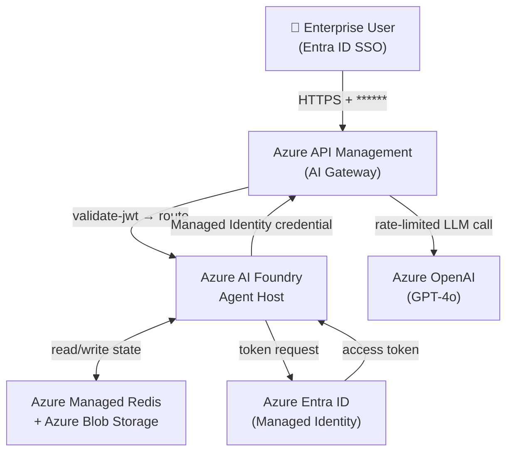
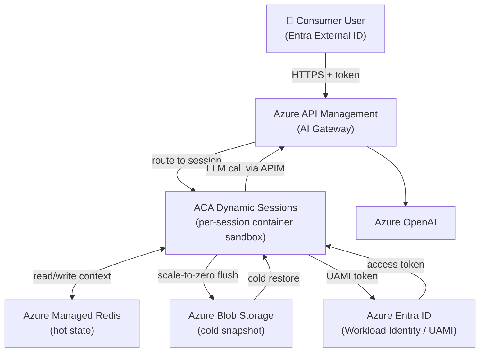
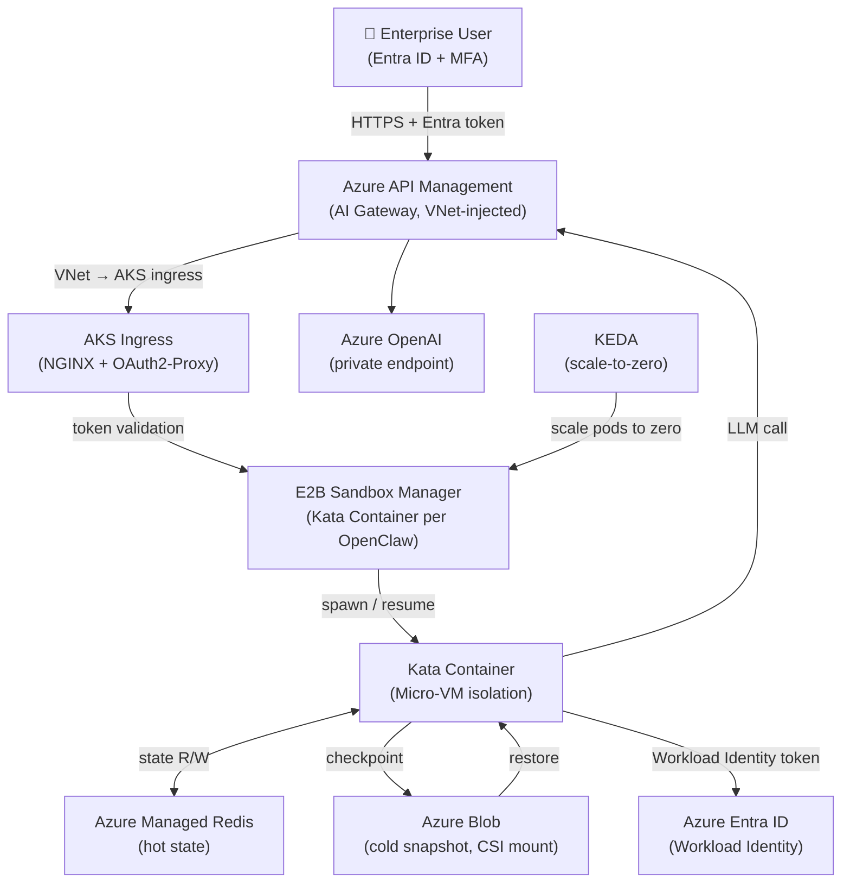

# OpenClaw Hosting on Azure — Workshop Design Proposal

## Outline

- **Target**: Deploy AI-agent workloads (OpenClaw) on Azure for both enterprise (ToB) and consumer (ToC) scenarios.
- **Core challenges**: per-instance isolation, fast start / scale-to-zero, state persistence, Entra ID auth, and cost control.
- **Top picks**: Azure AI Foundry Agent Host · Azure Container Apps Dynamic Sessions · AKS + self-built E2B.
- **Key patterns**: state snapshotted to Redis/Blob before scale-down, restored on warm-up; all LLM calls routed through Azure API Management (AI Gateway); each OpenClaw authenticates as its own Entra ID workload identity.
- **Duration**: 90 minutes · Mid-level difficulty.

---

## 1. Target Scenarios

### 1.1 ToB — Enterprise / Business

| Dimension | Detail |
|---|---|
| Typical users | Enterprise IT, internal dev teams, B2B SaaS platforms |
| Scale | Tens to thousands of named OpenClaw instances per tenant |
| Isolation requirement | Strong — tenant/department boundaries, audit trail |
| Auth | Azure Entra ID (AAD) — SSO, RBAC, Conditional Access |
| Compliance | Data residency, private networking (VNet), RBAC |
| Cost model | Reserved capacity or burstable with predictable SLA |
| Priority | Security · Governance · Reliability |

### 1.2 ToC — Consumer / End-user

| Dimension | Detail |
|---|---|
| Typical users | Individual end-users, small teams, developer playground |
| Scale | Potentially very large number of short-lived sessions |
| Isolation requirement | Process- or container-level; lighter than enterprise |
| Auth | Social login (Entra External ID / B2C) or API key |
| Cost model | Pure pay-per-use, aggressive scale-to-zero |
| Priority | Cost · Speed · Simplicity |

---

## 2. Possible Solutions

### 2.1 Hosting Technique Comparison

| Technique | Isolation | Cold-start | Cost efficiency | Azure fit | Suitable for | Advantage | Weakness |
|---|---|---|---|---|---|---|---|
| **Micro-VM** | Strongest (hypervisor) | Slow (2–10 s) | Low (always-on VM) | AKS + Kata / E2B | ToB high-security | True kernel isolation | Cost, operational overhead |
| **Container** | Strong (namespace) | Fast (< 2 s) | Good with scale-to-zero | ACA, AKS | ToB / ToC | Mature ecosystem, OCI | Shared kernel |
| **Process** | Weak (OS process) | Fastest (< 0.5 s) | Best | App Service, Functions | ToC low-risk | Minimal overhead | Noisy-neighbour risk |
| **Session** | Medium (sandbox) | Fast (< 1 s) | Good | ACA Dynamic Sessions | ToC interactive | Managed, serverless | Limited customisation |
| **VM** | Strongest | Slowest (> 30 s) | Poorest | Azure VM | Niche / legacy | Full control | Cold-start, cost |
| **Serverless** | Medium | Fast (< 2 s) | Best (pay-per-exec) | Azure Functions, ACA Jobs | ToC stateless | Zero infra ops | Stateless by design |

### 2.2 Azure Resource Comparison

| Azure Resource | Technique | Isolation level | Scale-to-zero | State persistence | Entra ID integration | APIM integration | Best for |
|---|---|---|---|---|---|---|---|
| **Azure AI Foundry Agent Host** | Managed agent runtime | Managed (per-agent) | ✅ Native | ✅ Built-in | ✅ Native | ✅ Native | ToB managed, fastest on-ramp |
| **ACA Dynamic Sessions** | Container sandbox | Strong (per-session) | ✅ Native | ✅ via Blob/Redis | ✅ Workload Identity | ✅ | ToC interactive, ToB dev |
| **AKS + self-built E2B** | Micro-VM or Container | Strongest | ✅ Custom | ✅ Custom | ✅ AAD Pod Identity | ✅ | ToB high-security, full control |
| **Azure Container Apps** | Container | Strong | ✅ Native | ✅ via Blob/Redis | ✅ Workload Identity | ✅ | ToB / ToC general |
| **Azure Functions** | Process / Serverless | Medium | ✅ Native | Limited | ✅ | ✅ | ToC stateless tasks |
| **Azure App Service** | Process / Container | Weak–Medium | ❌ (min 1 instance) | ✅ | ✅ | ✅ | Simple ToC web apps |
| **Virtual Machine** | VM | Strongest | ❌ | ✅ | ✅ | ✅ | Legacy / special hardware |

---

## 3. Solutions Selected and Rationale

Three complementary solutions are recommended, each optimised for a distinct operational profile.

| # | Solution | Scenario | Key reason |
|---|---|---|---|
| **A** | Azure AI Foundry Agent Host | ToB managed | Fully managed; native agent lifecycle, state, auth; fastest time-to-value |
| **B** | ACA Dynamic Sessions | ToC / ToB dev | Serverless container sandbox; strong isolation; true scale-to-zero; low ops cost |
| **C** | AKS + self-built E2B | ToB high-security | Maximum control; Micro-VM isolation via Kata Containers; custom networking and compliance |

> **Why not Azure Functions or App Service?**  
> Functions are stateless by design and do not support persistent session contexts without external state management complexity. App Service does not natively scale to zero and carries higher idle cost.

---

## 4. Implemented Features

The table below maps each technical requirement to the implementation approach for all three selected solutions.

| # | Requirement | Foundry Agent Host (A) | ACA Dynamic Sessions (B) | AKS + E2B (C) |
|---|---|---|---|---|
| 1 | **State & context persistence** | Built-in agent state store (Cosmos/Blob) | Azure Managed Redis (context cache) + Azure Blob (snapshot) | Redis on AKS + Azure Blob via CSI driver |
| 2 | **Fast start / scale-to-zero** | Native agent idle eviction + warm resume | ACA session pool; idle timeout = 15 min; state flushed to Redis on eviction | KEDA-driven scale-to-zero; state checkpoint before pod termination; pre-warmed pool |
| 3 | **Isolation** | Per-agent managed sandbox | Per-session container with network policy | Kata Container Micro-VM per OpenClaw; NetworkPolicy + Namespace isolation |
| 4 | **Entra ID authentication** | Native AAD integration; user-assigned Managed Identity | ACA Workload Identity (UAMI) + Entra ID token validation at ingress | AAD Workload Identity for Pods; ingress auth via Entra ID App Registration |
| 5 | **AI Gateway (APIM)** | APIM policy routes all LLM calls; token quota per agent | APIM gateway policy; JWT validation; rate-limiting per session | APIM deployed in VNet; each AKS pod calls APIM internal endpoint |
| 6 | **OpenClaw-to-Gateway auth** | Managed Identity credential → APIM subscription key + OAuth | UAMI credential; APIM validates Entra ID token via validate-jwt policy | Pod Workload Identity → Entra token → APIM OAuth 2.0 token validation |
| 7 | **Cost saving** | Scale-to-zero after 15 min idle; pay per agent execution | True serverless; session destroyed after idle; Redis TTL auto-evicts stale state | KEDA zero-scale; Spot Node Pool for worker nodes; Redis Basic SKU for dev |

---

## 5. Key Technical Considerations

### 5.1 State Persistence Design

```
Lifecycle event          Action
─────────────────────    ──────────────────────────────────────────
New OpenClaw started  →  Load state from Redis (TTL 24 h) or Blob
Active conversation   →  Write-through to Redis (hot cache)
Scale-to-zero trigger →  Flush Redis state → snapshot to Azure Blob
                         (versioned, immutable, cost-effective long-term)
New request arrives   →  Restore from Redis if still warm,
                         else restore from Blob → warm Redis
```

> **Recommended storage per tier**
> - **Hot** (active session): Azure Managed Redis — sub-millisecond latency, automatic failover.
> - **Warm** (idle < 24 h): Redis with TTL.
> - **Cold** (archived / scale-to-zero): Azure Blob Storage (Cool tier), versioned containers.

### 5.2 Fast-Start Optimisation

- **Pre-warmed instance pool**: keep a minimum of 1 standby instance per solution to absorb burst (configurable; set to 0 for pure cost-saving).
- **Lightweight checkpoint format**: serialise only conversation history + tool state; avoid full process memory dumps.
- **Container image caching**: pin base image layers in Azure Container Registry geo-replication.

### 5.3 Entra ID Auth Architecture

```
User / Client App
     │  access token (Entra ID)
     ▼
Azure API Management (AI Gateway)
     │  validate-jwt policy
     ▼
OpenClaw instance
     │  Managed Identity / Workload Identity credential
     ▼
Azure API Management (LLM route)
     │  validate-jwt + rate-limit policy
     ▼
Azure OpenAI / external LLM
```

- **ToB**: Entra ID App Registration with RBAC roles; Conditional Access policies; Managed Identity per OpenClaw.
- **ToC**: Entra External ID (B2C); anonymous-to-authenticated escalation supported.

### 5.4 APIM AI Gateway Pattern

Key APIM policies applied to the LLM backend:
1. `validate-jwt` — verify Workload Identity token from OpenClaw.
2. `rate-limit-by-key` — per OpenClaw instance token quota.
3. `azure-openai-token-limit` — semantic token counting.
4. `retry` — automatic retry on 429 / 5xx with exponential back-off.
5. `cache-lookup` / `cache-store` — response caching for identical prompts.

---

## 6. Solution Architectures

### Solution A — Azure AI Foundry Agent Host (ToB Managed)



**Workflow:**
1. User authenticates via Entra ID SSO; receives ******
2. Client sends request to APIM; `validate-jwt` policy authenticates and routes to Foundry Agent Host endpoint.
3. Foundry Agent Host looks up OpenClaw instance state in Redis (warm) or Blob (cold restore).
4. OpenClaw processes the request; calls LLM via APIM using its Managed Identity credential.
5. APIM enforces per-agent token quota; routes to Azure OpenAI.
6. Response streams back to user.
7. If idle > 15 min, Agent Host evicts instance; state checkpointed to Blob.

---

### Solution B — ACA Dynamic Sessions (ToC / ToB Dev)



**Workflow:**
1. User authenticates; client presents token to APIM.
2. APIM validates token; forwards to ACA Sessions manager with `session-id` header.
3. Session manager looks up existing session (warm) or creates new container sandbox.
4. OpenClaw container starts (< 2 s); loads state from Redis if TTL valid; else restores from Blob.
5. OpenClaw calls LLM via APIM using its UAMI credential.
6. Idle detection: after 15 min, ACA evicts session; lifecycle hook flushes state to Redis + Blob.
7. Next request restores from Redis (< 500 ms) or Blob (< 3 s).

---

### Solution C — AKS + Self-built E2B (ToB High-Security)



**Workflow:**
1. User authenticates via Entra ID (MFA enforced); token forwarded to APIM.
2. APIM (VNet-injected) routes to AKS ingress; OAuth2-Proxy validates token.
3. E2B Sandbox Manager checks for existing Kata Container for this `openclaw-id`.
4. If warm: resume container (< 1 s); load Redis state.
5. If cold (KEDA scaled to zero): Sandbox Manager starts new Kata Container, restores Blob snapshot to Redis, then Redis → container memory.
6. OpenClaw processes request; issues LLM call to APIM private endpoint using Workload Identity credential.
7. APIM validates token, enforces quota, routes to Azure OpenAI private endpoint.
8. KEDA monitors queue depth; scales Kata Containers to zero after 15 min idle; pre-termination hook checkpoints state to Blob.

---

## 7. Workshop Flow (90 minutes)

### Prerequisites (before workshop)

- Azure subscription with Contributor access
- Azure CLI installed (`az login` completed)
- Docker Desktop (for local image testing)
- VS Code + Azure Container Apps extension

---

### Module 0 — Introduction (10 min)

| Time | Activity |
|---|---|
| 0:00–0:05 | Problem framing: what is OpenClaw? Why host AI agents on Azure? |
| 0:05–0:10 | Architecture overview: three solutions, key components (APIM, Entra ID, state store) |

---

### Module 1 — Core Infrastructure Setup (20 min)

| Time | Activity | Commands / Portal steps |
|---|---|---|
| 0:10–0:15 | Create Resource Group, Azure Managed Redis (Basic SKU), Azure Blob Storage | `az group create` · `az redis create` |
| 0:15–0:20 | Deploy Azure API Management (Consumption tier) | Portal or `az apim create` |
| 0:20–0:25 | Register Entra ID App; create User-Assigned Managed Identity for OpenClaw | `az ad app create` · `az identity create` |
| 0:25–0:30 | Configure APIM `validate-jwt` policy and LLM backend (Azure OpenAI) | APIM policy editor |

---

### Module 2 — Solution A: Foundry Agent Host (20 min)

| Time | Activity |
|---|---|
| 0:30–0:35 | Create Azure AI Foundry project; configure agent runtime |
| 0:35–0:40 | Deploy OpenClaw agent definition; set state store (Redis connection string via Key Vault reference) |
| 0:40–0:45 | Assign Managed Identity to agent; test LLM call via APIM |
| 0:45–0:50 | Trigger scale-to-zero; verify state checkpoint in Blob; restore and continue conversation |

---

### Module 3 — Solution B: ACA Dynamic Sessions (15 min)

| Time | Activity |
|---|---|
| 0:50–0:55 | Create ACA Environment; enable Dynamic Sessions pool |
| 0:55–1:00 | Push OpenClaw container image to ACR; configure session lifecycle hook (flush to Redis/Blob on eviction) |
| 1:00–1:05 | Test end-to-end: send requests, observe session creation, trigger idle timeout, verify restore |

---

### Module 4 — Solution C: AKS + E2B (10 min, optional / demo)

| Time | Activity |
|---|---|
| 1:05–1:10 | Walk through AKS cluster with KEDA and Kata Container runtime node pool |
| 1:10–1:15 | Demo: E2B Sandbox Manager spawns Kata Container; KEDA scales to zero; cold restore from Blob |

---

### Module 5 — Wrap-up and Q&A (15 min)

| Time | Activity |
|---|---|
| 1:15–1:20 | Solution comparison recap; guidance on choosing A vs B vs C |
| 1:20–1:25 | Cost optimisation tips: Redis TTL tuning, Blob Cool tier, APIM Consumption SKU, KEDA scale rules |
| 1:25–1:30 | Q&A and next steps (production hardening checklist) |

---

## 8. Cost Saving Summary

| Lever | Impact | Applies to |
|---|---|---|
| Scale-to-zero (15-min idle) | Eliminate compute cost during off-hours | A · B · C |
| APIM Consumption SKU | Pay per call; no gateway idle cost | A · B · C |
| Azure Managed Redis Basic | ~60 % cheaper than Standard for dev/test | A · B · C |
| Blob Cool tier for cold state | ~50 % cheaper than Hot tier | A · B · C |
| AKS Spot Node Pool | Up to 90 % discount for interruptible workloads | C |
| Azure OpenAI PTU (reserved) | Predictable cost for high-volume ToB | A · B · C |
| Redis TTL eviction (24 h) | Auto-clean stale state; avoid unbounded growth | A · B |

---

*Document version 1.0 — prepared for the Azure AI Agent Hosting Workshop*
