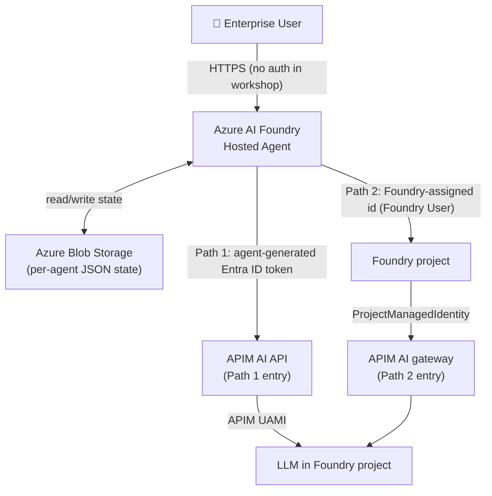
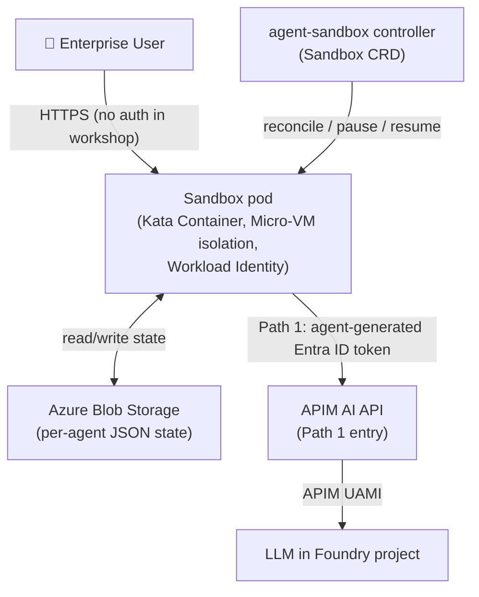
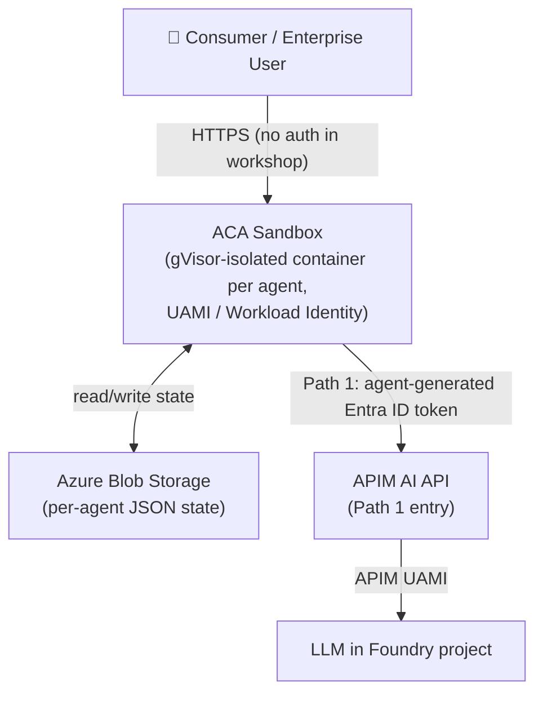

# Agent Hosting on Azure Workshop Design

[⬆ Back to Workshop Home](./readme.md)

## 1. Target Scenarios

### 1.1 ToB — Enterprise / Business

**Enterprise deployments prioritize security, governance, and strict tenant isolation. Multi-tenant SaaS platforms and large organizations require strong audit trails, compliance controls, and predictable scaling with reserved capacity.**

| Dimension | Detail |
|---|---|
| Typical users | Enterprise IT, internal dev teams, B2B SaaS platforms |
| Scale | Tens to thousands of named agent instances per tenant |
| Isolation requirement | Strong — tenant/department boundaries, audit trail |
| Auth | Azure Entra ID (AAD) — SSO, RBAC, Conditional Access |
| Compliance | Data residency, private networking (VNet), RBAC |
| Cost model | Reserved capacity or burstable with predictable SLA |
| Priority | Security · Governance · Reliability |

### 1.2 ToC — Consumer / End-user

**Consumer deployments prioritize cost efficiency, speed, and simplicity. High volume of short-lived sessions, lighter isolation requirements, and aggressive scale-to-zero enable pay-per-use pricing models suitable for individual users and small teams.**

| Dimension | Detail |
|---|---|
| Typical users | Individual end-users, small teams, developer playground |
| Scale | Potentially very large number of short-lived sessions |
| Isolation requirement | Process- or container-level; lighter than enterprise |
| Auth | Social login (Entra External ID / B2C) or API key |
| Cost model | Pure pay-per-use, aggressive scale-to-zero |
| Priority | Cost · Speed · Simplicity |

---

## 2. Possible Solutions

### 2.1 Hosting Technique Comparison

| Technique | Isolation | Cold-start | Cost efficiency | Azure fit | Suitable for | Advantage | Weakness |
|---|---|---|---|---|---|---|---|
| **AI Foundry Host Agent** | Managed (per-agent) | Fast (< 1 s) | Best (pay-per-exec) | Azure AI Foundry | ToB managed | Native agent lifecycle, built-in state & auth | Limited customisation |
| **Micro-VM** | Strongest (hypervisor) | Slow (2–10 s) | Low (always-on VM) | AKS + Kata / agent-sandbox | ToB high-security | True kernel isolation | Cost, operational overhead |
| **Container** | Strong (namespace) | Fast (< 2 s) | Good with scale-to-zero | ACA, AKS | ToB / ToC | Mature ecosystem, OCI | Shared kernel |
| **Process** | Weak (OS process) | Fastest (< 0.5 s) | Best | App Service, Functions | ToC low-risk | Minimal overhead | Noisy-neighbour risk |
| **Session** | Medium (sandbox) | Fast (< 1 s) | Good | ACA Dynamic Sessions | ToC interactive / short-lived jobs | Managed, serverless; ideal for one-time code execution | Limited customisation; not suited for long-running agents |
| **Sandbox** | Strong (OS-level gVisor isolation) | Fast (< 2 s) | Good with scale-to-zero | ACA Sandbox *(Public Preview)* | ToC / ToB long-running agents | OS-level isolation without dedicated VMs; runs alongside standard ACA containers | Public preview; feature set still evolving |
| **VM** | Strongest | Slowest (> 30 s) | Poorest | Azure VM | Niche / legacy | Full control | Cold-start, cost |
| **Serverless** | Medium | Fast (< 2 s) | Best (pay-per-exec) | Azure Functions, ACA Jobs | ToC stateless | Zero infra ops | Stateless by design |


### 2.2 Azure Resource Comparison

| Azure Resource | Technique | Isolation level | Scale-to-zero | State persistence | Entra ID integration | APIM integration | Best for |
|---|---|---|---|---|---|---|---|
| **Azure AI Foundry Host Agent** | Managed agent runtime | Managed (per-agent) | ✅ Native | ✅ Built-in | ✅ Native | ✅ Native | ToB managed, fastest on-ramp |
| **ACA Sandbox** *(Public Preview)* | Container sandbox (OS-level gVisor isolation) | Strong (per-container) | ✅ Native | ✅ via Blob | ✅ Workload Identity | ✅ | ToC / ToB long-running agents; isolation without dedicated VMs |
| **ACA Dynamic Sessions** | Container sandbox | Strong (per-session) | ✅ Native | ✅ via Blob | ✅ Workload Identity | ✅ | ToC short-lived / one-time code execution; not ideal for persistent long-running agents |
| **AKS + agent-sandbox** | Micro-VM or Container | Strongest | ✅ Custom | ✅ Custom | ✅ Workload Identity for Pods | ✅ | ToB high-security, full control |
| **Azure Container Apps** | Container | Strong | ✅ Native | ✅ via Blob | ✅ Workload Identity | ✅ | ToB / ToC general |
| **Azure Functions** | Process / Serverless | Medium | ✅ Native | Limited | ✅ | ✅ | ToC stateless tasks |
| **Azure App Service** | Process / Container | Weak–Medium | ❌ (min 1 instance) | ✅ | ✅ | ✅ | Simple ToC web apps |
| **Virtual Machine** | VM | Strongest | ❌ | ✅ | ✅ | ✅ | Legacy / special hardware |

---

## 3. Solutions Selected and Rationale

Three complementary solutions are recommended, each optimised for a distinct operational profile.

| # | Solution | Scenario | Key reason |
|---|---|---|---|
| **A** | Azure AI Foundry Host Agent | ToB managed | Fully managed; native agent lifecycle, state, auth; fastest time-to-value |
| **B** | AKS + agent-sandbox | ToB high-security | Maximum control; Micro-VM isolation via Kata Containers; `Sandbox` CRD lifecycle; custom networking and compliance |
| **C** | ACA Sandbox *(Public Preview)* | ToC / ToB long-running agents | OS-level container isolation via gVisor; long-running agent support; strong isolation without dedicated VMs; true scale-to-zero |

> **Why ACA Sandbox instead of ACA Dynamic Sessions for Solution C?**  
> ACA Dynamic Sessions is optimised for **one-time or short-lived code execution** (e.g. code interpreter tasks, ephemeral sandboxes). It evicts sessions aggressively and is not designed for long-running stateful agents. **ACA Sandbox** provides OS-level isolation (gVisor) within a regular ACA environment, making it a better fit for persistent, long-running agent workloads. Note that ACA Sandbox is currently in **public preview** — evaluate feature availability and SLA before adopting for production.  
> ACA Dynamic Sessions is retained in the comparison tables (Sections 2.1 and 2.2) as a valid option for short-lived execution scenarios.

> **Why not Azure Functions or App Service?**  
> Functions are stateless by design and do not support persistent session contexts without external state management complexity. App Service does not natively scale to zero and carries higher idle cost.

---

## 4. Implemented Features

The table below maps each technical requirement to the implementation approach for all three selected solutions.

| # | Requirement | Foundry Host Agent (A) | AKS + agent-sandbox (B) | ACA Sandbox — *Public Preview* (C) |
|---|---|---|---|---|
| 1 | **State & context persistence** | Built-in agent state store (Cosmos/Blob) | Azure Blob (per-agent JSON, saved on every change) | Azure Blob (per-agent JSON, saved on every change) |
| 2 | **Fast start / scale-to-zero** | Native agent idle eviction + warm resume | agent-sandbox lifecycle: pause / resume / hibernate; state already durable in Blob; optional SandboxWarmPool | ACA Sandbox container pool; idle timeout = 30 min; state already durable in Blob |
| 3 | **Isolation** | Per-agent managed sandbox | Kata Container Micro-VM per agent; NetworkPolicy + Namespace isolation | Per-container OS-level isolation via gVisor (syscall interception); no dedicated VM required |
| 4 | **Entra ID authentication** | Native AAD integration; user-assigned Managed Identity | AAD Workload Identity for Pods; ingress auth via Entra ID App Registration | ACA Workload Identity (UAMI) + Entra ID token validation at ingress |
| 5 | **AI Gateway (APIM)** | APIM policy routes all LLM calls; token quota per agent | APIM deployed in VNet; each AKS pod calls APIM internal endpoint | APIM gateway policy; JWT validation; rate-limiting per container |
| 6 | **Agent-to-Gateway auth** | Managed Identity credential → APIM subscription key + OAuth | Pod Workload Identity → Entra token → APIM OAuth 2.0 token validation | UAMI credential; APIM validates Entra ID token via validate-jwt policy |
| 7 | **Cost saving** | Scale-to-zero after 30 min idle; pay per agent execution | agent-sandbox hibernation; Spot Node Pool for worker nodes; Blob Cool tier for state | True serverless; container destroyed after idle; Blob lifecycle rules expire stale state |

---

## 5. Key Technical Considerations

### 5.1 State Persistence Design

```
Lifecycle event          Action
─────────────────────    ─────────────────────────────────────────────────────────
New agent started  →  Load state directly from Azure Blob (per-agent JSON)
Active conversation   →  Persist state to Azure Blob on every change
                         (after each chat turn: message sent + response received)
Scale-to-zero trigger →  No flush needed — latest state is already durable in Blob
New request arrives   →  Restore from Azure Blob
```

> **Single source of truth: Azure Blob Storage.** Each agent stores its state as
> `<AGENT_ID>.json` in the `agent-state` container. There is no separate hot cache
> (no Redis): the agent writes to Blob on every state change, so the latest state
> is always durable and recoverable after a restart, hibernation, or scale-to-zero.
> Use Blob **Cool tier** with **versioning** for cost-effective, recoverable state.

### 5.2 Fast-Start Optimisation

- **Pre-warmed instance pool**: keep a minimum of 1 standby instance per solution to absorb burst (configurable; set to 0 for pure cost-saving).
- **Lightweight checkpoint format**: serialise only conversation history + tool state; avoid full process memory dumps.
- **Container image caching**: pin base image layers in Azure Container Registry geo-replication.

### 5.3 Entra ID Auth Architecture

> **User → agent authentication is out of scope for this workshop.** Identity is
> only enforced on the hops **between the agent and the model**, described as two
> paths (see [6.0 Two Access Paths](#60-two-access-paths-shared-model)):
>
> - **Path 1** (`Agent → APIM AI API → LLM`): the agent presents an
>   **agent-generated Entra ID token** to the APIM AI API, and APIM calls the
>   Foundry LLM with its **UAMI**.
> - **Path 2** (`Agent → Foundry project → APIM AI gateway → LLM`, Solution A
>   only): the hosted agent uses the **Foundry-assigned identity** (Foundry User)
>   to call its project, which routes inference through the APIM AI gateway.

```
Path 1 (all solutions)                     Path 2 (Solution A hosted agent only)
──────────────────────────────            ─────────────────────────────────────────
👤 User                                    👤 User
   │ (no auth in workshop)                     │ (no auth in workshop)
   ▼                                           ▼
agent instance                             Foundry hosted agent
   │ agent-generated Entra ID token            │ Foundry-assigned id (Foundry User)
   ▼                                           ▼
APIM AI API                                Foundry project
   │ validate-jwt                              │ ProjectManagedIdentity
   │ then APIM UAMI → Foundry                  ▼
   ▼                                       APIM AI gateway
LLM in Foundry project                         │ APIM UAMI → Foundry
                                               ▼
                                           LLM in Foundry project
```

- **ToB**: Entra ID App Registration with RBAC roles; Managed Identity per agent. The agent's UAMI / Workload Identity is used to obtain the token for the APIM AI API (Path 1).
- **ToC**: Entra External ID (B2C) may front the user-facing app, but user → agent auth is not covered by this workshop; the agent → model hops still use managed identity.

### 5.4 APIM AI Gateway Pattern

Key APIM policies applied to the LLM backend:
1. `validate-jwt` — verify the **agent-generated Entra ID token** on the `Agent → APIM AI API` hop (Path 1). APIM then calls Foundry with its **UAMI**.
2. `rate-limit-by-key` — per agent instance token quota.
3. `azure-openai-token-limit` — semantic token counting.
4. `retry` — automatic retry on 429 / 5xx with exponential back-off.
5. `cache-lookup` / `cache-store` — response caching for identical prompts.

---

## 6. Solution Architectures

### 6.0 Two Access Paths (shared model)

Every solution routes traffic from the user to the model over one of two paths.
In this workshop, **user → agent authentication is out of scope**; identity is
only enforced on the hops between the agent and the model:

- **Path 1 — `Agent → APIM AI API → LLM in Foundry project`**
  - `Agent → APIM AI API`: the agent **dynamically generates an Entra ID token**
    and presents it to the APIM AI API (`validate-jwt`).
  - `APIM AI API → LLM in Foundry project`: APIM authenticates to Foundry with
    its **User-Assigned Managed Identity (UAMI)**.
- **Path 2 — `Agent → Foundry project → APIM AI gateway → LLM in Foundry project`**
  - `Agent → Foundry project`: the hosted agent calls its own Foundry project
    using the **identity Foundry assigns to the hosted agent** (granted the
    **Foundry User** role).
  - `Foundry project → APIM AI gateway → LLM`: the project's inference traffic is
    governed by the registered **APIM AI gateway** connection
    (`ProjectManagedIdentity`, audience `https://ai.azure.com`).

| Solution | Path 1 | Path 2 |
|---|:---:|:---:|
| A — Foundry Hosted Agent | ✅ | ✅ |
| B — AKS + agent-sandbox | ✅ | — |
| C — ACA Sandbox | ✅ | — |

> Path 2 is available **only to the Foundry hosted agent in Solution A**, because
> only a hosted agent runs inside a Foundry project and receives a
> Foundry-assigned identity. Solutions B and C run the agent outside Foundry, so
> they always reach the model through Path 1.

---

### Solution A — Azure AI Foundry Host Agent (ToB Managed)

Solution A uses **both Path 1 and Path 2**.



**Workflow:**
1. User sends a request to the hosted agent (user → agent auth is out of scope in this workshop).
2. The hosted agent loads its instance state from Azure Blob.
3. The agent reaches the model through either path:
   - **Path 1:** the agent generates an Entra ID token and calls the **APIM AI API**; APIM then calls the LLM in the Foundry project using its **UAMI**.
   - **Path 2:** the agent calls its **Foundry project** with the Foundry-assigned identity (**Foundry User**); the project routes inference through the registered **APIM AI gateway** to the LLM.
4. The agent persists updated state to Azure Blob after each turn; the response streams back to the user.
5. If idle > 30 min, the Host Agent evicts the instance; the latest state is already durable in Blob.

---

### Solution B — AKS + agent-sandbox (ToB High-Security)

Solution B uses **Path 1 only**.



**Workflow:**
1. User sends a request to the agent's Sandbox pod (user → agent auth is out of scope in this workshop).
2. The `agent-sandbox` controller reconciles the `Sandbox` CR for this agent — a stateful, singleton pod with stable identity.
3. If warm/running, the request reaches the existing Sandbox pod (< 1 s) and state is loaded from Blob; if hibernated, the controller resumes the Sandbox, which reloads its state directly from the Blob JSON.
4. The agent reaches the model via **Path 1**: it generates an Entra ID token (backed by AKS Workload Identity) and calls the **APIM AI API**; APIM then calls the LLM in the Foundry project using its **UAMI**.
5. The agent persists updated state to Blob after each turn.
6. On idle, the Sandbox is paused/hibernated (scale-to-zero); no flush is needed because state was persisted to Blob on every change. An optional `SandboxWarmPool` keeps pre-warmed sandboxes for fast allocation.

---

### Solution C — ACA Sandbox (ToC / ToB Long-Running Agents) *(Public Preview)*

Solution C uses **Path 1 only**.

> **Note:** Azure Container Apps Sandbox is currently in **public preview**. Review the [feature documentation](https://learn.microsoft.com/en-us/azure/container-apps/sandboxes-overview) for current limitations and SLA before adopting for production workloads.

> **ACA Dynamic Sessions vs ACA Sandbox:** ACA Dynamic Sessions is designed for **short-lived, one-time code execution** (e.g. ephemeral code interpreter tasks). Its aggressive session eviction makes it unsuitable for long-running stateful agents. ACA Sandbox runs your container workloads with OS-level gVisor isolation directly within a standard ACA environment, providing the persistent runtime and strong isolation that long-running agents require.



**Workflow:**
1. User sends a request to the agent container (user → agent auth is out of scope in this workshop).
2. ACA resolves the target agent container — resumes an existing (warm) container or starts a new gVisor-isolated one.
3. The agent container loads its state directly from Azure Blob.
4. The agent reaches the model via **Path 1**: it generates an Entra ID token (backed by its UAMI / Workload Identity) and calls the **APIM AI API**; APIM then calls the LLM in the Foundry project using its **UAMI**.
5. The agent persists updated state to Blob after each turn.
6. Idle detection: after 30 min, ACA scales the container to zero; no flush needed — state was persisted to Blob on every change.
7. The next request restores state from Azure Blob.

---

## 7. Workshop Flow (135 minutes)

### Module 0 — Introduction (10 min)

Problem framing and architecture overview. [See Module 0](./module-00/README.md)

---

### Module 1 — Core Infrastructure Setup (30 min)

Deploy foundational Azure services: Resource Group, Blob Storage, APIM, Entra ID, and Key Vault. [See Module 1](./module-01/README.md)

---

### Module 2 — Solution A: Foundry Host Agent (30 min)

Host AI agents using Azure AI Foundry with integrated state management and scale-to-zero. [See Module 2](./module-02/README.md)

---

### Module 3 — Solution B: AKS + agent-sandbox (40 min)

Run agents on AKS with Kata Containers and the `agent-sandbox` controller (`Sandbox` CRD lifecycle, pause/resume/hibernate). [See Module 3](./module-03/README.md)

---

### Module 4 — Solution C: ACA Sandbox (20 min)

Deploy agents in Azure Container Apps with gVisor-based sandbox isolation and dynamic scaling. [See Module 4](./module-04/README.md)

---

### Module 5 — Wrap-up and Q&A (5 min)

Solution comparison, selection guidance, and cost optimisation strategies. [See Module 5](./module-05/README.md)

---

*Document version 1.0 — prepared for the Azure AI Agent Hosting Workshop*
