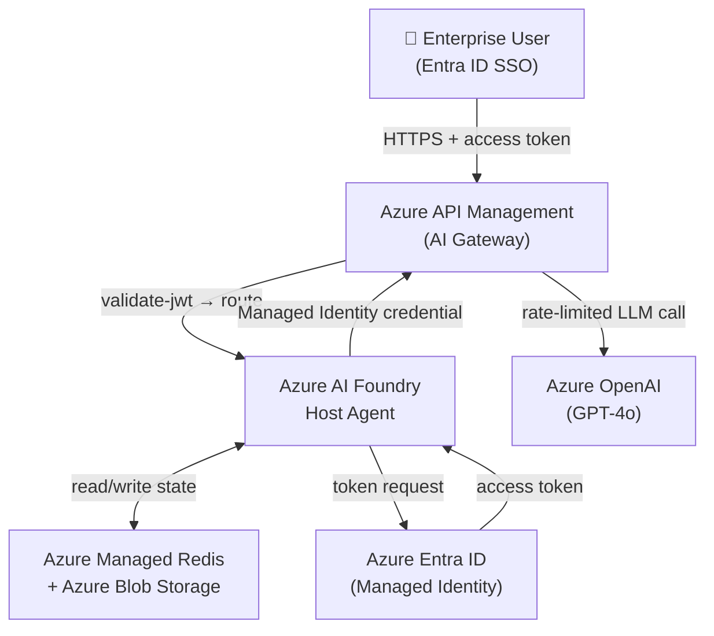
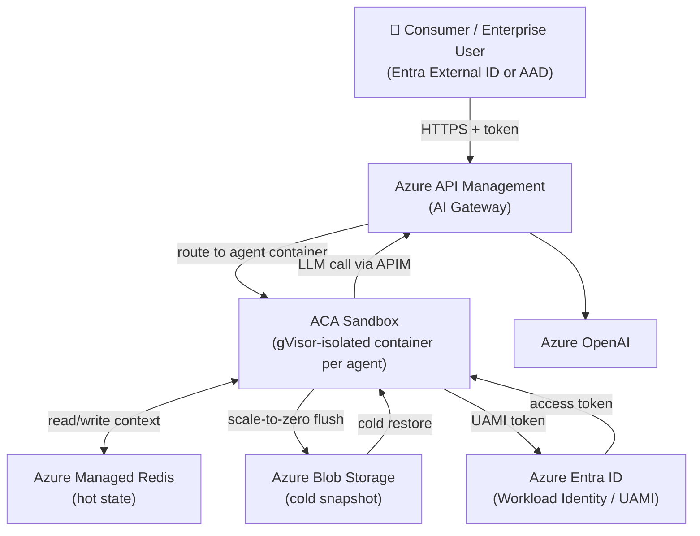
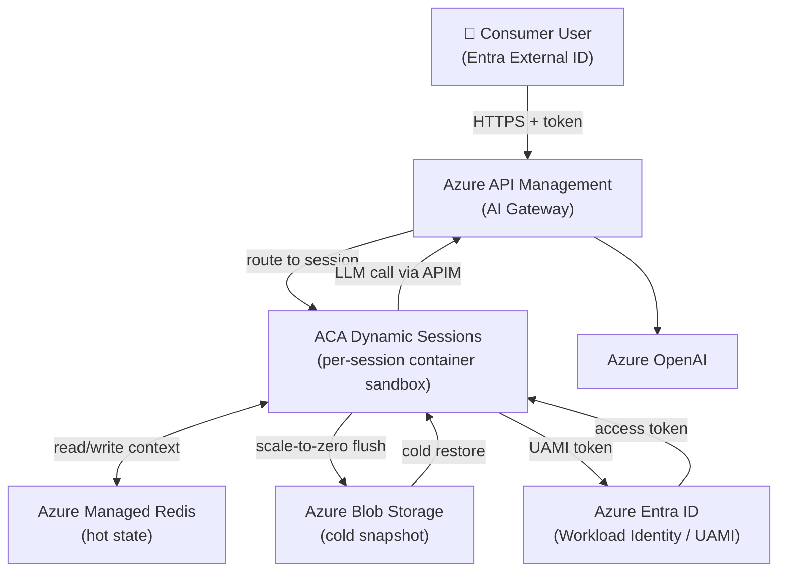
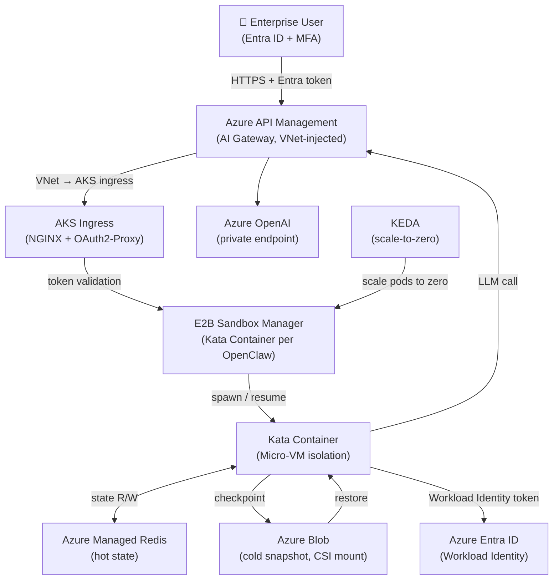

# OpenClaw Hosting on Azure Workshop

## 1. Target Scenarios

### 1.1 ToB — Enterprise / Business

**Enterprise deployments prioritize security, governance, and strict tenant isolation. Multi-tenant SaaS platforms and large organizations require strong audit trails, compliance controls, and predictable scaling with reserved capacity.**

| Dimension | Detail |
|---|---|
| Typical users | Enterprise IT, internal dev teams, B2B SaaS platforms |
| Scale | Tens to thousands of named OpenClaw instances per tenant |
| Isolation requirement | Strong — tenant/department boundaries, audit trail |
| Auth | Azure Entra ID (AAD) — SSO, RBAC, Conditional Access |
| Compliance | Data residency, private networking (VNet), RBAC |
| Cost model | Reserved capacity or burstable with predictable SLA |
| Priority | Security · Governance · Reliability |

### 1.2 ToC — Consumer / End-user

**Consumer deployments prioritize cost efficiency, speed, and simplicity. High volume of short-lived sessions, lighter isolation requirements, and aggressive scale-to-zero enable pay-per-use pricing models suitable for individual users and small teams.**

| Dimension | Detail |
|---|---|
| Typical users | Individual end-users, small teams, developer playground |
| Scale | Potentially very large number of short-lived sessions |
| Isolation requirement | Process- or container-level; lighter than enterprise |
| Auth | Social login (Entra External ID / B2C) or API key |
| Cost model | Pure pay-per-use, aggressive scale-to-zero |
| Priority | Cost · Speed · Simplicity |

---

## 2. Possible Solutions

### 2.1 Hosting Technique Comparison

| Technique | Isolation | Cold-start | Cost efficiency | Azure fit | Suitable for | Advantage | Weakness |
|---|---|---|---|---|---|---|---|
| **AI Foundry Host Agent** | Managed (per-agent) | Fast (< 1 s) | Best (pay-per-exec) | Azure AI Foundry | ToB managed | Native agent lifecycle, built-in state & auth | Limited customisation |
| **Micro-VM** | Strongest (hypervisor) | Slow (2–10 s) | Low (always-on VM) | AKS + Kata / E2B | ToB high-security | True kernel isolation | Cost, operational overhead |
| **Container** | Strong (namespace) | Fast (< 2 s) | Good with scale-to-zero | ACA, AKS | ToB / ToC | Mature ecosystem, OCI | Shared kernel |
| **Process** | Weak (OS process) | Fastest (< 0.5 s) | Best | App Service, Functions | ToC low-risk | Minimal overhead | Noisy-neighbour risk |
| **Session** | Medium (sandbox) | Fast (< 1 s) | Good | ACA Dynamic Sessions | ToC interactive / short-lived jobs | Managed, serverless; ideal for one-time code execution | Limited customisation; not suited for long-running agents |
| **Sandbox** | Strong (OS-level gVisor isolation) | Fast (< 2 s) | Good with scale-to-zero | ACA Sandbox *(Public Preview)* | ToC / ToB long-running agents | OS-level isolation without dedicated VMs; runs alongside standard ACA containers | Public preview; feature set still evolving |
| **VM** | Strongest | Slowest (> 30 s) | Poorest | Azure VM | Niche / legacy | Full control | Cold-start, cost |
| **Serverless** | Medium | Fast (< 2 s) | Best (pay-per-exec) | Azure Functions, ACA Jobs | ToC stateless | Zero infra ops | Stateless by design |


### 2.2 Azure Resource Comparison

| Azure Resource | Technique | Isolation level | Scale-to-zero | State persistence | Entra ID integration | APIM integration | Best for |
|---|---|---|---|---|---|---|---|
| **Azure AI Foundry Host Agent** | Managed agent runtime | Managed (per-agent) | ✅ Native | ✅ Built-in | ✅ Native | ✅ Native | ToB managed, fastest on-ramp |
| **ACA Sandbox** *(Public Preview)* | Container sandbox (OS-level gVisor isolation) | Strong (per-container) | ✅ Native | ✅ via Blob/Redis | ✅ Workload Identity | ✅ | ToC / ToB long-running agents; isolation without dedicated VMs |
| **ACA Dynamic Sessions** | Container sandbox | Strong (per-session) | ✅ Native | ✅ via Blob/Redis | ✅ Workload Identity | ✅ | ToC short-lived / one-time code execution; not ideal for persistent long-running agents |
| **AKS + self-built E2B** | Micro-VM or Container | Strongest | ✅ Custom | ✅ Custom | ✅ Workload Identity for Pods | ✅ | ToB high-security, full control |
| **Azure Container Apps** | Container | Strong | ✅ Native | ✅ via Blob/Redis | ✅ Workload Identity | ✅ | ToB / ToC general |
| **Azure Functions** | Process / Serverless | Medium | ✅ Native | Limited | ✅ | ✅ | ToC stateless tasks |
| **Azure App Service** | Process / Container | Weak–Medium | ❌ (min 1 instance) | ✅ | ✅ | ✅ | Simple ToC web apps |
| **Virtual Machine** | VM | Strongest | ❌ | ✅ | ✅ | ✅ | Legacy / special hardware |

---

## 3. Solutions Selected and Rationale

Three complementary solutions are recommended, each optimised for a distinct operational profile.

| # | Solution | Scenario | Key reason |
|---|---|---|---|
| **A** | Azure AI Foundry Host Agent | ToB managed | Fully managed; native agent lifecycle, state, auth; fastest time-to-value |
| **B** | ACA Sandbox *(Public Preview)* | ToC / ToB long-running agents | OS-level container isolation via gVisor; long-running agent support; strong isolation without dedicated VMs; true scale-to-zero |
| **C** | AKS + self-built E2B | ToB high-security | Maximum control; Micro-VM isolation via Kata Containers; custom networking and compliance |

> **Why ACA Sandbox instead of ACA Dynamic Sessions for Solution B?**  
> ACA Dynamic Sessions is optimised for **one-time or short-lived code execution** (e.g. code interpreter tasks, ephemeral sandboxes). It evicts sessions aggressively and is not designed for long-running stateful agents. **ACA Sandbox** provides OS-level isolation (gVisor) within a regular ACA environment, making it a better fit for persistent, long-running agent workloads. Note that ACA Sandbox is currently in **public preview** — evaluate feature availability and SLA before adopting for production.  
> ACA Dynamic Sessions is retained in the comparison tables (Sections 2.1 and 2.2) as a valid option for short-lived execution scenarios.

> **Why not Azure Functions or App Service?**  
> Functions are stateless by design and do not support persistent session contexts without external state management complexity. App Service does not natively scale to zero and carries higher idle cost.

---

## 4. Implemented Features

The table below maps each technical requirement to the implementation approach for all three selected solutions.

| # | Requirement | Foundry Host Agent (A) | ACA Sandbox — *Public Preview* (B) | AKS + E2B (C) |
|---|---|---|---|---|
| 1 | **State & context persistence** | Built-in agent state store (Cosmos/Blob) | Azure Managed Redis (context cache) + Azure Blob (snapshot) | Redis on AKS + Azure Blob via CSI driver |
| 2 | **Fast start / scale-to-zero** | Native agent idle eviction + warm resume | ACA Sandbox container pool; idle timeout = 30 min; state flushed from AMR to Blob on scale-to-zero | KEDA-driven scale-to-zero; state checkpoint before pod termination; pre-warmed pool |
| 3 | **Isolation** | Per-agent managed sandbox | Per-container OS-level isolation via gVisor (syscall interception); no dedicated VM required | Kata Container Micro-VM per OpenClaw; NetworkPolicy + Namespace isolation |
| 4 | **Entra ID authentication** | Native AAD integration; user-assigned Managed Identity | ACA Workload Identity (UAMI) + Entra ID token validation at ingress | AAD Workload Identity for Pods; ingress auth via Entra ID App Registration |
| 5 | **AI Gateway (APIM)** | APIM policy routes all LLM calls; token quota per agent | APIM gateway policy; JWT validation; rate-limiting per container | APIM deployed in VNet; each AKS pod calls APIM internal endpoint |
| 6 | **OpenClaw-to-Gateway auth** | Managed Identity credential → APIM subscription key + OAuth | UAMI credential; APIM validates Entra ID token via validate-jwt policy | Pod Workload Identity → Entra token → APIM OAuth 2.0 token validation |
| 7 | **Cost saving** | Scale-to-zero after 30 min idle; pay per agent execution | True serverless; container destroyed after idle; Redis TTL auto-evicts stale state | KEDA zero-scale; Spot Node Pool for worker nodes; Redis Basic SKU for dev |

---

## 5. Key Technical Considerations

### 5.1 State Persistence Design

```
Lifecycle event          Action
─────────────────────    ─────────────────────────────────────────────────────────
New OpenClaw started  →  Load state from Azure Managed Redis (AMR) first;
                         if not found, restore from Blob
Active conversation   →  Persist state to AMR + Blob (dual-write)
Scale-to-zero trigger →  Flush latest state from AMR to Azure Blob
                         (versioned, immutable, cost-effective long-term)
New request arrives   →  Restore from AMR first; fallback to Blob if AMR miss
```

> **Recommended storage per tier**
> - **Hot** (active session): Azure Managed Redis (choose an HA tier for automatic failover) — sub-millisecond latency.
> - **Cold** (archived / scale-to-zero): Azure Blob Storage (Cool tier), versioned containers.

### 5.2 Fast-Start Optimisation

- **Pre-warmed instance pool**: keep a minimum of 1 standby instance per solution to absorb burst (configurable; set to 0 for pure cost-saving).
- **Lightweight checkpoint format**: serialise only conversation history + tool state; avoid full process memory dumps.
- **Container image caching**: pin base image layers in Azure Container Registry geo-replication.

### 5.3 Entra ID Auth Architecture

```
User / Client App
     │  access token (Entra ID)
     ▼
Azure API Management (AI Gateway)
     │  validate-jwt policy
     ▼
OpenClaw instance
     │  Managed Identity / Workload Identity credential
     ▼
Azure API Management (LLM route)
     │  validate-jwt + rate-limit policy
     ▼
Azure OpenAI / external LLM
```

- **ToB**: Entra ID App Registration with RBAC roles; Conditional Access policies; Managed Identity per OpenClaw.
- **ToC**: Entra External ID (B2C); anonymous-to-authenticated escalation supported.

### 5.4 APIM AI Gateway Pattern

Key APIM policies applied to the LLM backend:
1. `validate-jwt` — verify Workload Identity token from OpenClaw.
2. `rate-limit-by-key` — per OpenClaw instance token quota.
3. `azure-openai-token-limit` — semantic token counting.
4. `retry` — automatic retry on 429 / 5xx with exponential back-off.
5. `cache-lookup` / `cache-store` — response caching for identical prompts.

---

## 6. Solution Architectures

### Solution A — Azure AI Foundry Host Agent (ToB Managed)



**Workflow:**
1. User authenticates via Entra ID SSO; receives an access token.
2. Client sends request to APIM; `validate-jwt` policy authenticates and routes to Foundry Host Agent endpoint.
3. Foundry Host Agent loads OpenClaw instance state from AMR first, then Blob if AMR has no state.
4. OpenClaw processes the request; calls LLM via APIM using its Managed Identity credential.
5. APIM enforces per-agent token quota; routes to Azure OpenAI.
6. Response streams back to user.
7. If idle > 30 min, Host Agent evicts instance; state flushed from AMR and checkpointed to Blob.

---

### Solution B — ACA Sandbox (ToC / ToB Long-Running Agents) *(Public Preview)*

> **Note:** Azure Container Apps Sandbox is currently in **public preview**. Review the [feature documentation](https://learn.microsoft.com/en-us/azure/container-apps/sandboxes-overview) for current limitations and SLA before adopting for production workloads.

> **ACA Dynamic Sessions vs ACA Sandbox:** ACA Dynamic Sessions is designed for **short-lived, one-time code execution** (e.g. ephemeral code interpreter tasks). Its aggressive session eviction makes it unsuitable for long-running stateful agents. ACA Sandbox runs your container workloads with OS-level gVisor isolation directly within a standard ACA environment, providing the persistent runtime and strong isolation that long-running agents require.



**Workflow:**
1. User authenticates; client presents token to APIM.
2. APIM validates token; routes to the ACA Sandbox-enabled container environment with `agent-id` header.
3. ACA resolves the target agent container — resumes existing (warm) or starts a new gVisor-isolated container.
4. OpenClaw container loads state from AMR first; if not found, restores from Blob.
5. OpenClaw processes the request; calls LLM via APIM using its UAMI credential.
6. Idle detection: after 30 min, ACA scales the container to zero; lifecycle hook flushes state from AMR to Blob.
7. Next request restores from AMR (< 500 ms) or Blob (< 3 s).

---

### Solution B (Alternative) — ACA Dynamic Sessions *(for short-lived tasks)*

> ACA Dynamic Sessions is retained here for comparison. It is best suited for **one-time or short-lived code execution** (e.g. sandboxed code interpreter, ephemeral computation). If your scenario requires long-running, persistent agent state, prefer **ACA Sandbox** above.



**Workflow:**
1. User authenticates; client presents token to APIM.
2. APIM validates token; forwards to ACA Sessions manager with `session-id` header.
3. Session manager looks up existing session (warm) or creates new container sandbox.
4. OpenClaw container starts (< 2 s); loads state from AMR first; else restores from Blob.
5. OpenClaw calls LLM via APIM using its UAMI credential.
6. Idle detection: after 30 min, ACA evicts session; lifecycle hook flushes state from AMR to Blob.
7. Next request restores from AMR (< 500 ms) or Blob (< 3 s).

---

### Solution C — AKS + Self-built E2B (ToB High-Security)



**Workflow:**
1. User authenticates via Entra ID (MFA enforced); token forwarded to APIM.
2. APIM (VNet-injected) routes to AKS ingress; OAuth2-Proxy validates token.
3. E2B Sandbox Manager checks for existing Kata Container for this `openclaw-id`.
4. If warm: resume container (< 1 s); load Redis state.
5. If cold (KEDA scaled to zero): Sandbox Manager starts new Kata Container, restores Blob snapshot to Redis, then Redis → container memory.
6. OpenClaw processes request; issues LLM call to APIM private endpoint using Workload Identity credential.
7. APIM validates token, enforces quota, routes to Azure OpenAI private endpoint.
8. KEDA monitors queue depth; scales Kata Containers to zero after 30 min idle; pre-termination hook checkpoints state to Blob.

---

## 7. Workshop Flow (120 minutes)

### Prerequisites (before workshop)

- Azure subscription with Contributor access
- Azure CLI installed (`az login` completed)
- Docker Desktop (for local image testing)
- VS Code + Azure Container Apps extension

---

### Module 0 — Introduction (10 min)

| Time | Activity |
|---|---|
| 0:00–0:05 | Problem framing: what is OpenClaw? Why host AI agents on Azure? |
| 0:05–0:10 | Architecture overview: three solutions, key components (APIM, Entra ID, state store) |

---

### Module 1 — Core Infrastructure Setup (20 min)

| Time | Activity | Commands / Portal steps |
|---|---|---|
| 0:10–0:15 | Create Resource Group, Azure Managed Redis (Basic SKU), Azure Blob Storage | `az group create` · `az redis create` |
| 0:15–0:20 | Deploy Azure API Management (Consumption tier for Solutions A/B; use a VNet-capable tier for Solution C) | Portal or `az apim create` |
| 0:20–0:25 | Register Entra ID App; create User-Assigned Managed Identity for OpenClaw | `az ad app create` · `az identity create` |
| 0:25–0:30 | Configure APIM `validate-jwt` policy and LLM backend (Azure OpenAI) | APIM policy editor |

---

### Module 2 — Solution A: Foundry Host Agent (20 min)

| Time | Activity |
|---|---|
| 0:30–0:35 | Create Azure AI Foundry project; configure agent runtime |
| 0:35–0:40 | Deploy OpenClaw agent definition; set state store (Redis connection string via Key Vault reference) |
| 0:40–0:45 | Assign Managed Identity to agent; test LLM call via APIM |
| 0:45–0:50 | Trigger scale-to-zero; verify state checkpoint in Blob; restore and continue conversation |

---

### Module 3 — Solution B: ACA Sandbox (30 min)

| Time | Activity |
|---|---|
| 0:50–0:55 | Create ACA Environment; enable Sandbox feature (note: Public Preview) |
| 0:55–1:00 | Push OpenClaw container image to ACR; configure ACA app with Sandbox isolation and lifecycle hook (flush AMR state to Blob on scale-to-zero) |
| 1:00–1:05 | Test end-to-end: send requests, observe container isolation, trigger idle timeout, verify state restore |
| 1:05–1:15 | Deep dive: Sandbox networking, resource limits, and debugging tools; hands-on configuration of scaling policies |
| 1:15–1:20 | Comparison moment: briefly contrast ACA Sandbox (long-running agents, gVisor OS-level isolation) with ACA Dynamic Sessions (short-lived/one-time code execution, session-scoped containers) |

---

### Module 4 — Solution C: AKS + E2B (30 min)

| Time | Activity |
|---|---|
| 1:20–1:25 | Walk through AKS cluster with KEDA and Kata Container runtime node pool |
| 1:25–1:30 | Deploy E2B Sandbox Manager and OpenClaw workload to AKS |
| 1:30–1:35 | Demo: E2B Sandbox Manager spawns Kata Container; KEDA scales to zero; cold restore from Blob |
| 1:35–1:45 | Hands-on: Configure Kata Container resource limits, test multi-agent scaling, monitor KEDA metrics |
| 1:45–1:50 | Test end-to-end workflow and verify state checkpoint/restore |

---

### Module 5 — Wrap-up and Q&A (10 min)

| Time | Activity |
|---|---|
| 1:50–1:55 | Solution comparison recap; guidance on choosing A vs B vs C; when to consider ACA Dynamic Sessions |
| 1:55–2:00 | Cost optimisation tips: Redis TTL tuning, Blob Cool tier, APIM Consumption SKU, KEDA scale rules; Q&A and next steps (production hardening checklist) |

---

## 8. Cost Saving Consideration

| Lever | Impact | Applies to |
|---|---|---|
| Scale-to-zero (30-min idle) | Eliminate compute cost during off-hours | A · B · C |
| APIM Consumption SKU | Pay per call; no gateway idle cost | A · B · C |
| Azure Managed Redis Basic | ~60 % cheaper than Standard for dev/test | A · B · C |
| Blob Cool tier for cold state | ~50 % cheaper than Hot tier | A · B · C |
| AKS Spot Node Pool | Up to 90 % discount for interruptible workloads | C |
| Azure OpenAI PTU (reserved) | Predictable cost for high-volume ToB | A · B · C |

---

*Document version 1.0 — prepared for the Azure AI Agent Hosting Workshop*
