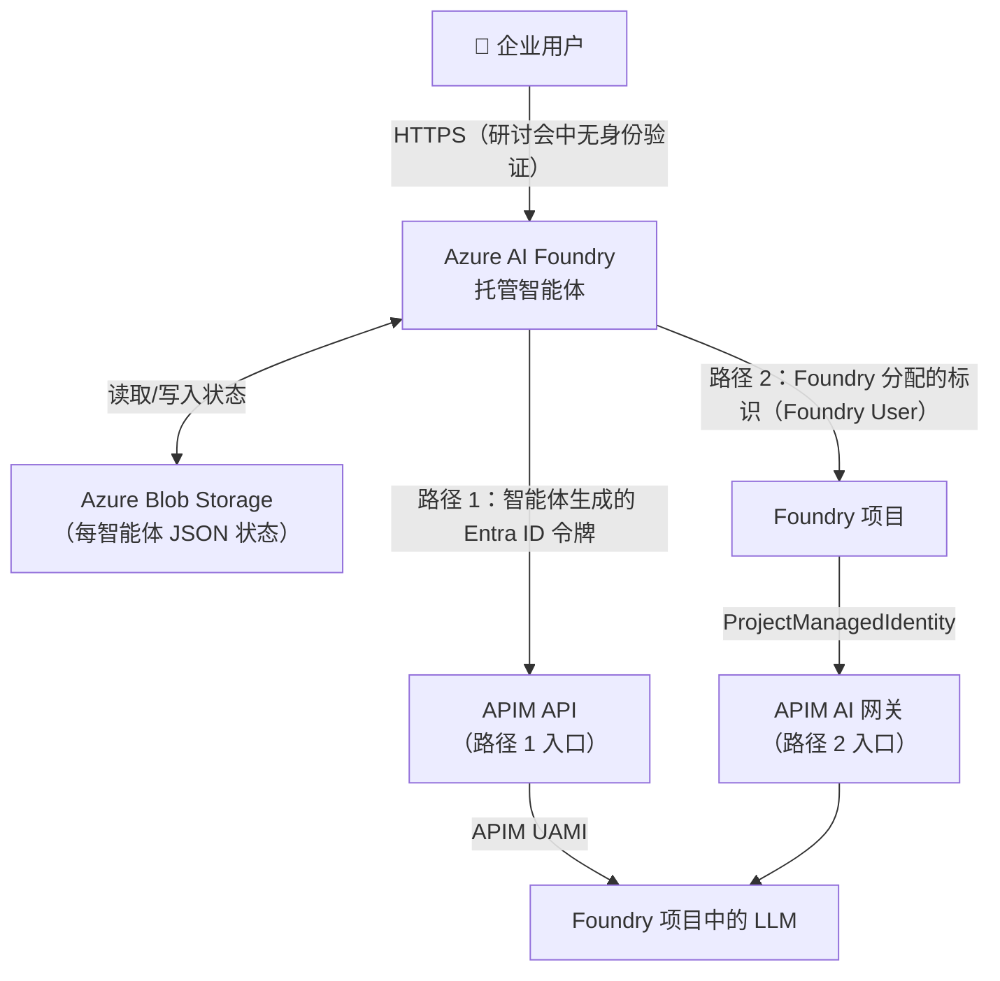
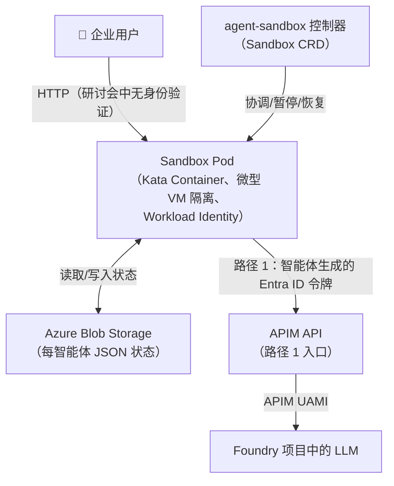
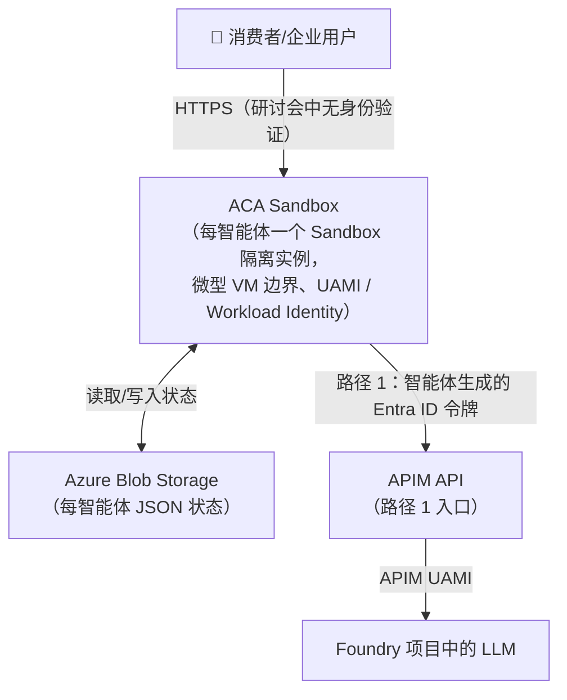

# Azure 上的智能体托管研讨会设计

[返回研讨会主页](../README_CN.md)

## 概述

本模块为研讨会建立架构和决策框架。它比较 Azure 智能体托管选项，并说明为何选择三种具有代表性的解决方案，而不是为每种工作负载规定同一个平台。

所选的三种互补解决方案用于演示这些权衡：

1. **Foundry Hosted Agent** 优先考虑托管运营、治理和快速实现价值。
2. **采用 agent-sandbox 的 AKS** 优先考虑可定制性、企业控制和微型 VM 隔离。
3. **ACA Sandbox** 优先考虑内存持久性、长时间运行的智能体生命周期控制和缩放到零。

> 📊 **更喜欢幻灯片？**
>
> 打开[设计](https://oxcp.github.io/ainotes/agenthost/module-00/design.html)，逐步了解研讨会设计。

## 1. 目标场景

### 1.1 ToB — 企业 / 商业

**企业部署优先考虑安全性、治理和严格的租户隔离。多租户 SaaS 平台和大型组织需要强大的审计跟踪、合规控制，以及采用预留容量的可预测缩放。**

| 维度 | 详细信息 |
|---|---|
| 典型用户 | 企业 IT、内部开发团队、B2B SaaS 平台 |
| 规模 | 每个租户数十到数千个具名智能体实例 |
| 隔离要求 | 强 — 租户/部门边界、审计跟踪 |
| 身份验证 | Azure Entra ID (AAD) — SSO、RBAC、条件访问 |
| 合规性 | 数据驻留、专用网络 (VNet)、RBAC |
| 成本模型 | 预留容量，或具有可预测 SLA 的可突发容量 |
| 优先级 | 安全性 · 治理 · 可靠性 |

### 1.2 ToC — 消费者 / 最终用户

**消费者部署优先考虑成本效益、速度和简单性。大量短期会话、较轻的隔离要求和积极缩放到零，让按使用量付费的定价模型适合个人用户和小型团队。**

| 维度 | 详细信息 |
|---|---|
| 典型用户 | 个人最终用户、小型团队、开发人员试验场 |
| 规模 | 可能有极大量的短期会话 |
| 隔离要求 | 中等到强的用户级隔离。建议使用微型 VM/Sandbox 边界 |
| 身份验证 | 社交登录（Entra External ID / B2C）或 API 密钥 |
| 成本模型 | 纯按使用量付费，积极缩放到零 |
| 优先级 | 成本 · 速度 · 简单性 |

---

## 2. 可选解决方案

### 2.1 托管技术比较

| 技术 | 隔离 | 冷启动 | 成本效益 | Azure 适配 | 适用对象 | 优势 | 弱点 |
|---|---|---|---|---|---|---|---|
| **Foundry Hosted Agent** | 强，托管（每智能体） | 快（< 1 秒） | 最佳（按执行付费） | Microsoft Foundry | ToB 托管 | 原生智能体生命周期、内置状态与身份验证；强大的治理与安全性 | 定制能力有限 |
| **微型 VM** | 强（虚拟机监控程序） | 慢（2–10 秒） | 低（始终运行的 VM） | AKS + Kata + agent-sandbox | ToB / ToC | 高度定制（企业特定要求；成本/性能优化）；真正的内核隔离 | 成本、运营开销 |
| **会话** | 强（Hyper-V 隔离会话） | 快（< 1 秒） | 良好 | ACA Dynamic Sessions | ToC 交互式/短期作业 | 托管、无服务器；非常适合一次性代码执行 | 定制能力有限；不适合长时间运行的智能体 |
| **Sandbox** | 强（服务托管的 Sandbox 隔离、微型 VM 边界） | 快（< 2 秒） | 缩放到零时良好 | ACA Sandbox | ToC / ToB 长时间运行的智能体 | 强隔离并具有生命周期控制（挂起/恢复/快照） | 基础设施控制不如 AKS |
| **容器** | 中等（命名空间） | 快（< 2 秒） | 缩放到零时良好 | ACA、AKS | ToB / ToC | 成熟的生态系统、OCI | 共享内核 |
| **进程** | 弱（OS 进程） | 最快（< 0.5 秒） | 最佳 | App Service、Functions | 低风险 ToC | 开销最小 | 嘈杂邻居风险 |
| **无服务器** | 中等 | 快（< 2 秒） | 最佳（按执行付费） | Azure Functions、ACA Jobs | 无状态 ToC | 零基础设施运营 | 设计上无状态 |
| **VM** | 最强 | 最慢（> 30 秒） | 最差 | Azure VM | 旧式系统 | 完全控制 | 冷启动、成本 |

### 2.2 Azure 资源比较

| Azure 资源 | 技术 | 隔离级别 | 缩放到零 | 状态持久性 | Entra ID 集成 | APIM 集成 | 最适用场景 |
|---|---|---|---|---|---|---|---|
| **Foundry Hosted Agent** | 托管智能体运行时 | 强，托管（每智能体） | ✅ 原生 | ✅ 内置 | ✅ 原生 | ✅ 原生 | ToB 托管，最快上手 |
| **AKS + agent-sandbox** | 微型 VM 或容器 | 强，微型 VM | ✅ 自定义 | ✅ 自定义 | ✅ Pod 的 Workload Identity | ✅ | ToB：针对企业特定技术要求进行高度定制；ToC：针对成本/性能优化进行高度定制 |
| **ACA Dynamic Sessions** | Hyper-V 隔离会话池 | 强（每会话，Hyper-V 边界） | ✅ 原生 | ✅ 通过 Blob | ✅ Workload Identity | ✅ | ToC 短期/一次性代码执行；不适合持久、长时间运行的智能体 |
| **ACA Sandbox** | 服务托管的 Sandbox（微型 VM 边界） | 强，微型 VM（每 Sandbox） | ✅ 原生 | ✅ 通过 Blob | ✅ Workload Identity | ✅ | ToC / ToB 长时间运行的智能体；强隔离 + 生命周期控制 |
| **Azure Container Apps** | 容器 | 中等（命名空间） | ✅ 原生 | ✅ 通过 Blob | ✅ Workload Identity | ✅ | ToB / ToC 通用 |
| **Azure App Service** | 进程/容器 | 弱–中等 | ❌（最少 1 个实例） | ✅ | ✅ | ✅ | 简单的 ToC Web 应用 |
| **Azure Functions** | 无服务器 | 中等 | ✅ 原生 | 有限 | ✅ | ✅ | ToC 无状态任务 |
| **虚拟机** | VM | 最强 | ❌ | ✅ | ✅ | ✅ | 旧式系统/特殊硬件 |

---

## 3. 所选解决方案及理由

建议采用三种互补解决方案，每种都针对不同的运营特征进行了优化。

| # | 解决方案 | 场景 | 关键原因 |
|---|---|---|---|
| **A** | Azure AI Foundry Host Agent | ToB 托管 | 完全托管；原生智能体生命周期、状态、身份验证；内置治理与安全性；最快实现价值 |
| **B** | AKS + agent-sandbox | ToB / ToC | 高度定制是核心价值。**ToB：** 进行定制以满足企业特定技术要求（通过 Kata Containers 实现微型 VM 隔离、自定义网络、合规性）；**ToC：** 针对成本/性能进行定制优化（Spot 节点池、适当大小的 SKU、休眠/缩放到零）；两者均使用 `Sandbox` CRD 生命周期 |
| **C** | ACA Sandbox | ToC / ToB 长时间运行的智能体 | 服务托管的 Sandbox 隔离（微型 VM 边界）；支持长时间运行的智能体；生命周期控制；真正缩放到零 |

> [!important]
> **为什么解决方案 C 选择 ACA Sandbox 而不是 ACA Dynamic Sessions？**
> ACA Dynamic Sessions 针对**一次性或短期代码执行**进行了优化（例如代码解释器任务、临时 Sandbox）。它会积极逐出会话，并非为长时间运行的有状态智能体而设计。**ACA Sandbox** 提供强大的服务托管 Sandbox 隔离及生命周期控制（创建/挂起/恢复/删除），更适合持久、长时间运行的智能体工作负载。ACA Sandboxes 已正式发布；对于生产工作负载，请验证区域可用性、配额、服务限制和 SLA 要求。
> ACA Dynamic Sessions 仍保留在比较表（第 2.1 和 2.2 节）中，作为短期执行场景的有效选项。
>
> **为什么不选择 Azure Functions 或 App Service？**
> Functions 设计上是无状态的；若没有复杂的外部状态管理，则不支持持久会话上下文。App Service 无法原生缩放到零，空闲成本较高。

---

## 4. 已实现的功能

下表将每项技术要求映射到三种所选解决方案各自的实现方法。

| # | 要求 | Foundry Host Agent (A) | AKS + agent-sandbox (B) | ACA Sandbox (C) |
|---|---|---|---|---|
| 1 | **状态与上下文持久性** | 内置智能体状态存储（Cosmos/Blob） | Azure Blob（每个智能体一个 JSON，每次更改时保存） | Azure Blob（每个智能体一个 JSON，每次更改时保存） |
| 2 | **快速启动/缩放到零** | 原生智能体空闲逐出 + 热恢复 | agent-sandbox 生命周期：暂停/恢复/休眠；状态已持久保存在 Blob 中；可选 SandboxWarmPool | ACA Sandbox 容器池；空闲超时 = 15 分钟；状态已持久保存在 Blob 中 |
| 3 | **隔离** | 每智能体托管 Sandbox | 每个智能体一个 Kata Container 微型 VM；NetworkPolicy + 命名空间隔离 | 每个 Sandbox 采用服务托管的 Sandbox 隔离（微型 VM 边界） |
| 4 | **Entra ID 身份验证** | 原生 AAD 集成；用户分配的托管标识 | Pod 的 AAD Workload Identity | ACA Workload Identity (UAMI) + 入口处的 Entra ID 令牌验证 |
| 5 | **AI 网关 (APIM)** | APIM 策略路由所有 LLM 调用 | APIM 网关策略；JWT 验证 | APIM 网关策略；JWT 验证 |
| 6 | **节省成本** | 空闲 15 分钟后缩放到零 | agent-sandbox 休眠；工作器节点使用 Spot 节点池；状态使用 Blob Cool 层 | 真正的无服务器；空闲后销毁容器 |

---

## 5. 关键技术注意事项

### 5.1 状态持久性设计

```
生命周期事件           操作
─────────────────────    ─────────────────────────────────────────────────────────
新智能体启动       →  直接从 Azure Blob 加载状态（每智能体 JSON）
活跃对话           →  每次更改时将状态持久保存到 Azure Blob
                       （每轮聊天后：消息已发送 + 响应已收到）
缩放到零触发       →  无需刷新 — 最新状态已持久保存在 Blob 中
新请求到达         →  从 Azure Blob 恢复
```
> [!note]
> **唯一事实来源：Azure Blob Storage。** 每个智能体将其状态存储为
> `agent-state` 容器中的 `<AGENT_ID>.json`。不存在单独的热缓存
>（不使用 Redis）：智能体在每次状态更改时写入 Blob，因此最新状态
> 始终持久保存，并可在重启、休眠或缩放到零后恢复。
> 使用启用了**版本控制**的 Blob **Cool 层**，以经济高效的方式实现可恢复状态。

### 5.2 快速启动优化（待添加）

- **预热实例池**：每个解决方案至少保留 1 个备用实例以吸收突发流量（可配置；如需纯粹节省成本则设置为 0）。
- **轻量级检查点格式**：仅序列化对话历史记录 + 工具状态；避免完整的进程内存转储。
- **容器映像缓存**：在 Azure Container Registry 异地复制中固定基础映像层。

### 5.3 Entra ID 身份验证架构

> [!note]
> **用户 → 智能体身份验证不在本研讨会范围内。** 仅在**智能体和模型之间**
> 的跃点强制实施身份验证，并将其描述为两条路径（请参阅
> [6.0 两条访问路径](#60-两条访问路径共享模型)）：
>
> - **路径 1**（`Agent → APIM API → LLM`）：智能体向 APIM API 提供
>   **由智能体生成的 Entra ID 令牌**，APIM 使用其 **UAMI**
>   调用 Foundry LLM。
> - **路径 2**（`Agent → Foundry project → APIM AI gateway → LLM`，仅解决方案 A）：
>   托管智能体使用 **Foundry 分配的标识**（Foundry User）调用其项目，
>   该项目通过 APIM AI 网关路由推理。

```
路径 1（所有解决方案）                       路径 2（仅解决方案 A 托管智能体）
──────────────────────────────            ─────────────────────────────────────────
👤 用户                                    👤 用户
   │（研讨会中无身份验证）                     │（研讨会中无身份验证）
   ▼                                           ▼
智能体实例                                  Foundry 托管智能体
   │ 智能体生成的 Entra ID 令牌                 │ Foundry 分配的标识（Foundry User）
   ▼                                           ▼
APIM API                                Foundry 项目
   │ validate-jwt                              │ ProjectManagedIdentity
   │ 然后 APIM UAMI → Foundry                  ▼
   ▼                                       APIM AI 网关
Foundry 项目中的 LLM                           │ APIM UAMI → Foundry
                                               ▼
                                           Foundry 项目中的 LLM
```

- **ToB**：具有 RBAC 角色的 Entra ID 应用注册；每个智能体一个托管标识。智能体的 UAMI / Workload Identity 用于获取 APIM API（路径 1）的令牌。
- **ToC**：Entra External ID (B2C) 可以置于面向用户的应用前端，但本研讨会不涵盖用户 → 智能体身份验证；智能体 → 模型跃点仍使用托管标识。

### 5.4 APIM AI 网关模式

应用于 LLM 后端的关键 APIM 策略：
1. `validate-jwt` — 验证 `Agent → APIM API` 跃点（路径 1）上**由智能体生成的 Entra ID 令牌**。然后 APIM 使用其 **UAMI** 调用 Foundry。
2. `rate-limit-by-key` — 每个智能体实例的令牌配额。（待添加）
3. `azure-openai-token-limit` — 语义令牌计数。
4. `retry` — 对 429 / 5xx 进行指数退避自动重试。（待添加）
5. `cache-lookup` / `cache-store` — 为相同提示缓存响应。（待添加）

---

## 6. 解决方案架构

### 6.0 两条访问路径（共享模型）

每种解决方案都通过两条路径之一将流量从用户路由到模型。
在本研讨会中，**用户 → 智能体身份验证不在范围内**；仅在智能体和模型
之间的跃点强制实施身份验证：

- **路径 1 — `Agent → APIM API → LLM in Foundry project`**
  - `Agent → APIM API`：智能体**动态生成 Entra ID 令牌**
    并将其提供给 APIM API (`validate-jwt`)。
  - `APIM API → LLM in Foundry project`：APIM 使用其
    **用户分配的托管标识 (UAMI)** 向 Foundry 进行身份验证。
- **路径 2 — `Agent → Foundry project → APIM AI gateway → LLM in Foundry project`**
  - `Agent → Foundry project`：托管智能体使用 **Foundry 分配给托管智能体的标识**
    （已授予 **Foundry User** 角色）调用其自己的 Foundry 项目。
  - `Foundry project → APIM AI gateway → LLM`：项目的推理流量由已注册的
    **APIM AI 网关**连接（`ProjectManagedIdentity`，受众
    `https://ai.azure.com`）治理。

| 解决方案 | 路径 1 | 路径 2 |
|---|:---:|:---:|
| A — Foundry Hosted Agent | ✅ | ✅ |
| B — AKS + agent-sandbox | ✅ | — |
| C — ACA Sandbox | ✅ | — |

> [!note]
> 路径 2 **仅适用于解决方案 A 中的 Foundry 托管智能体**，因为只有托管智能体
> 在 Foundry 项目内部运行并获得 Foundry 分配的标识。解决方案 B 和 C
> 在 Foundry 外部运行智能体，因此始终通过路径 1 访问模型。

---

### 解决方案 A — Azure AI Foundry Host Agent（ToB 托管）

解决方案 A **同时使用路径 1 和路径 2**。



**工作流：**
1. 用户向托管智能体发送请求（本研讨会不涵盖用户 → 智能体身份验证）。
2. 托管智能体从 Azure Blob 加载其实例状态。
3. 智能体通过任一路径访问模型：
   - **路径 1：** 智能体生成 Entra ID 令牌并调用 **APIM API**；随后 APIM 使用其 **UAMI** 调用 Foundry 项目中的 LLM。
   - **路径 2：** 智能体使用 Foundry 分配的标识（**Foundry User**）调用其 **Foundry 项目**；该项目通过已注册的 **APIM AI 网关**将推理路由到 LLM。
4. 每轮结束后，智能体将更新后的状态持久保存到 Azure Blob；响应流式返回给用户。
5. 若空闲 > 15 分钟，Host Agent 将逐出实例；最新状态已持久保存在 Blob 中。

---

### 解决方案 B — AKS + agent-sandbox（ToB / ToC — 高度定制）

解决方案 B **仅使用路径 1**。

> [!tip]
> **定位：** 同一套 AKS + agent-sandbox 堆栈通过其**高度可定制性**
> 服务两类受众：
> - **ToB** — 进行定制以满足企业特定技术要求
>   （微型 VM 隔离、自定义网络、合规控制）。
> - **ToC** — 针对成本和性能进行定制优化（Spot 节点池、
>   适当大小的 SKU、积极休眠/缩放到零）。



**工作流：**
1. 用户向智能体的 Sandbox Pod 发送请求（本研讨会不涵盖用户 → 智能体身份验证）。
2. `agent-sandbox` 控制器为该智能体协调 `Sandbox` CR — 一个具有稳定标识的有状态单例 Pod。
3. 如果处于热/运行状态，请求将到达现有 Sandbox Pod（< 1 秒）并从 Blob 加载状态；如果处于休眠状态，控制器将恢复 Sandbox，后者直接从 Blob JSON 重新加载状态。
4. 智能体通过**路径 1**访问模型：它生成由 AKS Workload Identity 支持的 Entra ID 令牌，并调用 **APIM API**；随后 APIM 使用其 **UAMI** 调用 Foundry 项目中的 LLM。
5. 每轮结束后，智能体将更新后的状态持久保存到 Blob。
6. 空闲时，Sandbox 会暂停/休眠（缩放到零）；无需刷新，因为每次更改时状态都已持久保存到 Blob。可选的 `SandboxWarmPool` 保留预热的 Sandbox，以便快速分配。

---

### 解决方案 C — ACA Sandbox（ToC / ToB 长时间运行的智能体）

解决方案 C **仅使用路径 1**。

> [!important]
> **注意：** Azure Container Apps Sandboxes 已**正式发布**。采用于生产工作负载前，请查看[功能文档](https://learn.microsoft.com/en-us/azure/container-apps/sandboxes-overview)，了解区域可用性、配额、服务限制和 SLA 详细信息。
>
> **ACA Dynamic Sessions 与 ACA Sandbox：** ACA Dynamic Sessions 专为**短期、一次性代码执行**（例如临时代码解释器任务）而设计。其积极的会话逐出使其不适合长时间运行的有状态智能体。ACA Sandbox 提供服务托管的 Sandbox 隔离、生命周期控制和持久状态语义，更适合长时间运行的智能体工作负载。



**工作流：**
1. 用户向智能体容器发送请求（本研讨会不涵盖用户 → 智能体身份验证）。
2. ACA 解析目标智能体容器 — 恢复现有（热）Sandbox，或启动一个新的 Sandbox 隔离实例。
3. 智能体容器直接从 Azure Blob 加载其状态。
4. 智能体通过**路径 1**访问模型：它生成由其 UAMI / Workload Identity 支持的 Entra ID 令牌，并调用 **APIM API**；随后 APIM 使用其 **UAMI** 调用 Foundry 项目中的 LLM。
5. 每轮结束后，智能体将更新后的状态持久保存到 Blob。
6. 空闲检测：15 分钟后，ACA 将容器缩放到零；无需刷新 — 每次更改时状态都已持久保存到 Blob。
7. 下一个请求从 Azure Blob 恢复状态。

---

*文档版本 1.0 — 为 Azure AI 智能体托管研讨会编写*
