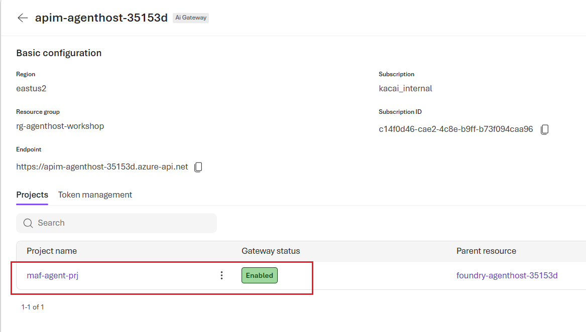

# Module 1 — Core Infrastructure Setup (30 min)

[⬆ Back to Workshop Home](../readme.md)

## Overview

Provision the shared Azure infrastructure used by all three agent hosting solutions:

- Resource Group
- Azure Blob Storage
- Azure API Management
- Azure Key Vault
- Azure Container Registry
- Entra ID App Registration
- User-Assigned Managed Identity
- Microsoft Foundry (AIServices) account

The Foundry account ships with:

- A project
- A `gpt-5.4-mini` model deployment
- Defender for AI
- Two RAI content-safety policies
- The APIM AI gateway that fronts its inference endpoint
- An APIM Basic v2 instance that is eligible for Foundry AI Gateway association

## Learning Objectives

- Deploy shared Azure infrastructure using Bicep IaC
- Configure APIM with a `validate-jwt` policy and Azure OpenAI backend
- Register an Entra ID application and create a User-Assigned Managed Identity
- Create a Foundry resource named `foundry-agenthost-<deploymentSN>` with the project `maf-agent-prj`
- Deploy `gpt-5.4-mini` (capacity 50) and enable Defender for AI
- Apply the `Microsoft.Default` and `Microsoft.DefaultV2` RAI policies
- Expose Foundry inference through APIM as an AI gateway (backend + RBAC + API/policy)

---

## Prerequisites

> **Note:** Run all commands in this README from this module's root directory (`agenthost/module-01/`).

- Azure subscription with **Contributor** access
- Azure CLI installed and authenticated (`az login`)

---

## Step 1 — Set Environment Variables

```bash
export RESOURCE_GROUP="rg-agenthost-workshop"
export LOCATION="eastus2"
```

---

## Step 2 — Deploy Infrastructure via Bicep

Deploy everything with a **single command** using the wrapper script (recommended). It just calls `az deployment sub create` on `main.bicep`, generates the deployment suffix for you, and prints the outputs:

```bash
chmod +x setup.sh
./setup.sh
```

> Before run the `setup.sh`, optionally you can override parameters in `main.bicep` as you need.

Or run the equivalent Bicep deployment manually:

```bash
export SN=$(openssl rand -hex 3); echo $SN

az deployment sub create \
  --name "main-$SN" \
  --location "$LOCATION" \
  --template-file main.bicep \
  --parameters \
      resourceGroupName="$RESOURCE_GROUP" \
      location="$LOCATION" \
      deploymentSN="$SN"

```
> The bicep deployment or running `setup.sh` may take minutes to complete. After the successful deployment, you will see output including deployment info like below:
```
==> Deployment 'main-****' complete. Outputs:
{
  "acrLoginServer": {
    "type": "String",
    "value": "acragenthost****.azurecr.io"
  },
  "acrName": {
    "type": "String",
    "value": "acragenthost****"
  },
  "apimFoundryBackendName": {
    "type": "String",
    "value": "foundry-backend"
  },
  "apimFoundryGatewayUrl": {
    "type": "String",
    "value": "https://apim-agenthost-****.azure-api.net/foundry"
  },
  "apimServiceUrl": {
    "type": "String",
    "value": "https://apim-agenthost-****.azure-api.net"
  },
  "deploymentStatus": {
    "type": "Object",
    "value": {
      "acr": "Succeeded",
      "apim": "Succeeded",
      "foundryAccount": "Succeeded",
      "foundryModel": "Succeeded",
      "foundryProject": "Succeeded",
      "keyVault": "Succeeded",
      "storage": "Succeeded"
    }
  },
  "foundryApimGatewayConnectionName": {
    "type": "String",
    "value": "foundry-apim-gateway"
  },
  "foundryProjectEndpoint": {
    "type": "String",
    "value": "https://foundry-agenthost-****.services.ai.azure.com/api/projects/maf-agent-prj"
  },
  "foundryProjectId": {
    "type": "String",
    "value": "/subscriptions/********-****-****-****-************/resourceGroups/rg-agenthost-workshop/providers/Microsoft.CognitiveServices/accounts/foundry-agenthost-****/projects/maf-agent-prj"
  },
  "foundryProjectName": {
    "type": "String",
    "value": "maf-agent-prj"
  },
  "foundryResourceName": {
    "type": "String",
    "value": "foundry-agenthost-****"
  },
  "identityClientId": {
    "type": "String",
    "value": "********-****-****-****-************"
  },
  "keyVaultName": {
    "type": "String",
    "value": "kv-agenthost-****"
  },
  "keyVaultUri": {
    "type": "String",
    "value": "https://kv-agenthost-****.vault.azure.net/"
  },
  "modelDeploymentName": {
    "type": "String",
    "value": "gpt-5.4-mini"
  },
  "resourceGroupName": {
    "type": "String",
    "value": "rg-agenthost-workshop"
  },
  "storageAccountName": {
    "type": "String",
    "value": "stcagenthost****"
  }
}

Next: proceed to module-02 to deploy the hosted agent with azd.
```

> **RBAC note:** the Foundry account sets `disableLocalAuth: true`, so APIM must call it with an Entra ID token from the user-assigned managed identity. The deployment therefore automatically grants the UAMI the **Cognitive Services OpenAI User** role on the Foundry account. Creating that role assignment requires the deployer to have **Owner** or **User Access Administrator** on the resource group (Contributor alone cannot create role assignments).

---

## Step 3 — Foundry AI gateway (provisioned with the core deployment)

`core.bicep` provisions the Foundry stack and wires the module-01 API Management instance as its AI gateway:

1. **Foundry account** `foundry-agenthost-<deploymentSN>` (kind `AIServices`, `disableLocalAuth: true`) with the project `maf-agent-prj`, the `gpt-5.4-mini` deployment (GlobalStandard, capacity 50), and Defender for AI.
2. **APIM** `apim-agenthost-<deploymentSN>` is created on the **Basic v2** tier so it is eligible for Foundry's native AI Gateway feature.
3. **Backend** `foundry-backend` → the Foundry Responses endpoint (`${foundryAccount.properties.endpoint}openai/v1`).
4. **RBAC** — the module-01 UAMI is granted **Cognitive Services OpenAI User** and **Azure AI User** on the Foundry account.
5. **API** `foundry-ai-gateway` (path `/foundry`) with `responses` (`POST /responses`) and `get-response` (`GET /responses/{response-id}`) operations, plus an API-scope policy that validates the caller's Entra ID token (`validate-jwt`) and then forwards to the backend with a managed-identity token via `authentication-managed-identity` (resource `https://ai.azure.com`).

To make this APIM instance appear in **Microsoft Foundry portal → Operate → Admin console → AI Gateway**, you still need one manual portal step after deployment:

1. Open **AI Gateway**.
2. Select **Add AI Gateway**.
3. Choose **Use existing**.
4. Select the deployed foundry account `foundry-agenthost-<deploymentSN>` and the APIM `apim-agenthost-<deploymentSN>` instance, click "Add".
5. Open the gateway entry and check the foundry project is automatically added to the gateway.


Call the model through the gateway (the gateway URL is the `apimFoundryGatewayUrl` output). The caller sends its own Entra ID token; APIM validates it and forwards to Foundry with its managed identity:

```bash
export ACCESSTOKEN=$(az account get-access-token --query accessToken -o tsv | tr -d '\r\n')

curl -s -X POST \
  "https://apim-agenthost-${SN}.azure-api.net/foundry/openai/v1/responses" \
  -H "Authorization: Bearer $ACCESSTOKEN" \
  -H "Content-Type: application/json" \
  -d '{
    "model":"gpt-5.4-mini",
    "input":"Hello through the APIM AI gateway"
  }' \
| jq -r '.output'

```
You should see output like below:
```
[
  {
    "type": "message",
    "id": "msg_094f276e62fae6ff006a5afcf4c690819685e624b6211a6c2d",
    "response_id": "resp_094f276e62fae6ff006a5afcf47f2081968f90d4187a8cb827",
    "phase": "final_answer",
    "role": "assistant",
    "content": [
      {
        "type": "output_text",
        "text": "Hello! I’m here and ready to help through the APIM AI gateway. What can I do for you today?",
        "annotations": [],
        "logprobs": []
      }
    ],
    "status": "completed"
  }
]
```

Retrieve the key outputs after deployment:

```bash
az deployment sub show \
  --name main-$SN \
  --query "properties.outputs.{endpoint:foundryProjectEndpoint.value, model:modelDeploymentName.value, gateway:apimFoundryGatewayUrl.value, backend:apimFoundryBackendName.value}"
```

---

## Files in This Module

| File | Description |
|---|---|
| `setup.sh` | One-step wrapper that runs the `main.bicep` subscription deployment (`az deployment sub create`) and prints the outputs |
| `main.bicep` | Bicep subscription-scoped entry point (creates Resource Group, calls core.bicep) |
| `core.bicep` | Bicep IaC template for all shared Azure resources (Storage, APIM Basic v2, Key Vault, ACR, UAMI) **and** the Foundry stack (account, project, `gpt-5.4-mini`, Defender for AI, APIM AI gateway) |

---

## Outputs

| Output | Description |
|---|---|
| `storageAccountName`, `apimServiceUrl`, `identityClientId`, `keyVaultName`, `keyVaultUri`, `acrName`, `acrLoginServer` | Core shared-resource coordinates |
| `foundryResourceName` | Foundry account name (`foundry-agenthost-<suffix>`) |
| `foundryProjectName` / `foundryProjectId` / `foundryProjectEndpoint` | Foundry project identifiers (project endpoint consumed by module-02) |
| `modelDeploymentName` | Deployed model name (`gpt-5.4-mini`) |
| `apimFoundryBackendName` | APIM backend name (`foundry-backend`) |
| `apimFoundryGatewayUrl` | APIM AI gateway URL for Foundry inference |

---

## Next Step

Proceed to [Module 2 — Solution A: Foundry Hosted Agent](../module-02/README.md) to deploy the hosted agent with `azd` against the Foundry project provisioned here.

---

[⬆ Back to Workshop Home](../readme.md)
