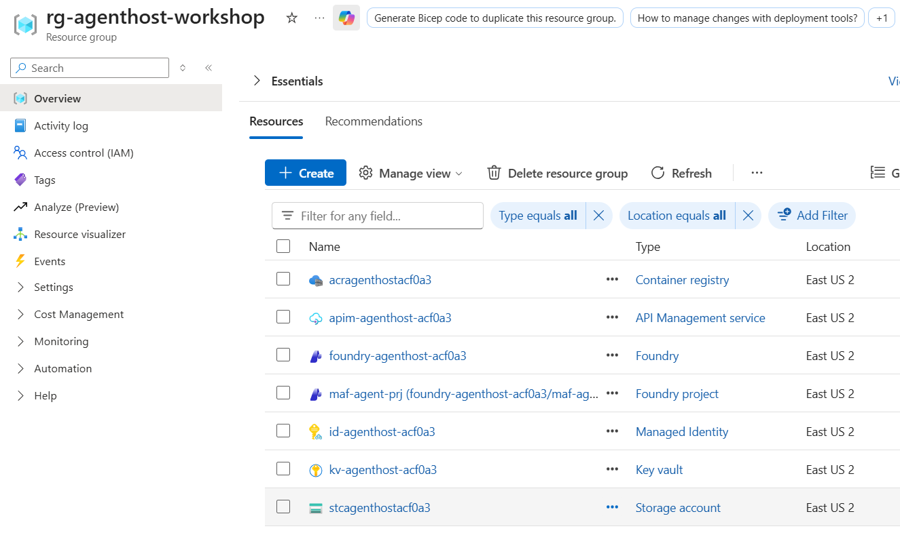
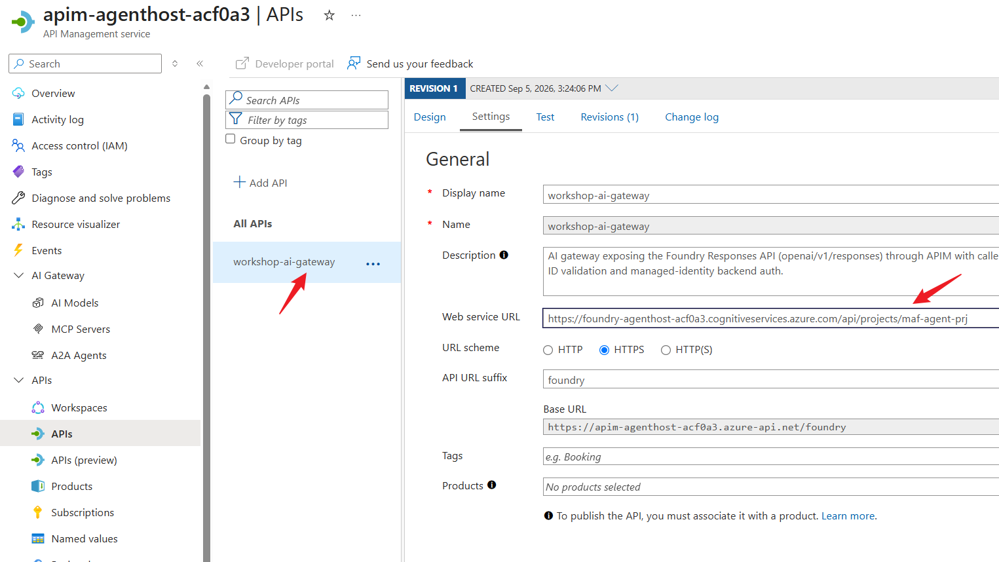
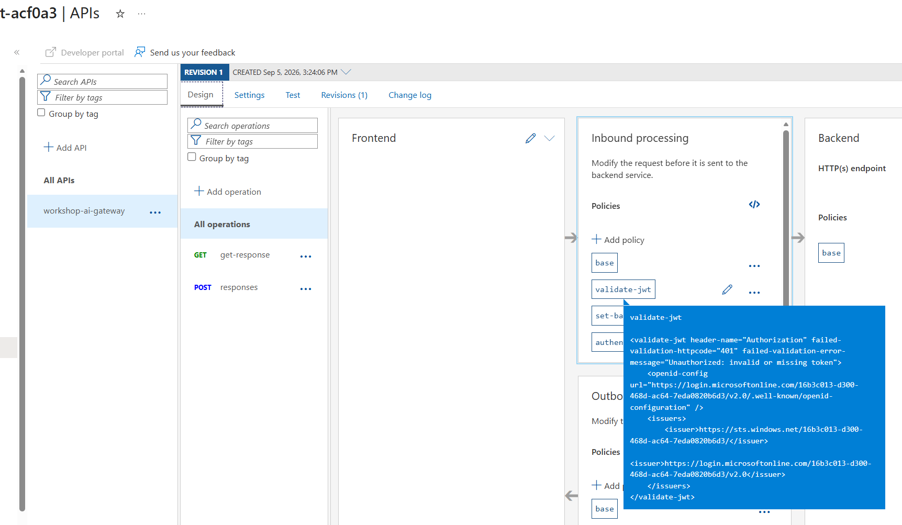
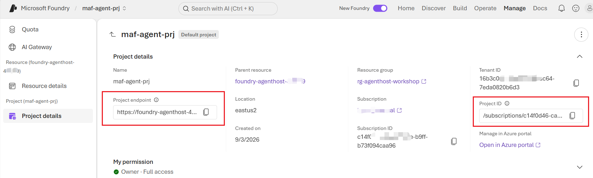
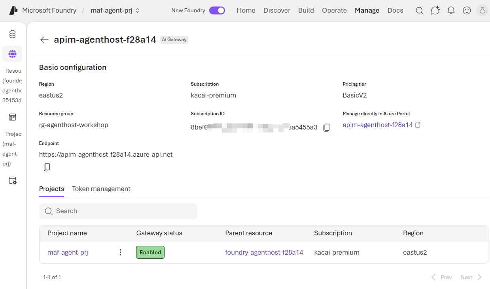
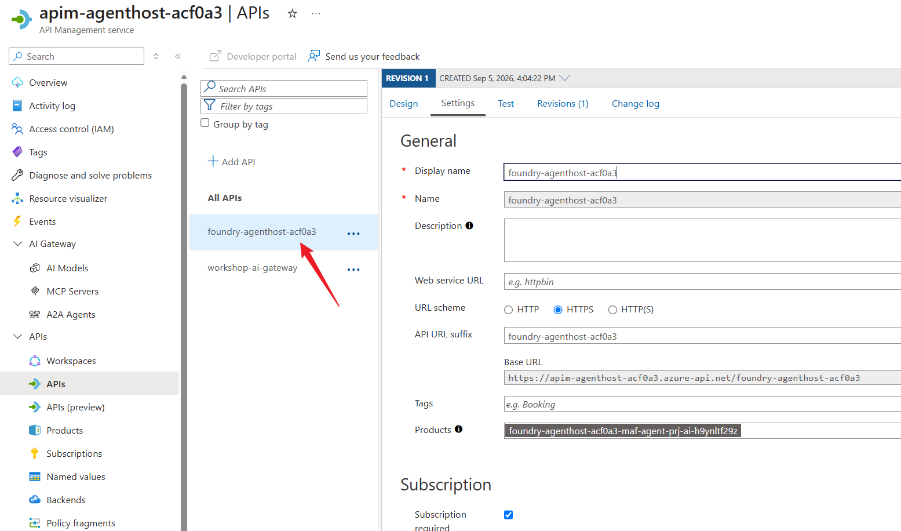

# Module 1 — Core Infrastructure Setup (20 min)

[⬆ Back to Workshop Home](../readme.md)

## Overview

Provision the shared Azure infrastructure used by all three agent hosting solutions:

- Resource Group
- Azure Blob Storage
- Azure API Management
- Azure Key Vault
- Azure Container Registry
- Entra ID App Registration
- User-Assigned Managed Identity
- Microsoft Foundry (AIServices) account

The Foundry account ships with:

- A project
- A `gpt-5.4-mini` model deployment
- Defender for AI
- Two RAI content-safety policies
- The APIM AI gateway that fronts its inference endpoint
- An APIM Basic v2 instance that is eligible for Foundry AI Gateway association

## Learning Objectives

- Deploy shared Azure infrastructure using Bicep IaC
- Configure APIM with a `validate-jwt` policy and Azure OpenAI backend
- Register an Entra ID application and create a User-Assigned Managed Identity
- Create a Foundry resource named `foundry-agenthost-<deploymentSN>` with the project `maf-agent-prj`
- Deploy `gpt-5.4-mini` (capacity 50) and enable Defender for AI
- Apply the `Microsoft.Default` and `Microsoft.DefaultV2` RAI policies
- Expose Foundry inference through APIM as an AI gateway (backend + RBAC + API/policy)

---

## Prerequisites
> [!IMPORTANT]
> **Note:** Run all commands in this README from this module's root directory (`agenthost/module-01/`).

- Complete the [common workshop prerequisites](../readme.md#prerequisites-before-workshop).
- `curl` installed
- `jq` installed
- Permission to create role assignments (`Microsoft.Authorization/roleAssignments/write`) for the resources deployed by this module. Typical options are **Owner**, or **Contributor** plus **Role Based Access Control Administrator**.

---

## Step 1 — Set Environment Variables

```bash
export RESOURCE_GROUP="rg-agenthost-workshop"
export LOCATION="eastus2"
```

---

## Step 2 — Deploy Infrastructure via Bicep

Deploy everything with a **single command** by using the wrapper script (recommended). The script calls `az deployment sub create` on `main.bicep`, generates the deployment suffix for you, and prints the outputs:

```bash
chmod +x setup.sh
./setup.sh
```
> [!TIP]
> Before running `setup.sh`, you can optionally override parameters in `main.bicep` as needed.

Or run the equivalent Bicep deployment manually:

```bash
export SN=$(openssl rand -hex 3); echo $SN

az deployment sub create \
  --name "main-$SN" \
  --location "$LOCATION" \
  --template-file main.bicep \
  --parameters \
      resourceGroupName="$RESOURCE_GROUP" \
      location="$LOCATION" \
      deploymentSN="$SN"

```
> [!NOTE]
> The Bicep deployment, whether run directly or through `setup.sh`, may take several minutes (ususally 3~4 minutes) to complete. After a successful deployment, you will see output similar to the following:
```
==> Deployment 'main-<deploymentSN>' complete. Outputs:
{
  "acrLoginServer": {
    "type": "String",
    "value": "acragenthost<deploymentSN>.azurecr.io"
  },
  "acrName": {
    "type": "String",
    "value": "acragenthost<deploymentSN>"
  },
  "apimFoundryBackendName": {
    "type": "String",
    "value": "foundry-backend"
  },
  "apimFoundryGatewayUrl": {
    "type": "String",
    "value": "https://apim-agenthost-<deploymentSN>.azure-api.net/foundry"
  },
  "apimServiceUrl": {
    "type": "String",
    "value": "https://apim-agenthost-<deploymentSN>.azure-api.net"
  },
  "deploymentStatus": {
    "type": "Object",
    "value": {
      "acr": "Succeeded",
      "apim": "Succeeded",
      "foundryAccount": "Succeeded",
      "foundryModel": "Succeeded",
      "foundryProject": "Succeeded",
      "keyVault": "Succeeded",
      "storage": "Succeeded"
    }
  },
  "foundryProjectEndpoint": {
    "type": "String",
    "value": "https://foundry-agenthost-<deploymentSN>.services.ai.azure.com/api/projects/maf-agent-prj"
  },
  "foundryProjectId": {
    "type": "String",
    "value": "/subscriptions/<subscription-id>/resourceGroups/rg-agenthost-workshop/providers/Microsoft.CognitiveServices/accounts/foundry-agenthost-<deploymentSN>/projects/maf-agent-prj"
  },
  "foundryProjectName": {
    "type": "String",
    "value": "maf-agent-prj"
  },
  "foundryResourceName": {
    "type": "String",
    "value": "foundry-agenthost-<deploymentSN>"
  },
  "identityClientId": {
    "type": "String",
    "value": "<identity-client-id>"
  },
  "keyVaultName": {
    "type": "String",
    "value": "kv-agenthost-<deploymentSN>"
  },
  "keyVaultUri": {
    "type": "String",
    "value": "https://kv-agenthost-<deploymentSN>.vault.azure.net/"
  },
  "modelDeploymentName": {
    "type": "String",
    "value": "gpt-5.4-mini"
  },
  "resourceGroupName": {
    "type": "String",
    "value": "rg-agenthost-workshop"
  },
  "storageAccountName": {
    "type": "String",
    "value": "stcagenthost<deploymentSN>"
  }
}
Template deployed successfully.
Next:
1. Verify the APIM works as standalone gateway by accessing the API through the APIM endpoint.
2. Add the APIM to the Foundry project as a Foundry Native AI Gateway.
```

After the template deployed, you have a resource group created with below resources in it:



> [!NOTE]
> **For reference, the template deploys and configures the following resources:**
> 1. **User-assigned managed identity (UAMI)** for workloads in later modules. It receives access to Foundry inference and the agent-state storage account.
> 2. **Azure Storage account** using Standard LRS and the Cool access tier, with HTTPS-only access, TLS 1.2, and public blob access disabled. Blob versioning is enabled, and a private `agent-state` container is created for durable agent state.
> 3. **Azure Key Vault** using the Standard tier, with RBAC authorization, soft delete, purge protection, and public network access enabled.
> 4. **Azure Container Registry (ACR)** using the Standard tier, with the administrator account disabled.
> 5. **Microsoft Foundry account** `foundry-agenthost-<deploymentSN>` of kind `AIServices`, with a system-assigned managed identity, local key authentication disabled, project management enabled, and public network access enabled.
> 6. **Foundry project** `maf-agent-prj`, configured as the account's default and associated project and assigned its own system-assigned managed identity.
> 7. **Model deployment** `gpt-5.4-mini`, using the specified model version, the Global Standard SKU with capacity 50, automatic upgrades to new default versions, and the `Microsoft.DefaultV2` RAI policy.
> 8. **Defender for AI**, enabled on the Foundry account after the project is created.
> 9. **Azure API Management (APIM)** `apim-agenthost-<deploymentSN>` using the Basic v2 tier, with both system-assigned and user-assigned managed identities. TLS 1.0 and TLS 1.1 are disabled.
> 10. **RBAC assignments** granting **Cognitive Services OpenAI User** and **Azure AI User** on the Foundry account to both the APIM system-assigned managed identity and the module-01 UAMI. The UAMI also receives **Storage Blob Data Contributor** on the storage account.
> 11. **APIM backend** `foundry-backend`, which points to the Foundry project endpoint and validates the backend TLS certificate and hostname.
> 12. **APIM API** `workshop-ai-gateway` at path `/foundry`, with subscription keys disabled and two operations: `responses` (`POST /openai/v1/responses`) and `get-response` (`GET /responses/{response-id}`).
> 13. **APIM API policy** that validates the caller's Entra ID token with `validate-jwt`, selects `foundry-backend`, and authenticates to Foundry as the APIM system-assigned managed identity through `authentication-managed-identity` using the `https://ai.azure.com` resource.

After the template deployment, you can retrieve the property values you need with commands as below:
```bash
export SN=$(az group show --resource-group "$RESOURCE_GROUP" --query "tags.deploymentSN" --output tsv 2>/dev/null | tr -d "\r\n" || echo "")

az deployment sub show \
  --name main-$SN \
  --query "properties.outputs.{endpoint:foundryProjectEndpoint.value, model:modelDeploymentName.value, gateway:apimFoundryGatewayUrl.value, backend:apimFoundryBackendName.value}"
```

---

## Step 3 — Verify APIM as a standalone gateway

In the resource group, click the APIM and enter the APIM portal, you will see an API `workshop-ai-gateway` is added with pointing to the Foundry project endpoint:


There are 2 operations are also defined ( /responses, /get-response), with the inbound processing policies:


Let's call the model through the APIM (standalone gateway) by using the above API/operations. To authenticate to the APIM，the caller sends its own Entra ID token, and APIM validates the token with `validate-jwt` policy and forwards the request to Foundry using its managed identity:

```bash
export SN=$(az group show --resource-group "$RESOURCE_GROUP" --query "tags.deploymentSN" --output tsv 2>/dev/null | tr -d "\r\n" || echo "")

export ACCESSTOKEN=$(az account get-access-token --query accessToken -o tsv | tr -d '\r\n')

curl -s -X POST \
  "https://apim-agenthost-${SN}.azure-api.net/foundry/openai/v1/responses" \
  -H "Authorization: Bearer $ACCESSTOKEN" \
  -H "Content-Type: application/json" \
  -d '{
    "model":"gpt-5.4-mini",
    "input":"Hello through the APIM AI gateway"
  }' \
| jq -r '.output'

```
You should see output similar to the following:
```text
[
  {
    "type": "message",
    "id": "msg_094f276e62fae6ff006a5afcf4c690819685e624b6211a6c2d",
    "response_id": "resp_094f276e62fae6ff006a5afcf47f2081968f90d4187a8cb827",
    "phase": "final_answer",
    "role": "assistant",
    "content": [
      {
        "type": "output_text",
        "text": "Hello! I’m here and ready to help through the APIM AI gateway. What can I do for you today?",
        "annotations": [],
        "logprobs": []
      }
    ],
    "status": "completed"
  }
]
```

This response confirms that the deployed APIM instance can operate as a standalone gateway: it validates agent requests and forwards authorized requests to the Foundry backend.

---

## Step 4 — Add APIM to the Foundry project as a native AI gateway

In module-02, agents run as Foundry hosted agents. They can access the Foundry project endpoints through either of the following routing modes:

| APIM operating mode | Call flow |
|---|---|
| Standalone gateway | Agent → APIM → Foundry project endpoint → Foundry project models |
| Foundry native AI gateway | Agent → Foundry project endpoint → Foundry native AI gateway (APIM) → Foundry project models |

> [!TIP]
>
> Because Foundry hosted agents run within the Foundry project, they can use the project's trust context to access its model endpoints. You do not need to assign the `Foundry User` role separately to every hosted-agent identity, which simplifies access management.
>
> In module-03 and module-04, agents run outside Foundry in AKS or Azure Container Apps Sandboxes. Calling the Foundry project endpoint directly would require each external agent identity to have the `Foundry User` role, which increases administrative overhead and can introduce security concerns at scale. A more manageable approach is to use a centrally governed APIM instance: APIM validates each agent token through its `validate-jwt` policy and forwards authorized requests to Foundry using its own managed identity.
>
> Module-02 demonstrates both modes. Modules 03 and 04 use the standalone gateway mode.

To configure APIM as the Foundry project's native AI gateway, complete the following steps manually:

1. Go to the Microsoft Foundry portal, in the top-left drop down menu, select "View all resources", and then in the resources list enter your project maf-agent-prj whose Parent resource is foundry-agenthost-<SN>:

2. In the `maf-agent-prj` project panel, go to **"Manage"** in the top meanu bar. In the left panel, open **AI Gateway**.
3. Select **Add AI Gateway**.
4. Under **AI Foundry resource**, select the Foundry project created in the previous step, `foundry-agenthost-<deploymentSN>`, from the drop-down list.
5. Choose **Use existing**.
6. Select the deployed APIM `apim-agenthost-<deploymentSN>` instance, then click **Add**.
7. Open the gateway entry and verify that the Foundry project is automatically added to the gateway.

8. Open the APIM instance in the Azure portal and verify that a new API was added automatically:


---
## Files in This Module

| File | Description |
|---|---|
| `setup.sh` | One-step wrapper that runs the `main.bicep` subscription deployment (`az deployment sub create`) and prints the outputs |
| `main.bicep` | Bicep subscription-scoped entry point (creates Resource Group, calls core.bicep) |
| `core.bicep` | Bicep IaC template for all shared Azure resources (Storage, APIM Basic v2, Key Vault, ACR, UAMI) **and** the Foundry stack (account, project, `gpt-5.4-mini`, Defender for AI, APIM AI gateway) |

---
## Next Step

Proceed to [Module 2 — Solution A: Foundry Hosted Agent](../module-02/README.md) to deploy the hosted agent with `azd` against the Foundry project provisioned here.

---

[⬆ Back to Workshop Home](../readme.md)
