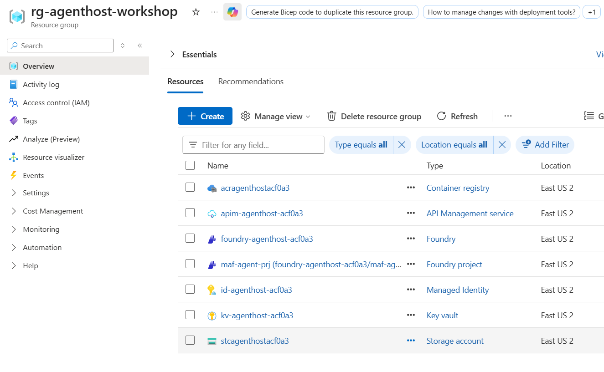
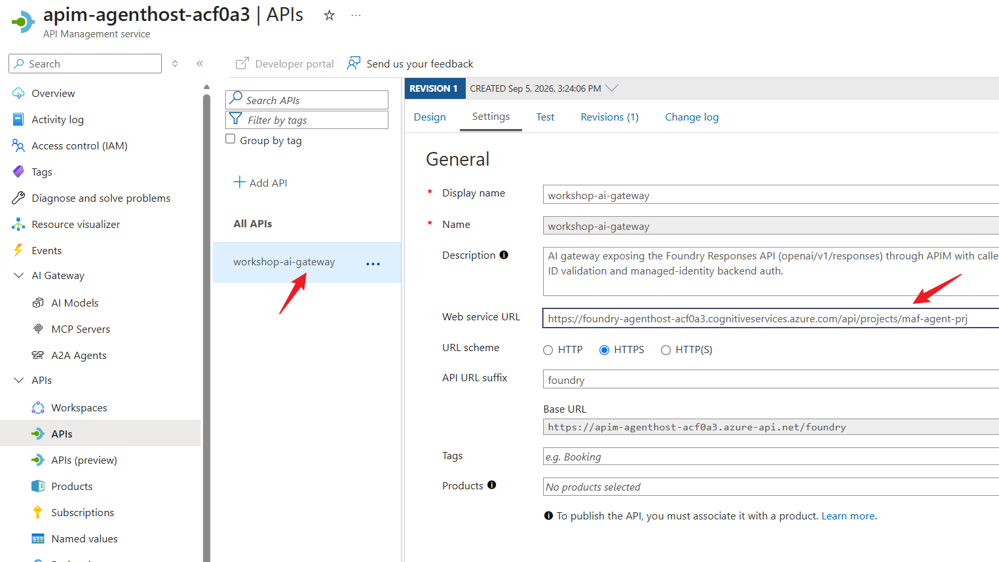
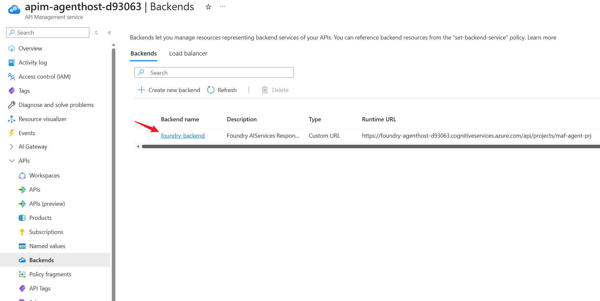
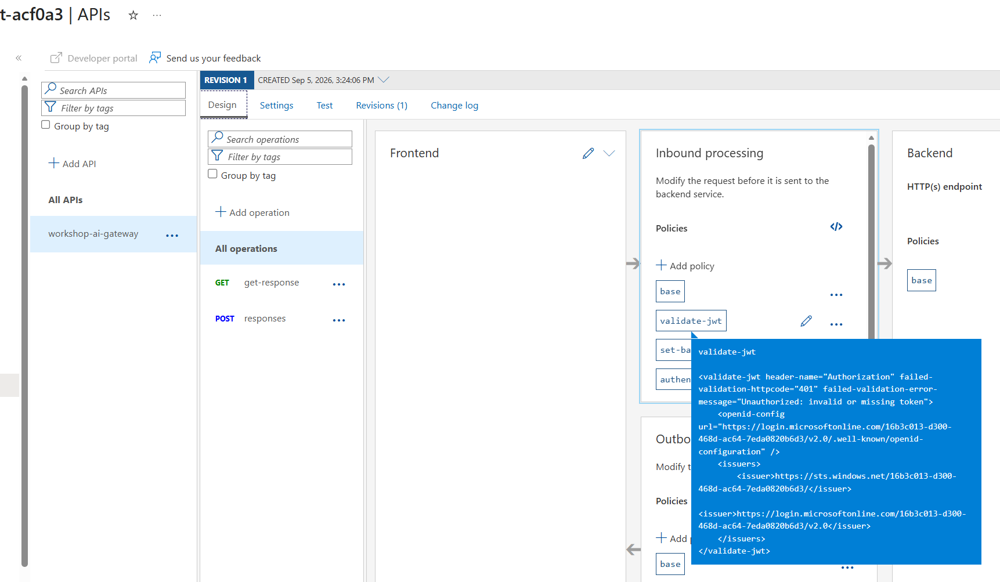
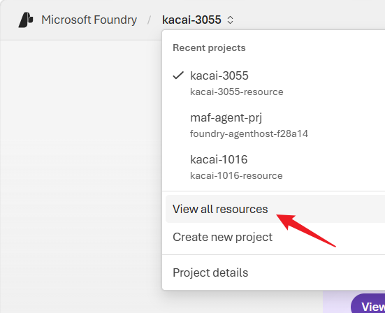
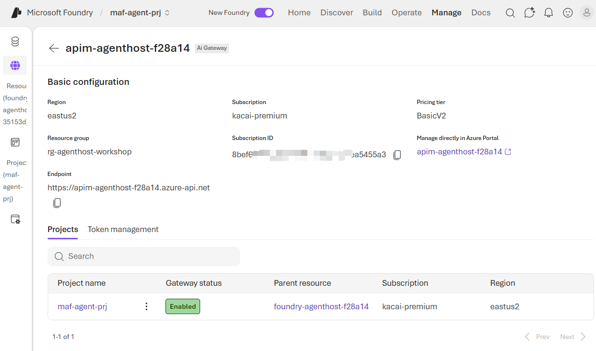
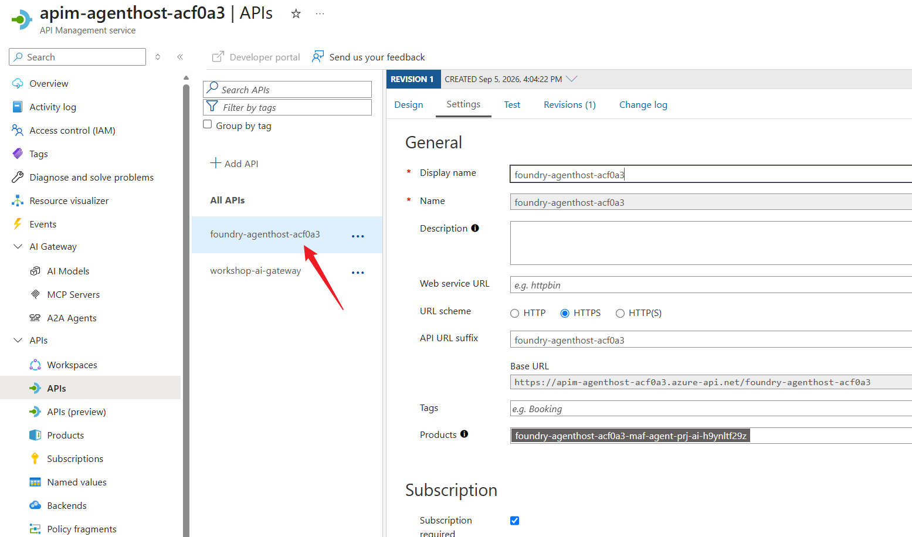

# 模块 1 — 核心基础设施设置（20 分钟）

[⬆ 返回研讨会主页](../readme.md)

## 概述

预配全部三种智能体托管解决方案共用的 Azure 基础设施：

- 资源组
- Azure Blob 存储
- Azure API 管理
- Azure Key Vault
- Azure 容器注册表
- Entra ID 应用注册
- 用户分配的托管标识
- Microsoft Foundry (AIServices) 帐户

Foundry 帐户附带：

- 一个项目
- 一个 `gpt-5.4-mini` 模型部署
- Defender for AI
- 两个 RAI 内容安全策略
- 位于其推理终结点前端的 APIM AI 网关
- 一个符合 Foundry AI Gateway 关联条件的 APIM Basic v2 实例

## 学习目标

- 使用 Bicep IaC 部署共享 Azure 基础设施
- 为 APIM 配置 `validate-jwt` 策略和 Azure OpenAI 后端
- 注册 Entra ID 应用程序并创建用户分配的托管标识
- 创建名为 `foundry-agenthost-<deploymentSN>` 的 Foundry 资源及项目 `maf-agent-prj`
- 部署 `gpt-5.4-mini`（容量 50）并启用 Defender for AI
- 应用 `Microsoft.Default` 和 `Microsoft.DefaultV2` RAI 策略
- 通过 APIM 将 Foundry 推理公开为 AI 网关（后端 + RBAC + API/策略）

---

## 先决条件
> [!IMPORTANT]
> **注意：** 请从本模块的根目录（`agenthost/module-01/`）运行此 README 中的所有命令。

- 完成[研讨会通用先决条件](../readme.md#prerequisites-before-workshop)。
- 已安装 `curl`
- 已安装 `jq`
- 拥有为本模块部署的资源创建角色分配的权限（`Microsoft.Authorization/roleAssignments/write`）。典型选项为 **Owner**，或 **Contributor** 加 **Role Based Access Control Administrator**。

---

## 步骤 1 — 设置环境变量

```bash
export RESOURCE_GROUP="rg-agenthost-workshop"
export LOCATION="eastus2"
```

---

## 步骤 2 — 通过 Bicep 部署基础设施

使用包装器脚本通过**单条命令**部署所有内容（推荐）。该脚本对 `main.bicep` 调用 `az deployment sub create`，为你生成部署后缀并输出结果：

```bash
chmod +x setup.sh
./setup.sh
```
> [!TIP]
> 运行 `setup.sh` 前，可根据需要选择覆盖 `main.bicep` 中的参数。

<!-- 或手动运行等效的 Bicep 部署：

```bash
export SN=$(openssl rand -hex 3); echo $SN

az deployment sub create \
  --name "main-$SN" \
  --location "$LOCATION" \
  --template-file main.bicep \
  --parameters \
      resourceGroupName="$RESOURCE_GROUP" \
      location="$LOCATION" \
      deploymentSN="$SN"

``` -->

部署可能需要几分钟（通常为 3～4 分钟）才能完成。部署成功后，你将看到类似以下内容的输出：
```
==> Deployment 'main-<deploymentSN>' complete. Outputs:
{
  "acrLoginServer": {
    "type": "String",
    "value": "acragenthost<deploymentSN>.azurecr.io"
  },
  "acrName": {
    "type": "String",
    "value": "acragenthost<deploymentSN>"
  },
  "apimFoundryBackendName": {
    "type": "String",
    "value": "foundry-backend"
  },
  "apimFoundryGatewayUrl": {
    "type": "String",
    "value": "https://apim-agenthost-<deploymentSN>.azure-api.net/foundry"
  },
  "apimServiceUrl": {
    "type": "String",
    "value": "https://apim-agenthost-<deploymentSN>.azure-api.net"
  },
  "deploymentStatus": {
    "type": "Object",
    "value": {
      "acr": "Succeeded",
      "apim": "Succeeded",
      "foundryAccount": "Succeeded",
      "foundryModel": "Succeeded",
      "foundryProject": "Succeeded",
      "keyVault": "Succeeded",
      "storage": "Succeeded"
    }
  },
  "foundryProjectEndpoint": {
    "type": "String",
    "value": "https://foundry-agenthost-<deploymentSN>.services.ai.azure.com/api/projects/maf-agent-prj"
  },
  "foundryProjectId": {
    "type": "String",
    "value": "/subscriptions/<subscription-id>/resourceGroups/rg-agenthost-workshop/providers/Microsoft.CognitiveServices/accounts/foundry-agenthost-<deploymentSN>/projects/maf-agent-prj"
  },
  "foundryProjectName": {
    "type": "String",
    "value": "maf-agent-prj"
  },
  "foundryResourceName": {
    "type": "String",
    "value": "foundry-agenthost-<deploymentSN>"
  },
  "identityClientId": {
    "type": "String",
    "value": "<identity-client-id>"
  },
  "keyVaultName": {
    "type": "String",
    "value": "kv-agenthost-<deploymentSN>"
  },
  "keyVaultUri": {
    "type": "String",
    "value": "https://kv-agenthost-<deploymentSN>.vault.azure.net/"
  },
  "modelDeploymentName": {
    "type": "String",
    "value": "gpt-5.4-mini"
  },
  "resourceGroupName": {
    "type": "String",
    "value": "rg-agenthost-workshop"
  },
  "storageAccountName": {
    "type": "String",
    "value": "stcagenthost<deploymentSN>"
  }
}
Template deployed successfully.
Next:
1. Verify the APIM works as standalone gateway by accessing the API through the APIM endpoint.
2. Add the APIM to the Foundry project as a Foundry Native AI Gateway.
```

模板部署后，资源组将创建完成，其中包含以下资源：



> [!NOTE]
> **供参考，该模板将部署和配置以下资源：**
> 1. 供后续模块中的工作负载使用的**用户分配的托管标识 (UAMI)**。它将获得 Foundry 推理和智能体状态存储帐户的访问权限。
> 2. 使用 Standard LRS 和 Cool 访问层的 **Azure 存储帐户**，仅允许 HTTPS 访问、使用 TLS 1.2，并禁用公共 Blob 访问。启用 Blob 版本控制，并创建专用 `agent-state` 容器来持久保存智能体状态。
> 3. 使用 Standard 层的 **Azure Key Vault**，启用 RBAC 授权、软删除、清除保护和公共网络访问。
> 4. 使用 Standard 层且禁用管理员帐户的 **Azure 容器注册表 (ACR)**。
> 5. 类型为 `AIServices` 的 **Microsoft Foundry 帐户** `foundry-agenthost-<deploymentSN>`，配有系统分配的托管标识，禁用本地密钥身份验证，启用项目管理和公共网络访问。
> 6. **Foundry 项目** `maf-agent-prj`，配置为该帐户的默认及关联项目，并分配其自己的系统分配托管标识。
> 7. **模型部署** `gpt-5.4-mini`，使用指定的模型版本、容量为 50 的 Global Standard SKU、自动升级至新的默认版本，并应用 `Microsoft.DefaultV2` RAI 策略。
> 8. **Defender for AI**，在项目创建后于 Foundry 帐户上启用。
> 9. 使用 Basic v2 层的 **Azure API 管理 (APIM)** `apim-agenthost-<deploymentSN>`，同时配有系统分配和用户分配的托管标识。TLS 1.0 和 TLS 1.1 已禁用。
> 10. **RBAC 分配**：向 APIM 的系统分配托管标识和 module-01 UAMI 授予 Foundry 帐户上的 **Cognitive Services OpenAI User** 和 **Azure AI User**。UAMI 还获得存储帐户上的 **Storage Blob Data Contributor**。
> 11. **APIM 后端** `foundry-backend`，指向 Foundry 项目终结点，并验证后端 TLS 证书和主机名。
> 12. 路径为 `/foundry` 的 **APIM API** `workshop-ai-gateway`，禁用订阅密钥，并包含两个操作：`responses` (`POST /openai/v1/responses`) 和 `get-response` (`GET /responses/{response-id}`)。
> 13. **APIM API 策略**：使用 `validate-jwt` 验证调用方的 Entra ID 令牌、选择 `foundry-backend`，并通过 `authentication-managed-identity` 使用 `https://ai.azure.com` 资源，以 APIM 的系统分配托管标识向 Foundry 进行身份验证。

> [!note]
> 模板部署后，可使用以下命令检索所需的属性值：
> ```bash
> export SN=$(az group show --resource-group "$RESOURCE_GROUP" --query "tags.deploymentSN" --output tsv 2>/dev/null | tr -d "\r\n" || echo "")
>
> az deployment sub show \
>   --name main-$SN \
>   --query "properties.outputs.{endpoint:foundryProjectEndpoint.value, model:modelDeploymentName.value, gateway:apimFoundryGatewayUrl.value, backend:apimFoundryBackendName.value}"
> ```

---

## 步骤 3 — 验证 APIM 作为独立网关

在资源组中单击 APIM 并进入 APIM 门户，你将看到已添加指向 Foundry 项目终结点的 API `workshop-ai-gateway`：


转到 **Backends**，你将看到还添加了名为 `foundry-backend` 的后端：


系统自动定义了两个操作（/responses、/get-response），并包含模板中定义的 `validate-jwt` 等入站处理策略：


现在，APIM 可以作为独立网关验证智能体调用，并将其转发给 Foundry 模型。

让我们进行一次调用，验证端到端调用是否正常。为向 APIM 进行身份验证，调用方必须发送自己的 Entra ID 令牌；APIM 使用 `validate-jwt` 策略验证该令牌，并通过已拥有 Foundry RBAC 的托管标识将请求转发给 Foundry：

```bash
export SN=$(az group show --resource-group "$RESOURCE_GROUP" --query "tags.deploymentSN" --output tsv 2>/dev/null | tr -d "\r\n" || echo "")

export ACCESSTOKEN=$(az account get-access-token --query accessToken -o tsv | tr -d '\r\n')

curl -s -X POST \
  "https://apim-agenthost-${SN}.azure-api.net/foundry/openai/v1/responses" \
  -H "Authorization: ******" \
  -H "Content-Type: application/json" \
  -d '{
    "model":"gpt-5.4-mini",
    "input":"Hello through the APIM AI gateway"
  }' \
| jq -r '.output'

```
你应看到类似以下内容的输出：
```text
[
  {
    "type": "message",
    "id": "msg_094f276e62fae6ff006a5afcf4c690819685e624b6211a6c2d",
    "response_id": "resp_094f276e62fae6ff006a5afcf47f2081968f90d4187a8cb827",
    "phase": "final_answer",
    "role": "assistant",
    "content": [
      {
        "type": "output_text",
        "text": "Hello! I’m here and ready to help through the APIM AI gateway. What can I do for you today?",
        "annotations": [],
        "logprobs": []
      }
    ],
    "status": "completed"
  }
]
```

此响应确认已部署的 APIM 实例可作为独立网关运行：它会验证智能体请求，并将已授权的请求转发到 Foundry 后端。

---

## 步骤 4 — 将 APIM 作为原生 AI 网关添加到 Foundry 项目

在 module-02 中，智能体作为 Foundry 托管智能体运行。它们可通过以下任一路由模式访问 Foundry 项目终结点：

| APIM 运行模式 | 调用流 |
|---|---|
| 独立网关 | 智能体 → APIM → Foundry 项目终结点 → Foundry 项目模型 |
| Foundry 原生 AI 网关 | 智能体 → Foundry 项目终结点 → Foundry 原生 AI 网关 (APIM) → Foundry 项目模型 |

> [!TIP]
>
> 由于 Foundry 托管智能体在 Foundry 项目内运行，因此可以使用项目的信任上下文访问其模型终结点。无需单独向每个托管智能体标识分配 `Foundry User` 角色，从而简化访问管理。
>
> 在 module-03 和 module-04 中，智能体在 Foundry 外部的 AKS 或 Azure Container Apps Sandboxes 中运行。直接调用 Foundry 项目终结点将要求每个外部智能体标识都具有 `Foundry User` 角色，这会增加管理开销，并可能在大规模场景中带来安全隐患。更易于管理的方法是使用集中治理的 APIM 实例：APIM 通过其 `validate-jwt` 策略验证每个智能体令牌，并使用自己的托管标识将已授权请求转发到 Foundry。
>
> Module-02 演示两种模式。Modules 03 和 04 使用独立网关模式。

要将 APIM 配置为 Foundry 项目的原生 AI 网关，请手动完成以下步骤：

1. 转到 Microsoft Foundry 门户，在左上角的下拉菜单中选择 “View all resources”：


2. 在资源列表中进入项目 maf-agent-prj，其父资源为 `foundry-agenthost-<deploymentSN>`。


3. 在 `maf-agent-prj` 项目面板中，转到顶部菜单栏中的 **“Manage”**。在左侧面板中打开 **AI Gateway**。
4. 选择 **Add AI Gateway**。
5. 在 **AI Foundry resource** 下，从下拉列表中选择上一步创建的 Foundry 项目 `foundry-agenthost-<deploymentSN>`。
6. 选择 **Use existing**。
7. 选择已部署的 APIM `apim-agenthost-<deploymentSN>` 实例，然后单击 **Add**。

8. 在结果 **“Gateway name”** 列表中打开网关条目，并验证 Foundry 项目是否已自动添加到该网关。


9. 在 Azure 门户中打开 APIM 实例，验证系统是否自动添加了新的 API。仅当 APIM 在 module-02 中作为 Foundry 原生 AI 网关运行时，才会使用此 API：


---
## 本模块中的文件

| 文件 | 说明 |
|---|---|
| `setup.sh` | 运行 `main.bicep` 订阅部署（`az deployment sub create`）并输出结果的一步式包装器 |
| `main.bicep` | Bicep 订阅范围入口点（创建资源组并调用 core.bicep） |
| `core.bicep` | 所有共享 Azure 资源（Storage、APIM Basic v2、Key Vault、ACR、UAMI）**以及** Foundry 堆栈（帐户、项目、`gpt-5.4-mini`、Defender for AI、APIM AI 网关）的 Bicep IaC 模板 |

---
## 下一步

继续前往[模块 2 — 解决方案 A：Foundry 托管智能体](../module-02/README.md)，使用 `azd` 针对在此预配的 Foundry 项目部署托管智能体。

---

[⬆ 返回研讨会主页](../readme.md)
