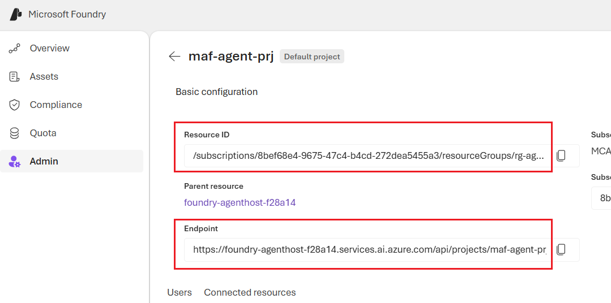
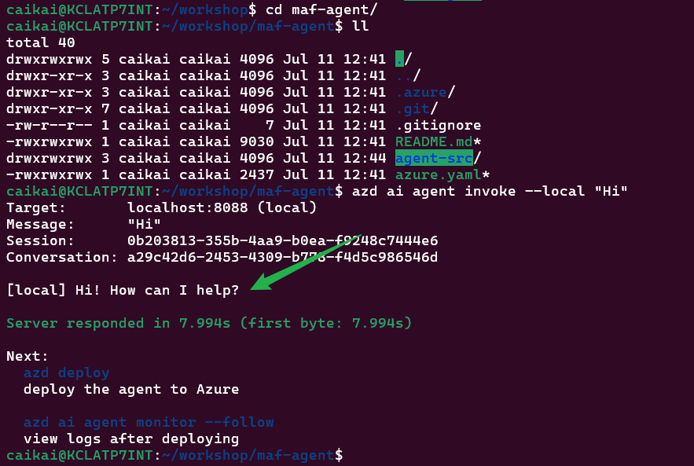
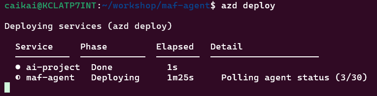
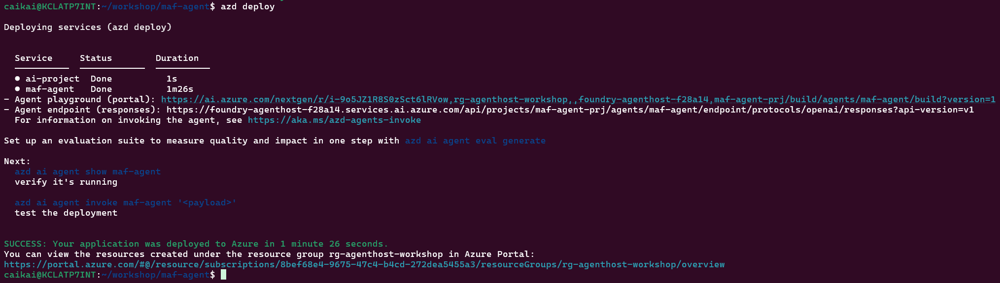
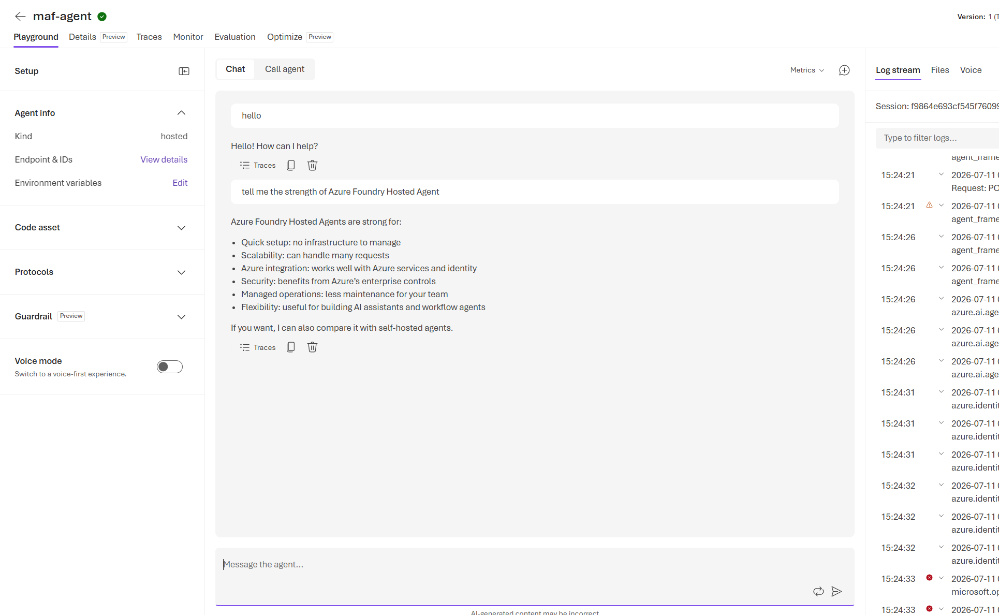
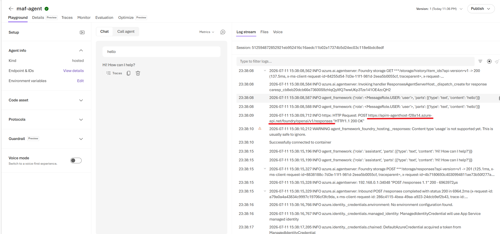

# Module 2 — Solution A: Foundry Hosted Agent (30 min)

## Overview

The Foundry infrastructure — the `foundry-agenthost-<deploymentSN>` account, the `maf-agent-prj` project, the `gpt-5.4-mini` deployment, Defender for AI, the RAI policies, and the APIM AI gateway — is provisioned by **module-01**. This module deploys the hosted agent itself with `azd`, updated base on the official Microsoft Foundry hosted-agent sample:

https://github.com/microsoft-foundry/foundry-samples/tree/main/samples/python/hosted-agents/agent-framework/responses/01-basic

## Learning Objectives

- Use `azd` to initialize, run locally, deploy, and invoke the hosted agent
- Our hosted agent uses the `maf-agent-prj` project and `gpt-5.4-mini` deployment created in module-01
- Support **two model-routing modes** and switch between them with a single env var (`MODEL_ROUTING`):
  - `direct` — the agent calls the Foundry project endpoint directly
  - `gateway` — the agent calls the model through the module-01 APIM AI gateway

## Two model-routing modes

The agent's model client is selected at startup by `MODEL_ROUTING` (see [agent-src/main.py](agent-src/main.py)). In this workshop, the **default mode is `direct`** — the agent calls the Foundry project endpoint directly (simpler for concept understanding).

| Aspect | `direct` (default) | `gateway` |
|---|---|---|
| Client | `FoundryChatClient` → project endpoint | `OpenAIChatClient` → `<gateway>/responses` |
| Network path | Agent → Foundry | Agent → APIM → Foundry |
| Auth to model | Agent identity holds **Azure AI User** on the Foundry account (module-01 RBAC) | Agent presents an Entra ID token; the **gateway's** UAMI holds the Foundry RBAC |
| Required env | `FOUNDRY_PROJECT_ENDPOINT` | `APIM_GATEWAY_URL` |
| Pros | Fewer hops → lower latency; nothing extra to stand up; simplest RBAC | Central governance: rate-limiting, quotas, logging, caching, key rotation, per-caller JWT validation; hides the Foundry endpoint; one front door for many callers |
| Cons | No central throttling/observability; every caller needs direct Foundry RBAC; endpoint exposed to each client | Extra hop → added latency + APIM cost; requires the `api://agenthost` Entra app to exist and callers to be granted; more moving parts to operate |
| Best for | Simple, low-scale, single-consumer agents | Shared/enterprise gateways, many consumers, policy enforcement |

Both clients speak the **Responses** protocol, so the hosted agent (served by `ResponsesHostServer`) behaves identically to callers regardless of the mode.

## Prerequisites

- Module 1 already deployed (Foundry account `foundry-agenthost-<deploymentSN>`, project `maf-agent-prj`, model `gpt-5.4-mini`)
- The module-01 resource group still contains the `deploymentSN` tag
- Azure CLI, Azure Developer CLI, and Docker Desktop installed
- The Microsoft Foundry extension for azd installed: `azd ext install microsoft.foundry`
- You have the "Foundry User" role in your subscription

## Step 1 — Bind the hosted agent to the module-01 Foundry project

### Get deployment suffix from module-01

First, retrieve the `SN` (deployment suffix) from your module-01 deployment. This is used to construct resource names like the APIM gateway URL.

```bash
export SN=<your deployment suffix from module-01>  # e.g., "abc123"
echo $SN
```

If you don't have it, you can retrieve it from module-01's resource group tags:

```bash
export RESOURCE_GROUP="rg-agenthost-workshop"
az group show --name "$RESOURCE_GROUP" --query "tags.deploymentSN" -o tsv
```

### Set Foundry project environment variables

module-01 already created the Foundry account, the `maf-agent-prj` project, and the `gpt-5.4-mini` deployment. To make `azd` **reuse** them instead of provisioning a brand-new account/project, initialize the agent with the existing project's **ARM resource ID** (`--project-id`).

Grab the project resource ID and project endpoint from the Foundry portal. In the Foundry portal, go to "Operate -> Admin -> enter your project", you will see your project resource id and endpoint. Copy and use them to set environment variables as below:



```bash
export PROJECT_ID=<your Foundry project resource id>
export PROJECT_ENDPOINT=<your Foundry project endpoint>
echo "$PROJECT_ID"
echo "$PROJECT_ENDPOINT"

```

### Initialize the agent bound to Foundry project

Create the azd working directory anywhere you want and switch to it:

```bash
mkdir workshop #<your_working_dir>
cd workshop #<your_working_dir>
azd auth login
# Or use: azd auth login --tenant-id <your_tenant_id>, if you have multiple tenants

azd ai agent init -m <your module-02 folder path>/azure.yaml --project-id "$PROJECT_ID"
```
After init success, you can see result as below:


`azd ai agent init` reads `azure.yaml` in module-02, whose `project: agent-src` points at the agent source under `module-02/agent-src/`. `--project-id` binds `azd` to module-01's existing project, so **no new resource group, Foundry account, or project provisioning is created**.

> **Important:** module-02 **does not run `azd provision`**, so `azd` never creates or reconciles the model deployment — it deploys the agent against module-01's existing `gpt-5.4-mini`. So in `azure.yaml` environmentVariables maps, make sure `AI_MODEL_DEPLOYMENT_NAME` resolves to `gpt-5.4-mini`.

After you initialize the agent, you will see a new sub-folder with the agent name (in this workshop, by default the agent name is "maf-agent"). You need to enter the sub-folder, and the later steps are best to run under this folder to avoid troubles.
```bash
cd maf-agent
```


### Update `azure.yaml` with deployment suffix and routing mode

Open `azure.yaml` in `maf-agent` folder, and make below updates:

**Set the MODEL_ROUTING mode** (optional; default is `"direct"` for simple, and `"gateway"` is recommended for production use):

Find the line:

```yaml
      - name: MODEL_ROUTING
        value: "direct" # allowed values: "gateway" or "direct"
```

You can keep it as `"direct"` (default, simpler, lower latency) or change it to `"gateway"` (centralized governance via APIM):

- `"direct"` — agent calls the Foundry project endpoint directly
- `"gateway"` — agent calls through the module-01 APIM AI gateway

For gateway mode:
```yaml
      - name: MODEL_ROUTING
        value: "gateway"
```

**Replace the `<SN>` placeholder (optional; required only for `gateway` mode)**:

If you chose `"gateway"` mode above, you must update the APIM gateway URL with your deployment suffix. Find the line:

```yaml
      - name: APIM_GATEWAY_URL
        value: "https://apim-agenthost-<SN>.azure-api.net/foundry"
```

Replace `<SN>` with your deployment suffix. For example, if `SN = "abc123"`, change it to:

```yaml
      - name: APIM_GATEWAY_URL
        value: "https://apim-agenthost-abc123.azure-api.net/foundry"
```

Or use bash to replace automatically:

```bash
sed -i "s/<SN>/$SN/g" <your module-02 folder path>/azure.yaml
```
> **Auth prerequisite (gateway mode only):** the gateway's `validate-jwt` policy requires a caller token (The caller must present a HTTP header like "Authorization: Bearer eyJ0eXAiOiJ..." ) to grant the caller access. The gateway then re-authenticates to Foundry with its own user-assigned managed identity. In `direct` mode this token is not needed.

## Step 2 — Bind the azd environment (skip provision) and run locally

Point the azd environment at the existing project so `azd deploy` (Step 3) targets it directly:

```bash
azd env set AZURE_TENANT_ID <your_tenant_id>
azd env set AZURE_SUBSCRIPTION_ID <your_azure_subscription_id>
azd env set AZURE_LOCATION $LOCATION
azd env set AZURE_RESOURCE_GROUP $RESOURCE_GROUP
azd env set AZURE_AI_PROJECT_ID  "$PROJECT_ID"
azd env set FOUNDRY_PROJECT_ENDPOINT "$PROJECT_ENDPOINT"
azd env set AI_MODEL_DEPLOYMENT_NAME "gpt-5.4-mini"

azd env get-values

```

## Step 3 - Run the agent locally

```bash
azd ai agent run
```

If success, you should see "Agent ready" info and it is ready to receive response on local 8088 port.

The local host listens on `http://localhost:8088`. In a second terminal, invoke it:

```bash
azd ai agent invoke --local "Hi"
```


If success, you should see the response.

## Step 4 — Deploy the hosted agent

```bash
azd deploy
```


If success, you should see:



Go to the Foundry portal, in your Foundry project, go to the Agents tab, you should see your agent is successfully deployed, and the Type is "hosted":


Each deployment creates a new hosted-agent version in Foundry. 

## Step 5 — Invoke the deployed agent

```bash
azd ai agent invoke "Hi"
```

Try the agent in Playground it should work:


If you are using APIM as the AI gateway ("gateway" mode set in the `azure.yaml`), in the right panel of the Playground, you can see the log stream mentions the calling to AI models are routed through the APIM URL:



## Files in This Module

| File | Description |
|---|---|
| `azure.yaml` | Foundry agent manifest used by `azd ai agent init` (references `agent-src`) |
| `agent-src/main.py` | Agent, served with `ResponsesHostServer`; `build_client()` selects `FoundryChatClient` (direct) or `OpenAIChatClient` → APIM gateway based on `MODEL_ROUTING` |
| `agent-src/requirements.txt` | Python dependencies for the hosted agent (both `agent-framework-foundry` and `agent-framework-openai`) |
| `agent-src/.env.example` | Local env template (`MODEL_ROUTING`, gateway + direct vars, `AZURE_AI_MODEL_DEPLOYMENT_NAME`) |
| `agent-src/Dockerfile` | Container build for the hosted agent runtime |

## Next Step

Proceed to [Module 3 — Solution B: ACA Sandbox](../module-03/README.md).
