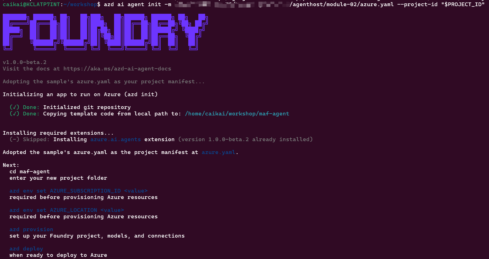
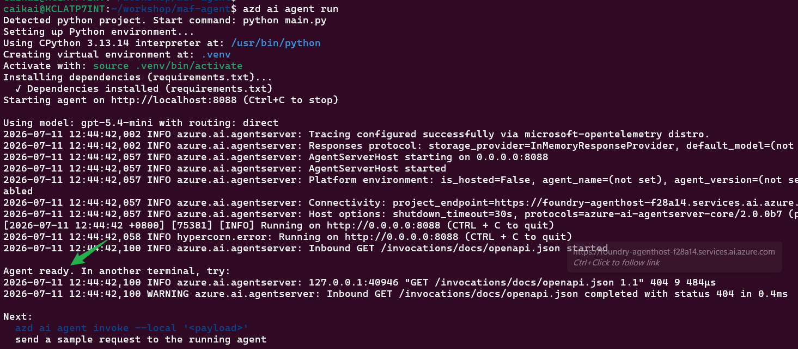
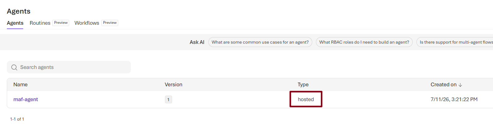

# Module 2 — Solution A: Foundry Hosted Agent (azd)

## Overview

The Foundry infrastructure — the `foundry-agenthost-<deploymentSN>` account, the `maf-agent-prj` project, the `gpt-5.4-mini` deployment, Defender for AI, the RAI policies, and the APIM AI gateway — is provisioned by **module-01**. This module deploys the hosted agent itself with `azd`, updated base on the official Microsoft Foundry hosted-agent sample:

https://github.com/microsoft-foundry/foundry-samples/tree/main/samples/python/hosted-agents/agent-framework/responses/01-basic

## Learning Objectives

- Use `azd` to initialize, provision, run locally, deploy, and invoke the hosted agent
- Target the `maf-agent-prj` project and `gpt-5.4-mini` deployment created in module-01
- Support **two model-routing modes** and switch between them with a single env var (`MODEL_ROUTING`):
  - `direct` — the agent calls the Foundry project endpoint directly
  - `gateway` — the agent calls the model through the module-01 APIM AI gateway

## Two model-routing modes

The agent's model client is selected at startup by `MODEL_ROUTING` (see [agent-src/main.py](agent-src/main.py)):

| Aspect | `direct` | `gateway` (default) |
|---|---|---|
| Client | `FoundryChatClient` → project endpoint | `OpenAIChatClient` → `<gateway>/responses` |
| Network path | Agent → Foundry | Agent → APIM → Foundry |
| Auth to model | Agent identity holds **Azure AI User** on the Foundry account (module-01 RBAC) | Agent presents an Entra token with `aud = api://agenthost`; the **gateway's** UAMI holds the Foundry RBAC |
| Required env | `FOUNDRY_PROJECT_ENDPOINT` | `APIM_GATEWAY_URL`, `APIM_AUDIENCE` |
| Pros | Fewer hops → lower latency; nothing extra to stand up; simplest RBAC | Central governance: rate-limiting, quotas, logging, caching, key rotation, per-caller JWT validation; hides the Foundry endpoint; one front door for many callers |
| Cons | No central throttling/observability; every caller needs direct Foundry RBAC; endpoint exposed to each client | Extra hop → added latency + APIM cost; requires the `api://agenthost` Entra app to exist and callers to be granted; more moving parts to operate |
| Best for | Simple, low-scale, single-consumer agents | Shared/enterprise gateways, many consumers, policy enforcement |

Both clients speak the **Responses** protocol, so the hosted agent (served by `ResponsesHostServer`) behaves identically to callers regardless of the mode.

## Prerequisites

- Module 1 already deployed (Foundry account `foundry-agenthost-<deploymentSN>`, project `maf-agent-prj`, model `gpt-5.4-mini`)
- The module-01 resource group still contains the `deploymentSN` tag
- Azure CLI, Azure Developer CLI, and Docker Desktop installed
- The Microsoft Foundry extension for azd installed: `azd ext install microsoft.foundry`
- You have the "Foundry User" role in your subscription
- The hosted-agent sample available as the source-of-truth for the application code and `azure.yaml`

## Step 1 — Bind the hosted agent to the module-01 Foundry project

module-01 already created the Foundry account, the `maf-agent-prj` project, and the `gpt-5.4-mini` deployment. To make `azd` **reuse** them instead of provisioning a brand-new account/project, initialize the agent with the existing project's **ARM resource ID** (`--project-id`).

First grab the project resource ID from the Foundry portal. In the Foundry portal, go to "Operate -> Admin -> enter your project -> Endpoint", you will see your project resource id. Copy and use it to set the "PROJECT_ID" as below:


```bash
export PROJECT_ID=<your Foundry project resource id>
export PROJECT_ENDPOINT=<your Foundry project endpoint>
echo "$PROJECT_ID"
echo "$PROJECT_ENDPOINT"

```

Then scaffold the agent bound to that project. Create the azd working directory anywehre you want and switch to your working directory, and then run below commands:

First, replace the `<SN>` placeholder in `azure.yaml` with your deployment suffix:

**Option 1: bash (Linux/Mac)**

```bash
SN="your-deployment-suffix"  # e.g., "abc123" from module-01 deployment
sed -i "s/<SN>/$SN/g" <your module-02 folder path>/azure.yaml
```

**Option 2: PowerShell (Windows)**

```powershell
$SN = "your-deployment-suffix"  # e.g., "abc123" from module-01 deployment
(Get-Content <your module-02 folder path>/azure.yaml) -replace '<SN>', $SN | Set-Content <your module-02 folder path>/azure.yaml
```

**Option 3: Manual edit**

Open `<your module-02 folder path>/azure.yaml` in a text editor and find the line:

```yaml
      - name: APIM_GATEWAY_URL
        value: "https://apim-agenthost-<SN>.azure-api.net/foundry"
```

Replace `<SN>` with your deployment suffix. For example, if `SN = "abc123"`, change it to:

```yaml
      - name: APIM_GATEWAY_URL
        value: "https://apim-agenthost-abc123.azure-api.net/foundry"
```

Next, set the model-routing mode (`MODEL_ROUTING`) in `azure.yaml`. Choose one:
- `"direct"` — the agent calls the Foundry project endpoint directly (lower latency, simpler)
- `"gateway"` — the agent calls through the module-01 APIM AI gateway (centralized governance)

Open `<your module-02 folder path>/azure.yaml` and find the line:

```yaml
      - name: MODEL_ROUTING
        value: "direct" # allowed values: "gateway" or "direct"
```

Change the `MODEL_ROUTING` value to either:

For direct mode:
```yaml
      - name: MODEL_ROUTING
        value: "direct"
```

Or for gateway mode:
```yaml
      - name: MODEL_ROUTING
        value: "gateway"
```

Then initialize the agent:

```bash
azd auth login --tenant-id 16b3c013-d300-468d-ac64-7eda0820b6d3
azd ai agent init -m <your module-02 folder path>/azure.yaml --project-id "$PROJECT_ID"

```
After init success, you can see result as below:


`azd ai agent init` reads `azure.yaml` in module-02, whose `project: agent-src` points at the agent source under `module-02/agent-src/`. `--project-id` binds `azd` to module-01's existing project, so **no new resource group, Foundry account, or project is created**.

> **Important:** module-02 **does not run `azd provision`**, so `azd` never creates or reconciles the model deployment — it deploys the agent against module-01's existing `gpt-5.4-mini`. So in `azure.yaml` environmentVariables maps, make sure `AI_MODEL_DEPLOYMENT_NAME` resolves to `gpt-5.4-mini`.

## Step 2 — Bind the azd environment (skip provision) and run locally

module-01 already provisioned the Foundry account, project, and `gpt-5.4-mini` deployment, so **do not run `azd provision` in this module**. `azd provision`'s job is to create/reconcile the `ai-project` infrastructure; against a module-01-owned project it creates a *new* account/project/model. Instead, point the azd environment at the existing project so `azd deploy` (Step 3) targets it directly:

```bash
azd env set AZURE_AI_PROJECT_ENDPOINT "$(az deployment sub show --name main-$SN --query 'properties.outputs.foundryProjectEndpoint.value' -o tsv)"

azd env set AZURE_TENANT_ID 16b3c013-d300-468d-ac64-7eda0820b6d3
azd env set AZURE_SUBSCRIPTION_ID 8bef68e4-9675-47c4-b4cd-272dea5455a3
azd env set AZURE_LOCATION eastus2
azd env set AZURE_RESOURCE_GROUP rg-agenthost-workshop
azd env set AZURE_AI_PROJECT_ID  "$PROJECT_ID"
azd env set FOUNDRY_PROJECT_ENDPOINT "$PROJECT_ENDPOINT"
azd env set AI_MODEL_DEPLOYMENT_NAME "gpt-5.4-mini"

azd env get-values

```

> **Why no provision?** Once `AZURE_AI_PROJECT_ENDPOINT` is set, the Foundry azd extension uses the existing project as-is, and `azd deploy` performs a **direct code deploy** (the agent service block has `codeConfiguration:`) straight into it — no infrastructure is provisioned by this module.

The agent app under `agent-src/` (i.e. `module-02/agent-src/`) supports both model-routing modes; pick "direct" or "gateway" with `MODEL_ROUTING` environment variable in `azure.yaml`.

> **Auth prerequisite (gateway mode only):** the gateway's `validate-jwt` policy requires a caller token to grant the caller access. The gateway then re-authenticates to Foundry with its own user-assigned managed identity. In `direct` mode this token is not needed.

Run the agent locally:

```bash
azd ai agent run
```

If success, you should see "Agent ready" info and it is ready to receive response on local 8088 port.

The local host listens on `http://localhost:8088`. In a second terminal, invoke it:

```bash
azd ai agent invoke --local "Hi"
```


If success, you should see the response.

## Step 3 — Deploy the hosted agent

```bash
azd deploy
```


If success, you should see:


Go to the Foundry portal, in your Foundry project, go to the Agents portal, you should see your agent is successfully deployed, and the Type is "hosted":



Each deployment creates a new hosted-agent version in Foundry. 
## Step 4 — Invoke the deployed agent

```bash
azd ai agent invoke "Hi"
```

In `gateway` mode the agent's model calls flow through the module-01 APIM AI gateway. Validating the gateway directly (an external `curl` with your own Entra token) is covered in **module-01 Step 3** — no need to repeat it here.

## Files in This Module

| File | Description |
|---|---|
| `azure.yaml` | Foundry agent manifest used by `azd ai agent init` (references `agent-src`) |
| `agent-src/main.py` | Agent, served with `ResponsesHostServer`; `build_client()` selects `FoundryChatClient` (direct) or `OpenAIChatClient` → APIM gateway based on `MODEL_ROUTING` |
| `agent-src/requirements.txt` | Python dependencies for the hosted agent (both `agent-framework-foundry` and `agent-framework-openai`) |
| `agent-src/.env.example` | Local env template (`MODEL_ROUTING`, gateway + direct vars, `AZURE_AI_MODEL_DEPLOYMENT_NAME`) |
| `agent-src/Dockerfile` | Container build for the hosted agent runtime |

## Next Step

Proceed to [Module 3 — Solution B: ACA Sandbox](../module-03/README.md).
