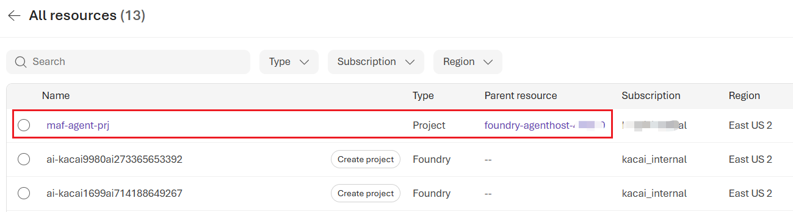
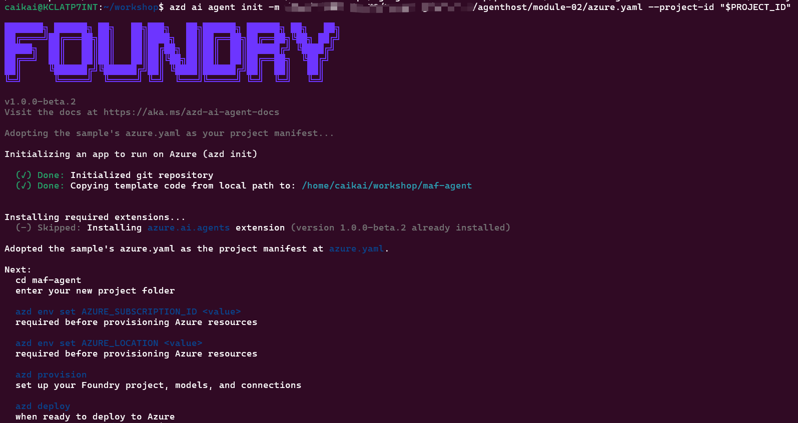
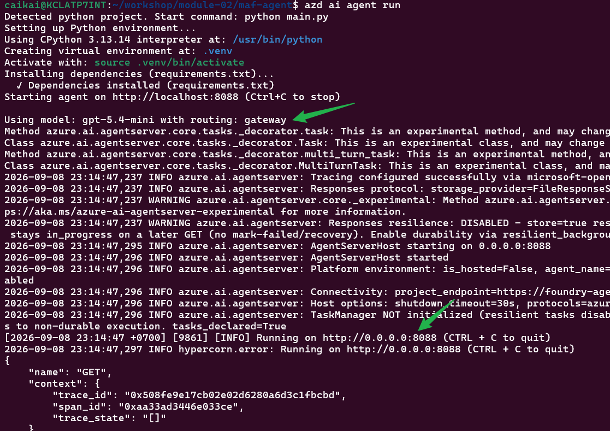
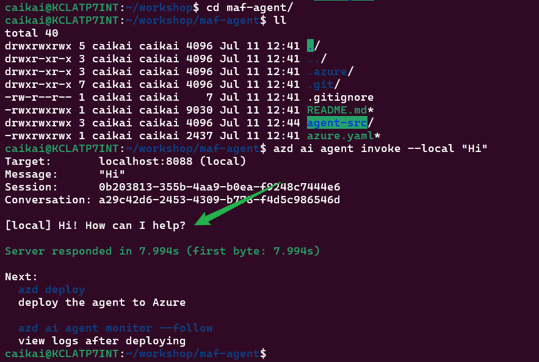
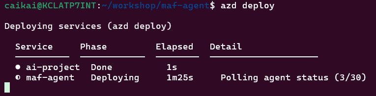
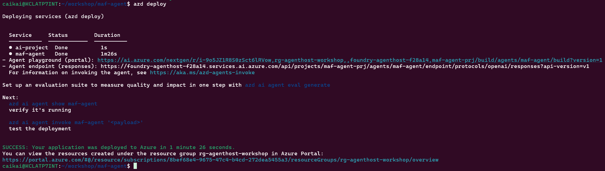
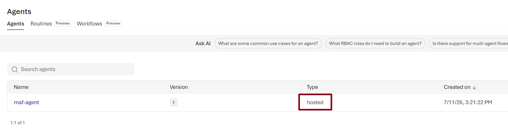
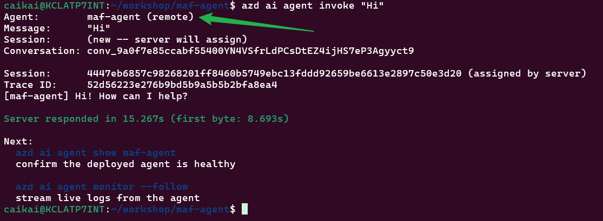
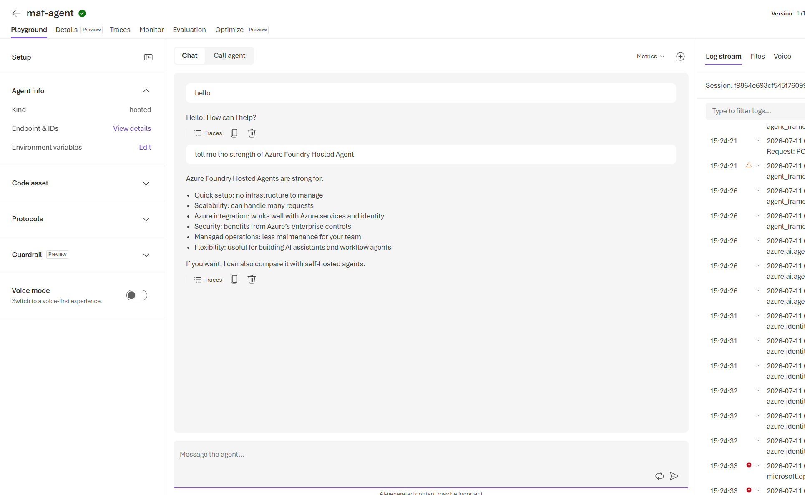
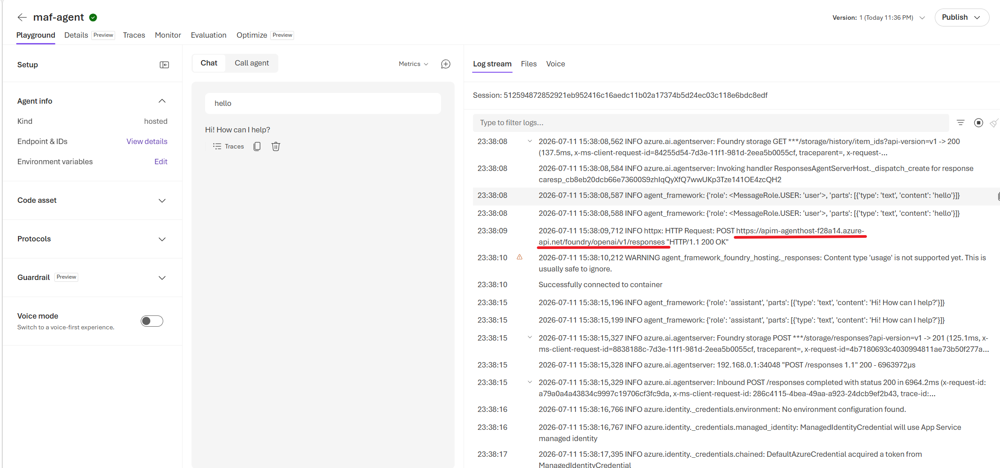

# Module 2 — Solution A: Foundry Hosted Agent (30 min)

[⬆ Back to Workshop Home](../readme.md)

## Overview

The Foundry infrastructure — the `foundry-agenthost-<deploymentSN>` account, the `maf-agent-prj` project, the `gpt-5.4-mini` deployment, Defender for AI, the RAI policies, and the APIM AI gateway — is provisioned by **module-01**. This module deploys the hosted agent itself with `azd`, based on the official Microsoft Foundry hosted-agent sample:

https://github.com/microsoft-foundry/foundry-samples/tree/main/samples/python/hosted-agents/agent-framework/responses/01-basic

## Learning Objectives

- Use `azd` to initialize, run locally, deploy, and invoke the hosted agent
- Use the `maf-agent-prj` project and `gpt-5.4-mini` deployment created in module-01
- Support **two model-routing modes** and switch between them with a single environment variable (`MODEL_ROUTING`):
  - `direct` — the agent calls the Foundry project endpoint directly
  - `gateway` — the agent calls the model through the module-01 APIM AI gateway

## Two model-routing modes

The agent's model client is selected at startup by `MODEL_ROUTING` (see [agent-src/main.py](agent-src/main.py)). In this workshop, the **default mode is `direct`** — the agent calls the Foundry project endpoint directly (simpler for concept understanding).

| Aspect | `direct` (default) | `gateway` |
|---|---|---|
| Client | `FoundryChatClient` → project endpoint | `OpenAIChatClient` → `<gateway>/responses` |
| Network path | Agent → Foundry | Agent → APIM → Foundry |
| Auth to model | Agent identity holds **Azure AI User** on the Foundry account (module-01 RBAC) | Agent presents an Entra ID token; the **gateway's** UAMI holds the Foundry RBAC |
| Required env | `FOUNDRY_PROJECT_ENDPOINT` | `APIM_GATEWAY_URL` |
| Pros | Fewer hops → lower latency; nothing extra to stand up; simplest RBAC | Central governance: rate-limiting, quotas, logging, caching, key rotation, per-caller JWT validation; hides the Foundry endpoint; one front door for many callers |
| Cons | No central throttling/observability; every caller needs direct Foundry RBAC; endpoint exposed to each client | Extra hop → added latency + APIM cost; requires the `api://agenthost` Entra app to exist and callers to be granted; more moving parts to operate |
| Best for | Simple, low-scale, single-consumer agents | Shared/enterprise gateways, many consumers, policy enforcement |

Both clients speak the **Responses** protocol, so the hosted agent (served by `ResponsesHostServer`) behaves identically to callers regardless of the mode.

## Prerequisites

> **Note:** Run all commands in this README from this module's root directory (`agenthost/module-02/`).

- Module 1 already deployed (Foundry account `foundry-agenthost-<deploymentSN>`, project `maf-agent-prj`, model `gpt-5.4-mini`)
- The module-01 resource group still contains the `deploymentSN` tag
- Azure CLI, Azure Developer CLI installed
- The Microsoft Foundry extension for azd installed: `azd ext install microsoft.foundry`
- You have the "Foundry User" role in your subscription

## Step 1 — Bind the hosted agent to the module-01 Foundry project

### Get deployment suffix from module-01

First, retrieve the `SN` (deployment suffix) from your module-01 deployment. This is used to construct resource names like the APIM gateway URL. You can retrieve it from module-01's resource group tags:

```bash
export RESOURCE_GROUP="rg-agenthost-workshop"
export SN=$(az group show --resource-group "$RESOURCE_GROUP" --query "tags.deploymentSN" --output tsv 2>/dev/null | tr -d "\r\n" || echo "")
echo $SN
```

### Set Foundry project environment variables

> The module-01 already created the Foundry account, the `maf-agent-prj` project, and the `gpt-5.4-mini` deployment. In this module-01, to **reuse** them instead of provisioning new ones, we initialize the agent with the existing project's **Endpoint** and **ARM resource ID** (`--project-id`). We can get the project endpoint and project ID from the Foundry portal.

In the Foundry portal, in the top-left drop down menu, select **"View all resources"**, and then in the resources list enter your project `maf-agent-prj` whose Parent resource is `foundry-agenthost-<SN>`:


In the `maf-agent-prj` project panel, go to **"Manage"** in the top meanu bar, in the **Project details** you will see the **Project endpoint** and **Project ID**：


Copy the project endpoint and project ID. Use those values to set the environment variables below:

```bash
export PROJECT_ID=<your Foundry project resource id>
export PROJECT_ENDPOINT=<your Foundry project endpoint>
echo "$PROJECT_ID"
echo "$PROJECT_ENDPOINT"

```

### Initialize the agent bound to Foundry project

> **Tip:** Create a working directory anywhere outside of your module-02 folder. Because you need to run the `azd ai agent init` from a directory outside the template file `azure.yaml` (in module-02 folder). 

For example create a subfolder in your HOME folder, and switch into it:

```bash
cd ~
mkdir -p workshop/module-02
cd workshop/module-02
azd auth login
# Or use: azd auth login --tenant-id <your_tenant_id>, if you have multiple tenants

azd ai agent init -m <your_cloned_module-02_path>/azure.yaml --project-id "$PROJECT_ID"
# note: you need pointing to the right location of azure.yaml file (in the module-02 folder), for example: <your_clone_path>/ainotes/agenthost/module-02/azure.yaml
```
After initialization succeeds, you should see a result similar to the following:


`azd ai agent init` reads `azure.yaml` in module-02, whose `project: agent-src` points at the agent source under `module-02/agent-src/`. `--project-id` binds `azd` to module-01's existing project, so **no new resource group, Foundry account, or project provisioning is created**.

> **Important:** module-02 **does not run `azd provision`**, so `azd` never creates or reconciles the model deployment. It deploys the agent against module-01's existing `gpt-5.4-mini`. In the `azure.yaml` `environmentVariables` map, make sure `AI_MODEL_DEPLOYMENT_NAME` resolves to `gpt-5.4-mini`.

After you initialize the agent, you will see a new subfolder with the agent name. In this workshop, the default agent name is `maf-agent`. Enter that subfolder and run the remaining steps from there.
```bash
cd maf-agent
```


### Update `azure.yaml` with deployment suffix and routing mode

Open `azure.yaml` in the `maf-agent` folder and make the following updates:

**Set the MODEL_ROUTING mode** (optional; the default is `"direct"` for simplicity, while `"gateway"` is recommended for production use):

Find the line:

```yaml
      - name: MODEL_ROUTING
        value: "direct" # allowed values: "gateway" or "direct"
```

You can keep it as `"direct"` (default, simpler, lower latency) or change it to `"gateway"` (centralized governance via APIM):

- `"direct"` — agent calls the Foundry project endpoint directly
- `"gateway"` — agent calls through the module-01 APIM AI gateway

For gateway mode:
```yaml
      - name: MODEL_ROUTING
        value: "gateway"
```

> **Tip:** `direct` and `gateway` represent two different request paths to the LLM:
> - `direct`: Agent → Foundry project endpoint → APIM Foundry native AI gateway → LLM deployment
> - `gateway`: Agent → APIM standalone AI gateway (`/foundry`) → Foundry project endpoint → LLM deployment
>
> Direct mode provides a simpler path with lower latency. Gateway mode adds a centralized layer for authentication, governance, policy enforcement, monitoring, and routing.
>
> In `gateway` mode the Foundry hosted agent calls APIM explicitly, and then the APIM route the calls to Foundry. In the `gateway` mode, you have the APIM as the central governance point for all LLM calls.
>
> In module-01 we have already configured the APIM to support both request paths.
>
> The two modes also work in different ways on calls authentication:
>
>| | Who authenticates the **caller** | What APIM sees inbound |
>|---|---|---|
>| `gateway` | **APIM** (`validate-jwt` on the `foundry-ai-gateway` API) | the **end-caller** Entra token sent in HTTP header such as `Authorization: Bearer eyJ0eXAiOiJ...`The APIM then re-authenticates to Foundry with its own managed identity |
>| `direct` + AI Gateway | **Foundry project RBAC** (`Azure AI User`) | the **Foundry project managed identity** token which is automatically trusted internal of Foundry project |


**Replace the `<SN>` placeholder (no need for `direct` mode; REQUIRED for `gateway` mode)**:

If you chose `"gateway"` mode above, you must update the APIM gateway URL with your deployment suffix. Find the line:

```yaml
      - name: APIM_GATEWAY_URL
        value: "https://apim-agenthost-<SN>.azure-api.net/foundry"
```

Replace `<SN>` with your deployment suffix. For example, if `SN = "abc123"`, change it to:

```yaml
      - name: APIM_GATEWAY_URL
        value: "https://apim-agenthost-abc123.azure-api.net/foundry"
```

Or use bash to replace automatically:

```bash
sed -i "s/<SN>/$SN/g" <your module-02 folder path>/azure.yaml
```

## Step 2 — Bind the azd environment (skip provision) and run locally

Point the azd environment at the existing project so `azd deploy` (Step 3) targets it directly:

```bash
azd env set AZURE_TENANT_ID $(az account show --query tenantId -o tsv | tr -d "\r\n")
azd env set AZURE_SUBSCRIPTION_ID $(az account show --query id -o tsv | tr -d "\r\n")
azd env set AZURE_LOCATION $LOCATION
azd env set AZURE_RESOURCE_GROUP $RESOURCE_GROUP
azd env set AZURE_AI_PROJECT_ID  "$PROJECT_ID"
azd env set FOUNDRY_PROJECT_ENDPOINT "$PROJECT_ENDPOINT"
azd env set AI_MODEL_DEPLOYMENT_NAME "gpt-5.4-mini"

azd env get-values

```

## Step 3 — Run the agent locally

```bash
azd ai agent run
```

If the command succeeds, you should see `Agent ready`, and the agent will be ready to receive requests on local port 8088.

In a second terminal, switch to the same `maf-agent` folder, and invoke it:

```bash
azd ai agent invoke --local "Hi"
```


If the command succeeds, you should see a response.

Back to the terminal you run commend `azd ai agent run`, press Ctrl+C to terminate the agent local run. You will see output like:
```text
^C
Stopping agent...
~/workshop/module-02/maf-agent$ Agent stopped.
``` 
Now we verified the agent can work through end-to-end. Next we will deploy the agent to Microsoft Foundry (Hosted Agent).

## Step 4 — Deploy the hosted agent

```bash
azd deploy
```


If the deployment succeeds, you should see:



In the Foundry portal, open your Foundry project and go to the **Agents** tab. You should see that your agent has been deployed successfully and its type is `hosted`:



Each deployment creates a new hosted-agent version in Foundry. 

## Step 5 — Invoke the deployed agent

```bash
azd ai agent invoke "Hi"
```
If the command succeeds, this time you should see the response from the **remote agent**.



Try the agent in Playground; it should work there as well:


If you are using APIM as the AI gateway (`"gateway"` mode in `azure.yaml`), the Playground log stream shows that model calls are routed through the APIM URL:



## Files in This Module

| File | Description |
|---|---|
| `azure.yaml` | Foundry agent manifest used by `azd ai agent init` (references `agent-src`) |
| `agent-src/main.py` | Agent, served with `ResponsesHostServer`; `build_client()` selects `FoundryChatClient` (direct) or `OpenAIChatClient` → APIM gateway based on `MODEL_ROUTING` |
| `agent-src/requirements.txt` | Python dependencies for the hosted agent (both `agent-framework-foundry` and `agent-framework-openai`) |
| `agent-src/Dockerfile` | Container build for the hosted agent runtime |
| `ai-gateway-inbound-policy.xml` | `validate-jwt` fragment to paste into the auto-created AI-Gateway API (locks it to the Foundry project managed identity — see the optional section above) |

## Next Step

Proceed to [Module 3 — Solution B: AKS + agent-sandbox](../module-03/README.md).

---

[⬆ Back to Workshop Home](../readme.md)
