# 模块 2 — 解决方案 A：Foundry 托管代理（30 分钟）

[⬆ 返回研讨会主页](../readme.md)

## 概述

Foundry 基础设施——`foundry-agenthost-<deploymentSN>` 帐户、`maf-agent-prj` 项目、`gpt-5.4-mini` 部署、Defender for AI、RAI 策略和 APIM AI 网关——由 **module-01** 预配。本模块使用 `azd` 部署托管代理本身，并基于 Microsoft Foundry 官方托管代理示例：

https://github.com/microsoft-foundry/foundry-samples/tree/main/samples/python/hosted-agents/agent-framework/responses/01-basic

## 学习目标

- 使用 `azd` 初始化、在本地运行、部署和调用托管代理
- 使用 module-01 中创建的 `maf-agent-prj` 项目和 `gpt-5.4-mini` 部署
- 支持**两种模型路由模式**，并通过单个环境变量 (`MODEL_ROUTING`) 在两者之间切换：
  - `direct` — 代理直接调用 Foundry 项目终结点
  - `gateway` — 代理通过 module-01 APIM AI 网关调用模型

## 先决条件

- 已部署模块 1（Foundry 帐户 `foundry-agenthost-<deploymentSN>`、项目 `maf-agent-prj`、模型 `gpt-5.4-mini`）
- module-01 资源组仍包含 `deploymentSN` 标记
- 已安装 Azure CLI、Azure Developer CLI
- 已安装用于 azd 的 Microsoft Foundry 扩展：`azd ext install microsoft.foundry`
- 你在订阅中拥有“Foundry User”角色

## 步骤 1 — 创建工作目录

> [!CAUTION]
> 请从克隆的 `module-02` 目录之外的工作目录运行本模块中的命令。不得从包含源 `azure.yaml` 模板的目录运行 `azd ai agent init` 命令。

例如，在主目录下创建一个工作目录并切换到该目录：

```bash
cd ~
mkdir -p workshop/module-02
cd workshop/module-02
```

## 步骤 2 — 将托管代理绑定到 module-01 Foundry 项目

### 从 module-01 获取部署后缀

首先，从 module-01 部署中检索 `SN`（部署后缀）。它用于构造 APIM 网关 URL 等资源名称。可以从 module-01 的资源组标记中检索：

```bash
export RESOURCE_GROUP="rg-agenthost-workshop"
export SN=$(az group show --resource-group "$RESOURCE_GROUP" --query "tags.deploymentSN" --output tsv 2>/dev/null | tr -d "\r\n" || echo "")
echo $SN
```

### 设置 Foundry 项目环境变量
> [!NOTE]
> module-01 已创建 Foundry 帐户、`maf-agent-prj` 项目和 `gpt-5.4-mini` 部署。在本模块中，为了**重用**这些资源而不是预配新资源，我们使用现有项目的**终结点**和 **ARM 资源 ID** (`--project-id`) 初始化代理。可以从 Foundry 门户获取项目终结点和项目 ID。

在 Foundry 门户左上角的下拉菜单中选择 **“View all resources”**，然后在资源列表中进入父资源为 `foundry-agenthost-<SN>` 的项目 `maf-agent-prj`：
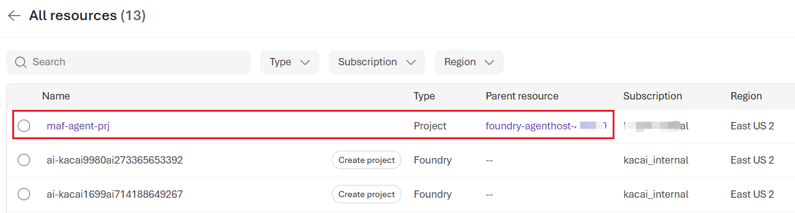

在 `maf-agent-prj` 项目面板中，转到顶部菜单栏中的 **“Manage”**，在 **Project details** 中可以看到 **Project endpoint** 和 **Project ID**：
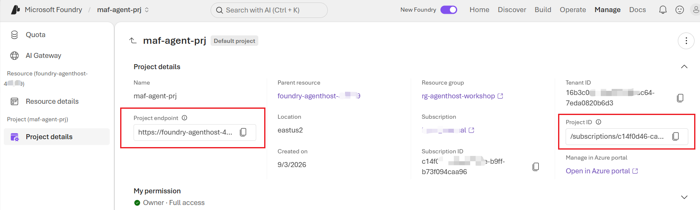

复制项目终结点和项目 ID。使用这些值设置以下环境变量：

```bash
export PROJECT_ID=<your Foundry project resource id>
export PROJECT_ENDPOINT=<your Foundry project endpoint>
echo "$PROJECT_ID"
echo "$PROJECT_ENDPOINT"

```

### 初始化绑定到 Foundry 项目的代理

```bash
azd auth login
# Or use: azd auth login --tenant-id <your_tenant_id>, if you have multiple tenants

azd ai agent init -m <your_cloned_module-02_path>/azure.yaml --project-id "$PROJECT_ID"
# note: you need pointing to the right location of azure.yaml file (in the module-02 folder), for example: <your_clone_path>/ainotes/agenthost/module-02/azure.yaml
```
初始化成功后，应看到类似以下内容的结果：
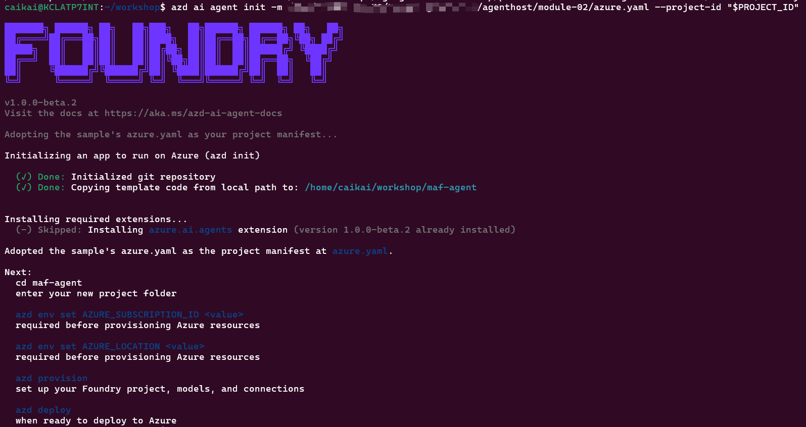

`azd ai agent init` 读取 module-02 中的 `azure.yaml`，其中的 `project: agent-src` 指向 `module-02/agent-src/` 下的代理源代码。`--project-id` 将 `azd` 绑定到 module-01 的现有项目，因此**不会创建新的资源组、Foundry 帐户或项目预配**。

> [!NOTE]
> **重要提示：** module-02 **不运行 `azd provision`**，因此 `azd` 永远不会创建或协调模型部署。它针对 module-01 现有的 `gpt-5.4-mini` 部署代理。在 `azure.yaml` 的 `environmentVariables` 映射中，确保 `AI_MODEL_DEPLOYMENT_NAME` 解析为 `gpt-5.4-mini`。

初始化代理后，将看到一个以代理名称命名的新子文件夹。在本研讨会中，默认代理名称为 `maf-agent`。进入该子文件夹，并从中运行其余步骤。
```bash
cd maf-agent
```


### 使用部署后缀和路由模式更新 `azure.yaml`

打开 `maf-agent` 文件夹中的 `azure.yaml` 并进行以下更新：

**设置 MODEL_ROUTING 模式：**

找到以下行：

```yaml
      - name: MODEL_ROUTING
        value: "gateway" # allowed values: "gateway" or "direct"
```

支持的值为 `"gateway"` 和 `"direct"`。保留 `"gateway"`，以采用默认的、通过 APIM 集中治理的路由；或将其更改为 `"direct"`，以采用更简单、延迟更低的路由。如果未设置 `MODEL_ROUTING`，代理也默认使用 `"gateway"`：

- `"gateway"`（默认）— 代理通过 module-01 APIM 独立 AI 网关调用
- `"direct"` — 代理直接调用 Foundry 项目终结点

> [!TIP]
> `direct` 和 `gateway` 表示到 LLM 的两条不同请求路径：
> - `direct`：代理 → Foundry 项目终结点 → APIM Foundry 原生 AI 网关 → LLM 部署
> - `gateway`：代理 → APIM 独立 AI 网关 (`/foundry`) → Foundry 项目终结点 → LLM 部署
>
> 两条路径的比较：
>| 方面 | `direct` | `gateway`（默认） |
>|---|---|---|
>| 客户端连接到 | `FoundryChatClient` → 项目终结点 | `OpenAIChatClient` → `<gateway>/responses` |
>| 模型身份验证 | 代理标识在 Foundry 帐户上拥有 **Azure AI User**（module-01 RBAC）。它会自动获得 Foundry 项目的信任 | **最终调用方** Entra 令牌在 HTTP 标头中发送，例如 `Authorization: ******`。**APIM** 通过 `validate-jwt` 策略验证调用，然后 APIM 使用自身的托管标识向 Foundry 重新进行身份验证；该标识拥有 Foundry RBAC |
>| 优点 | 跳数更少 → 延迟更低；无需部署额外组件；RBAC 最简单；默认策略 | 集中治理：身份验证、速率限制、配额、日志记录、缓存、密钥轮换；隐藏 Foundry 终结点；为多个调用方提供统一入口 |
>| 缺点 | 无集中式限制/可观测性；每个调用方都需要直接 Foundry RBAC；终结点向每个客户端公开 | 额外一跳 → 增加延迟和 APIM 成本；需要令牌身份验证；需要运维的组件更多 |
>| 最适合 | 简单、低规模代理 | 企业网关、众多使用者、策略实施 |

**替换 `<SN>` 占位符**：

找到以下行：

```yaml
      - name: APIM_GATEWAY_URL
        value: "https://apim-agenthost-<SN>.azure-api.net/foundry"
      - name: FOUNDRY_PROJECT_ENDPOINT
        value: "https://foundry-agenthost-<SN>.services.ai.azure.com/api/projects/maf-agent-prj"        
```

将 `<SN>` 替换为部署后缀。例如，如果 `SN = "abc123"`，将其更改为：

```yaml
      - name: APIM_GATEWAY_URL
        value: "https://apim-agenthost-abc123.azure-api.net/foundry"
      - name: FOUNDRY_PROJECT_ENDPOINT
        value: "https://foundry-agenthost-abc123.services.ai.azure.com/api/projects/maf-agent-prj"```
```
或者使用 bash 自动替换：

```bash
sed -i "s/<SN>/$SN/g" ./azure.yaml
```

## 步骤 3 — 绑定 azd 环境（跳过预配）

将 azd 环境指向现有项目，使 `azd deploy`（步骤 5）直接以它为目标：

```bash
azd env set AZURE_TENANT_ID $(az account show --query tenantId -o tsv | tr -d "\r\n")
azd env set AZURE_SUBSCRIPTION_ID $(az account show --query id -o tsv | tr -d "\r\n")
azd env set AZURE_LOCATION $LOCATION
azd env set AZURE_RESOURCE_GROUP $RESOURCE_GROUP
azd env set AZURE_AI_PROJECT_ID  "$PROJECT_ID"
azd env set FOUNDRY_PROJECT_ENDPOINT "$PROJECT_ENDPOINT"
azd env set AI_MODEL_DEPLOYMENT_NAME "gpt-5.4-mini"

azd env get-values

```

## 步骤 4 — 在本地运行代理

```bash
azd ai agent run
```
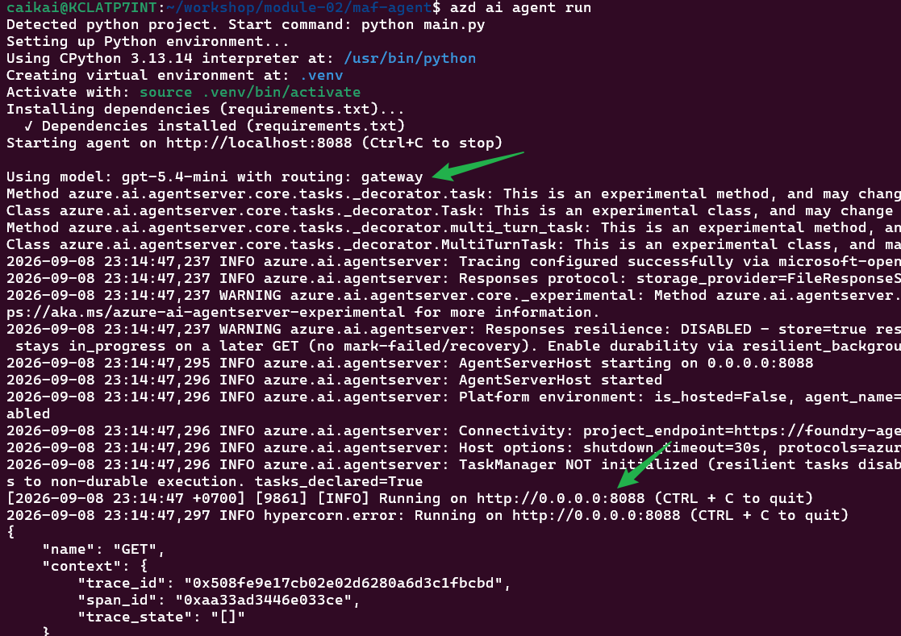
如果命令成功，应看到 `Agent ready`，代理将准备好在本地端口 8088 上接收请求。

在另一个终端中切换到同一个 `maf-agent` 文件夹并调用它：

```bash
azd ai agent invoke --local "Hi"
```
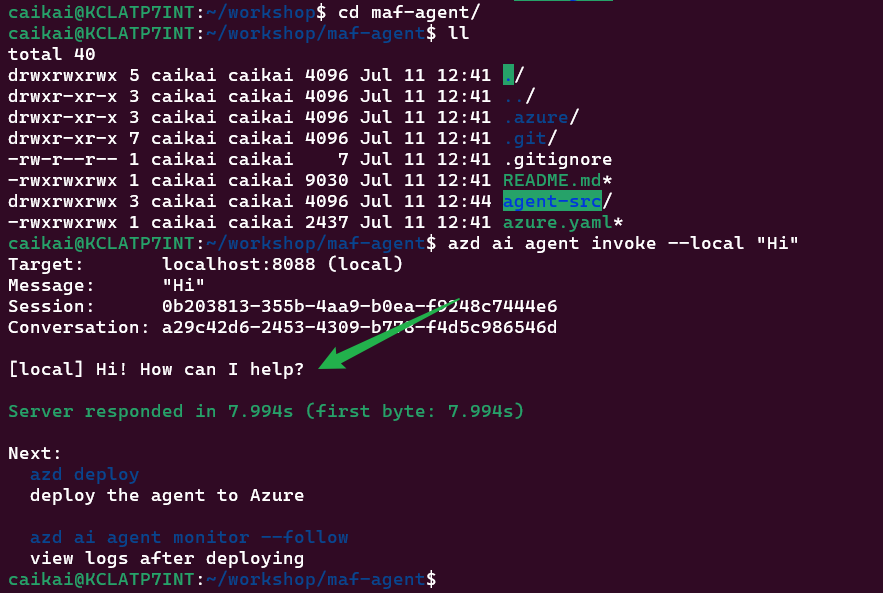

如果命令成功，应看到响应。

返回运行 `azd ai agent run` 命令的终端，按 Ctrl+C 终止代理的本地运行。将看到类似以下内容的输出：
```text
^C
Stopping agent...
~/workshop/module-02/maf-agent$ Agent stopped.
``` 
现在已验证代理能够端到端工作。接下来，将代理部署到 Microsoft Foundry（托管代理）。

## 步骤 5 — 部署托管代理

```bash
azd deploy
```
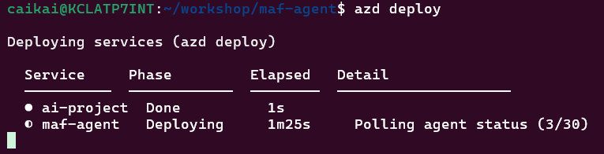

如果部署成功，应看到：

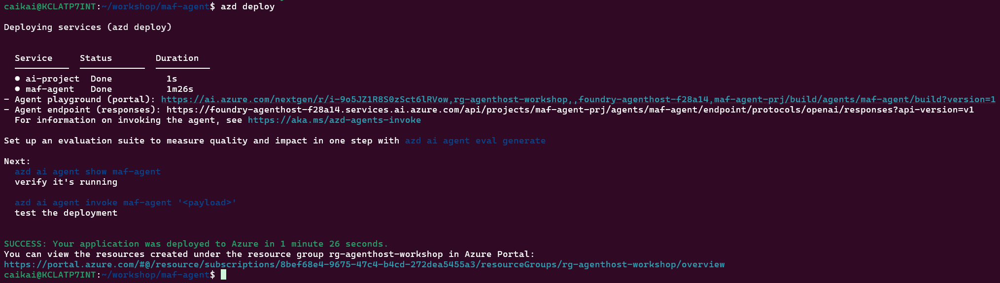

> [!tip]
> `azd deploy` 将代理部署到 Foundry，使其作为托管代理运行，并检查部署是否成功。如果看到 `agent deployment timed out (last status: creating); check agent status manually`，请打开 Foundry 门户并检查代理状态：
> - 如果代理已经处于 **Running** 状态，可以放心忽略此错误
> - 如果代理未处于 **Running** 状态，请从代理列表中删除代理，然后重新运行 `azd deploy`

在 Foundry 门户中打开 Foundry 项目，然后转到 **Build → Agents** 选项卡。应看到代理已成功部署，其类型为 `hosted`：

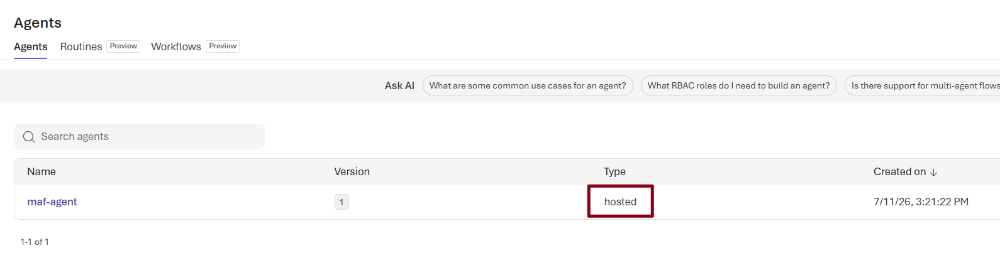

每次部署都会在 Foundry 中创建新的托管代理版本。

## 步骤 6 — 调用已部署的代理

```bash
azd ai agent invoke "Hi"
```
如果命令成功，这次应看到来自**远程代理**的响应。
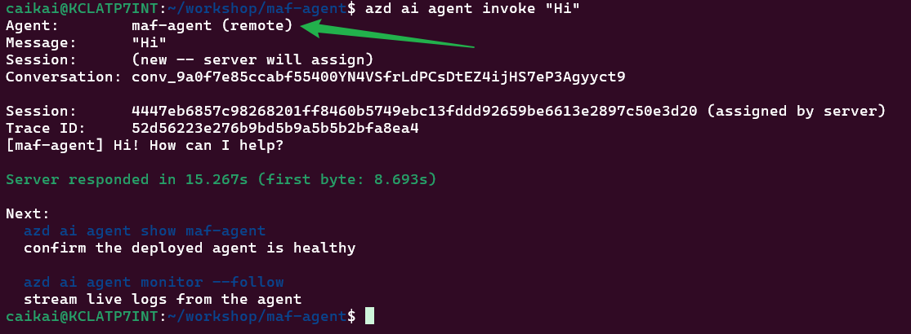


在 Playground 中尝试该代理；它在那里也应正常工作：
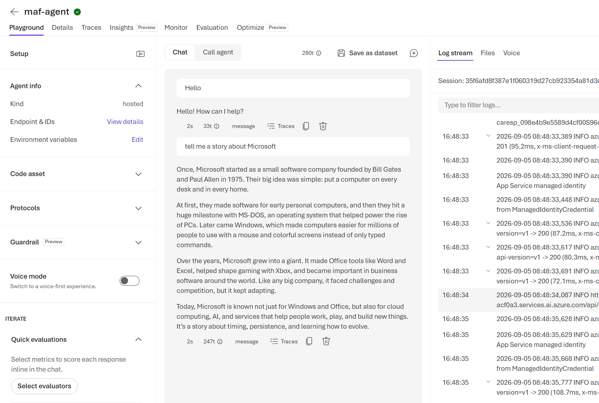


## 步骤 7 — 在托管代理 Playground 中切换路由模式

可以在 Foundry 门户中创建托管代理的新版本并更改其环境变量，而无需修改之前部署的版本。使用此步骤测试之前未选择的路由模式（例如，如果使用 `azd deploy` 时选择了 `direct` 模式，可以在下面测试 `gateway` 模式，反之亦然）。

1. 在 Foundry 门户中，打开 `maf-agent-prj` 项目并选择 **Agents**。
2. 打开已部署的 `maf-agent` 托管代理。
3. 在 Playground 中进入 **“Environment variables / Edit”**，并更新环境变量：
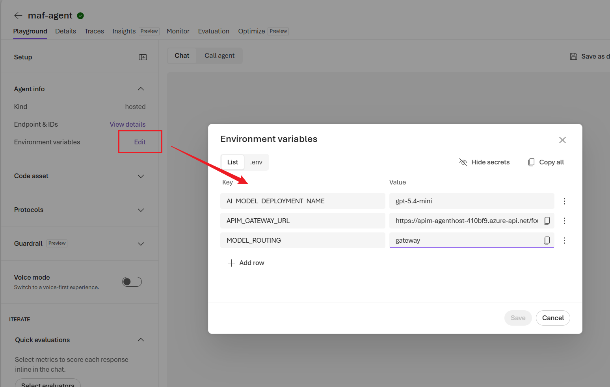

  | 路由模式 | 环境变量 |
  |---|---|
  | `direct` | `MODEL_ROUTING=direct`<br>`FOUNDRY_PROJECT_ENDPOINT=https://foundry-agenthost-<SN>.services.ai.azure.com/api/projects/maf-agent-prj` |
  | `gateway` | `MODEL_ROUTING=gateway`<br>`APIM_GATEWAY_URL=https://apim-agenthost-<SN>.azure-api.net/foundry` |

  > [!IMPORTANT]
  > 对于 `direct` 模式，请使用 **FOUNDRY_PROJECT_ENDPOINT**。`FoundryChatClient` 使用此项目终结点通过 Responses 协议调用模型。
  >
  > 对于 `gateway` 模式，请使用 **APIM_GATEWAY_URL**。它以 `/foundry` 结尾。不要追加 `/openai/v1` 或 `/responses`。APIM 作为独立网关工作时将处理 API 路径。

4. 保留 `AI_MODEL_DEPLOYMENT_NAME=gpt-5.4-mini`，保存配置，这将创建新的代理版本。

5. 在 Playground 中激活新版本，并等待新版代理被激活。
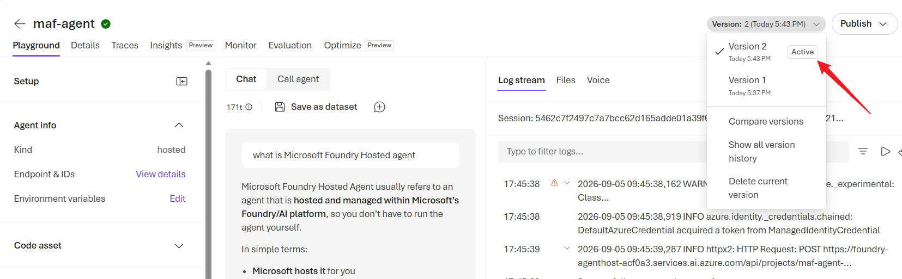

6. 发送测试消息以试用新版本。查看托管代理日志流，确认所选路由路径：
  - `direct`：代理 → POST 到 Foundry 项目终结点
  - `gateway`：代理 → POST 到独立 APIM 网关

如果使用 `direct` 模式，Playground 日志流会显示模型调用通过 PROJECT 终结点路由（见下图）：
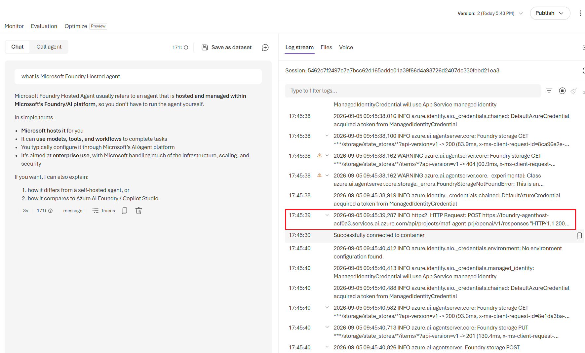

如果使用 `gateway` 模式，Playground 日志流会显示模型调用通过 APIM URL 路由（见下图）：
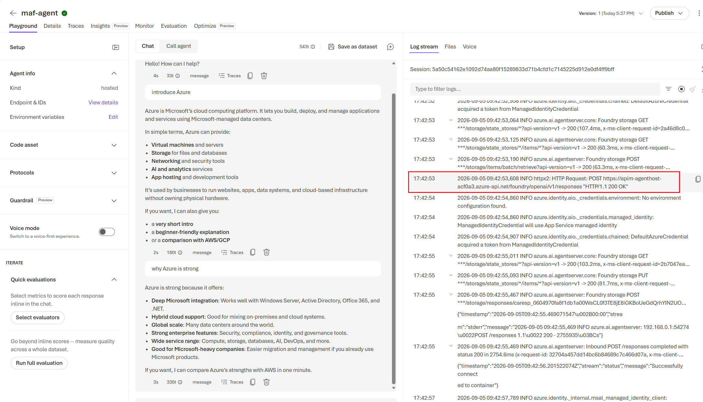

之前的代理版本仍然可用，因此可以在版本之间切换并比较两种路由模式。

---
## 体系结构

- 代理作为 Microsoft Foundry 托管代理运行，并使用模块 01 中创建的项目和模型部署。
- `MODEL_ROUTING` 选择通过 Foundry 项目终结点直接访问，或通过 APIM AI 网关集中访问。
- 托管标识和 Foundry RBAC 提供对 Azure 资源的无密码访问。

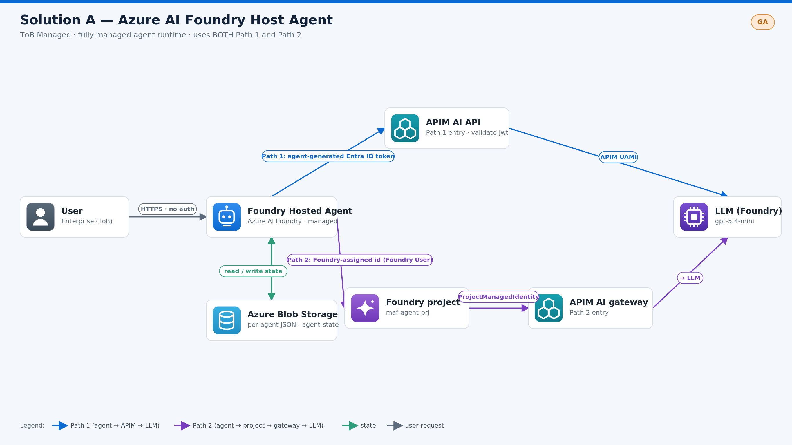

---

## 演示

https://github.com/user-attachments/assets/5cf37256-1fc1-43e4-bf64-5d1108b893a0

---

## 本模块中的文件

| 文件 | 说明 |
|---|---|
| `azure.yaml` | `azd ai agent init` 使用的 Foundry 代理清单（引用 `agent-src`） |
| `agent-src/main.py` | 使用 `ResponsesHostServer` 提供服务的代理；`build_client()` 根据 `MODEL_ROUTING` 选择 `FoundryChatClient`（直接）或 `OpenAIChatClient` → APIM 网关 |
| `agent-src/requirements.txt` | 托管代理的 Python 依赖项（同时包括 `agent-framework-foundry` 和 `agent-framework-openai`） |
| `agent-src/Dockerfile` | 托管代理运行时的容器生成文件 |
| `ai-gateway-inbound-policy.xml` | 粘贴到自动创建的 AI-Gateway API 中的 `validate-jwt` 片段（将其限制为 Foundry 项目托管标识——请参阅上面的可选部分） |
---
## 后续步骤

继续前往[模块 3 — 解决方案 B：AKS + agent-sandbox](../module-03/README_CN.md)。

---

[⬆ 返回研讨会主页](../readme.md)
