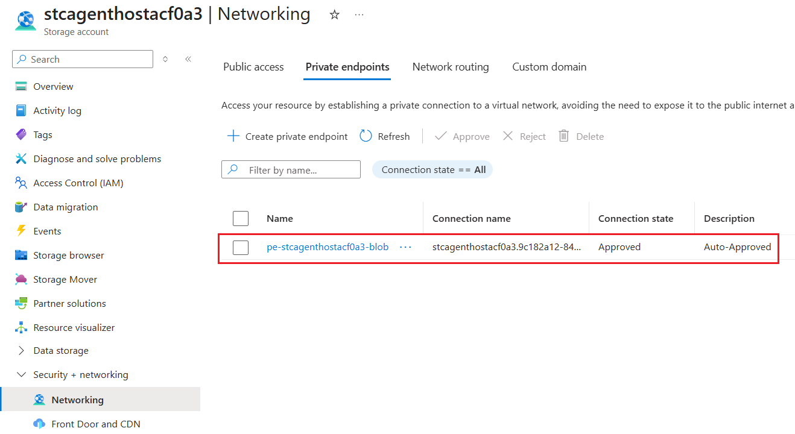
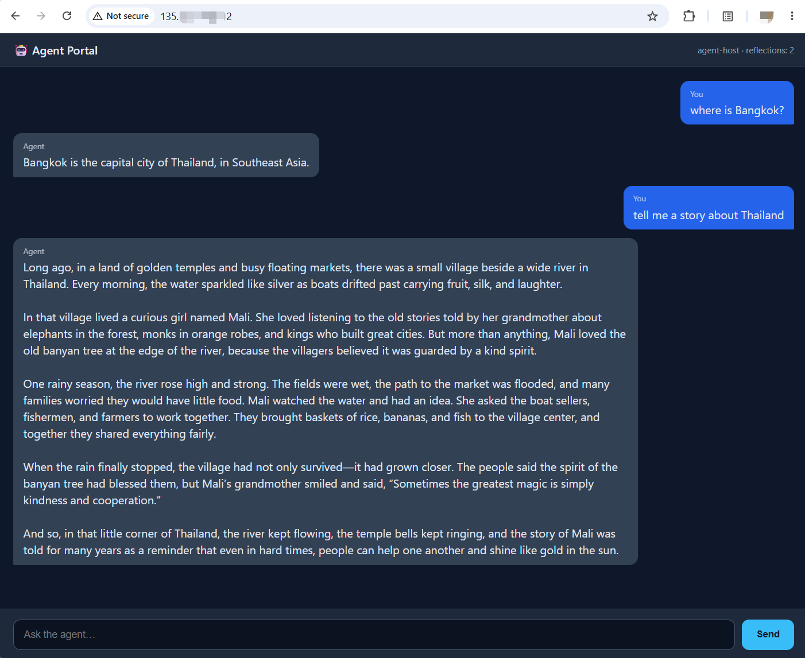
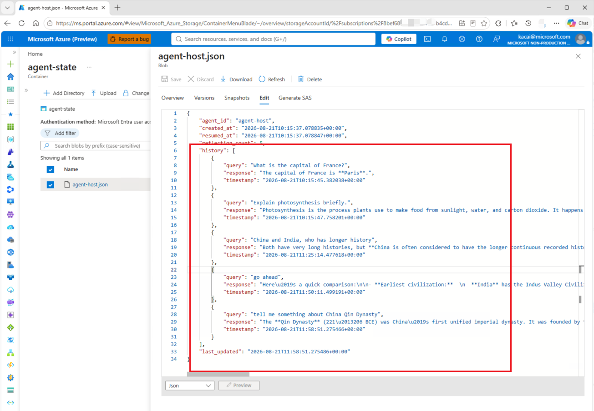
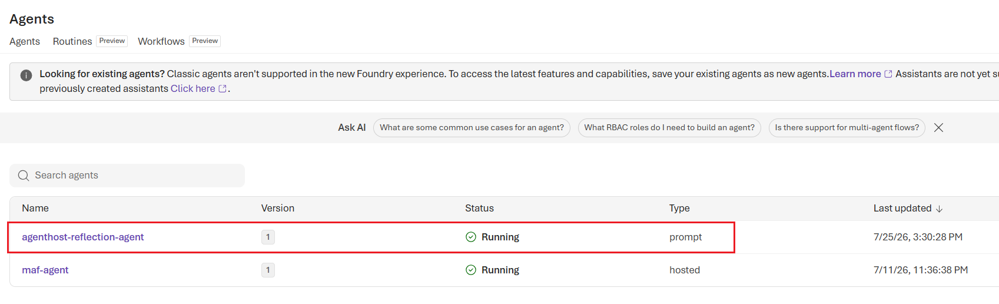
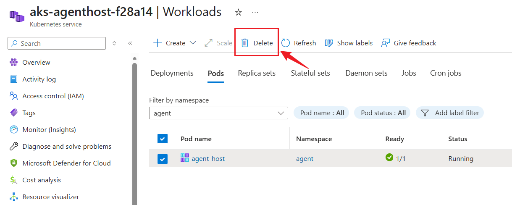

# Module 3 — Solution B: AKS + agent-sandbox (40 min)

[⬆ Back to Workshop Home](../readme.md)

## Overview

Deploy agents on **Azure Kubernetes Service (AKS)** using **official AKS Pod Sandboxing** on an **Azure Linux** Kata node pool. **[agent-sandbox](https://github.com/kubernetes-sigs/agent-sandbox)** (a Kubernetes SIG project) manages the agent lifecycle through `Sandbox` custom resources. This is the most controllable and customizable option, supporting both **ToB** scenarios with enterprise-specific technical requirements and **ToC** scenarios that require cost and performance tuning.

> **Note:** Unlike the hosted agent in Solution A, which runs in a Microsoft Foundry managed environment, Solution B hosts the agent in AKS Pod Sandboxing.

> **Why agent-sandbox?** `agent-sandbox` is a CNCF/Kubernetes SIG project that provides a `Sandbox` CRD and controller for managing isolated, stateful, singleton agent pods with a **stable identity**, **persistent storage**, and **lifecycle management** (create, pause, resume, and hibernate). Its built-in hibernation provides the scale-to-zero mechanism used in this module.

This module **reuses the resources created by Module 1** instead of recreating them and provisions the AKS cluster **in the same resource group**:

| Reused from Module 1 | Name pattern | Used for |
|---|---|---|
| Azure Container Registry | `acragenthost<SN>` | Agent image pull (AcrPull to kubelet) |
| User-Assigned Managed Identity | `id-agenthost-<SN>` | Workload Identity federation for pods |
| Azure Blob Storage | `stcagenthost<SN>` | Agent state store (JSON per agent, container `agent-state`) |
| API Management | `apim-agenthost-<SN>` | AI Gateway for model calls (`/foundry`) |

`<SN>` is the deployment suffix stored in the `deploymentSN` tag on the Module 1 resource group. `deploy.sh` reads it automatically.

## Learning Objectives

- Provision AKS with an OIDC issuer and Workload Identity, then enable AKS Pod Sandboxing on an Azure Linux node pool
- Install the `agent-sandbox` controller from a release manifest and run the agent as a `Sandbox` CR
- Connect the agent to the Module 1 Blob Storage account and APIM gateway
- Observe the agent-sandbox lifecycle (pause, resume, and hibernate) as the scale-to-zero mechanism

---

## Prerequisites

> **Note:** Run all commands in this README from the module root directory (`agenthost/module-03/`).

- **Module 1 deployed** (Blob, APIM, ACR, UAMI) — `deploymentSN` tag present on the RG
- `az`, `kubectl`, and Docker installed and logged in (`az login`)
- Azure CLI `2.80.0+` for AKS Pod Sandboxing support

---

## One-Command Deploy

> **Choose one deployment path:** use this one-command flow **or** the
> [Manual Steps](#manual-steps-equivalent-to-deploysh) below. They are
> equivalent; do not run both.

```bash
cd agenthost/module-03
./deploy.sh
```

`deploy.sh` performs the following steps end to end:

1. Read `deploymentSN` (SN) from the Module 1 resource group tag.
2. Build and push the agent image to the **existing** ACR, `acragenthost<SN>`.
3. Deploy `aks.bicep`, which creates the baseline AKS cluster `aks-agenthost-<SN>`, federates the Module 1 UAMI, and grants AcrPull to the kubelet identity and Storage Blob Data Contributor to the UAMI.
4. Add an Azure Linux `kata` node pool with `KataVmIsolation`, run `az aks update`, and retrieve the AKS credentials.
5. Install the **agent-sandbox controller** from the release manifest, including the core components and extensions.
6. Create the `agent` namespace.
7. Create runtime secrets using the Module 1 Storage account and APIM gateway URL.
8. Copy `agent-sandbox.yaml.example` to `agent-sandbox.yaml`, replace the placeholders, and deploy the agent as a `Sandbox` custom resource that uses the AKS `kata-vm-isolation` runtime class.
9. Wait for the Sandbox pod to become ready.

Environment overrides: `RESOURCE_GROUP`, `LOCATION`, `NAMESPACE`, `SERVICE_ACCOUNT`, `IMAGE_TAG`, `KATA_NODEPOOL_NAME`, `KATA_NODE_VM_SIZE`, `AGENT_SANDBOX_VERSION`.

> Set `AGENT_SANDBOX_VERSION` to a release tag from
> https://github.com/kubernetes-sigs/agent-sandbox/releases (used in the release manifest URL).

After `deploy.sh` completes, jump to the [Deploy Blob Private Link](#deploy-blob-private-link-optional-if-your-storage-account-supports-public-network-access) step below.

---

## Manual Steps (equivalent to deploy.sh)

> **Alternative to one-command deployment:** follow these steps only if you chose
> the manual deployment path. Do not run them after `./deploy.sh`.

### Step 1 — Get the deployment suffix (SN)

```bash
RESOURCE_GROUP="rg-agenthost-workshop"
SN=$(az group show --resource-group "$RESOURCE_GROUP" --query "tags.deploymentSN" --output tsv 2>/dev/null | tr -d "\r\n")

ACR_NAME="acragenthost${SN}"
IDENTITY_NAME="id-agenthost-${SN}"
STORAGE_ACCOUNT="stcagenthost${SN}"
APIM_NAME="apim-agenthost-${SN}"
AKS_NAME="aks-agenthost-${SN}"
NAMESPACE="agent"
SERVICE_ACCOUNT="agent-sa"
```

### Step 2 — Build and push the image to the existing ACR

```bash
cp agent-src/app/.env.example agent-src/app/.env
sed -i "s|<SN>|${SN}|g" agent-src/app/.env

az acr login --name "$ACR_NAME"
# Build context is ./agent-src (app + Dockerfile + lifecycle hook)
docker build -t "${ACR_NAME}.azurecr.io/agent-host:latest" agent-src/
docker push "${ACR_NAME}.azurecr.io/agent-host:latest"
```

> The agent application lives in [`agent-src/`](./agent-src/README.md). It is a simple
> reflection-loop agent that demonstrates LLM endpoint configuration, `Authorization: Bearer`
> authentication (using either a static key or Workload Identity), Blob state persistence and
> recovery, and hibernate/resume recovery. See its README for local-run and API details.

### Step 3 — Deploy the baseline AKS cluster (reusing Module 1 resources)

```bash
az deployment group create \
  --resource-group "$RESOURCE_GROUP" \
  --template-file aks.bicep \
  --parameters \
      location="$(az group show -g "$RESOURCE_GROUP" --query location -o tsv)" \
      deploymentSN="$SN" \
      aksName="$AKS_NAME" \
      acrName="$ACR_NAME" \
      identityName="$IDENTITY_NAME" \
      storageAccountName="$STORAGE_ACCOUNT" \
      namespace="$NAMESPACE" \
      serviceAccountName="$SERVICE_ACCOUNT"

az aks get-credentials -g "$RESOURCE_GROUP" -n "$AKS_NAME" --overwrite-existing
```

### Step 4 — Enable AKS Pod Sandboxing on an Azure Linux node pool

```bash
KATA_NODEPOOL_NAME="kata"
KATA_NODE_VM_SIZE="Standard_D4s_v3"

az aks nodepool add \
  --resource-group "$RESOURCE_GROUP" \
  --cluster-name "$AKS_NAME" \
  --name "$KATA_NODEPOOL_NAME" \
  --mode User \
  --node-vm-size "$KATA_NODE_VM_SIZE" \
  --node-count 1 \
  --enable-cluster-autoscaler \
  --min-count 1 \
  --max-count 10 \
  --os-sku AzureLinux \
  --workload-runtime KataVmIsolation \
  --node-taints "kata=true:NoSchedule" \
  --labels "kata-containers=true"

az aks update -g "$RESOURCE_GROUP" -n "$AKS_NAME"
kubectl get runtimeclass kata-vm-isolation
```

### Step 5 — Install the agent-sandbox controller (release manifest)

```bash
VERSION="v0.5.2"   # pick a real release tag
kubectl apply -f \
  "https://github.com/kubernetes-sigs/agent-sandbox/releases/download/${VERSION}/sandbox-with-extensions.yaml"

kubectl wait --for=condition=Established crd/sandboxes.agents.x-k8s.io --timeout=2m
kubectl wait --for=condition=Ready pod -l app=agent-sandbox-controller -n agent-sandbox-system --timeout=5m
```

### Step 6 — Create secrets from Module 1 Storage / APIM

```bash
kubectl create namespace "$NAMESPACE" --dry-run=client -o yaml | kubectl apply -f -

kubectl create secret generic agent-config -n "$NAMESPACE" \
  --from-literal=storage-account="$STORAGE_ACCOUNT" \
  --from-literal=blob-container="agent-state" \
  --from-literal=apim-endpoint="https://${APIM_NAME}.azure-api.net/foundry" \
  --dry-run=client -o yaml | kubectl apply -f -
```

### Step 7 — Deploy the agent as a Sandbox

```bash
IDENTITY_CLIENT_ID=$(az identity show -g "$RESOURCE_GROUP" -n "$IDENTITY_NAME" --query clientId -o tsv | tr -d "\r\n")

cp agent-sandbox.yaml.example agent-sandbox.yaml

sed "s|<ACR_NAME>|${ACR_NAME}|g; s|<IMAGE_TAG>|latest|g; s|<NAMESPACE>|${NAMESPACE}|g; s|<IDENTITY_CLIENT_ID>|${IDENTITY_CLIENT_ID}|g" \
  agent-sandbox.yaml > agent-sandbox.yaml.tmp && mv agent-sandbox.yaml.tmp agent-sandbox.yaml

kubectl apply -f agent-sandbox.yaml
```

---
## Deploy Blob Private Link (optional when public network access is disabled)

If your subscription policy disables public network access for Storage, create a
dedicated Private Endpoint subnet in the AKS-managed VNet and deploy a Blob Private Endpoint.

> **If the Module-01 Storage account has public network access disabled, or if Azure Policy disables public network access for Storage in your environment, the AKS-managed VNet must have private connectivity to the Blob endpoint before the agent can read or write its persisted state.**

Run the following script to establish private connectivity between the AKS-managed VNet and the storage account:

```bash
./deploy-storage-private-link.sh
```

> The script automatically detects the AKS-managed VNet name and asks for confirmation before continuing. You can also find the AKS-managed VNet name in the AKS resource group `$RESOURCE_GROUP`.
>
> If the script does not select the correct AKS-managed VNet, answer **"N"** to stop it, then provide the VNet name explicitly when you run the script:

```bash
VNET_NAME=<aks-vnet-name> ./deploy-storage-private-link.sh
```

If you do not provide the AKS-managed VNet name explicitly, run the following command:

```bash
./deploy-storage-private-link.sh
```

**Expected output:**

```text
WARNING: The behavior of this command has been altered by the following extension: aks-preview
WARNING: The behavior of this command has been altered by the following extension: aks-preview
    AKS vnetSubnetId is null (expected for AKS-managed VNet). Discovering VNet in node resource group...
    No VNET_NAME input provided.
    First VNet in rg-aks-agenthost-f28a14-nodes: aks-vnet-39023097
Continue with this VNet? [y/N]: y
    Auto-selected subnet prefix for snet-private-endpoints: 10.225.0.0/24
==> Deploying Blob Private Link
    Workshop RG : rg-agenthost-workshop
    Node RG     : rg-aks-agenthost-f28a14-nodes
    VNet        : aks-vnet-39023097
    PE subnet   : snet-private-endpoints (10.225.0.0/24)
    Storage     : stcagenthostf28a14
A new Bicep release is available: v0.46.1. Upgrade now by running "az bicep upgrade".
Name                         State      Timestamp                         Mode         ResourceGroup
---------------------------  ---------  --------------------------------  -----------  ---------------------
storage-private-link-f28a14  Succeeded  2026-08-21T11:57:12.610428+00:00  Incremental  rg-agenthost-workshop
==> Blob Private Link deployed. Storage clients in the AKS VNet now resolve the Blob endpoint to the Private Endpoint IP.
```
In the Azure portal, open the storage account and confirm that the private endpoint was added:


> **Note:** The script creates the subnet in the AKS-managed VNet, then
> deploys the Private Endpoint and Private DNS resources in the workshop
> resource group `$RESOURCE_GROUP`.
> 
> The agent continues to use
> `https://<storage-account>.blob.core.windows.net`; Private DNS resolves that
> hostname to the Private Endpoint IP from inside the AKS VNet.
>
> The script automatically selects an available `/24` CIDR block from the VNet address
> space and creates a subnet for the private endpoint.

---

## Verify

Run the following commands to verify that the Sandbox and its pod are ready, and that the controller is running:

```bash
# The Sandbox CR and its pod
kubectl get sandbox,pods -n "$NAMESPACE"
kubectl wait --for=condition=Ready pod -l app=agent-host -n "$NAMESPACE" --timeout=3m

# Controller
kubectl get pods -n agent-sandbox-system
```

**Expected output:**

```text
NAME                                 READY   REASON              AGE
sandbox.agents.x-k8s.io/agent-host   True    DependenciesReady   5m2s

NAME             READY   STATUS    RESTARTS   AGE
pod/agent-host   1/1     Running   0          5m1s

pod/agent-host condition met

NAME                                        READY   STATUS    RESTARTS   AGE
agent-sandbox-controller-76885c8b6c-gjbk7   1/1     Running   0          117m
```
### Verify the agent is working

Run the following command:

```bash
kubectl get all -n "$NAMESPACE"
```

**Expected output:**

```text
NAME             READY   STATUS    RESTARTS   AGE
pod/agent-host   1/1     Running   0          10m

NAME                    TYPE           CLUSTER-IP    EXTERNAL-IP     PORT(S)        AGE
service/agent-host      ClusterIP      None          <none>          <none>         10m
service/agent-host-lb   LoadBalancer   10.0.164.26   135.**.**.251   80:32234/TCP   10m
```
Open `http://<EXTERNAL-IP>` in your browser. The chat window should appear. Ask several questions to confirm that the agent is working:

> ***Tip: Make sure the URL includes `http://`. Otherwise, the browser may default to HTTPS, which is not yet implemented by this workshop agent.***



### Verify chat history persisted to Blob

> **Tip:** If public network access is disabled on your storage account, run the verification below from a jumpbox that can reach the storage account through Private Link.
> The easiest approach in this workshop is to reuse the private connectivity you just created:
> 1. Create a separate subnet in the AKS-managed VNet.
> 2. Create a jumpbox VM in that subnet. The jumpbox will have a NIC and private IP in the subnet.
> 3. Use the jumpbox to access the storage account through the private endpoint.


After several rounds of chat, verify that the conversation state is persisted in the
`agent-state` container as `agent-host.json`. From the jumpbox browser, open the Blob container in the portal and view `agent-host.json`. The `history` field should contain your chat turns and grow after each interaction.


If your jumpbox does not have a browser, you can download the blob to view it locally:
```bash
# List state blobs (should include agent-host.json)
az storage blob list \
  --account-name "$STORAGE_ACCOUNT" \
  --container-name agent-state \
  --auth-mode login \
  --query "[].name" -o tsv

# Inspect the saved chat history JSON
az storage blob download \
  --account-name "$STORAGE_ACCOUNT" \
  --container-name agent-state \
  --name agent-host.json \
  --file /tmp/agent-host.json \
  --auth-mode login \
  --overwrite

cat /tmp/agent-host.json
```

### Verify the agent runs in a sandbox

Run the following command to confirm that the pod is running in a Sandbox with runtime class **`kata-vm-isolation`**:

```bash
kubectl describe pod/agent-host -n "$NAMESPACE"
```

**Expected output:**

```text
Name:                agent-host
Namespace:           agent
Priority:            0
Runtime Class Name:  kata-vm-isolation
Service Account:     agent-sa
Node:                aks-kata-75222809-vmss00000a/10.224.0.19
Start Time:          Tue, 21 Jul 2026 00:43:13 +0800
Labels:              agents.x-k8s.io/sandbox-name-hash=03e7e68b
                     app=agent-host
                     azure.workload.identity/use=true
                     component=agent-runtime
                     topology.kubernetes.io/region=eastus2
                     topology.kubernetes.io/zone=0
Annotations:         agents.x-k8s.io/propagated-labels: app,azure.workload.identity/use,component
Status:              Running
IP:                  10.224.0.30
IPs:
  IP:           10.224.0.30
Controlled By:  Sandbox/agent-host
Containers:
  agent-host:
    Container ID:   containerd://a8619d5c5b9eef8906c84d864e9eb6a037882b14b6e7b7a4f2b23010826d5ec3
    Image:          ......
```

### Verify Pod Sandboxing Kernel Isolation

Use `uname -r` inside the sandboxed agent pod to confirm that it is running with the
AKS Pod Sandboxing runtime. Then compare its kernel with that of a normal pod on the cluster.

```bash
AGENT_POD=$(kubectl get pod -n "$NAMESPACE" -l app=agent-host -o jsonpath='{.items[0].metadata.name}')
kubectl exec -it -n "$NAMESPACE" "$AGENT_POD" -- uname -r
```

**Expected output:**

```text
6.6.137.mshv1-1.azl3
```

The `mshv1` suffix indicates a Microsoft Hyper-V-optimized kernel. In Azure Sandbox environments, this kernel is commonly used as the guest OS kernel inside the isolated VM.

Optionally, run a normal pod without `kata-vm-isolation` for comparison:

```bash
cat <<EOF | kubectl apply -f -
apiVersion: v1
kind: Pod
metadata:
  name: normal-pod
  namespace: ${NAMESPACE}
spec:
  restartPolicy: Never
  containers:
    - name: normal
      image: mcr.microsoft.com/aks/fundamental/base-ubuntu:v0.0.11
      command: ["/bin/sh", "-ec", "sleep 3600"]
EOF

kubectl wait --for=condition=Ready pod/normal-pod -n "$NAMESPACE" --timeout=2m
kubectl exec -it -n "$NAMESPACE" normal-pod -- uname -r
```

**Expected output:**

```text
6.8.0-1059-azure
```

**Clean up:**

```bash
kubectl delete pod normal-pod -n "$NAMESPACE"
```

> **Note:** If the agent pod reports a different kernel from the normal pod and uses `runtimeClassName: kata-vm-isolation`, the workload is running inside AKS Pod Sandboxing.

### Verify that the agent is registered in Foundry as a "prompt" agent

In the Foundry portal, open your Foundry project and go to the **Agents** tab. The agent
`agenthost-reflection-agent` (defined in `.env`) should be registered successfully with
the type `prompt`:



### Verify that the agent reloads its state after resuming

In the AKS portal, delete the agent pod:


Refresh the agent chat window in the browser. The agent connection will be unavailable temporarily.
After the agent pod resumes, the previous chat history should load into the chat window again.

### Lifecycle (idle suspend/resume model)

The Sandbox manifest sets `spec.operatingMode: Running` and `spec.service: true`.
`operatingMode` controls the Sandbox lifecycle:

- Patch it to `Suspended` to scale the backing pod to zero while retaining the
  Sandbox object and its stable Service.
- Patch it back to `Running` when traffic resumes.

<details>
<summary><strong>Why auto suspend/resume is not enabled here</strong></summary>

The `Sandbox` CRD provides the `Running` / `Suspended` state transition, but it
does not provide an `idleTimeout` field and cannot inspect application requests
or determine when a user session becomes idle. The current public `LoadBalancer` Service
also routes directly to the agent pod. When that pod is suspended, the Service has no
ready endpoint and cannot hold a request, patch the Sandbox, wait for startup, and retry
the request. Therefore, the Sandbox manifest alone cannot implement the behavior
"idle for 15 minutes, then wake on the next HTTP request."

KEDA is useful for scaling Deployments or `SandboxWarmPool` capacity based on
metrics, but it does not by itself implement the per-Sandbox session routing and
wake-before-forward behavior required by this singleton agent.

</details>

<details>
<summary><strong>Practical implementation</strong></summary>

A production implementation places an always-running gateway in front of the
Sandbox and adds an idle sweeper. The browser calls the gateway instead of the
Sandbox LoadBalancer directly. The gateway and sweeper use Kubernetes RBAC with
`get`, `watch`, and `patch` permissions on the relevant Sandbox resources.

The control flow is:

1. The gateway records the time of the last completed request for each Sandbox.
  Store this information outside the agent pod, for example in Redis or a database,
  because the pod disappears while suspended.
2. The idle sweeper periodically finds Sandboxes with no active request and no
   traffic for 15 minutes, then patches `spec.operatingMode` to `Suspended`.
3. The agent-sandbox controller terminates the backing pod while retaining the
  Sandbox object and its stable Service. This workshop's conversation state is
  already persisted durably in Blob Storage.
4. When new traffic arrives, the gateway resolves the target Sandbox. If it is
   suspended, the gateway patches `operatingMode` to `Running` and holds the
   incoming request.
5. The gateway watches the Sandbox until `Ready=True`, then forwards the held
  request to `status.serviceFQDN`. If startup exceeds a configured timeout, the
  gateway returns a retryable `503` response.
6. The implementation must serialize concurrent wake requests and recheck the
   active-request count immediately before suspension, so the sweeper cannot
   suspend a Sandbox while a request is running.

For larger platforms, `SandboxTemplate`, `SandboxClaim`, and `SandboxWarmPool`
can reduce cold-start latency. The gateway still owns session routing, idle detection,
request holding, and wake-on-traffic behavior.

</details>

#### Workshop Simplification

To keep this workshop focused on Sandbox lifecycle and state recovery, it does
not deploy a custom gateway, activity store, or idle-sweeper controller. We use
manual patches to represent the two actions that those components would perform:

1. After 15 minutes without user traffic, the idle sweeper would patch the
   Sandbox to `Suspended`.
2. On the next user request, the gateway would patch the Sandbox back to
   `Running`, wait for `Ready=True`, then proxy the request to the stable
   Sandbox Service.

Run the equivalent manual suspend and resume commands:

**Run:**

```bash
# Suspend after an idle period (the workshop target is 15 minutes)
kubectl patch sandbox agent-host -n "$NAMESPACE" --type merge \
  -p '{"spec":{"operatingMode":"Suspended"}}'
```

Check the pod, Service, and Sandbox:

```bash
kubectl get pods -n "$NAMESPACE"
kubectl get all -n "$NAMESPACE"
kubectl get sandbox -n "$NAMESPACE"
```

**Expected output:**

```text
No resources found in agent namespace.

NAME                    TYPE           CLUSTER-IP    EXTERNAL-IP     PORT(S)        AGE
service/agent-host      ClusterIP      None          <none>          <none>         62m
service/agent-host-lb   LoadBalancer   10.0.164.26   135.**.**.251   80:32234/TCP   62m

NAME         READY   REASON             AGE
agent-host   False   SandboxSuspended   62m
```
The output indicates:
1. The pod is stopped.
2. The Services are retained.
3. The Sandbox status is `False/SandboxSuspended`, which means it is not ready.

If you refresh the Agent Chat UI in the browser, it will be unreachable.

Next, resume the pod and Sandbox to simulate traffic returning:

**Run:**

```bash
# Resume when traffic returns
kubectl patch sandbox agent-host -n "$NAMESPACE" --type merge \
  -p '{"spec":{"operatingMode":"Running"}}'

kubectl wait sandbox agent-host -n "$NAMESPACE" --for=condition=Ready --timeout=180s
```

**Expected output:**

```text
sandbox.agents.x-k8s.io/agent-host patched
sandbox.agents.x-k8s.io/agent-host condition met
```

Check the pod, Service, and Sandbox status again:

```bash
kubectl get pods -n "$NAMESPACE"
kubectl get all -n "$NAMESPACE"
kubectl get sandbox -n "$NAMESPACE"
```

**Expected output:**

```text
NAME         READY   STATUS    RESTARTS   AGE
agent-host   1/1     Running   0          2m30s

NAME             READY   STATUS    RESTARTS   AGE
pod/agent-host   1/1     Running   0          2m38s

NAME                    TYPE           CLUSTER-IP    EXTERNAL-IP     PORT(S)        AGE
service/agent-host      ClusterIP      None          <none>          <none>         70m
service/agent-host-lb   LoadBalancer   10.0.164.26   135.**.**.251   80:32234/TCP   70m

NAME         READY   REASON              AGE
agent-host   True    DependenciesReady   71m
```
The output indicates:
1. The pod has resumed and is running.
2. The Services are running and healthy.
3. The Sandbox status is `True/DependenciesReady`.

> If you refresh the Agent Chat UI in the browser, it should be available again, with the previous chat history restored.


Anytime you can inspect the Sandbox lifecycle status with the following command:

```bash
# Inspect the Sandbox status / lifecycle fields
kubectl describe sandbox agent-host -n "$NAMESPACE"
```

> Tip: For more detail of the agent-sandbox on agent lifecycle management, refer to the [agent-sandbox docs](https://agent-sandbox.sigs.k8s.io/docs/) for pause/resume, scheduled deletion, and `SandboxWarmPool` patterns.

---

## Files in This Module

| File | Description |
|---|---|
| `deploy.sh` | End-to-end deployment: reads SN, reuses the Module 1 ACR/UAMI/Storage/APIM resources, builds the `agent-src/` image, provisions the baseline AKS cluster, enables AKS Pod Sandboxing on an Azure Linux node pool, installs agent-sandbox, and deploys the Sandbox. |
| `aks.bicep` | Baseline AKS cluster definition. It references the existing ACR, UAMI, and Storage account, and configures AcrPull, Storage RBAC, and the UAMI federated credential. The AKS Pod Sandboxing node pool is added by `deploy.sh`. |
| `deploy-storage-private-link.sh` | Optional post-AKS wrapper that discovers the AKS-managed VNet, creates a dedicated Private Endpoint subnet, and deploys the Blob Private Link Bicep template. |
| `storage-private-link.bicep` | Optional Blob Private Endpoint, Private DNS zone, VNet link, and DNS zone group in the workshop resource group. |
| `agent-sandbox.yaml.example` | Template manifest with placeholders for the ACR, image tag, namespace, and identity values. |
| `agent-sandbox.yaml` | Generated from `agent-sandbox.yaml.example` during deployment, then applied to create the ServiceAccount, `Sandbox` CR, and Service using AKS `kata-vm-isolation`. |
| `agent-src/` | POC agent source: `app/main.py` (the ReflectionAgent HTTP server), `Dockerfile`, `requirements.txt`, `lifecycle-hook.sh`, and a usage `README.md`. This is the image built and deployed as the Sandbox. |

---

## Architecture Notes

- **Reuse, not recreation**: `aks.bicep` references the Module 1 ACR, UAMI, and Storage account as `existing`; only the AKS cluster and role/federation wiring are new.
- **AKS Pod Sandboxing**: the sandbox node pool is created with `--os-sku AzureLinux --workload-runtime KataVmIsolation`, which provides the built-in `kata-vm-isolation` runtime class used by the agent workload.
- **agent-sandbox**: the `Sandbox` CRD (`agents.x-k8s.io/v1beta1`) and controller manage the agent as an isolated, stateful, singleton pod with a stable identity and lifecycle.
- **Workload Identity**: the Module 1 UAMI (`id-agenthost-<SN>`) receives a federated credential that trusts the AKS OIDC issuer for `system:serviceaccount:agent:agent-sa`. Pods can then obtain Azure AD tokens without storing secrets.
- **Azure Blob Storage**: the agent persists conversation state directly to Blob as `<AGENT_ID>.json` in the `agent-state` container after every change, and the pod recovers it on startup. Blob Storage is the single source of truth; there is no Redis or hot cache.
- **AI Gateway**: model calls route through APIM at `https://apim-agenthost-<SN>.azure-api.net/foundry`, the Foundry Responses gateway from Module 1.
- **Kata Containers**: the `kata` node pool is tainted and labelled, and the agent workload targets it with `runtimeClassName: kata-vm-isolation` plus a node selector and toleration.
- **Scale-to-zero**: the Sandbox exposes `operatingMode` (`Running` / `Suspended`) as the suspend/resume control point. A gateway or idle sweeper should enforce the 15-minute idle policy and wake the Sandbox before proxying incoming traffic.

---

## Next Step

Proceed to [Module 4 — Solution C: ACA Sandboxes](../module-04/README.md).

---

[⬆ Back to Workshop Home](../readme.md)
