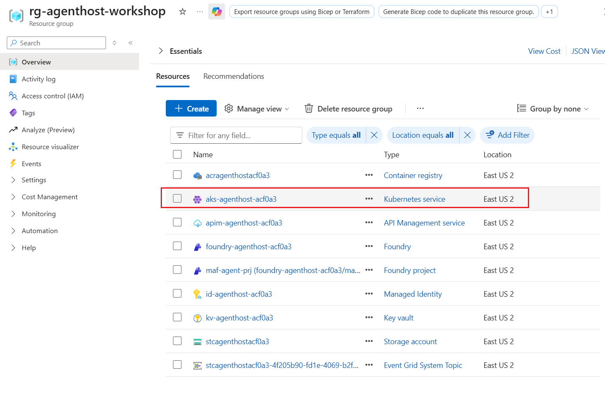
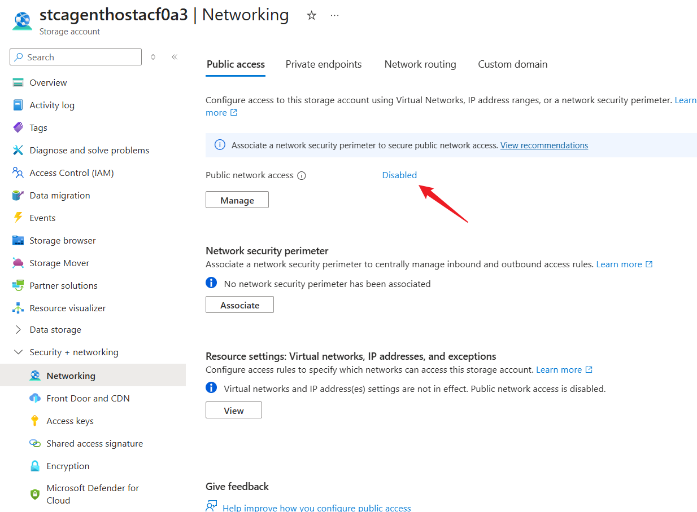
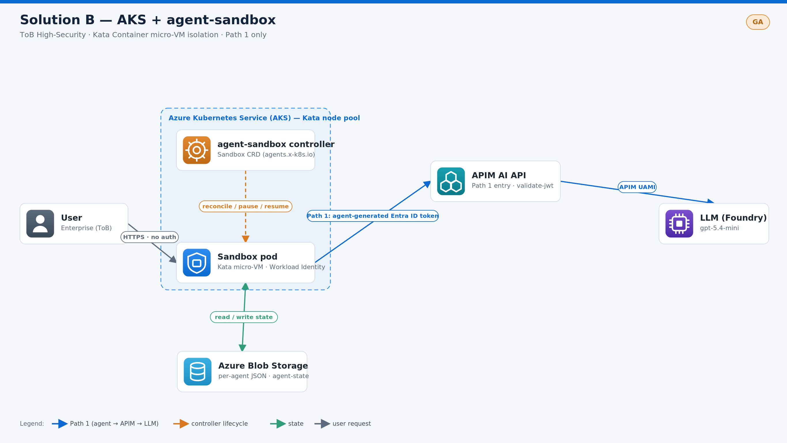

# Module 3 — Solution B: AKS + agent-sandbox (40 min)

[⬆ Back to Workshop Home](../readme.md)

## Overview

Deploy agents on **Azure Kubernetes Service (AKS)** using **official AKS Pod Sandboxing** on an **Azure Linux** Kata node pool. **[agent-sandbox](https://github.com/kubernetes-sigs/agent-sandbox)** (a Kubernetes SIG project) manages the agent lifecycle through `Sandbox` custom resources. This is the most controllable and customizable option, supporting both **ToB** scenarios with enterprise-specific technical requirements and **ToC** scenarios that require cost and performance tuning.

> [!Note]
> Unlike the hosted agent in Solution A, which runs in a Microsoft Foundry managed environment, Solution B hosts the agent in AKS Pod Sandboxing.
>
> **Why agent-sandbox?** `agent-sandbox` is a CNCF/Kubernetes SIG project that provides a `Sandbox` CRD and controller for managing isolated, stateful, singleton agent pods with a **stable identity**, **persistent storage**, and **lifecycle management** (create, pause, resume, and hibernate). Its built-in hibernation provides the scale-to-zero mechanism used in this module.

This module **reuses the resources created by Module 1** instead of recreating them and provisions the AKS cluster **in the same resource group**:

| Reused from Module 1 | Name pattern | Used for |
|---|---|---|
| Azure Container Registry | `acragenthost<SN>` | Agent image pull (AcrPull to kubelet) |
| User-Assigned Managed Identity | `id-agenthost-<SN>` | Workload Identity federation for pods |
| Azure Blob Storage | `stcagenthost<SN>` | Agent state store (JSON per agent, container `agent-state`) |
| API Management | `apim-agenthost-<SN>` | AI Gateway for model calls (`/foundry`) |

`<SN>` is the deployment suffix stored in the `deploymentSN` tag on the Module 1 resource group. `prepare-agent-sandbox.sh` reads it automatically.

## Learning Objectives

- Provision AKS with an OIDC issuer and Workload Identity, then enable AKS Pod Sandboxing on an Azure Linux node pool
- Install the `agent-sandbox` controller from a release manifest and run the agent as a `Sandbox` CR
- Connect the agent to the Module 1 Blob Storage account and APIM gateway
- Observe the agent-sandbox lifecycle (pause, resume, and hibernate) as the scale-to-zero mechanism

---

## Prerequisites
> [!CAUTION]
> **Run all commands in this README from the module root directory (`agenthost/module-03/`).**

- **Module 1 deployed** (Blob, APIM, ACR, UAMI) — `deploymentSN` tag present on the RG
- `az` and `kubectl` installed, with Azure CLI logged in (`az login`)
- Azure CLI `2.80.0+` for AKS Pod Sandboxing support
- Permission to create the AKS cluster, node pools, federated identity credential, and role assignments. Role assignment creation requires `Microsoft.Authorization/roleAssignments/write` (for example, **Owner**, or **Contributor** plus **Role Based Access Control Administrator**).
- Permission to run an ACR quick build and push its result to the Module 1 ACR. **Contributor** on the registry is sufficient; custom roles must include the ACR build and image push actions.

---

## One-Command Environment Preparation

> [!CAUTION]
> **Choose one preparation path:** use this one-command flow **or** the [Manual Steps](#manual-steps-equivalent-to-prepare-agent-sandboxsh) below. 
>
> They are equivalent; **DO NOT** run both.

```bash
cd agenthost/module-03
chmod +x prepare-agent-sandbox.sh
./prepare-agent-sandbox.sh
```

When the preparation succeeds, `prepare-agent-sandbox.sh` prints output similar to the following:
```text
==> Solution B infrastructure prepared. Continue with README: Deploy agent in Sandbox.
    SN            : acf0a3
    AKS           : aks-agenthost-acf0a3
    Namespace     : agent
    Kata pool     : kata (Standard_D4s_v3, AzureLinux, KataVmIsolation)
    agent-sandbox : v0.5.2 (ns agent-sandbox-system)
    ACR           : acragenthostacf0a3.azurecr.io
    APIM          : https://apim-agenthost-acf0a3.azure-api.net/foundry
```

After `prepare-agent-sandbox.sh` completes, open the resource group in the Azure portal and confirm that the AKS cluster has been created:


> [!note]
> `prepare-agent-sandbox.sh` makes the following key changes:
>
> 1. Build the agent image in the existing ACR and push it as `agent-host:<IMAGE_TAG>`. The build runs in ACR, so no local Docker daemon is required.
> 2. Create the AKS cluster with OIDC, Workload Identity, and the Blob CSI driver. Grant AcrPull to the kubelet identity and grant its node-side CSI driver access to the existing Storage account.
> 3. Add an autoscaling Azure Linux node pool with `KataVmIsolation`. This provides the `kata-vm-isolation` runtime used to isolate the agent pod in a lightweight VM.
> 4. Install the `agent-sandbox` CRD and controller, which manage Sandbox creation and lifecycle transitions such as running and suspended states.
> 5. Create a StorageClass, static PV, and PVC for the existing `agent-state` container, then render `agent-sandbox.yaml` with the PVC mounted at `/app/app/data`. The script does not deploy the Sandbox.


> [!IMPORTANT]
> To construct the agent-sandbox release manifest URL, `prepare-agent-sandbox.sh` sets `AGENT_SANDBOX_VERSION` to a 
> default value which could not be the up-to-date version or fit for your needs.
> You can override the `AGENT_SANDBOX_VERSION` value to a release tag. Check the available value from
> https://github.com/kubernetes-sigs/agent-sandbox/releases.

**Next:**

- If your Storage account has public network access disabled, continue to [Configure Blob Private Link](#configure-blob-private-link).
- Otherwise, go directly to [Deploy agent in Sandbox](#deploy-agent-in-sandbox).

---

## Manual Steps Preparation (equivalent to prepare-agent-sandbox.sh)
> [!warning]
> **Alternative to One-Command Deployment:** follow these steps only if you chose
> the manual deployment path.
>
> **Do not run them after `./prepare-agent-sandbox.sh`**.

### Step 1 — Retrieve the deployment serial number (SN) and construct related environment variables

```bash
RESOURCE_GROUP="rg-agenthost-workshop"
SN=$(az group show --resource-group "$RESOURCE_GROUP" --query "tags.deploymentSN" --output tsv 2>/dev/null | tr -d "\r\n")

ACR_NAME="acragenthost${SN}"
IDENTITY_NAME="id-agenthost-${SN}"
STORAGE_ACCOUNT="stcagenthost${SN}"
APIM_NAME="apim-agenthost-${SN}"
AKS_NAME="aks-agenthost-${SN}"
NAMESPACE="agent"
SERVICE_ACCOUNT="agent-sa"
IMAGE_TAG="latest"
LLM_MODEL="gpt-5.4-mini"
```

### Step 2 — Build and push the image to the existing ACR

```bash
cp agent-src/app/.env.example agent-src/app/.env
sed -i "s|<SN>|${SN}|g" agent-src/app/.env

# Build context is ./agent-src (app + Dockerfile + lifecycle hook).
# ACR builds the image remotely and pushes it to this registry.
az acr build \
  --registry "$ACR_NAME" \
  --image "agent-host:${IMAGE_TAG}" \
  agent-src/
```
> [!tip]
> The application lives in [`agent-src/`](./agent-src/README.md). It runs a LangGraph workflow:
> - reader extracts grounded evidence and saves it to HorizonDB
> - writer saves a draft report to HorizonDB
> - reviewer saves actionable feedback to HorizonDB
> - writer revises and saves the final report, which is returned to the browser
> - all roles run in the container and are not registered in a Foundry project
> - See its README for local-run and API details.

### Step 3 — Deploy the baseline AKS cluster (reusing Module 1 resources)

```bash
az deployment group create \
  --resource-group "$RESOURCE_GROUP" \
  --template-file aks.bicep \
  --parameters \
      location="$(az group show -g "$RESOURCE_GROUP" --query location -o tsv | tr -d "\r\n")" \
      deploymentSN="$SN" \
      aksName="$AKS_NAME" \
      acrName="$ACR_NAME" \
      identityName="$IDENTITY_NAME" \
      storageAccountName="$STORAGE_ACCOUNT" \
      namespace="$NAMESPACE" \
      serviceAccountName="$SERVICE_ACCOUNT"

az aks get-credentials -g "$RESOURCE_GROUP" -n "$AKS_NAME" --overwrite-existing
```

### Step 4 — Enable AKS Pod Sandboxing on an Azure Linux node pool

```bash
KATA_NODEPOOL_NAME="kata"
KATA_NODE_VM_SIZE="Standard_D4s_v3"

if az aks nodepool show --resource-group "$RESOURCE_GROUP" --cluster-name "$AKS_NAME" --name "$KATA_NODEPOOL_NAME" --output none 2>/dev/null; then
  echo "    Node pool $KATA_NODEPOOL_NAME already exists; reusing it"
else
  az aks nodepool add \
    --resource-group "$RESOURCE_GROUP" \
    --cluster-name "$AKS_NAME" \
    --name "$KATA_NODEPOOL_NAME" \
    --mode User \
    --node-vm-size "$KATA_NODE_VM_SIZE" \
    --node-count 1 \
    --enable-cluster-autoscaler \
    --min-count 1 \
    --max-count 10 \
    --os-sku AzureLinux \
    --workload-runtime KataVmIsolation \
    --node-taints "kata=true:NoSchedule" \
    --labels "kata-containers=true"
fi
```

After the Kata node pool is added, run the following command to verify that the runtime class is available:

```bash
kubectl get runtimeclass kata-vm-isolation
```

If AKS Pod Sandboxing is enabled correctly, you should see output similar to the following:

```text
NAME                HANDLER   AGE
kata-vm-isolation   kata      7m21s
```


### Step 5 — Install the agent-sandbox controller (release manifest)

> [!tip]
> Pick a released version from https://github.com/kubernetes-sigs/agent-sandbox/releases, and use the selected version to install the agent-sandbox in AKS.

```bash
AGENT_SANDBOX_VERSION="v0.5.2"   # pick a real release tag
kubectl apply -f \
  "https://github.com/kubernetes-sigs/agent-sandbox/releases/download/${AGENT_SANDBOX_VERSION}/sandbox-with-extensions.yaml"

kubectl wait --for=condition=Established crd/sandboxes.agents.x-k8s.io --timeout=2m
kubectl wait --for=condition=Ready pod -l app=agent-sandbox-controller -n agent-sandbox-system --timeout=5m
```
You should see output similar to the following:
```text
namespace/agent-sandbox-system created
customresourcedefinition.apiextensions.k8s.io/sandboxclaims.extensions.agents.x-k8s.io created
customresourcedefinition.apiextensions.k8s.io/sandboxes.agents.x-k8s.io created
customresourcedefinition.apiextensions.k8s.io/sandboxtemplates.extensions.agents.x-k8s.io created
customresourcedefinition.apiextensions.k8s.io/sandboxwarmpools.extensions.agents.x-k8s.io created
serviceaccount/agent-sandbox-controller created
role.rbac.authorization.k8s.io/agent-sandbox-controller created
clusterrole.rbac.authorization.k8s.io/agent-sandbox-controller created
clusterrole.rbac.authorization.k8s.io/agent-sandbox-controller-extensions created
rolebinding.rbac.authorization.k8s.io/agent-sandbox-controller created
clusterrolebinding.rbac.authorization.k8s.io/agent-sandbox-controller created
clusterrolebinding.rbac.authorization.k8s.io/agent-sandbox-controller-extensions created
service/agent-sandbox-controller created
service/agent-sandbox-webhook-service created
deployment.apps/agent-sandbox-controller created
customresourcedefinition.apiextensions.k8s.io/sandboxes.agents.x-k8s.io condition met
pod/agent-sandbox-controller-76885c8b6c-cmgpp condition met
```

### Step 6 — Create runtime secrets for APIM and the model

```bash
kubectl create namespace "$NAMESPACE" --dry-run=client -o yaml | kubectl apply -f -

kubectl create secret generic agent-config -n "$NAMESPACE" \
  --from-literal=storage-account="$STORAGE_ACCOUNT" \
  --from-literal=blob-container="agent-state" \
  --from-literal=apim-endpoint="https://${APIM_NAME}.azure-api.net/foundry" \
  --from-literal=llm-model="$LLM_MODEL" \
  --dry-run=client -o yaml | kubectl apply -f -
```

### Step 7 — Configure Blob CSI persistence and prepare the Sandbox manifest

```bash
KUBELET_CLIENT_ID=$(az aks show -g "$RESOURCE_GROUP" -n "$AKS_NAME" \
  --query identityProfile.kubeletidentity.clientId -o tsv | tr -d "\r\n")

sed "s|<RESOURCE_GROUP>|${RESOURCE_GROUP}|g; s|<STORAGE_ACCOUNT>|${STORAGE_ACCOUNT}|g; s|<KUBELET_CLIENT_ID>|${KUBELET_CLIENT_ID}|g; s|<NAMESPACE>|${NAMESPACE}|g" \
  agent-storage.yaml.example > agent-storage.yaml

kubectl apply -f agent-storage.yaml
kubectl wait --for=jsonpath='{.status.phase}'=Bound pvc/agent-state \
  --namespace "$NAMESPACE" --timeout=2m

IDENTITY_CLIENT_ID=$(az identity show -g "$RESOURCE_GROUP" -n "$IDENTITY_NAME" --query clientId -o tsv | tr -d "\r\n")

cp agent-sandbox.yaml.example agent-sandbox.yaml

sed "s|<ACR_NAME>|${ACR_NAME}|g; s|<IMAGE_TAG>|${IMAGE_TAG}|g; s|<NAMESPACE>|${NAMESPACE}|g; s|<IDENTITY_CLIENT_ID>|${IDENTITY_CLIENT_ID}|g" \
  agent-sandbox.yaml > agent-sandbox.yaml.tmp && mv agent-sandbox.yaml.tmp agent-sandbox.yaml
```

**Next:**

- If your Storage account has public network access disabled, continue to [Configure Blob Private Link](#configure-blob-private-link).
- Otherwise, go directly to [Deploy agent in Sandbox](#deploy-agent-in-sandbox).

---
<a id="configure-blob-private-link"></a>

## Configure Blob Private Link (required when your Storage account public network access is disabled)

**This section is only required when the Module 1 Storage account has public network access disabled.**
**Azure Policy may enforce this Storage account setting in your environment.**

> [!tip]
>
> To check whether public network access is disabled for your storage account, open the
> storage account in the Azure portal and select **Networking**. The **Public network access**
> setting shows its current status:
>

If your storage account has public network access disabled, the AKS-managed VNet needs private connectivity to the Blob endpoint before the agent can read or write its persisted state. 

Run the following script to establish private connectivity between the AKS-managed VNet and the storage account:

```bash
chmod +x deploy-storage-private-link.sh
./deploy-storage-private-link.sh
```

The script may ask you to confirm that it detected the correct AKS-managed VNet:
```
    AKS vnetSubnetId is null (expected for AKS-managed VNet). Discovering VNet in node resource group...
    No VNET_NAME input provided.
    First VNet in rg-aks-agenthost-acf0a3-nodes: aks-vnet-39076840
Continue with this VNet? [y/N]: y
```
Verify the VNet name in the **AKS node resource group**. If the detected VNet is correct, enter **y** to continue. Otherwise, enter **N** to stop the script, then rerun it with the VNet name specified explicitly:

```bash
VNET_NAME=<aks-vnet-name> ./deploy-storage-private-link.sh
```

> [!note]
> `deploy-storage-private-link.sh` makes the following key changes:
>
> 1. Create a dedicated Private Endpoint subnet in the AKS-managed VNet if it does not already exist. The script selects an available, non-overlapping `/24` address range and disables Private Endpoint network policies on the subnet.
> 2. Create a Blob Private Endpoint for the existing Storage account, along with the `privatelink.blob.core.windows.net` Private DNS zone, VNet link, and DNS zone group.
> 3. Route Blob CSI node traffic from the AKS VNet through the Private Endpoint. The CSI driver continues using the standard `https://<storage-account>.blob.core.windows.net` hostname, which Private DNS resolves to the private IP.
>
> The VNet and subnet remain in the **AKS node resource group**. The Private Endpoint and Private DNS resources are created in the **workshop resource group**.


**Expected output after `deploy-storage-private-link.sh` completes successfully:**

```text
    Auto-selected subnet prefix for snet-private-endpoints: 10.225.0.0/24
==> Deploying Blob Private Link
    Workshop RG : rg-agenthost-workshop
    Node RG     : rg-aks-agenthost-acf0a3-nodes
    VNet        : aks-vnet-39076840
    PE subnet   : snet-private-endpoints (10.225.0.0/24)
    Storage     : stcagenthostacf0a3
A new Bicep release is available: v0.46.1. Upgrade now by running "az bicep upgrade".
Name                         State      Timestamp                         Mode         ResourceGroup
---------------------------  ---------  --------------------------------  -----------  ---------------------
storage-private-link-acf0a3  Succeeded  2026-09-05T16:49:31.354280+00:00  Incremental  rg-agenthost-workshop
==> Blob Private Link deployed. Storage clients in the AKS VNet now resolve the Blob endpoint to the Private Endpoint IP.
```
In the Azure portal, open the storage account and confirm that the private endpoint was added:


> [!note]
> The script creates the subnet in the AKS-managed VNet, then
> deploys the Private Endpoint and Private DNS resources in the workshop
> resource group `$RESOURCE_GROUP`.
> 
> The Blob CSI driver continues to use
> `https://<storage-account>.blob.core.windows.net`; Private DNS resolves that
> hostname to the Private Endpoint IP from inside the AKS VNet.
>
> The script automatically selects an available `/24` CIDR block from the VNet address
> space and creates a subnet for the private endpoint.

---
<a id="deploy-agent-in-sandbox"></a>

## Deploy agent in Sandbox

After the infrastructure, storage, networking, and Sandbox manifest are ready, deploy the agent and inspect the resulting Sandbox and pod:

```bash
export NAMESPACE="${NAMESPACE:-agent}"

kubectl apply -f agent-sandbox.yaml

kubectl wait --for=condition=Ready pod -l app=agent-host -n "$NAMESPACE" --timeout=3m
```

---
<a id="verify"></a>

## Verify

Run the following commands to verify that the Sandbox and its pod are ready, and that the controller is running:

```bash
export NAMESPACE="agent"

# The Sandbox CR and its pod
kubectl get sandbox,pods -n "$NAMESPACE"
kubectl wait --for=condition=Ready pod -l app=agent-host -n "$NAMESPACE" --timeout=3m

# Controller
kubectl get pods -n agent-sandbox-system
```

**Expected output:**

```text
NAME                                 READY   REASON              AGE
sandbox.agents.x-k8s.io/agent-host   True    DependenciesReady   5m2s

NAME             READY   STATUS    RESTARTS   AGE
pod/agent-host   1/1     Running   0          5m1s

pod/agent-host condition met

NAME                                        READY   STATUS    RESTARTS   AGE
agent-sandbox-controller-76885c8b6c-gjbk7   1/1     Running   0          117m
```
### Verify the agent is working

Run the following command:

```bash
kubectl get all -n "$NAMESPACE"
```

**Expected output:**

```text
NAME             READY   STATUS    RESTARTS   AGE
pod/agent-host   1/1     Running   0          10m

NAME                    TYPE           CLUSTER-IP    EXTERNAL-IP     PORT(S)        AGE
service/agent-host      ClusterIP      None          <none>          <none>         10m
service/agent-host-lb   LoadBalancer   10.0.164.26   135.**.**.251   80:32234/TCP   10m
```
Open `http://<EXTERNAL-IP>` in your browser. The chat window should appear. Ask several questions to confirm that the agent is working:

> [!tip]
> **Make sure the URL includes `http://`. Otherwise, the browser may default to HTTPS, which is not yet implemented by this workshop agent.***


### Verify chat history persisted to Blob

After several rounds of chat, verify that the conversation state is persisted in the
`agent-state` Blob container as `agent-host.json`.

The Blob container is mounted in the Sandbox pod at `/app/app/data`, so you can
inspect the persisted state directly from the pod. First, identify the agent pod
and list the files in the mounted volume:

```bash
AGENT_POD=$(kubectl get pod -n "$NAMESPACE" -l app=agent-host \
  -o jsonpath='{.items[0].metadata.name}')

kubectl exec -n "$NAMESPACE" "$AGENT_POD" -- ls -l /app/app/data
```

**Expected output:**

```text
total 0
-rwxrwxrwx 1 root root 1970 Sep  8 17:53 agent-host.json
```

Next, inspect the complete persisted state:

```bash
kubectl exec -n "$NAMESPACE" "$AGENT_POD" -- \
  cat /app/app/data/agent-host.json | \
  jq .
```

**Expected output:**

```json
{
  "agent_id": "agent-host",
  "created_at": "2026-09-08T17:45:15.581359+00:00",
  "resumed_at": "2026-09-08T17:45:15.581373+00:00",
  "reflection_count": 2,
  "history": [
    {
      "query": "where is Bangkok?",
      "response": "Bangkok is the capital city of Thailand, in Southeast Asia.",
      "timestamp": "2026-09-08T17:53:23.107278+00:00"
    },
    {
      "query": "tell me a story about Thailand",
      "response": "Long ago, in a land of golden temples and busy floating markets, there was a small village beside a wide river in Thailand. Every morning, the water sparkled like silver as boats drifted past carrying fruit, silk, and laughter.\n\nIn that village lived a curious girl named Mali. She loved listening to the old stories told by her grandmother about elephants in the forest, monks in orange robes, and kings who built great cities. But more than anything, Mali loved the old banyan tree at the edge of the river, because the villagers believed it was guarded by a kind spirit.\n\nOne rainy season, the river rose high and strong. The fields were wet, the path to the market was flooded, and many families worried they would have little food. Mali watched the water and had an idea. She asked the boat sellers, fishermen, and farmers to work together. They brought baskets of rice, bananas, and fish to the village center, and together they shared everything fairly.\n\nWhen the rain finally stopped, the village had not only survived-it had grown closer. The people said the spirit of the banyan tree had blessed them, but Mali's grandmother smiled and said, \"Sometimes the greatest magic is simply kindness and cooperation.\"\n\nAnd so, in that little corner of Thailand, the river kept flowing, the temple bells kept ringing, and the story of Mali was told for many years as a reminder that even in hard times, people can help one another and shine like gold in the sun.",
      "timestamp": "2026-09-08T17:53:37.655865+00:00"
    }
  ],
  "last_updated": "2026-09-08T17:53:37.655888+00:00"
}
```

### Verify the agent runs in a sandbox

Run the following command to confirm that the pod is running in a Sandbox with runtime class **`kata-vm-isolation`**:

```bash
kubectl describe pod/agent-host -n "$NAMESPACE"
```

**Expected output:**

```text
Name:                agent-host
Namespace:           agent
Priority:            0
Runtime Class Name:  kata-vm-isolation
Service Account:     agent-sa
Node:                aks-kata-75222809-vmss00000a/10.224.0.19
Start Time:          Tue, 21 Jul 2026 00:43:13 +0800
Labels:              agents.x-k8s.io/sandbox-name-hash=03e7e68b
                     app=agent-host
                     azure.workload.identity/use=true
                     component=agent-runtime
                     topology.kubernetes.io/region=eastus2
                     topology.kubernetes.io/zone=0
Annotations:         agents.x-k8s.io/propagated-labels: app,azure.workload.identity/use,component
Status:              Running
IP:                  10.224.0.30
IPs:
  IP:           10.224.0.30
Controlled By:  Sandbox/agent-host
Containers:
  agent-host:
    Container ID:   containerd://a8619d5c5b9eef8906c84d864e9eb6a037882b14b6e7b7a4f2b23010826d5ec3
    Image:          ......
```

### Verify Pod Sandboxing Kernel Isolation

Use `uname -r` inside the sandboxed agent pod to confirm that it is running with the
AKS Pod Sandboxing runtime. Then compare its kernel with that of a normal pod on the cluster.

```bash
AGENT_POD=$(kubectl get pod -n "$NAMESPACE" -l app=agent-host -o jsonpath='{.items[0].metadata.name}')
kubectl exec -it -n "$NAMESPACE" "$AGENT_POD" -- uname -r
```

**Expected output:**

```text
6.6.137.mshv1-1.azl3
```

The `mshv1` suffix indicates a Microsoft Hyper-V-optimized kernel. In Azure Sandbox environments, this kernel is commonly used as the guest OS kernel inside the isolated VM.

Optionally, run a normal pod without `kata-vm-isolation` for comparison:

```bash
cat <<EOF | kubectl apply -f -
apiVersion: v1
kind: Pod
metadata:
  name: normal-pod
  namespace: ${NAMESPACE}
spec:
  restartPolicy: Never
  containers:
    - name: normal
      image: mcr.microsoft.com/aks/fundamental/base-ubuntu:v0.0.11
      command: ["/bin/sh", "-ec", "sleep 3600"]
EOF

kubectl wait --for=condition=Ready pod/normal-pod -n "$NAMESPACE" --timeout=2m
kubectl exec -it -n "$NAMESPACE" normal-pod -- uname -r
```

**Expected output:**

```text
6.8.0-1059-azure
```

**Clean up:**

```bash
kubectl delete pod normal-pod -n "$NAMESPACE"
```
> [!tip]
> If the agent pod reports a different kernel from the normal pod and uses `runtimeClassName: kata-vm-isolation`, it confirms that the workload is running inside AKS Pod Sandboxing.

<!-- ### Verify that the agent is registered in Foundry as a "prompt" agent

In the Foundry portal, open your Foundry project and go to the **Agents** tab. The agent
`agenthost-reflection-agent` (defined in `.env`) should be registered successfully with
the type `prompt`:

 -->

### Verify that the agent reloads its state after resuming

In the Azure portal, open the AKS cluster, go to **Workloads**, select the agent pod, and then click **Delete**:


Refresh the agent chat window in your browser. The agent will be temporarily unavailable while the pod restarts.
After the pod is running again, refresh the page. The previous chat history should be restored.

### Lifecycle (idle suspend/resume model)

The Sandbox manifest sets `spec.operatingMode: Running` and `spec.service: true`.
`operatingMode` controls the Sandbox lifecycle:

- Patch it to `Suspended` to scale the backing pod to zero while retaining the
  Sandbox object and its stable Service.
- Patch it back to `Running` when traffic resumes.

<details>
<summary><strong>Why auto suspend/resume is not enabled here</strong></summary>

The `Sandbox` CRD provides the `Running` / `Suspended` state transition, but it
does not provide an `idleTimeout` field and cannot inspect application requests
or determine when a user session becomes idle. The current public `LoadBalancer` Service
also routes directly to the agent pod. When that pod is suspended, the Service has no
ready endpoint and cannot hold a request, patch the Sandbox, wait for startup, and retry
the request. Therefore, the Sandbox manifest alone cannot implement the behavior
"idle for 15 minutes, then wake on the next HTTP request."

KEDA is useful for scaling Deployments or `SandboxWarmPool` capacity based on
metrics, but it does not by itself implement the per-Sandbox session routing and
wake-before-forward behavior required by this singleton agent.

</details>

<details>
<summary><strong>Practical implementation</strong></summary>

A production implementation places an always-running gateway in front of the
Sandbox and adds an idle sweeper. The browser calls the gateway instead of the
Sandbox LoadBalancer directly. The gateway and sweeper use Kubernetes RBAC with
`get`, `watch`, and `patch` permissions on the relevant Sandbox resources.

The control flow is:

1. The gateway records the time of the last completed request for each Sandbox.
  Store this information outside the agent pod, for example in Redis or a database,
  because the pod disappears while suspended.
2. The idle sweeper periodically finds Sandboxes with no active request and no
   traffic for 15 minutes, then patches `spec.operatingMode` to `Suspended`.
3. The agent-sandbox controller terminates the backing pod while retaining the
  Sandbox object and its stable Service. This workshop's conversation state is
  already persisted durably in Blob Storage.
4. When new traffic arrives, the gateway resolves the target Sandbox. If it is
   suspended, the gateway patches `operatingMode` to `Running` and holds the
   incoming request.
5. The gateway watches the Sandbox until `Ready=True`, then forwards the held
  request to `status.serviceFQDN`. If startup exceeds a configured timeout, the
  gateway returns a retryable `503` response.
6. The implementation must serialize concurrent wake requests and recheck the
   active-request count immediately before suspension, so the sweeper cannot
   suspend a Sandbox while a request is running.

For larger platforms, `SandboxTemplate`, `SandboxClaim`, and `SandboxWarmPool`
can reduce cold-start latency. The gateway still owns session routing, idle detection,
request holding, and wake-on-traffic behavior.

</details>

#### Workshop Simplification

To keep this workshop focused on Sandbox lifecycle and state recovery, it does
not deploy a custom gateway, activity store, or idle-sweeper controller. We use
manual patches to represent the two actions that those components would perform:

1. After 15 minutes without user traffic, the idle sweeper would patch the
   Sandbox to `Suspended`.
2. On the next user request, the gateway would patch the Sandbox back to
   `Running`, wait for `Ready=True`, then proxy the request to the stable
   Sandbox Service.

Run the equivalent manual suspend and resume commands:

**Run:**

```bash
# Suspend after an idle period (the workshop target is 15 minutes)
kubectl patch sandbox agent-host -n "$NAMESPACE" --type merge \
  -p '{"spec":{"operatingMode":"Suspended"}}'
```

Check the pod, Service, and Sandbox:

```bash
kubectl get pods -n "$NAMESPACE"
kubectl get all -n "$NAMESPACE"
kubectl get sandbox -n "$NAMESPACE"
```

**Expected output:**

```text
No resources found in agent namespace.

NAME                    TYPE           CLUSTER-IP    EXTERNAL-IP     PORT(S)        AGE
service/agent-host      ClusterIP      None          <none>          <none>         62m
service/agent-host-lb   LoadBalancer   10.0.164.26   135.**.**.251   80:32234/TCP   62m

NAME         READY   REASON             AGE
agent-host   False   SandboxSuspended   62m
```
The output indicates:
1. The pod is stopped.
2. The Services are retained.
3. The Sandbox status is `False/SandboxSuspended`, which means it is not ready.

If you refresh the Agent Chat UI in the browser, it will be unreachable.
If you refresh the **Workloads -> Pods** in AKS portal, our agent pod `agent-host` dispears. 

Next, resume the pod and Sandbox to simulate traffic returning:

**Run:**

```bash
# Resume when traffic returns
kubectl patch sandbox agent-host -n "$NAMESPACE" --type merge \
  -p '{"spec":{"operatingMode":"Running"}}'

kubectl wait sandbox agent-host -n "$NAMESPACE" --for=condition=Ready --timeout=180s
```

**Expected output:**

```text
sandbox.agents.x-k8s.io/agent-host patched
sandbox.agents.x-k8s.io/agent-host condition met
```

Check the pod, Service, and Sandbox status again:

```bash
kubectl get pods -n "$NAMESPACE"
kubectl get all -n "$NAMESPACE"
kubectl get sandbox -n "$NAMESPACE"
```

**Expected output:**

```text
NAME         READY   STATUS    RESTARTS   AGE
agent-host   1/1     Running   0          2m30s

NAME             READY   STATUS    RESTARTS   AGE
pod/agent-host   1/1     Running   0          2m38s

NAME                    TYPE           CLUSTER-IP    EXTERNAL-IP     PORT(S)        AGE
service/agent-host      ClusterIP      None          <none>          <none>         70m
service/agent-host-lb   LoadBalancer   10.0.164.26   135.**.**.251   80:32234/TCP   70m

NAME         READY   REASON              AGE
agent-host   True    DependenciesReady   71m
```
The output indicates:
1. The pod has resumed and is running.
2. The Services are running and healthy.
3. The Sandbox status is `True/DependenciesReady`.

> [!tip]
> If you refresh the Agent Chat UI in the browser, it should be available again, with the previous **chat history restored.**


Anytime you can inspect the Sandbox lifecycle status with the following command:

```bash
# Inspect the Sandbox status / lifecycle fields
kubectl describe sandbox agent-host -n "$NAMESPACE"
```
> [!tip]
> For more detail of the agent-sandbox on agent lifecycle management, refer to the [agent-sandbox docs](https://agent-sandbox.sigs.k8s.io/docs/) for pause/resume, scheduled deletion, and `SandboxWarmPool` patterns.

---

## Architecture

- AKS runs the agent on an Azure Linux Kata node pool, providing pod-level micro-VM isolation through `kata-vm-isolation`.
- The `agent-sandbox` controller manages the stateful agent pod, stable service identity, and suspend/resume lifecycle.
- Workload Identity provides passwordless access, while Blob CSI mounts persistent state and APIM routes model requests to Foundry.
- Module 01 resources, including ACR, managed identity, Blob Storage, APIM, and the Foundry model, are reused.



---

## Demo

https://github.com/user-attachments/assets/7dd698c4-7eb4-49f6-afea-3b413d69d991

---

## Files in This Module

| File | Description |
|---|---|
| `prepare-agent-sandbox.sh` | Environment preparation: reads SN, reuses the Module 1 ACR/UAMI/Storage/APIM resources, builds the `agent-src/` image, provisions the baseline AKS cluster, enables AKS Pod Sandboxing, installs agent-sandbox, configures Blob CSI persistence, and renders the Sandbox manifest without deploying it. |
| `aks.bicep` | Baseline AKS cluster definition. It enables Blob CSI, configures AcrPull and Blob data access for the kubelet identity, and creates the application UAMI federated credential. The AKS Pod Sandboxing node pool is added by `prepare-agent-sandbox.sh`. |
| `deploy-storage-private-link.sh` | Optional post-AKS wrapper that discovers the AKS-managed VNet, creates a dedicated Private Endpoint subnet, and deploys the Blob Private Link Bicep template. |
| `storage-private-link.bicep` | Optional Blob Private Endpoint, Private DNS zone, VNet link, and DNS zone group in the workshop resource group. |
| `agent-storage.yaml.example` | Template for the Blob CSI StorageClass, static PV, and namespace-scoped PVC backed by the existing `agent-state` container. |
| `agent-storage.yaml` | Generated by `prepare-agent-sandbox.sh` with the Storage account, resource group, kubelet identity, and namespace values. |
| `agent-sandbox.yaml.example` | Template manifest with placeholders for the ACR, image tag, namespace, and identity values. |
| `agent-sandbox.yaml` | Generated from `agent-sandbox.yaml.example` during deployment, then applied to create the ServiceAccount, `Sandbox` CR, and Service using AKS `kata-vm-isolation`. |
| `agent-src/` | LangGraph business-analysis service, HorizonDB repository, browser portal, tests, Dockerfile, and dependencies. Module 4 reuses this image. |

---

## Next Step

Proceed to [Module 4 — Solution C: ACA Sandboxes](../module-04/README.md).

---

[⬆ Back to Workshop Home](../readme.md)
