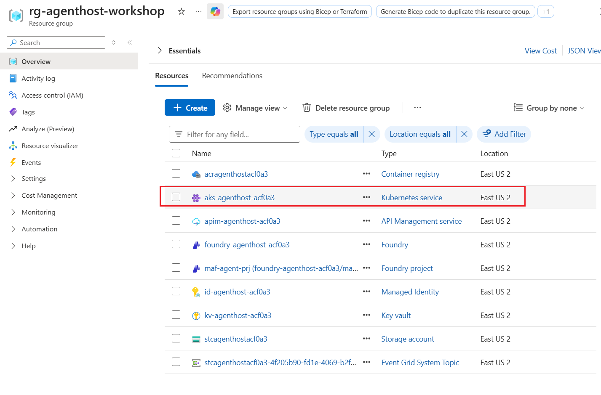
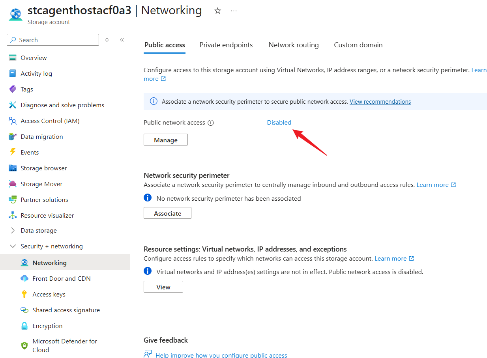
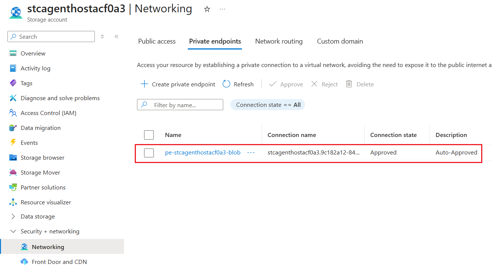
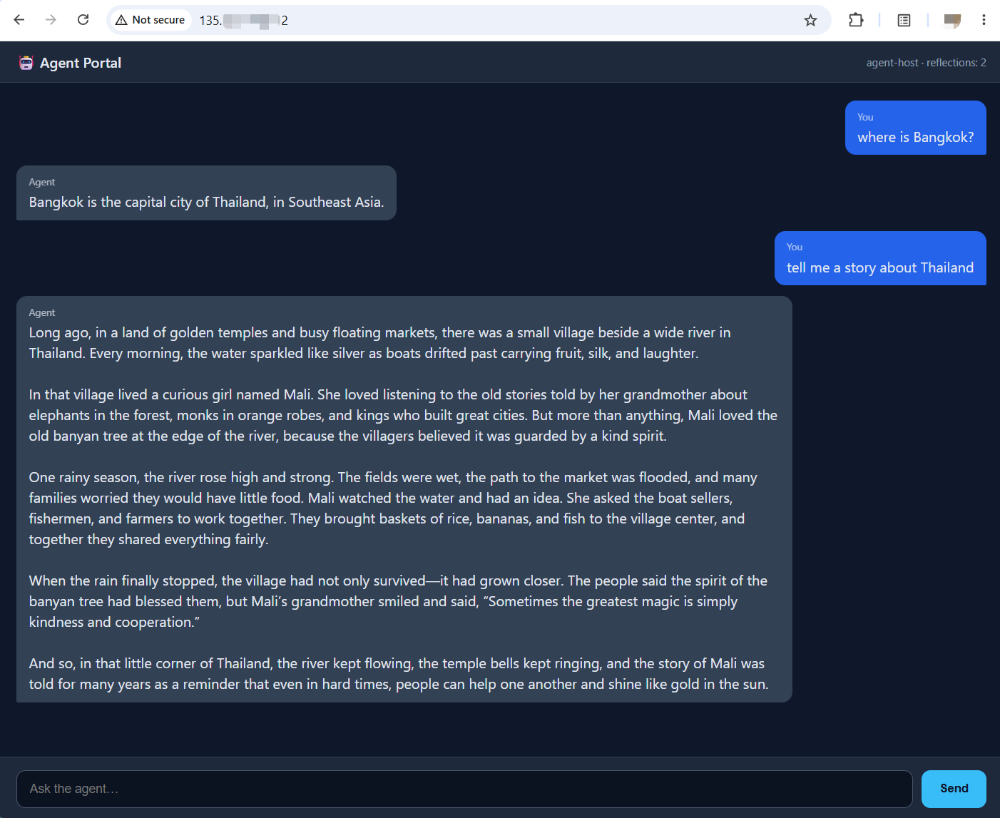
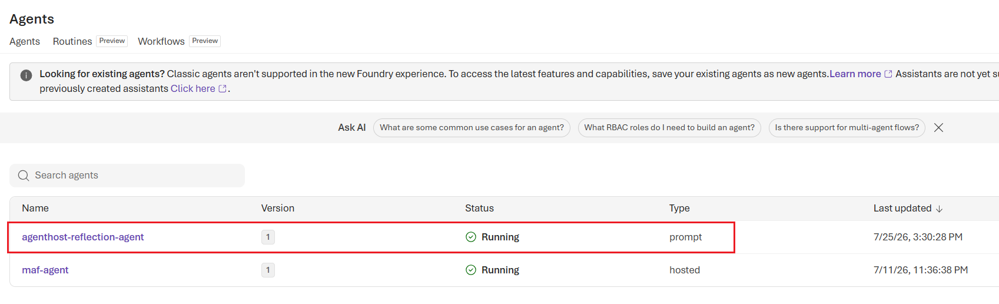
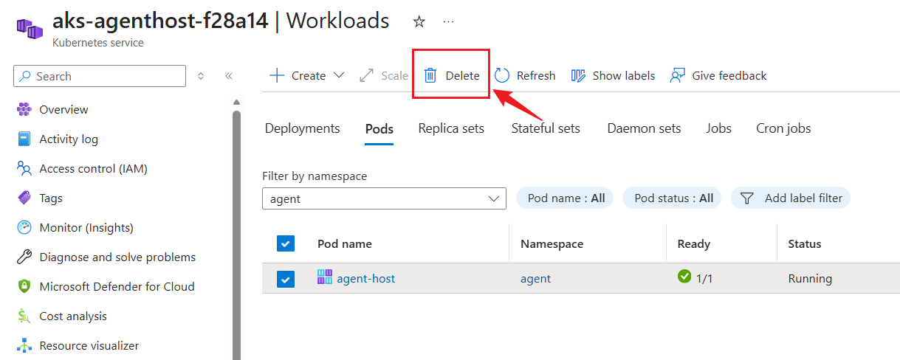
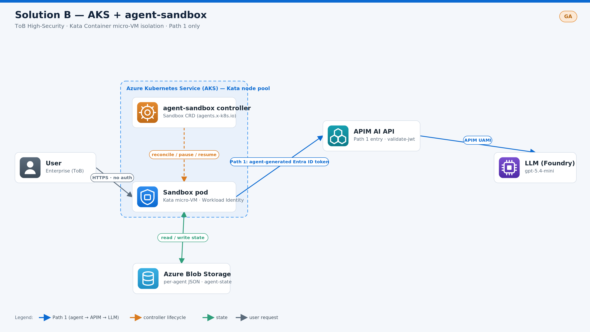

# 模块 3 — 解决方案 B：AKS + agent-sandbox（40 分钟）

[English](README.md)

[⬆ 返回研讨会主页](../readme.md)

## 概述

使用 **Azure Kubernetes Service (AKS)**，在 **Azure Linux** Kata 节点池上通过**官方 AKS Pod Sandboxing** 部署代理。**[agent-sandbox](https://github.com/kubernetes-sigs/agent-sandbox)**（一个 Kubernetes SIG 项目）通过 `Sandbox` 自定义资源管理代理生命周期。这是可控性和可自定义性最高的选项，既支持具有企业特定技术要求的 **ToB** 场景，也支持需要成本和性能优化的 **ToC** 场景。

> [!Note]
> 与解决方案 A 中运行于 Microsoft Foundry 托管环境的托管代理不同，解决方案 B 在 AKS Pod Sandboxing 中托管代理。
>
> **为什么选择 agent-sandbox？** `agent-sandbox` 是一个 CNCF/Kubernetes SIG 项目，提供 `Sandbox` CRD 和控制器，用于管理隔离、有状态、单实例的代理 Pod，并提供**稳定标识**、**持久存储**和**生命周期管理**（创建、暂停、恢复和休眠）。其内置休眠功能提供了本模块使用的缩容到零机制。

本模块**重用模块 1 创建的资源**，而不是重新创建这些资源，并在**同一资源组**中预配 AKS 群集：

| 从模块 1 重用 | 名称模式 | 用途 |
|---|---|---|
| Azure Container Registry | `acragenthost<SN>` | 拉取代理映像（kubelet 的 AcrPull） |
| 用户分配的托管标识 | `id-agenthost-<SN>` | Pod 的 Workload Identity 联合 |
| Azure Blob Storage | `stcagenthost<SN>` | 代理状态存储（每个代理一个 JSON，容器 `agent-state`） |
| API Management | `apim-agenthost-<SN>` | 模型调用的 AI 网关 (`/foundry`) |

`<SN>` 是存储在模块 1 资源组的 `deploymentSN` 标记中的部署后缀。`prepare-agent-sandbox.sh` 会自动读取它。

## 学习目标

- 预配带有 OIDC 颁发者和 Workload Identity 的 AKS，然后在 Azure Linux 节点池上启用 AKS Pod Sandboxing
- 从发布清单安装 `agent-sandbox` 控制器，并将代理作为 `Sandbox` CR 运行
- 将代理连接到模块 1 的 Blob Storage 帐户和 APIM 网关
- 观察 agent-sandbox 生命周期（暂停、恢复和休眠）如何用作缩容到零机制

---

## 先决条件
> [!CAUTION]
> **请从模块根目录 (`agenthost/module-03/`) 运行本 README 中的所有命令。**

- **已部署模块 1**（Blob、APIM、ACR、UAMI）— RG 中存在 `deploymentSN` 标记
- 已安装 `az` 和 `kubectl`，且已登录 Azure CLI (`az login`)
- Azure CLI `2.80.0+`，以支持 AKS Pod Sandboxing
- 有权创建 AKS 群集、节点池、联合标识凭据和角色分配。创建角色分配需要 `Microsoft.Authorization/roleAssignments/write`（例如 **Owner**，或 **Contributor** 加 **Role Based Access Control Administrator**）。
- 有权运行 ACR 快速生成，并将结果推送到模块 1 的 ACR。在注册表上拥有 **Contributor** 即可；自定义角色必须包括 ACR 生成和映像推送操作。

---

## 单命令环境准备

> [!CAUTION]
> **请选择一种准备路径：** 使用此单命令流程，**或者**使用下面的[手动步骤](#manual-steps-equivalent-to-prepare-agent-sandboxsh)。
>
> 两者等效；**请勿**同时运行。

```bash
cd agenthost/module-03
chmod +x prepare-agent-sandbox.sh
./prepare-agent-sandbox.sh
```

准备成功后，`prepare-agent-sandbox.sh` 会打印类似以下内容的输出：
```text
==> Solution B infrastructure prepared. Continue with README: Deploy agent in Sandbox.
    SN            : acf0a3
    AKS           : aks-agenthost-acf0a3
    Namespace     : agent
    Kata pool     : kata (Standard_D4s_v3, AzureLinux, KataVmIsolation)
    agent-sandbox : v0.5.2 (ns agent-sandbox-system)
    ACR           : acragenthostacf0a3.azurecr.io
    APIM          : https://apim-agenthost-acf0a3.azure-api.net/foundry
```

`prepare-agent-sandbox.sh` 完成后，在 Azure 门户中打开资源组，并确认已创建 AKS 群集：


> [!note]
> `prepare-agent-sandbox.sh` 会进行以下关键更改：
>
> 1. 在现有 ACR 中生成代理映像，并将其作为 `agent-host:<IMAGE_TAG>` 推送。生成在 ACR 中运行，因此不需要本地 Docker 守护程序。
> 2. 创建启用了 OIDC、Workload Identity 和 Blob CSI 驱动程序的 AKS 群集。向 kubelet 标识授予 AcrPull，并授予其节点侧 CSI 驱动程序访问现有 Storage 帐户的权限。
> 3. 添加启用了自动缩放且使用 `KataVmIsolation` 的 Azure Linux 节点池。这会提供用于在轻量级 VM 中隔离代理 Pod 的 `kata-vm-isolation` 运行时。
> 4. 安装 `agent-sandbox` CRD 和控制器，它们管理 Sandbox 的创建和生命周期转换，例如运行和挂起状态。
> 5. 为现有 `agent-state` 容器创建 StorageClass、静态 PV 和 PVC，然后呈现 `agent-sandbox.yaml`，其中 PVC 挂载在 `/app/app/data`。该脚本不会部署 Sandbox。


> [!IMPORTANT]
> 为了构造 agent-sandbox 发布清单 URL，`prepare-agent-sandbox.sh` 会将 `AGENT_SANDBOX_VERSION` 设置为一个
> 默认值，该值可能不是最新版本，也可能不适合你的需求。
> 可以将 `AGENT_SANDBOX_VERSION` 值替换为某个发布标记。请从以下位置查看可用值：
> https://github.com/kubernetes-sigs/agent-sandbox/releases。

**下一步：**

- 如果 Storage 帐户已禁用公共网络访问，请继续前往[配置 Blob Private Link](#configure-blob-private-link)。
- 否则，直接前往[在 Sandbox 中部署代理](#deploy-agent-in-sandbox)。

---

<a id="manual-steps-equivalent-to-prepare-agent-sandboxsh"></a>

## 等效于 prepare-agent-sandbox.sh 的手动步骤准备
> [!warning]
> **单命令部署的替代方案：** 仅当选择手动部署路径时才执行这些步骤。
>
> **运行 `./prepare-agent-sandbox.sh` 后请勿再运行这些步骤**。

### 步骤 1 — 检索部署序列号 (SN) 并构造相关环境变量

```bash
RESOURCE_GROUP="rg-agenthost-workshop"
SN=$(az group show --resource-group "$RESOURCE_GROUP" --query "tags.deploymentSN" --output tsv 2>/dev/null | tr -d "\r\n")

ACR_NAME="acragenthost${SN}"
IDENTITY_NAME="id-agenthost-${SN}"
STORAGE_ACCOUNT="stcagenthost${SN}"
APIM_NAME="apim-agenthost-${SN}"
AKS_NAME="aks-agenthost-${SN}"
NAMESPACE="agent"
SERVICE_ACCOUNT="agent-sa"
IMAGE_TAG="latest"
LLM_MODEL="gpt-5.4-mini"
```

### 步骤 2 — 生成映像并将其推送到现有 ACR

```bash
cp agent-src/app/.env.example agent-src/app/.env
sed -i "s|<SN>|${SN}|g" agent-src/app/.env

# Build context is ./agent-src (app + Dockerfile + lifecycle hook).
# ACR builds the image remotely and pushes it to this registry.
az acr build \
  --registry "$ACR_NAME" \
  --image "agent-host:${IMAGE_TAG}" \
  agent-src/
```
> [!tip]
> 代理应用程序位于 [`agent-src/`](./agent-src/README.md)。它是一个简单的反思循环代理，演示了：
> - LLM 终结点配置
> - `Authorization: Bearer` 令牌身份验证
> - Blob 状态持久化和恢复
> - 挂起/休眠/恢复后的恢复
> - 有关本地运行和 API 的详细信息，请参阅其 README。

### 步骤 3 — 部署基线 AKS 群集（重用模块 1 资源）

```bash
az deployment group create \
  --resource-group "$RESOURCE_GROUP" \
  --template-file aks.bicep \
  --parameters \
      location="$(az group show -g "$RESOURCE_GROUP" --query location -o tsv | tr -d "\r\n")" \
      deploymentSN="$SN" \
      aksName="$AKS_NAME" \
      acrName="$ACR_NAME" \
      identityName="$IDENTITY_NAME" \
      storageAccountName="$STORAGE_ACCOUNT" \
      namespace="$NAMESPACE" \
      serviceAccountName="$SERVICE_ACCOUNT"

az aks get-credentials -g "$RESOURCE_GROUP" -n "$AKS_NAME" --overwrite-existing
```

### 步骤 4 — 在 Azure Linux 节点池上启用 AKS Pod Sandboxing

```bash
KATA_NODEPOOL_NAME="kata"
KATA_NODE_VM_SIZE="Standard_D4s_v3"

if az aks nodepool show --resource-group "$RESOURCE_GROUP" --cluster-name "$AKS_NAME" --name "$KATA_NODEPOOL_NAME" --output none 2>/dev/null; then
  echo "    Node pool $KATA_NODEPOOL_NAME already exists; reusing it"
else
  az aks nodepool add \
    --resource-group "$RESOURCE_GROUP" \
    --cluster-name "$AKS_NAME" \
    --name "$KATA_NODEPOOL_NAME" \
    --mode User \
    --node-vm-size "$KATA_NODE_VM_SIZE" \
    --node-count 1 \
    --enable-cluster-autoscaler \
    --min-count 1 \
    --max-count 10 \
    --os-sku AzureLinux \
    --workload-runtime KataVmIsolation \
    --node-taints "kata=true:NoSchedule" \
    --labels "kata-containers=true"
fi
```

添加 Kata 节点池后，运行以下命令以验证运行时类是否可用：

```bash
kubectl get runtimeclass kata-vm-isolation
```

如果已正确启用 AKS Pod Sandboxing，应看到类似以下内容的输出：

```text
NAME                HANDLER   AGE
kata-vm-isolation   kata      7m21s
```


### 步骤 5 — 安装 agent-sandbox 控制器（发布清单）

> [!tip]
> 从 https://github.com/kubernetes-sigs/agent-sandbox/releases 选择一个已发布版本，并使用所选版本在 AKS 中安装 agent-sandbox。

```bash
AGENT_SANDBOX_VERSION="v0.5.2"   # pick a real release tag
kubectl apply -f \
  "https://github.com/kubernetes-sigs/agent-sandbox/releases/download/${AGENT_SANDBOX_VERSION}/sandbox-with-extensions.yaml"

kubectl wait --for=condition=Established crd/sandboxes.agents.x-k8s.io --timeout=2m
kubectl wait --for=condition=Ready pod -l app=agent-sandbox-controller -n agent-sandbox-system --timeout=5m
```
应看到类似以下内容的输出：
```text
namespace/agent-sandbox-system created
customresourcedefinition.apiextensions.k8s.io/sandboxclaims.extensions.agents.x-k8s.io created
customresourcedefinition.apiextensions.k8s.io/sandboxes.agents.x-k8s.io created
customresourcedefinition.apiextensions.k8s.io/sandboxtemplates.extensions.agents.x-k8s.io created
customresourcedefinition.apiextensions.k8s.io/sandboxwarmpools.extensions.agents.x-k8s.io created
serviceaccount/agent-sandbox-controller created
role.rbac.authorization.k8s.io/agent-sandbox-controller created
clusterrole.rbac.authorization.k8s.io/agent-sandbox-controller created
clusterrole.rbac.authorization.k8s.io/agent-sandbox-controller-extensions created
rolebinding.rbac.authorization.k8s.io/agent-sandbox-controller created
clusterrolebinding.rbac.authorization.k8s.io/agent-sandbox-controller created
clusterrolebinding.rbac.authorization.k8s.io/agent-sandbox-controller-extensions created
service/agent-sandbox-controller created
service/agent-sandbox-webhook-service created
deployment.apps/agent-sandbox-controller created
customresourcedefinition.apiextensions.k8s.io/sandboxes.agents.x-k8s.io condition met
pod/agent-sandbox-controller-76885c8b6c-cmgpp condition met
```

### 步骤 6 — 为 APIM 和模型创建运行时机密

```bash
kubectl create namespace "$NAMESPACE" --dry-run=client -o yaml | kubectl apply -f -

kubectl create secret generic agent-config -n "$NAMESPACE" \
  --from-literal=storage-account="$STORAGE_ACCOUNT" \
  --from-literal=blob-container="agent-state" \
  --from-literal=apim-endpoint="https://${APIM_NAME}.azure-api.net/foundry" \
  --from-literal=llm-model="$LLM_MODEL" \
  --dry-run=client -o yaml | kubectl apply -f -
```

### 步骤 7 — 配置 Blob CSI 持久性并准备 Sandbox 清单

```bash
KUBELET_CLIENT_ID=$(az aks show -g "$RESOURCE_GROUP" -n "$AKS_NAME" \
  --query identityProfile.kubeletidentity.clientId -o tsv | tr -d "\r\n")

sed "s|<RESOURCE_GROUP>|${RESOURCE_GROUP}|g; s|<STORAGE_ACCOUNT>|${STORAGE_ACCOUNT}|g; s|<KUBELET_CLIENT_ID>|${KUBELET_CLIENT_ID}|g; s|<NAMESPACE>|${NAMESPACE}|g" \
  agent-storage.yaml.example > agent-storage.yaml

kubectl apply -f agent-storage.yaml
kubectl wait --for=jsonpath='{.status.phase}'=Bound pvc/agent-state \
  --namespace "$NAMESPACE" --timeout=2m

IDENTITY_CLIENT_ID=$(az identity show -g "$RESOURCE_GROUP" -n "$IDENTITY_NAME" --query clientId -o tsv | tr -d "\r\n")

cp agent-sandbox.yaml.example agent-sandbox.yaml

sed "s|<ACR_NAME>|${ACR_NAME}|g; s|<IMAGE_TAG>|${IMAGE_TAG}|g; s|<NAMESPACE>|${NAMESPACE}|g; s|<IDENTITY_CLIENT_ID>|${IDENTITY_CLIENT_ID}|g" \
  agent-sandbox.yaml > agent-sandbox.yaml.tmp && mv agent-sandbox.yaml.tmp agent-sandbox.yaml
```

**下一步：**

- 如果 Storage 帐户已禁用公共网络访问，请继续前往[配置 Blob Private Link](#configure-blob-private-link)。
- 否则，直接前往[在 Sandbox 中部署代理](#deploy-agent-in-sandbox)。

---
<a id="configure-blob-private-link"></a>

## 配置 Blob Private Link（当 Storage 帐户公共网络访问被禁用时需要）

**仅当模块 1 Storage 帐户已禁用公共网络访问时，才需要此部分。**
**Azure Policy 可能会在你的环境中强制执行此 Storage 帐户设置。**

> [!tip]
>
> 若要检查 Storage 帐户是否已禁用公共网络访问，请在 Azure 门户中打开
> Storage 帐户并选择 **Networking**。**Public network access**
> 设置会显示其当前状态：
>

如果 Storage 帐户已禁用公共网络访问，则在代理可以读取或写入其持久化状态之前，AKS 托管 VNet 需要与 Blob 终结点建立专用连接。

运行以下脚本，在 AKS 托管 VNet 和 Storage 帐户之间建立专用连接：

```bash
chmod +x deploy-storage-private-link.sh
./deploy-storage-private-link.sh
```

该脚本可能会要求你确认它是否检测到正确的 AKS 托管 VNet：
```
    AKS vnetSubnetId is null (expected for AKS-managed VNet). Discovering VNet in node resource group...
    No VNET_NAME input provided.
    First VNet in rg-aks-agenthost-acf0a3-nodes: aks-vnet-39076840
Continue with this VNet? [y/N]: y
```
在 **AKS 节点资源组**中验证 VNet 名称。如果检测到的 VNet 正确，请输入 **y** 继续。否则，输入 **N** 停止脚本，然后再次运行脚本并显式指定 VNet 名称：

```bash
VNET_NAME=<aks-vnet-name> ./deploy-storage-private-link.sh
```

> [!note]
> `deploy-storage-private-link.sh` 会进行以下关键更改：
>
> 1. 如果 AKS 托管 VNet 中还没有专用 Private Endpoint 子网，则创建一个。该脚本选择可用且不重叠的 `/24` 地址范围，并在该子网上禁用 Private Endpoint 网络策略。
> 2. 为现有 Storage 帐户创建 Blob Private Endpoint，以及 `privatelink.blob.core.windows.net` Private DNS 区域、VNet 链接和 DNS 区域组。
> 3. 将来自 AKS VNet 的 Blob CSI 节点流量通过 Private Endpoint 路由。CSI 驱动程序继续使用标准 `https://<storage-account>.blob.core.windows.net` 主机名，该主机名通过 Private DNS 解析为专用 IP。
>
> VNet 和子网保留在 **AKS 节点资源组**中。Private Endpoint 和 Private DNS 资源创建在**研讨会资源组**中。


**`deploy-storage-private-link.sh` 成功完成后的预期输出：**

```text
    Auto-selected subnet prefix for snet-private-endpoints: 10.225.0.0/24
==> Deploying Blob Private Link
    Workshop RG : rg-agenthost-workshop
    Node RG     : rg-aks-agenthost-acf0a3-nodes
    VNet        : aks-vnet-39076840
    PE subnet   : snet-private-endpoints (10.225.0.0/24)
    Storage     : stcagenthostacf0a3
A new Bicep release is available: v0.46.1. Upgrade now by running "az bicep upgrade".
Name                         State      Timestamp                         Mode         ResourceGroup
---------------------------  ---------  --------------------------------  -----------  ---------------------
storage-private-link-acf0a3  Succeeded  2026-09-05T16:49:31.354280+00:00  Incremental  rg-agenthost-workshop
==> Blob Private Link deployed. Storage clients in the AKS VNet now resolve the Blob endpoint to the Private Endpoint IP.
```
在 Azure 门户中打开 Storage 帐户，并确认已添加 Private Endpoint：


> [!note]
> 该脚本在 AKS 托管 VNet 中创建子网，然后
> 在研讨会资源组 `$RESOURCE_GROUP` 中部署 Private Endpoint 和 Private DNS 资源。
> 
> Blob CSI 驱动程序继续使用
> `https://<storage-account>.blob.core.windows.net`；在 AKS VNet 内部，Private DNS 将该
> 主机名解析为 Private Endpoint IP。
>
> 该脚本自动从 VNet 地址空间中选择可用的 `/24` CIDR 块，
> 并为 Private Endpoint 创建子网。

---
<a id="deploy-agent-in-sandbox"></a>

## 在 Sandbox 中部署代理

基础设施、存储、网络和 Sandbox 清单准备就绪后，部署代理并检查生成的 Sandbox 和 Pod：

```bash
export NAMESPACE="${NAMESPACE:-agent}"

kubectl apply -f agent-sandbox.yaml

kubectl wait --for=condition=Ready pod -l app=agent-host -n "$NAMESPACE" --timeout=3m
```

---
<a id="verify"></a>

## 验证

运行以下命令，验证 Sandbox 及其 Pod 是否就绪，以及控制器是否正在运行：

```bash
export NAMESPACE="agent"

# The Sandbox CR and its pod
kubectl get sandbox,pods -n "$NAMESPACE"
kubectl wait --for=condition=Ready pod -l app=agent-host -n "$NAMESPACE" --timeout=3m

# Controller
kubectl get pods -n agent-sandbox-system
```

**预期输出：**

```text
NAME                                 READY   REASON              AGE
sandbox.agents.x-k8s.io/agent-host   True    DependenciesReady   5m2s

NAME             READY   STATUS    RESTARTS   AGE
pod/agent-host   1/1     Running   0          5m1s

pod/agent-host condition met

NAME                                        READY   STATUS    RESTARTS   AGE
agent-sandbox-controller-76885c8b6c-gjbk7   1/1     Running   0          117m
```
### 验证代理是否正常工作

运行以下命令：

```bash
kubectl get all -n "$NAMESPACE"
```

**预期输出：**

```text
NAME             READY   STATUS    RESTARTS   AGE
pod/agent-host   1/1     Running   0          10m

NAME                    TYPE           CLUSTER-IP    EXTERNAL-IP     PORT(S)        AGE
service/agent-host      ClusterIP      None          <none>          <none>         10m
service/agent-host-lb   LoadBalancer   10.0.164.26   135.**.**.251   80:32234/TCP   10m
```
在浏览器中打开 `http://<EXTERNAL-IP>`。应出现聊天窗口。提出几个问题以确认代理正常工作：

> [!tip]
> **请确保 URL 包含 `http://`。否则，浏览器可能会默认使用 HTTPS，而本研讨会代理尚未实现 HTTPS。***



### 验证聊天历史记录已持久化到 Blob

进行几轮聊天后，验证对话状态是否作为 `agent-host.json` 持久保存在
`agent-state` Blob 容器中。

Blob 容器挂载在 Sandbox Pod 中的 `/app/app/data`，因此可以
直接从 Pod 检查持久化状态。首先，标识代理 Pod
并列出挂载卷中的文件：

```bash
AGENT_POD=$(kubectl get pod -n "$NAMESPACE" -l app=agent-host \
  -o jsonpath='{.items[0].metadata.name}')

kubectl exec -n "$NAMESPACE" "$AGENT_POD" -- ls -l /app/app/data
```

**预期输出：**

```text
total 0
-rwxrwxrwx 1 root root 1970 Sep  8 17:53 agent-host.json
```

接下来，检查完整的持久化状态：

```bash
kubectl exec -n "$NAMESPACE" "$AGENT_POD" -- \
  cat /app/app/data/agent-host.json | \
  jq .
```

**预期输出：**

```json
{
  "agent_id": "agent-host",
  "created_at": "2026-09-08T17:45:15.581359+00:00",
  "resumed_at": "2026-09-08T17:45:15.581373+00:00",
  "reflection_count": 2,
  "history": [
    {
      "query": "where is Bangkok?",
      "response": "Bangkok is the capital city of Thailand, in Southeast Asia.",
      "timestamp": "2026-09-08T17:53:23.107278+00:00"
    },
    {
      "query": "tell me a story about Thailand",
      "response": "Long ago, in a land of golden temples and busy floating markets, there was a small village beside a wide river in Thailand. Every morning, the water sparkled like silver as boats drifted past carrying fruit, silk, and laughter.\n\nIn that village lived a curious girl named Mali. She loved listening to the old stories told by her grandmother about elephants in the forest, monks in orange robes, and kings who built great cities. But more than anything, Mali loved the old banyan tree at the edge of the river, because the villagers believed it was guarded by a kind spirit.\n\nOne rainy season, the river rose high and strong. The fields were wet, the path to the market was flooded, and many families worried they would have little food. Mali watched the water and had an idea. She asked the boat sellers, fishermen, and farmers to work together. They brought baskets of rice, bananas, and fish to the village center, and together they shared everything fairly.\n\nWhen the rain finally stopped, the village had not only survived-it had grown closer. The people said the spirit of the banyan tree had blessed them, but Mali's grandmother smiled and said, \"Sometimes the greatest magic is simply kindness and cooperation.\"\n\nAnd so, in that little corner of Thailand, the river kept flowing, the temple bells kept ringing, and the story of Mali was told for many years as a reminder that even in hard times, people can help one another and shine like gold in the sun.",
      "timestamp": "2026-09-08T17:53:37.655865+00:00"
    }
  ],
  "last_updated": "2026-09-08T17:53:37.655888+00:00"
}
```

### 验证代理在沙盒中运行

运行以下命令，确认 Pod 正在运行时类为 **`kata-vm-isolation`** 的 Sandbox 中运行：

```bash
kubectl describe pod/agent-host -n "$NAMESPACE"
```

**预期输出：**

```text
Name:                agent-host
Namespace:           agent
Priority:            0
Runtime Class Name:  kata-vm-isolation
Service Account:     agent-sa
Node:                aks-kata-75222809-vmss00000a/10.224.0.19
Start Time:          Tue, 21 Jul 2026 00:43:13 +0800
Labels:              agents.x-k8s.io/sandbox-name-hash=03e7e68b
                     app=agent-host
                     azure.workload.identity/use=true
                     component=agent-runtime
                     topology.kubernetes.io/region=eastus2
                     topology.kubernetes.io/zone=0
Annotations:         agents.x-k8s.io/propagated-labels: app,azure.workload.identity/use,component
Status:              Running
IP:                  10.224.0.30
IPs:
  IP:           10.224.0.30
Controlled By:  Sandbox/agent-host
Containers:
  agent-host:
    Container ID:   containerd://a8619d5c5b9eef8906c84d864e9eb6a037882b14b6e7b7a4f2b23010826d5ec3
    Image:          ......
```

### 验证 Pod Sandboxing 内核隔离

在沙盒化的代理 Pod 内使用 `uname -r`，确认它使用
AKS Pod Sandboxing 运行时。然后将其内核与群集上普通 Pod 的内核进行比较。

```bash
AGENT_POD=$(kubectl get pod -n "$NAMESPACE" -l app=agent-host -o jsonpath='{.items[0].metadata.name}')
kubectl exec -it -n "$NAMESPACE" "$AGENT_POD" -- uname -r
```

**预期输出：**

```text
6.6.137.mshv1-1.azl3
```

`mshv1` 后缀表示针对 Microsoft Hyper-V 优化的内核。在 Azure Sandbox 环境中，此内核通常用作隔离 VM 内的来宾 OS 内核。

或者，运行一个不使用 `kata-vm-isolation` 的普通 Pod 进行比较：

```bash
cat <<EOF | kubectl apply -f -
apiVersion: v1
kind: Pod
metadata:
  name: normal-pod
  namespace: ${NAMESPACE}
spec:
  restartPolicy: Never
  containers:
    - name: normal
      image: mcr.microsoft.com/aks/fundamental/base-ubuntu:v0.0.11
      command: ["/bin/sh", "-ec", "sleep 3600"]
EOF

kubectl wait --for=condition=Ready pod/normal-pod -n "$NAMESPACE" --timeout=2m
kubectl exec -it -n "$NAMESPACE" normal-pod -- uname -r
```

**预期输出：**

```text
6.8.0-1059-azure
```

**清理：**

```bash
kubectl delete pod normal-pod -n "$NAMESPACE"
```
> [!tip]
> 如果代理 Pod 报告的内核与普通 Pod 不同，并且使用 `runtimeClassName: kata-vm-isolation`，即可确认工作负载正在 AKS Pod Sandboxing 内运行。

<!-- ### 验证代理是否在 Foundry 中注册为“prompt”代理

在 Foundry 门户中打开 Foundry 项目并转到 **Agents** 选项卡。代理
`agenthost-reflection-agent`（在 `.env` 中定义）应已成功注册，其
类型为 `prompt`：

 -->

### 验证代理在恢复后重新加载其状态

在 Azure 门户中打开 AKS 群集，转到 **Workloads**，选择代理 Pod，然后单击 **Delete**：


在浏览器中刷新代理聊天窗口。Pod 重启期间，代理会暂时不可用。
Pod 恢复运行后，再次刷新页面。之前的聊天历史记录应已还原。

### 生命周期（空闲挂起/恢复模型）

Sandbox 清单设置了 `spec.operatingMode: Running` 和 `spec.service: true`。
`operatingMode` 控制 Sandbox 生命周期：

- 将其修补为 `Suspended`，可将后备 Pod 缩容到零，同时保留
  Sandbox 对象及其稳定的 Service。
- 流量恢复时，将其修补回 `Running`。

<details>
<summary><strong>此处为何未启用自动挂起/恢复</strong></summary>

`Sandbox` CRD 提供 `Running` / `Suspended` 状态转换，但它
不提供 `idleTimeout` 字段，无法检查应用程序请求，
也无法确定用户会话何时变为空闲。当前的公共 `LoadBalancer` Service
还会将流量直接路由到代理 Pod。当该 Pod 挂起时，Service 没有
就绪终结点，无法保留请求、修补 Sandbox、等待启动，然后重试
该请求。因此，仅使用 Sandbox 清单无法实现
“空闲 15 分钟，然后在下一个 HTTP 请求到达时唤醒”的行为。

KEDA 可用于根据指标缩放 Deployment 或 `SandboxWarmPool` 容量，
但它本身无法实现此单实例代理所需的按 Sandbox 会话路由和
转发前唤醒行为。

</details>

<details>
<summary><strong>实际实现</strong></summary>

生产实现会在 Sandbox 前放置一个始终运行的网关，
并添加空闲清理程序。浏览器调用网关，而不是直接调用
Sandbox LoadBalancer。网关和清理程序使用 Kubernetes RBAC，
对相关 Sandbox 资源拥有 `get`、`watch` 和 `patch` 权限。

控制流如下：

1. 网关记录每个 Sandbox 上次完成请求的时间。
  将此信息存储在代理 Pod 之外，例如 Redis 或数据库中，
  因为 Pod 挂起时会消失。
2. 空闲清理程序定期查找没有活动请求且
   15 分钟内无流量的 Sandbox，然后将 `spec.operatingMode` 修补为 `Suspended`。
3. agent-sandbox 控制器终止后备 Pod，同时保留
  Sandbox 对象及其稳定的 Service。本研讨会的对话状态
  已持久保存在 Blob Storage 中。
4. 新流量到达时，网关解析目标 Sandbox。如果它
   已挂起，网关会将 `operatingMode` 修补为 `Running`，并保留
   传入请求。
5. 网关监视 Sandbox，直到 `Ready=True`，然后将保留的
  请求转发到 `status.serviceFQDN`。如果启动时间超过配置的超时，
  网关将返回可重试的 `503` 响应。
6. 实现必须序列化并发唤醒请求，并在挂起前立即重新检查
   活动请求数，以免清理程序在请求运行时挂起 Sandbox。

对于更大规模的平台，`SandboxTemplate`、`SandboxClaim` 和 `SandboxWarmPool`
可以减少冷启动延迟。网关仍负责会话路由、空闲检测、
请求保留和按流量唤醒行为。

</details>

#### 研讨会简化方案

为使本研讨会专注于 Sandbox 生命周期和状态恢复，它
不会部署自定义网关、活动存储或空闲清理控制器。我们使用
手动修补来表示这些组件会执行的两个操作：

1. 15 分钟无用户流量后，空闲清理程序会将
   Sandbox 修补为 `Suspended`。
2. 下一个用户请求到达时，网关会将 Sandbox 修补回
   `Running`，等待 `Ready=True`，然后将请求代理到稳定的
   Sandbox Service。

运行等效的手动挂起和恢复命令：

**运行：**

```bash
# Suspend after an idle period (the workshop target is 15 minutes)
kubectl patch sandbox agent-host -n "$NAMESPACE" --type merge \
  -p '{"spec":{"operatingMode":"Suspended"}}'
```

检查 Pod、Service 和 Sandbox：

```bash
kubectl get pods -n "$NAMESPACE"
kubectl get all -n "$NAMESPACE"
kubectl get sandbox -n "$NAMESPACE"
```

**预期输出：**

```text
No resources found in agent namespace.

NAME                    TYPE           CLUSTER-IP    EXTERNAL-IP     PORT(S)        AGE
service/agent-host      ClusterIP      None          <none>          <none>         62m
service/agent-host-lb   LoadBalancer   10.0.164.26   135.**.**.251   80:32234/TCP   62m

NAME         READY   REASON             AGE
agent-host   False   SandboxSuspended   62m
```
输出表示：
1. Pod 已停止。
2. Service 得以保留。
3. Sandbox 状态为 `False/SandboxSuspended`，表示它尚未就绪。

如果在浏览器中刷新 Agent Chat UI，它将无法访问。
如果在 AKS 门户中刷新 **Workloads -> Pods**，代理 Pod `agent-host` 会消失。

接下来，恢复 Pod 和 Sandbox，以模拟流量回归：

**运行：**

```bash
# Resume when traffic returns
kubectl patch sandbox agent-host -n "$NAMESPACE" --type merge \
  -p '{"spec":{"operatingMode":"Running"}}'

kubectl wait sandbox agent-host -n "$NAMESPACE" --for=condition=Ready --timeout=180s
```

**预期输出：**

```text
sandbox.agents.x-k8s.io/agent-host patched
sandbox.agents.x-k8s.io/agent-host condition met
```

再次检查 Pod、Service 和 Sandbox 状态：

```bash
kubectl get pods -n "$NAMESPACE"
kubectl get all -n "$NAMESPACE"
kubectl get sandbox -n "$NAMESPACE"
```

**预期输出：**

```text
NAME         READY   STATUS    RESTARTS   AGE
agent-host   1/1     Running   0          2m30s

NAME             READY   STATUS    RESTARTS   AGE
pod/agent-host   1/1     Running   0          2m38s

NAME                    TYPE           CLUSTER-IP    EXTERNAL-IP     PORT(S)        AGE
service/agent-host      ClusterIP      None          <none>          <none>         70m
service/agent-host-lb   LoadBalancer   10.0.164.26   135.**.**.251   80:32234/TCP   70m

NAME         READY   REASON              AGE
agent-host   True    DependenciesReady   71m
```
输出表示：
1. Pod 已恢复并正在运行。
2. Service 正在运行且状态正常。
3. Sandbox 状态为 `True/DependenciesReady`。

> [!tip]
> 如果在浏览器中刷新 Agent Chat UI，它应再次可用，并恢复之前的**聊天历史记录**。


随时可以使用以下命令检查 Sandbox 生命周期状态：

```bash
# Inspect the Sandbox status / lifecycle fields
kubectl describe sandbox agent-host -n "$NAMESPACE"
```
> [!tip]
> 有关 agent-sandbox 代理生命周期管理的更多详细信息，请参阅 [agent-sandbox 文档](https://agent-sandbox.sigs.k8s.io/docs/)，了解暂停/恢复、计划删除和 `SandboxWarmPool` 模式。

---

## 体系结构

- AKS 在 Azure Linux Kata 节点池上运行代理，通过 `kata-vm-isolation` 提供 Pod 级微型 VM 隔离。
- `agent-sandbox` 控制器管理有状态代理 Pod、稳定的服务标识以及挂起/恢复生命周期。
- Workload Identity 提供无密码访问，Blob CSI 挂载持久状态，APIM 则将模型请求路由到 Foundry。
- 重用模块 01 资源，包括 ACR、托管标识、Blob Storage、APIM 和 Foundry 模型。



---

## 演示

https://github.com/user-attachments/assets/7dd698c4-7eb4-49f6-afea-3b413d69d991

---

## 本模块中的文件

| 文件 | 说明 |
|---|---|
| `prepare-agent-sandbox.sh` | 环境准备：读取 SN，重用模块 1 ACR/UAMI/Storage/APIM 资源，生成 `agent-src/` 映像，预配基线 AKS 群集，启用 AKS Pod Sandboxing，安装 agent-sandbox，配置 Blob CSI 持久性，并呈现 Sandbox 清单但不进行部署。 |
| `aks.bicep` | 基线 AKS 群集定义。它启用 Blob CSI，为 kubelet 标识配置 AcrPull 和 Blob 数据访问，并创建应用程序 UAMI 联合凭据。AKS Pod Sandboxing 节点池由 `prepare-agent-sandbox.sh` 添加。 |
| `deploy-storage-private-link.sh` | 可选的 AKS 后包装器，用于发现 AKS 托管 VNet、创建专用 Private Endpoint 子网并部署 Blob Private Link Bicep 模板。 |
| `storage-private-link.bicep` | 研讨会资源组中的可选 Blob Private Endpoint、Private DNS 区域、VNet 链接和 DNS 区域组。 |
| `agent-storage.yaml.example` | Blob CSI StorageClass、静态 PV 和命名空间范围 PVC 的模板，由现有 `agent-state` 容器提供支持。 |
| `agent-storage.yaml` | 由 `prepare-agent-sandbox.sh` 生成，其中包含 Storage 帐户、资源组、kubelet 标识和命名空间值。 |
| `agent-sandbox.yaml.example` | 清单模板，其中包含 ACR、映像标记、命名空间和标识值的占位符。 |
| `agent-sandbox.yaml` | 在部署期间从 `agent-sandbox.yaml.example` 生成，然后应用它来创建使用 AKS `kata-vm-isolation` 的 ServiceAccount、`Sandbox` CR 和 Service。 |
| `agent-src/` | POC 代理源代码：`app/main.py`（ReflectionAgent HTTP 服务器）、`Dockerfile`、`requirements.txt`、`lifecycle-hook.sh` 和使用说明 `README.md`。这是作为 Sandbox 生成和部署的映像。 |

---

## 后续步骤

继续前往[模块 4 — 解决方案 C：ACA Sandboxes](../module-04/README.md)。

---

[⬆ 返回研讨会主页](../readme.md)
