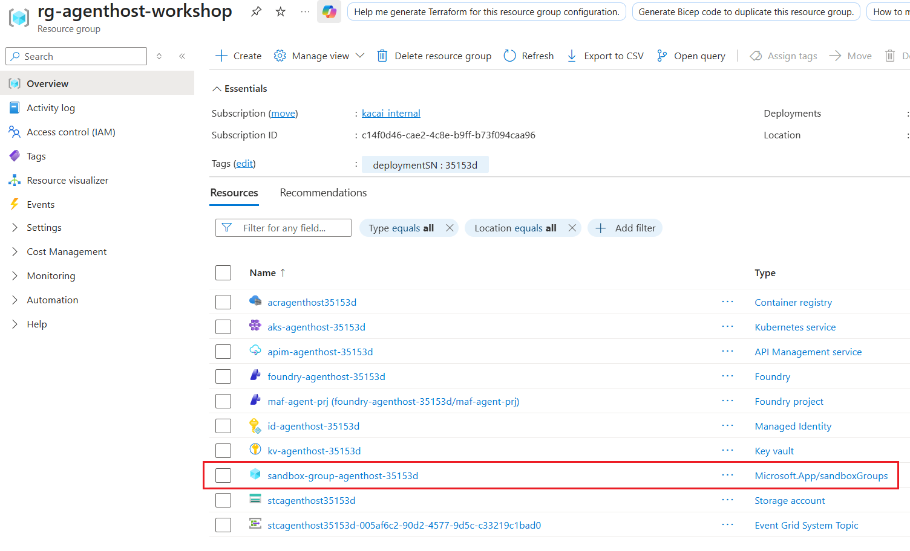
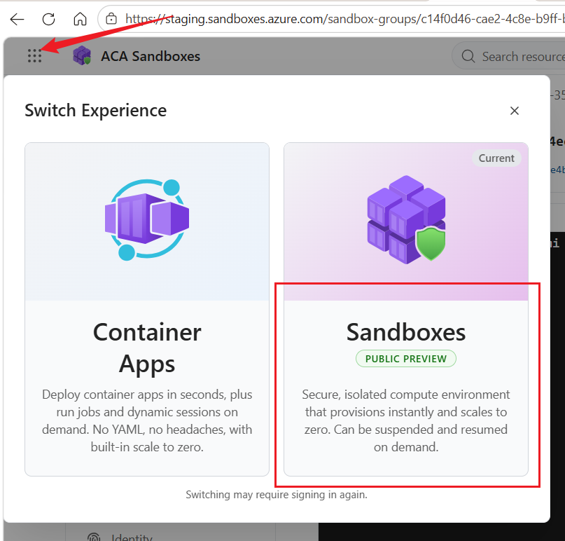
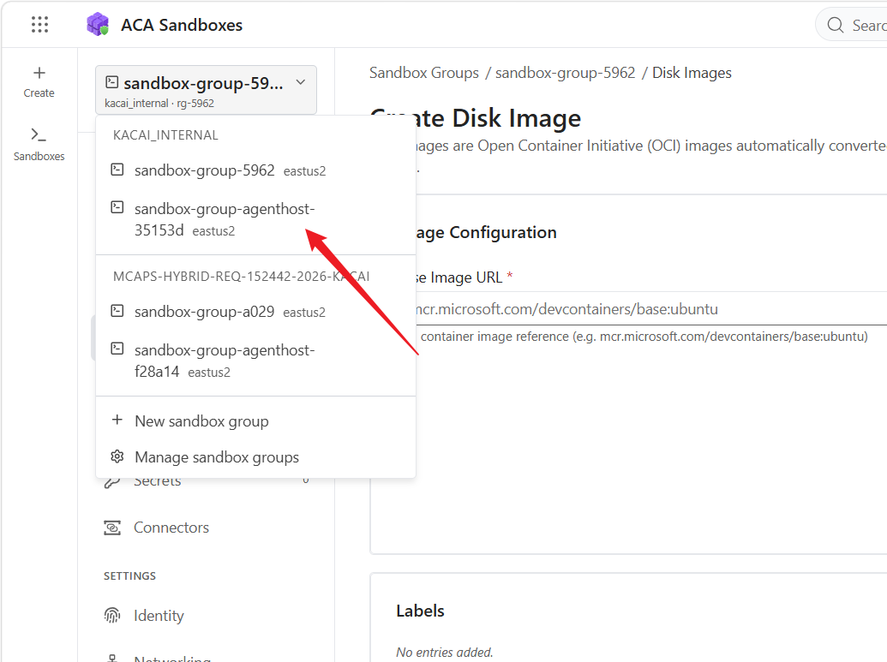
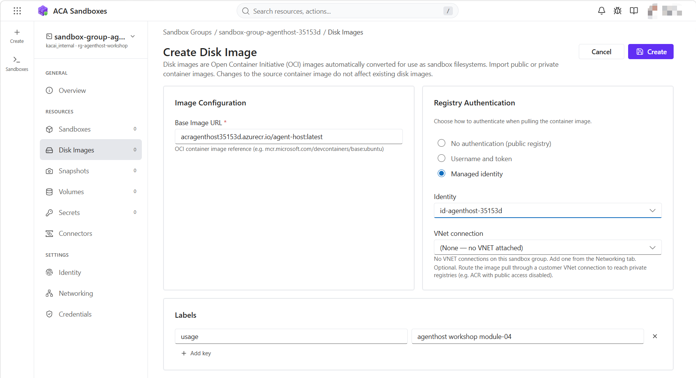
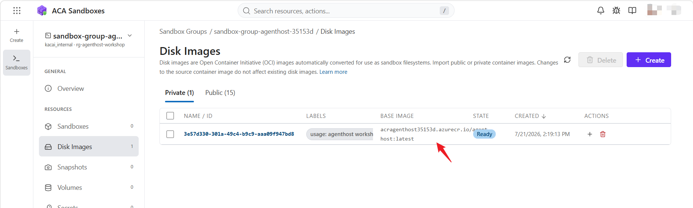
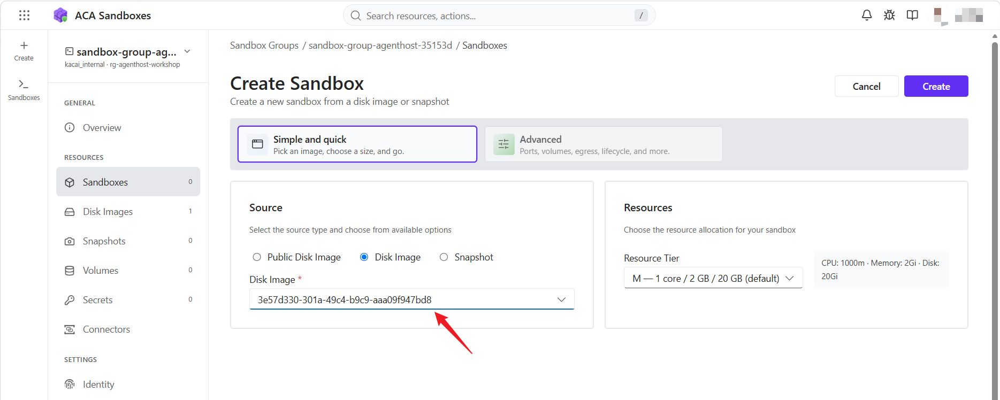
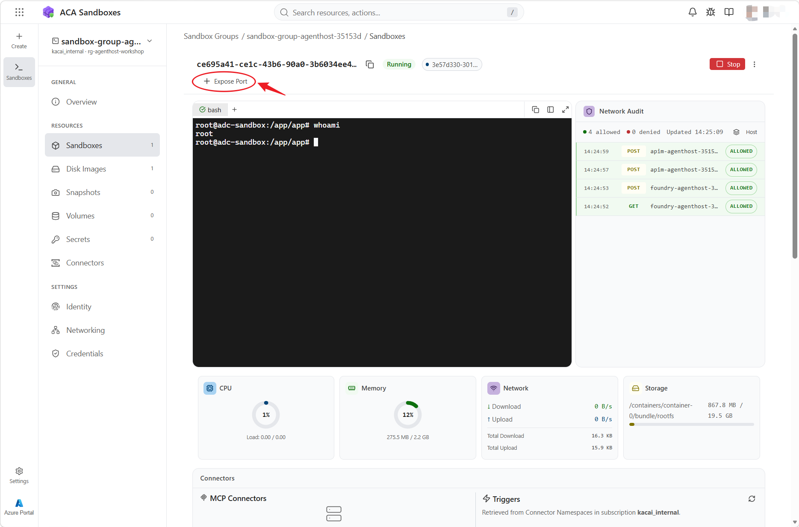
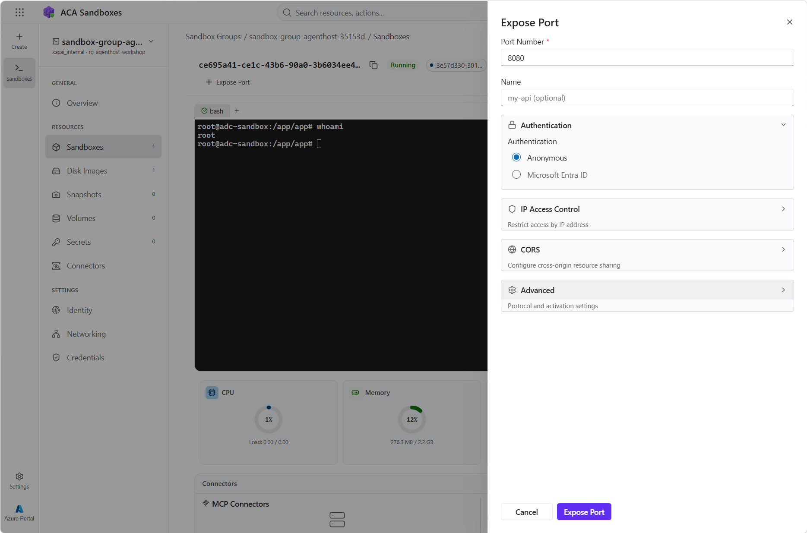
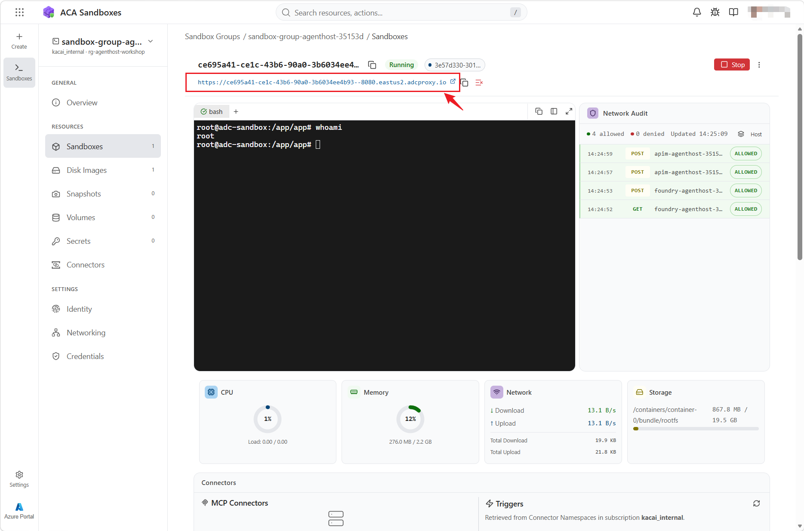
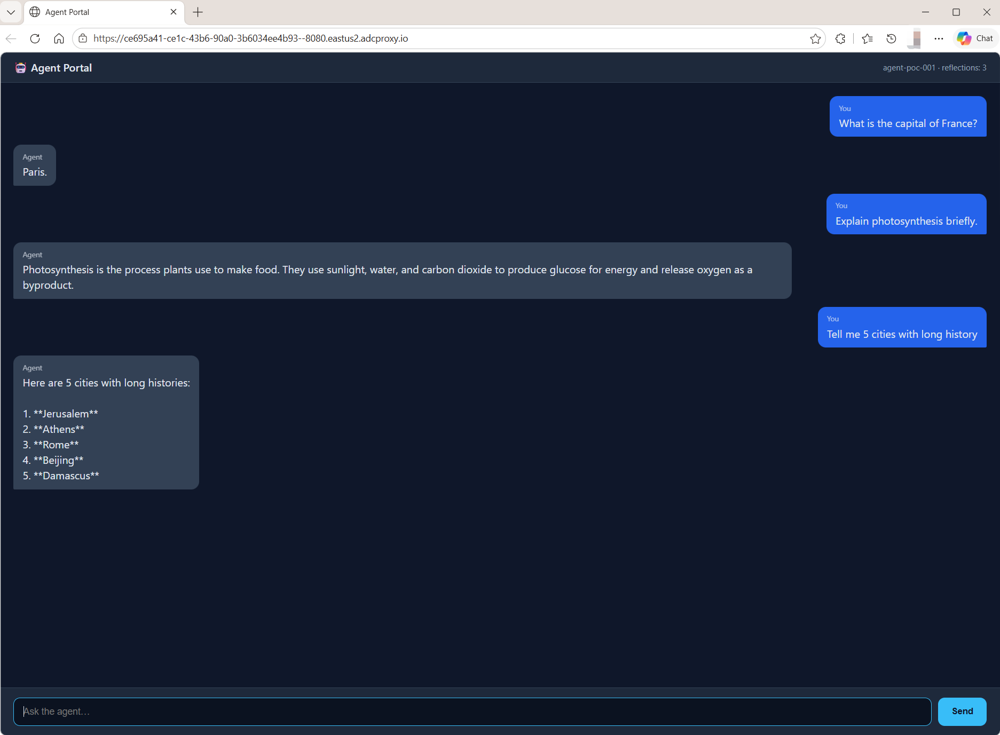

# Module 4 — Solution C: Container-based Agent Runtime (ACA Sandboxes, 20 min)

[⬆ Back to Workshop Home](../readme.md)

## Overview

This module deploys the agent runtime to **Azure Container Apps Sandboxes**, the
container-based hosting model adopted for this workshop. Sandboxes deliver strong
OS-level isolation through gVisor, full lifecycle control
(create, suspend, resume, delete), and snapshot-based state continuity.

> **Primary workshop path:** ACA Sandboxes.
> An optional learning track, **ACA Dynamic Sessions**, appears at the end of this
> module for those who wish to explore an alternative execution model.

---

## Prerequisites

> **Note:** Run all commands in this README from this module's root directory (`agenthost/module-04/`).

1. Module-01 is deployed and the `deploymentSN` tag is present on the resource group.
2. The agent container image built in Module-03 is available for reuse in this module.
3. The Azure CLI is installed.
4. The Container Apps extension is installed and upgraded with preview support enabled:

```bash
az extension add --name containerapp --upgrade --allow-preview true -y
```

5. Your identity holds the `Container Apps SandboxGroup Data Owner` role assignment.

---

## Workshop Path — ACA Sandboxes

### Files

- `sandbox.bicep`
- `sandbox-deploy.sh`

### What It Deploys

- A `Microsoft.App/SandboxGroups` resource (preview)
- SandboxGroup identity and registry bindings
- The `AcrPull` role assignment for the Module-01 UAMI on the ACR (declared in `sandbox.bicep`)
- Optional references to Module-01 storage for state workflows

### Deploy Steps

```bash
cd agenthost/module-04
./sandbox-deploy.sh
```

On completion, the script has provisioned:

- An Azure Container Apps SandboxGroup
- The `AcrPull` role assignment granting the UAMI pull access to the ACR (granted declaratively via `sandbox.bicep`)

In the Azure portal, open your resource group to confirm the SandboxGroup was created. You may need to enable **Show hidden types** in the **Manage view** menu:



Sign in to `https://staging.sandboxes.azure.com/` with your Azure identity and open
the ACA Sandbox portal:



Switch to your sandbox group:



Build a disk image from the container image produced in Module-03:



Once the build completes, the disk image appears in the list:



On the **Sandbox** tab, create a new sandbox from the disk image you just built.
Assign the Module-01 UAMI, which was granted `AcrPull` permission to pull container
images from the ACR:



The sandbox launches within seconds. Use the option at the top of the UI to expose a
port:



Expose port 8080, which the container image publishes:



A hyperlink then appears at the top of the UI. Select it:



The agent chat UI opens in your browser. Submit a few questions to verify the agent is
running correctly:




### Characteristics

- Strong isolation for risky or untrusted workloads
- Full lifecycle control (create, suspend, resume, delete)
- Snapshot-based state continuity
- Preferred when safety and resumability outweigh the simplicity of API pooling

---

<details>
<summary><strong>Optional Learning Track — ACA Dynamic Sessions</strong> (click to expand)</summary>

> This section is **optional**. It is provided for learners who complete the main
> Sandbox path early and want to compare a different Azure Container Apps execution
> model. It is **not required** to complete the workshop.

> [!IMPORTANT]
> **Dynamic Sessions is not an ideal host for running an agent.**
> It is purpose-built to provide **temporary, strongly isolated execution
> environments** — for example, safely running AI-generated or otherwise untrusted
> code. Each session is **ephemeral**: it is allocated on demand, runs a short-lived
> task, and is **destroyed after use with no state retained**. A long-running agent
> typically requires a stable, addressable, stateful runtime — precisely what the
> **Sandbox** workshop path provides. Treat Dynamic Sessions as a **tool the agent
> calls** to execute code safely, not as the place where the agent itself lives.
>
> See the official comparison:
> [Sandboxes vs. Dynamic Sessions](https://learn.microsoft.com/en-us/azure/container-apps/sandboxes-overview#sandboxes-vs-dynamic-sessions).

Dynamic Sessions use prewarmed **session pools** for fast, ephemeral, high-concurrency
execution — a strong fit for short-lived, disposable task runs such as executing
AI-generated code, tool calls, or code interpreters. In an agent architecture, the
agent runs elsewhere (for example, on the Sandbox path) and **offloads risky code
execution** to a Dynamic Session, discarding the session once the task completes.

### Files

- `dynamic-session-deploy.sh`
- `dynamic-session-invoke.sh` (minimal invocation example)

### What It Deploys

- ACA environment for session pool hosting (if missing)
- Custom container session pool via `az containerapp sessionpool create`
- Management endpoint for per-session invocation (`identifier` based routing)

### Deploy

```bash
cd agenthost/module-04
./dynamic-session-deploy.sh
```

### Minimal Invoke Example

```bash
cd agenthost/module-04

# Default: calls /health with identifier=test-session
./dynamic-session-invoke.sh

# Custom identifier
./dynamic-session-invoke.sh user-42

# Custom endpoint and JSON body
ENDPOINT_PATH=/api/projects/demo/openai/v1/responses \
METHOD=POST \
BODY='{"messages":[{"role":"user","content":"hello"}]}' \
./dynamic-session-invoke.sh user-42
```

### Validate

```bash
az containerapp sessionpool list -g rg-agenthost-workshop -o table
```

### When to Explore This

Explore Dynamic Sessions to understand the **secure code-execution** model that an
agent can call as a tool — not as a way to host the agent itself:

- You want to safely run AI-generated or untrusted code in a throwaway environment
- You need strong isolation for a single short task, followed by automatic teardown
- You want fast per-request or per-session allocation from a prewarmed pool
- You explicitly do **not** need to preserve state between runs

> If you need a persistent, addressable, stateful place to run the agent, use the
> **Sandbox** workshop path instead.

</details>

---

## Sandbox vs Dynamic Sessions (Reference)

| Aspect | ACA Sandboxes (workshop path) | ACA Dynamic Sessions (optional) |
|---|---|---|
| Runtime | `Microsoft.App/SandboxGroups` | Session Pools |
| Isolation | gVisor OS-level | Session-level isolated containers |
| State | Stateful via snapshots | Ephemeral — destroyed after use, no state retained |
| Lifecycle | create/suspend/resume/delete | pool-managed, cooldown-based auto-teardown |
| Primary purpose | Hosting an isolated, resumable agent runtime | Temporary secure execution of untrusted / AI-generated code |
| Ideal for hosting an agent? | Yes | No — use it as a tool the agent calls |
| Best for | Isolation + resumability | Fast ephemeral, disposable code execution |

---

## Notes

- `container-app.yaml` is a legacy standard ACA manifest and is not used by the current scripts.
- The Sandbox workshop path reuses the agent container image built in Module-03, which already contains its own `lifecycle-hook.sh` (invoked via a Kubernetes `preStop` hook in Module-03).
- `Dockerfile` in this module is used only by the optional Dynamic Sessions track (`dynamic-session-deploy.sh`).

---

## Next Step

Proceed to [Module 5 — Wrap-up and Q&A](../module-05/README.md).

---

[⬆ Back to Workshop Home](../readme.md)
