# Module 4 — Solution C: Container-based Agent Runtime (ACA Sandboxes, 20 min)

[⬆ Back to Workshop Home](../readme.md)

## Overview

This module deploys the agent runtime to **Azure Container Apps Sandboxes**, the
container-based hosting model adopted for this workshop. Sandboxes provide strong
micro-VM-based isolation and full lifecycle control
(create, suspend, resume, delete), with memory or disk suspend modes for
state continuity.

> **Primary workshop path:** ACA Sandboxes.
> An optional learning track, **ACA Dynamic Sessions**, appears at the end of this
> module for those who wish to explore an alternative execution model.

---

## Prerequisites

> **Note:** Run all commands in this README from this module's root directory (`agenthost/module-04/`).

1. Module-01 is deployed and the `deploymentSN` tag is present on the resource group.
2. The agent container image built in Module-03 is available for reuse in this module.
3. The Azure CLI is installed.
4. The Container Apps extension is installed and upgraded with preview support enabled:

```bash
az extension add --name containerapp --upgrade --allow-preview true -y
```

5. Your identity holds the `Container Apps SandboxGroup Data Owner` role assignment.

---

## Workshop Path — ACA Sandboxes

### Files

- `sandbox.bicep`
- `sandbox-deploy.sh`

### What It Deploys

- A `Microsoft.App/SandboxGroups` resource (preview)
- SandboxGroup identity and registry bindings (assign the Module-01 UAMI to the SandboxGroup)
- The `AcrPull` role assignment for the Module-01 UAMI to pull container images from the ACR (declared in `sandbox.bicep`)
- Optional references to Module-01 storage for state workflows

### Deploy Steps

```bash
cd agenthost/module-04
./sandbox-deploy.sh
```

On completion, the script has provisioned:

- An Azure Container Apps SandboxGroup
- The `AcrPull` role assignment granting the UAMI pull access to the ACR (granted declaratively via `sandbox.bicep`)

In the Azure portal, open your resource group to confirm the SandboxGroup was created:

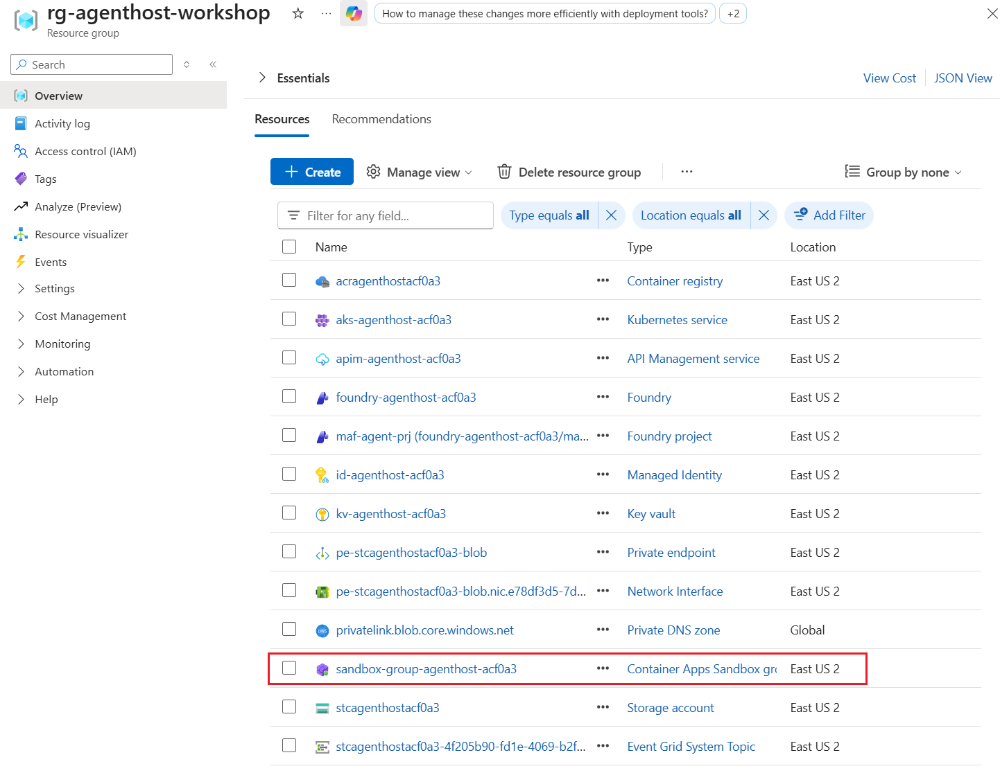

### Optional — Connect the SandboxGroup to Blob through Private Link

> **If the Module-01 Storage account has public network access disabled, or if Azure Policy disables public network access for Storage in your environment, the ACA SandboxGroup must have private network connectivity to the Blob endpoint before the agent can read or write its persisted state.**

For workshop convenience, reuse the AKS-managed VNet discovered in Module-03.
Module-03 already linked this VNet to the Blob Private DNS zone and created the
Blob Private Endpoint. Do not create another Blob Private Endpoint for Module-04.
Instead, create a dedicated subnet for ACA Sandboxes in the same VNet and connect
the SandboxGroup to that subnet:

1. In the Azure portal, open the AKS node resource group and select the
	AKS-managed VNet used in Module-03.
2. Create a new subnet named `aca-subnet`. Use a free, non-overlapping address
	range and keep it separate from both the AKS node subnet and
	`snet-private-endpoints`.

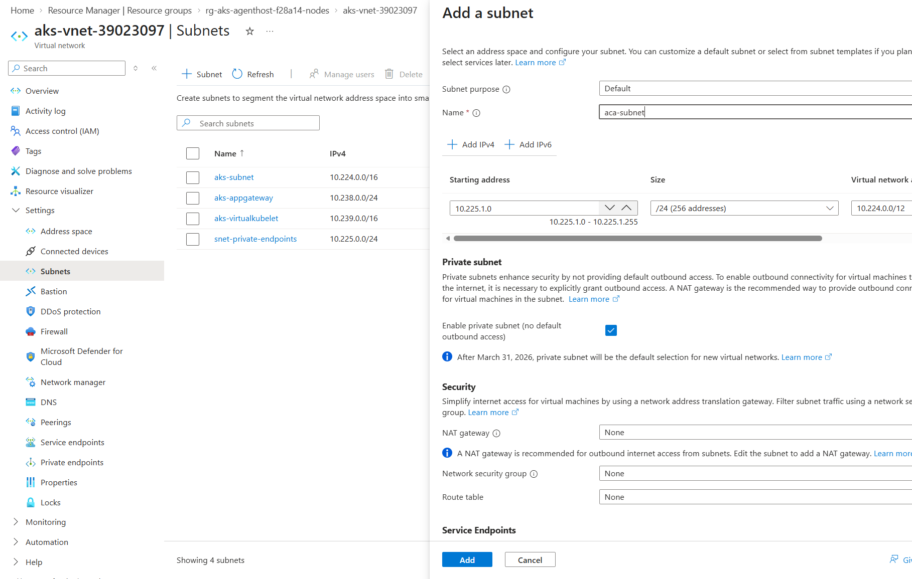

After creating the subnet, you should see `aca-subnet` in the subnet list:
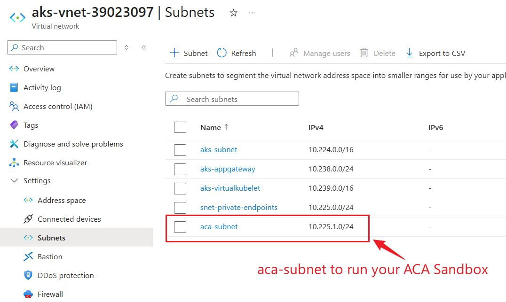

Now delegate the subnet `aca-subnet` to Azure Container Apps so it can be used by a Container Apps environment:
```
$ az network vnet subnet update \
  --resource-group rg-aks-agenthost-f28a14-nodes \
  --vnet-name aks-vnet-39023097 \
  --name aca-subnet \
  --delegations Microsoft.App/environments
```
If the command succeeds, you should see output similar to the following:
```
{
  "addressPrefix": "10.225.1.0/24",
  "defaultOutboundAccess": false,
  "delegations": [
    {
      "actions": [
        "Microsoft.Network/virtualNetworks/subnets/join/action"
      ],
      "etag": "W/\"f2437ea5-8a14-4088-ada3-e8f6f61756ff\"",
      "id": "/subscriptions/8bef68e4-9675-47c4-b4cd-272dea5455a3/resourceGroups/rg-aks-agenthost-f28a14-nodes/providers/Microsoft.Network/virtualNetworks/aks-vnet-39023097/subnets/aca-subnet/delegations/0",
      "name": "0",
      "provisioningState": "Succeeded",
      "resourceGroup": "rg-aks-agenthost-f28a14-nodes",
      "serviceName": "Microsoft.App/environments",
      "type": "Microsoft.Network/virtualNetworks/subnets/delegations"
    }
  ],
  "etag": "W/\"f2437ea5-8a14-4088-ada3-e8f6f61756ff\"",
  "id": "/subscriptions/8bef68e4-9675-47c4-b4cd-272dea5455a3/resourceGroups/rg-aks-agenthost-f28a14-nodes/providers/Microsoft.Network/virtualNetworks/aks-vnet-39023097/subnets/aca-subnet",
  "name": "aca-subnet",
  "privateEndpointNetworkPolicies": "Disabled",
  "privateLinkServiceNetworkPolicies": "Enabled",
  "provisioningState": "Succeeded",
  "resourceGroup": "rg-aks-agenthost-f28a14-nodes",
  "type": "Microsoft.Network/virtualNetworks/subnets"
}

```

Verify the delegation for service "Microsoft.App/environments" is added:
```
$ az network vnet subnet show \
  -g rg-aks-agenthost-f28a14-nodes \
  --vnet-name aks-vnet-39023097 \
  -n aca-subnet \
  --query delegations
```

You should see output similar to the following:
```
[
  {
    "actions": [
      "Microsoft.Network/virtualNetworks/subnets/join/action"
    ],
    "etag": "W/\"f2437ea5-8a14-4088-ada3-e8f6f61756ff\"",
    "id": "/subscriptions/8bef68e4-9675-47c4-b4cd-272dea5455a3/resourceGroups/rg-aks-agenthost-f28a14-nodes/providers/Microsoft.Network/virtualNetworks/aks-vnet-39023097/subnets/aca-subnet/delegations/0",
    "name": "0",
    "provisioningState": "Succeeded",
    "resourceGroup": "rg-aks-agenthost-f28a14-nodes",
    "serviceName": "Microsoft.App/environments",
    "type": "Microsoft.Network/virtualNetworks/subnets/delegations"
  }
]

```
The output must include:
```
[
  {
    "serviceName": "Microsoft.App/environments"
  }
]
```


3. In the ACA Sandbox portal at `https://sandboxes.azure.com/`, open the workshop
	SandboxGroup and connect it to the AKS-managed VNet and `aca-subnet`.

Sign in to `https://sandboxes.azure.com/` with your Azure identity and open the ACA Sandbox portal:

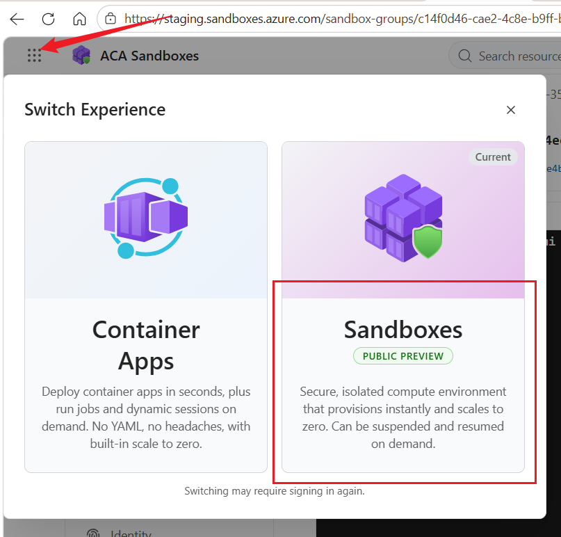

Switch to your sandbox group:

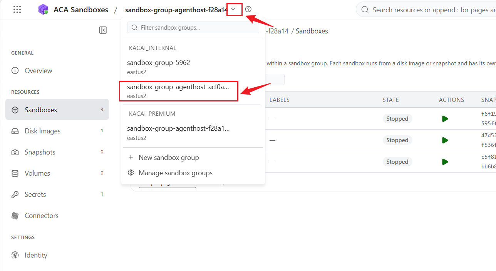

In the **Networking** tab, add VNET connection for the ACA SandboxGroup to `aca-subnet`:

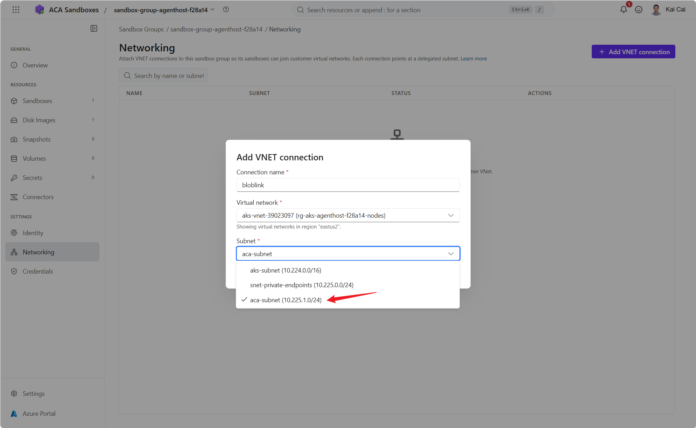


4. Confirm that the SandboxGroup reports the VNet connection as ready before
	creating or restarting sandbox instances.

After the connection is created, you should see:

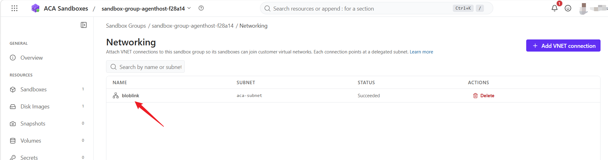


> **Note:** The Private Endpoint remains in `snet-private-endpoints`; ACA
> Sandboxes run in `aca-subnet` and reach that Private Endpoint over the shared
> VNet. The existing `privatelink.blob.core.windows.net` Private DNS zone link
> makes the standard Blob hostname resolve to the private IP. The Module-01 UAMI
> still needs `Storage Blob Data Contributor` for Blob data-plane authorization.


### Deploy your agent

You build a disk image from the container image produced in Module-03. You can find your container image in the Azure Container Registry portal:
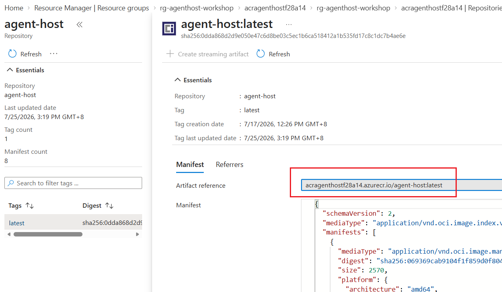

In the ACA Sandbox portal at `https://sandboxes.azure.com/`, go to the **Disk Images** tab.

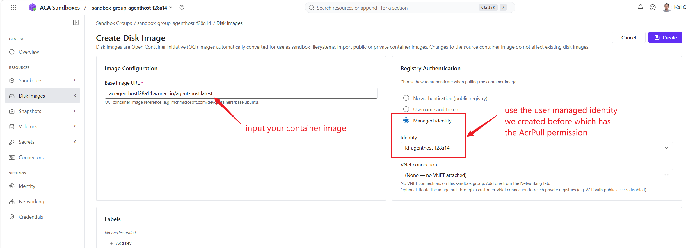

Once the build completes, the disk image appears in the list:

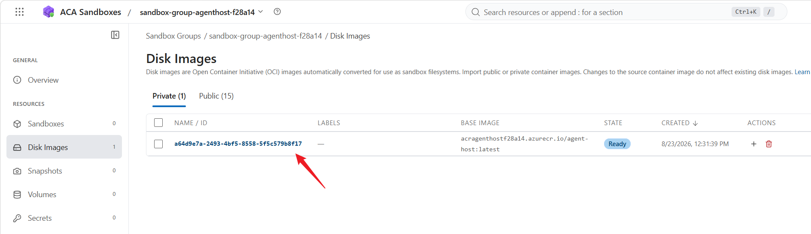

On the **Sandbox** tab, create a new standard sandbox from the disk image you just built. Switch to the **Advanced** tab for configuration:

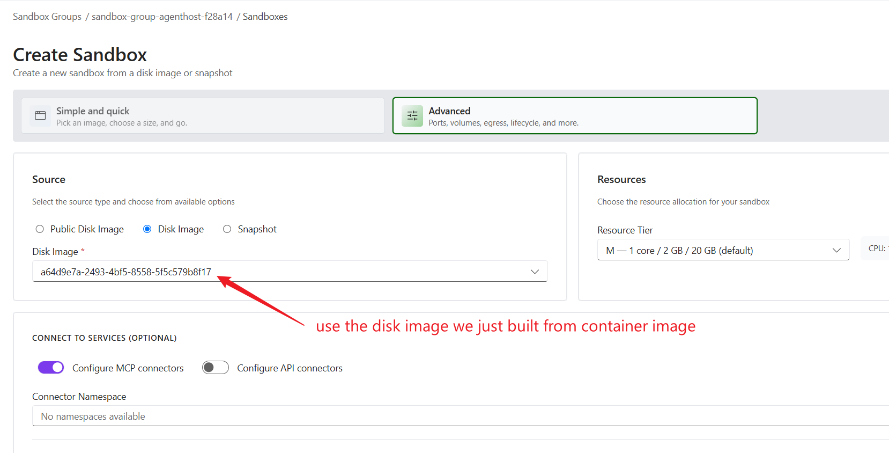

Scroll down and confirm that your Sandbox uses the identity created in module-01. This user-assigned managed identity is granted the roles required for the workshop and is assigned to the SandboxGroup by the Bicep template. In most cases, new Sandboxes in the SandboxGroup automatically inherit this identity:

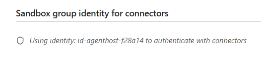


Scroll down to "Additional Details" to configure environment variables. Configure the following values:

| Key | Sample value | Description |
|---|---|---|
| AGENT_STORAGE_ACCOUNT | stcagenthostf28a14 | Module-01 Storage account name used by the agent to persist chat state in Blob. |
| AGENT_ID | agent-host-on-aca | Logical agent identifier. Also determines the Blob state file name as `<AGENT_ID>.json`. |
| FOUNDRY_PROJECT_ENDPOINT | `https://foundry-agenthost-f28a14.services.ai.azure.com/api/projects/maf-agent-prj` | Foundry project endpoint used for catalog registration and project-scoped agent operations. Find the project endpoint value in your Microsoft Foundry project Home page. |
| FOUNDRY_AGENT_NAME | agenthost-reflection-agent-on-aca | Agent name shown in the Foundry catalog. |

For example, configure the `AGENT_STORAGE_ACCOUNT` variable as shown below:
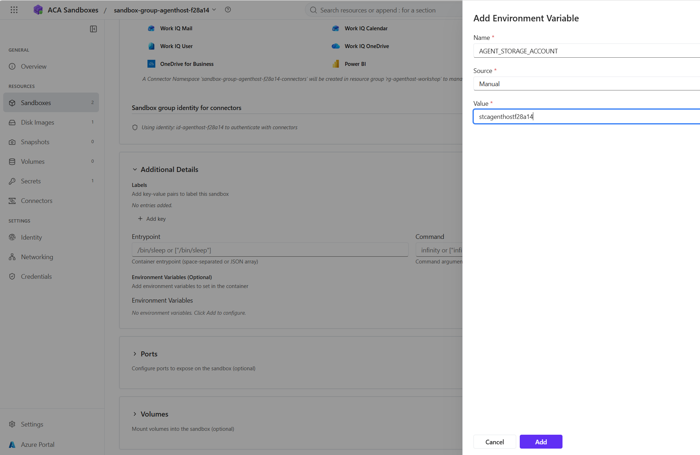

After configuring the environment variables, you should see a list similar to the following:
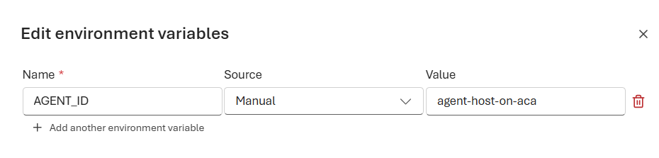

Scroll down to configure port:

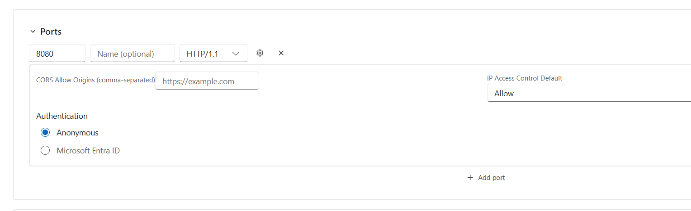

Scroll down to configure lifecycle policy:

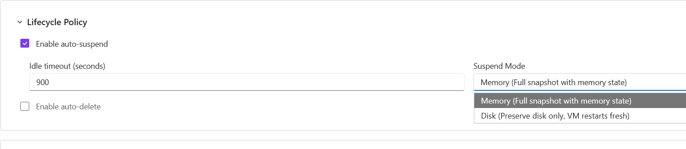

> **Tip:** Choose **Memory** as the suspend mode to preserve everything in memory and on disk, and to restore the runtime state quickly from memory. In this workshop, you will use it to verify chat-history persistence and fast restore from memory.
>
> Configure the **Idle timeout** as 900 seconds, which matches the workshop design of a 15-minute idle timeout.

#### Memory vs. disk suspend mode

The lifecycle policy offers two suspend modes. Both stop CPU and memory billing
while the sandbox is stopped, but they preserve different runtime state:

| Aspect | Memory mode | Disk mode |
|---|---|---|
| Preserved state | Sandbox memory and disk | Sandbox disk only |
| Running processes | Restored with their in-memory context | Not restored; processes and the application start again from disk |
| Resume experience | Continues from the captured runtime state | Includes application startup and state reload |
| Best fit | Short interruptions, interactive sessions, and the fastest continuity | Longer idle periods or workloads that already persist state externally |
| Workshop chat history | Available immediately with the resumed process | Reloaded by the restarted agent from `agent-state/agent-host.json` in Blob |

Use **Memory** mode in this workshop to demonstrate full process and disk
continuity. Choose **Disk** mode to demonstrate that the agent can restart and
recover its conversation history from Blob without relying on preserved memory.
In either mode, keep the auto-suspend timeout at **15 minutes**.

> **Note:** Suspend mode controls the ACA Sandbox snapshot. It is independent of
> the agent's Blob persistence: the application writes every completed chat turn
> to Blob.

Scroll down to configure the VNET connection (**required only if your storage account does not have public network access**):

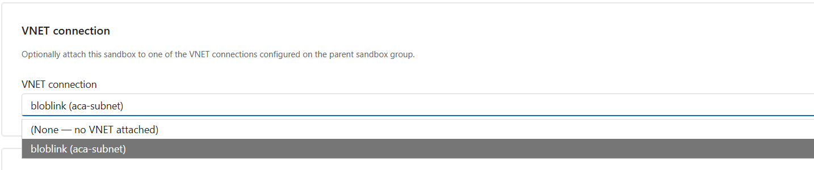

After the configuration above, you will have a **Review** step before creation:

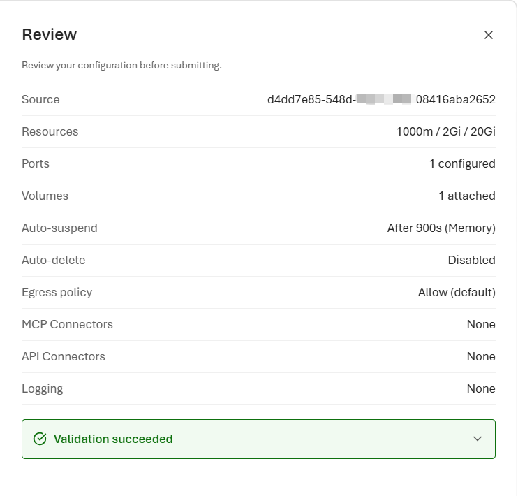

If everything is configured correctly, click **Create** to create your agent.


The sandbox launches within seconds. Try several commands in the console to verify that it is alive. The example below checks the environment variables and the agent execution files and folders:

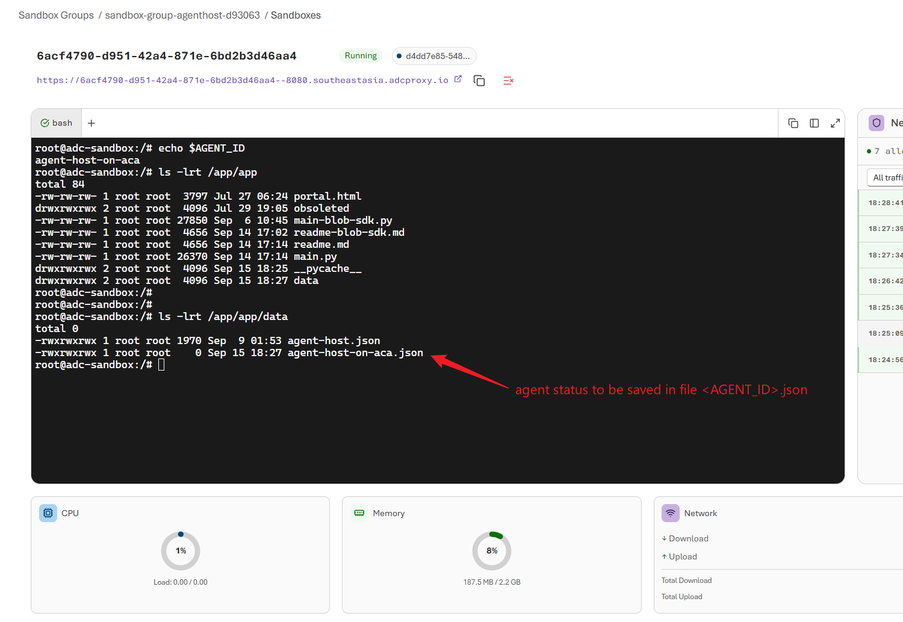

A hyperlink appears at the top of the UI. Click it to open the agent chat UI in your browser. Submit a few messages to verify that the agent is running correctly. In the backend, all LLM calls go through the APIM AI gateway:

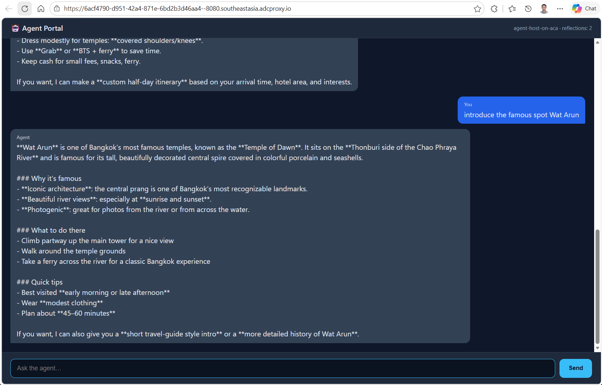

In your Microsoft Foundry project portal, open the Agent catalog. You should see that the agent running on ACA Sandbox is registered and appears with type `Prompt`:
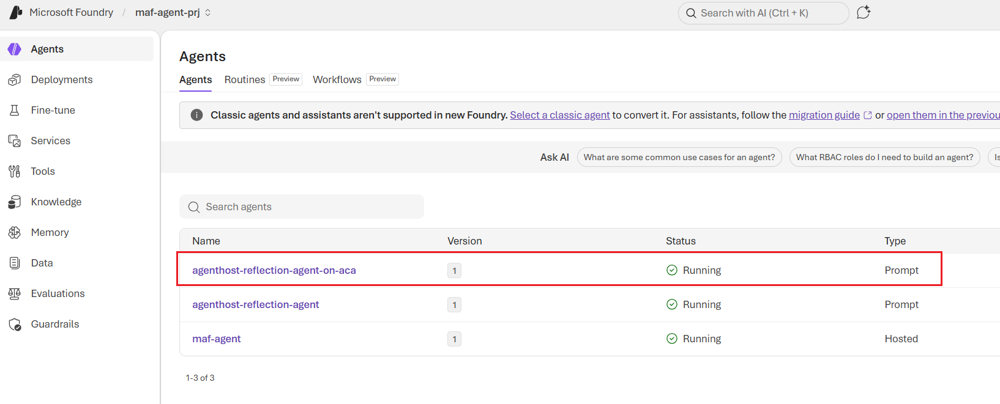

Open the storage account Blob container. You should see the chat-history persistence file:
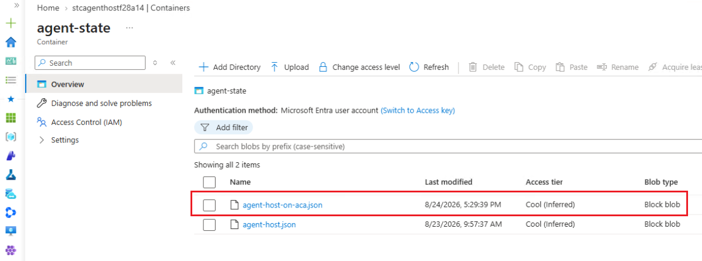
Open the persistence file to view the chat history:
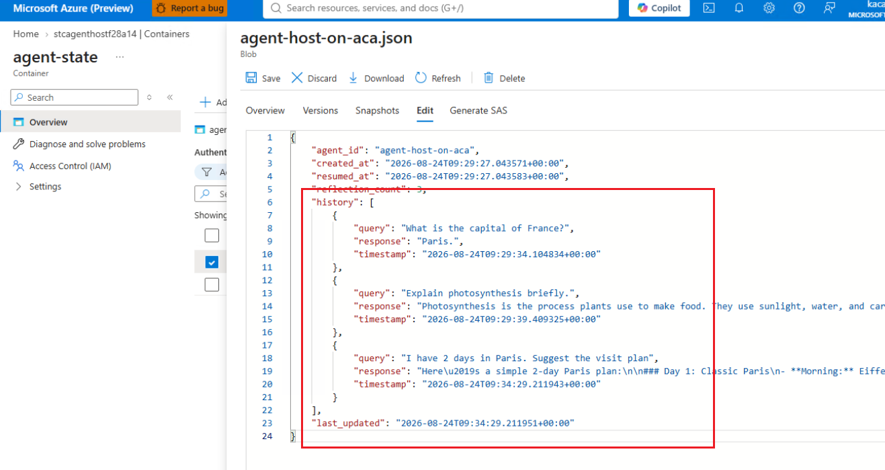

> **Tip**: If public network access is disabled on your storage account, check the persistence file from a jumpbox that can reach the storage account through Private Link. The easiest approach is to reuse the jumpbox from module-03.

To verify that ACA Sandbox helps preserve runtime state, wait for the idle timeout until the agent automatically enters the `Stopped` status:
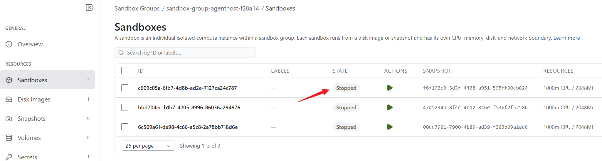

After the agent stops, refresh the chat window in the browser. You should see:
```
{"error":"Sandbox is not running"}
```
Click **Resume** in the Sandbox console, then refresh the chat window again. The previous chat history should be restored. This demonstrates the runtime-state persistence that ACA Sandbox provides, including in-memory state when Memory suspend mode is used.

> If you do not want to wait for the idle timeout, which is 15 minutes in this workshop, you can manually stop and resume the agent to simulate the process. In the Sandbox console, click **Stop** in the upper-right corner, then click **Resume**. Refresh your browser to view the chat connection status and chat-history recovery.

### Characteristics

- Strong isolation for risky or untrusted workloads
- Full lifecycle control (create, suspend, resume, delete)
- Snapshot-based state continuity
- Preferred when safety and resumability outweigh the simplicity of API pooling

---

<details>
<summary><strong>Optional Learning Track — ACA Dynamic Sessions</strong> (click to expand)</summary>

> This section is **optional**. It is provided for learners who complete the main
> Sandbox path early and want to compare a different Azure Container Apps execution
> model. It is **not required** to complete the workshop.

> [!IMPORTANT]
> **Dynamic Sessions is not an ideal host for running an agent.**
> It is purpose-built to provide **temporary, strongly isolated execution
> environments** — for example, safely running AI-generated or otherwise untrusted
> code. Each session is **ephemeral**: it is allocated on demand, runs a short-lived
> task, and is **destroyed after use with no state retained**. A long-running agent
> typically requires a stable, addressable, stateful runtime — precisely what the
> **Sandbox** workshop path provides. Treat Dynamic Sessions as a **tool the agent
> calls** to execute code safely, not as the place where the agent itself lives.
>
> See the official comparison:
> [Sandboxes vs. Dynamic Sessions](https://learn.microsoft.com/en-us/azure/container-apps/sandboxes-overview#sandboxes-vs-dynamic-sessions).

Dynamic Sessions use prewarmed **session pools** for fast, ephemeral, high-concurrency
execution — a strong fit for short-lived, disposable task runs such as executing
AI-generated code, tool calls, or code interpreters. In an agent architecture, the
agent runs elsewhere (for example, on the Sandbox path) and **offloads risky code
execution** to a Dynamic Session, discarding the session once the task completes.

### Files

- `dynamic-session-deploy.sh`
- `dynamic-session-invoke.sh` (minimal invocation example)

### What It Deploys

- ACA environment for session pool hosting (if missing)
- Custom container session pool via `az containerapp sessionpool create`
- Management endpoint for per-session invocation (`identifier` based routing)

### Deploy

```bash
cd agenthost/module-04
./dynamic-session-deploy.sh
```

### Minimal Invoke Example

```bash
cd agenthost/module-04

# Default: calls /health with identifier=test-session
./dynamic-session-invoke.sh

# Custom identifier
./dynamic-session-invoke.sh user-42

# Custom endpoint and JSON body
ENDPOINT_PATH=/api/projects/demo/openai/v1/responses \
METHOD=POST \
BODY='{"messages":[{"role":"user","content":"hello"}]}' \
./dynamic-session-invoke.sh user-42
```

### Validate

```bash
az containerapp sessionpool list -g rg-agenthost-workshop -o table
```

### When to Explore This

Explore Dynamic Sessions to understand the **secure code-execution** model that an
agent can call as a tool — not as a way to host the agent itself:

- You want to safely run AI-generated or untrusted code in a throwaway environment
- You need strong isolation for a single short task, followed by automatic teardown
- You want fast per-request or per-session allocation from a prewarmed pool
- You explicitly do **not** need to preserve state between runs

> If you need a persistent, addressable, stateful place to run the agent, use the
> **Sandbox** workshop path instead.

</details>

---

## Sandbox vs Dynamic Sessions (Reference)

| Aspect | ACA Sandboxes (workshop path) | ACA Dynamic Sessions (optional) |
|---|---|---|
| Runtime | `Microsoft.App/SandboxGroups` | Session Pools |
| Isolation | Service-managed sandbox isolation (micro-VM boundary) | Hyper-V isolated sessions |
| State | Stateful via snapshots | Ephemeral — destroyed after use, no state retained |
| Lifecycle | create/suspend/resume/delete | pool-managed, cooldown-based auto-teardown |
| Primary purpose | Hosting an isolated, resumable agent runtime | Temporary secure execution of untrusted / AI-generated code |
| Ideal for hosting an agent? | Yes | No — use it as a tool the agent calls |
| Best for | Isolation + resumability | Fast ephemeral, disposable code execution |

---

## Notes

- `container-app.yaml` is a legacy standard ACA manifest and is not used by the current scripts.
- Both the Sandbox workshop path and the optional Dynamic Sessions track reuse the agent container image built in Module-03 (which already contains its own `lifecycle-hook.sh`, invoked via a Kubernetes `preStop` hook in Module-03). This module no longer contains its own `Dockerfile`.

---

## Next Step

Proceed to [Module 5 — Wrap-up and Q&A](../module-05/README.md).

---

[⬆ Back to Workshop Home](../readme.md)
