# 模块 4 — 解决方案 C：基于容器的智能体运行时（ACA Sandboxes，30 分钟）

[⬆ 返回研讨会主页](../readme.md)

## 概述

本模块将智能体运行时部署到 **Azure Container Apps Sandboxes**，这是本次研讨会采用的基于容器的托管模型。Sandboxes 提供基于微型 VM 的强隔离以及完整的生命周期控制（创建、挂起、恢复、删除），并支持内存或磁盘挂起模式，以保持状态连续性。

> [!important]
> **研讨会主要路径：** ACA Sandboxes。
>
> 对于希望探索另一种执行模型的学习者，另行提供了可选学习路径 [ACA Dynamic Sessions](./dynamic-sessions.md)。

> [!caution]
> **ACA Dynamic Sessions** 可选学习路径尚未准备就绪。

---

## 先决条件

> [!caution]
> **注意：** 请从本模块的根目录（`agenthost/module-04/`）运行本 README 中的所有命令。

1. 已部署 Module-01，并且资源组中存在 `deploymentSN` 标记。
2. Module-03 中构建的智能体容器映像可供本模块复用。
3. 已安装 Azure CLI。
4. 已安装并升级 Container Apps 扩展，且已启用预览支持：

```bash
az extension add --name containerapp --upgrade --allow-preview true -y
```

5. 你的标识已获得 `Container Apps SandboxGroup Data Owner` 角色分配。
6. 你的标识可以创建角色分配（`Microsoft.Authorization/roleAssignments/write`），因为本模块会向 Module 1 托管标识授予 `AcrPull`。常见选择包括 **Owner**，或 **Contributor** 加 **Role Based Access Control Administrator**。

---

## 部署 ACA Sandboxe Group

```bash
cd agenthost/module-04
chmod +x sandbox-deploy.sh
./sandbox-deploy.sh
```

> [!note]
> 完成后，`sandbox-deploy.sh` 已应用所需的 Sandbox 资源和权限：
>
> - 创建 Azure Container Apps SandboxGroup（`Microsoft.App/SandboxGroups`，预览版）。
> - 将 Module-01 用户分配的托管标识分配给 SandboxGroup，用作工作负载标识。
> - 配置 SandboxGroup 注册表绑定，使 sandbox 能够使用现有 ACR 映像。
> - 通过 `sandbox.bicep` 向 Module-01 托管标识授予 ACR 上的 `AcrPull`。

`sandbox-depoy.sh` 完成后，应看到如下输出：
```text
==========================================================================
✓ SandboxGroup deployed successfully!
==========================================================================

SandboxGroup Details:
  Name: sandbox-group-agenthost-acf0a3
  Resource Group: rg-agenthost-workshop
  Container Image: acragenthostacf0a3.azurecr.io/agent-host:latest

Next Steps:
  1. Create disk image (if not already done)
  2. Launch individual sandbox instances using CLI commands (shown above)
  3. Manage sandbox lifecycle: suspend, resume, delete
  4. Monitor sandbox performance and resource usage

Documentation:
  https://learn.microsoft.com/en-us/azure/container-apps/sandboxes-overview
  https://learn.microsoft.com/en-us/cli/azure/containerapp/sandbox
```

在 Azure 门户中，打开资源组以确认 SandboxGroup 已创建：

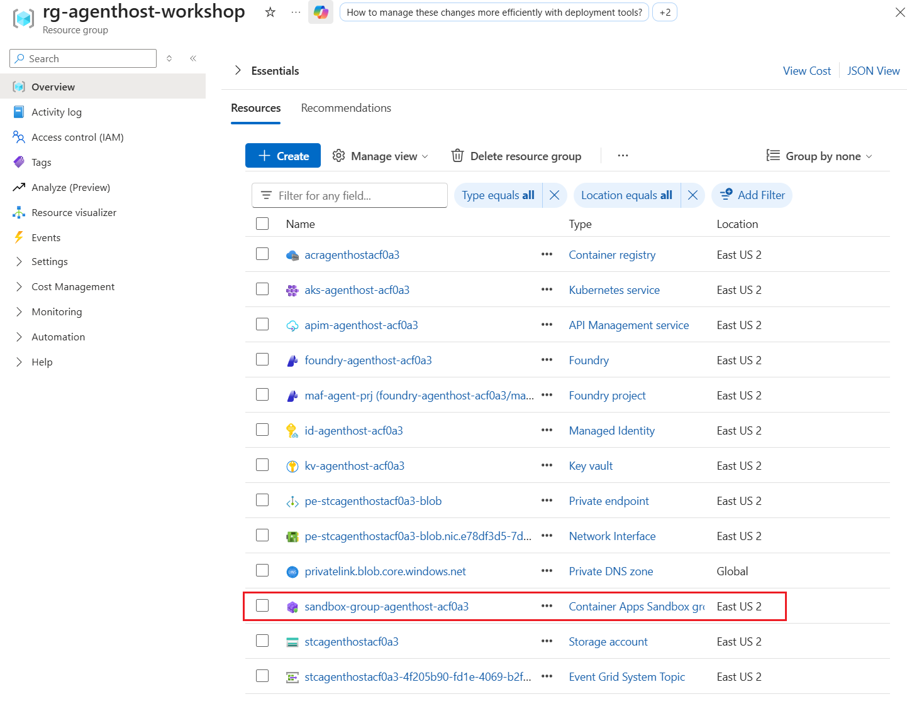

## 可选 — 通过 Private Link 将 SandboxGroup 连接到 Blob

> [!important]
> **如果 Module-01 Storage account 已禁用公共网络访问，那么在智能体能够读取或写入其持久化状态之前，ACA SandboxGroup 必须具有到 Blob endpoint 的专用网络连接。**

为方便研讨会操作，请复用 Module-03 中发现的 AKS 托管 VNet。
Module-03 已将 AKS managed VNet 链接到 Blob Private DNS zone，并创建了 Blob Private Endpoint。我们不会为 Module-04 再创建一个 Blob Private Endpoint。
而是在 AKS managed VNet 中为 ACA Sandboxes 创建一个新的专用子网，并将 SandboxGroup 连接到该子网：

1. 在 Azure 门户中打开 **AKS node resource group**，然后选择 Module-03 使用的 AKS-managed VNet。
2. 创建名为 `aca-subnet` 的新子网。使用空闲且不重叠的地址范围，并使其与 AKS node subnet 和 `snet-private-endpoints` 保持分离。

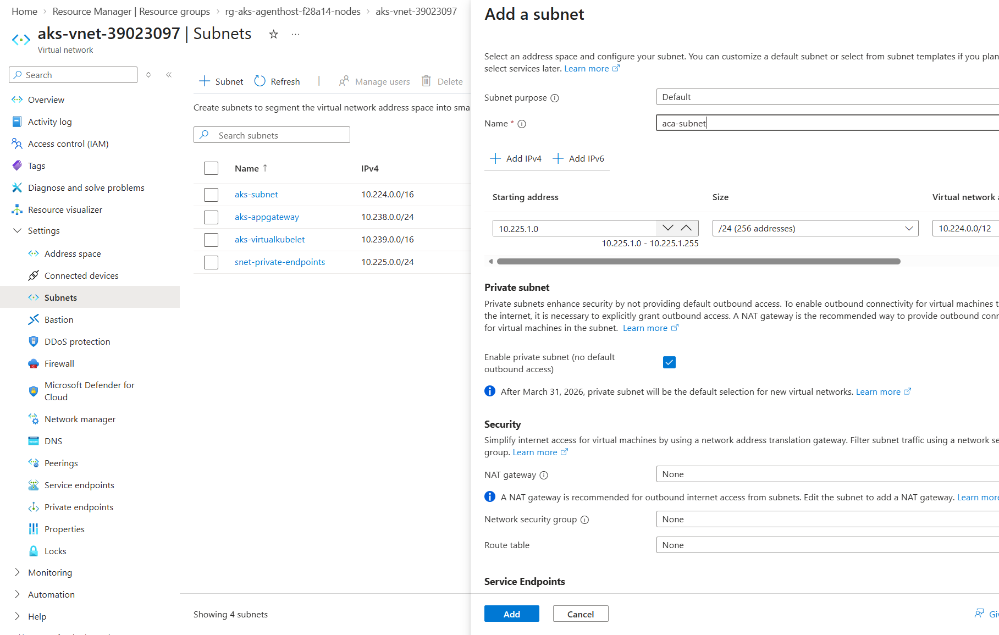

创建子网后，应在子网列表中看到 `aca-subnet`：
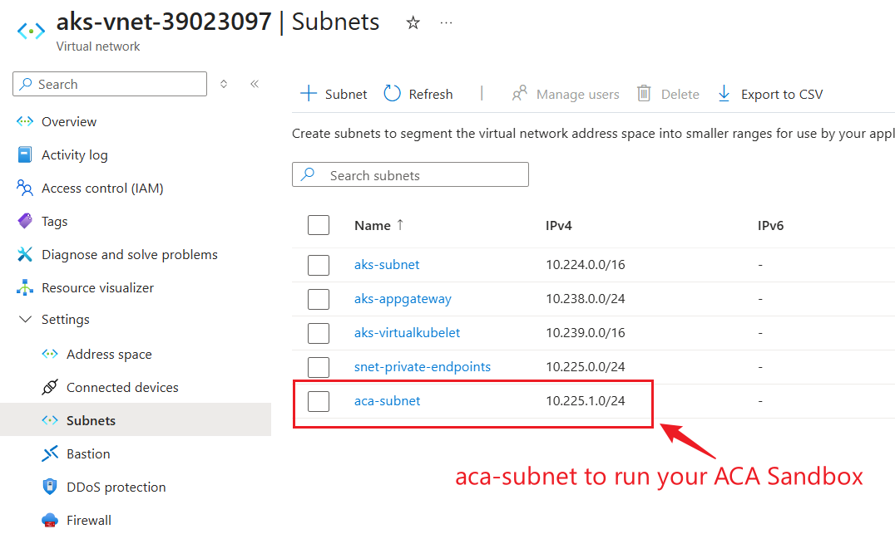

现在将子网 `aca-subnet` 委派给 Azure Container Apps，使其可供 Container Apps environment 使用。

**运行（将 `--resource-group` 和 `--vnet-name` 的值替换为你自己的值）：**

```bash
NODE_RESOURCE_GROUP=$(az aks show --resource-group "$RESOURCE_GROUP" --name "$AKS_NAME" --query nodeResourceGroup --output tsv | tr -d "\r\n")

VNET_NAME=$(az network vnet list --resource-group "$NODE_RESOURCE_GROUP" --query "[0].name" --output tsv | tr -d "\r\n")

az network vnet subnet update \
  --resource-group $NODE_RESOURCE_GROUP \
  --vnet-name $VNET_NAME \
  --name aca-subnet \
  --delegations Microsoft.App/environments
```

**预期输出：**

```json
{
  "addressPrefix": "10.225.1.0/24",
  "defaultOutboundAccess": false,
  "delegations": [
    {
      "actions": [
        "Microsoft.Network/virtualNetworks/subnets/join/action"
      ],
      "etag": "<etag>",
      "id": "/subscriptions/<subscription-id>/resourceGroups/<node-resource-group>/providers/Microsoft.Network/virtualNetworks/<vnet-name>/subnets/aca-subnet/delegations/0",
      "name": "0",
      "provisioningState": "Succeeded",
      "resourceGroup": "<node-resource-group>",
      "serviceName": "Microsoft.App/environments",
      "type": "Microsoft.Network/virtualNetworks/subnets/delegations"
    }
  ],
  "etag": "<etag>",
  "id": "/subscriptions/<subscription-id>/resourceGroups/<node-resource-group>/providers/Microsoft.Network/virtualNetworks/<vnet-name>/subnets/aca-subnet",
  "name": "aca-subnet",
  "privateEndpointNetworkPolicies": "Disabled",
  "privateLinkServiceNetworkPolicies": "Enabled",
  "provisioningState": "Succeeded",
  "resourceGroup": "<node-resource-group>",
  "type": "Microsoft.Network/virtualNetworks/subnets"
}

```

验证是否已添加 `Microsoft.App/environments` 服务委派。输出中应包含：
```
"serviceName": "Microsoft.App/environments"
```

**运行（将 `--resource-group` 和 `--vnet-name` 的值替换为你自己的值）：**

```bash
NODE_RESOURCE_GROUP=$(az aks show --resource-group "$RESOURCE_GROUP" --name "$AKS_NAME" --query nodeResourceGroup --output tsv | tr -d "\r\n")

VNET_NAME=$(az network vnet list --resource-group "$NODE_RESOURCE_GROUP" --query "[0].name" --output tsv | tr -d "\r\n")

az network vnet subnet show \
  --resource-group $NODE_RESOURCE_GROUP \
  --vnet-name $VNET_NAME \
  -n aca-subnet \
  --query delegations
```

**预期输出：**

```json
[
  {
    "actions": [
      "Microsoft.Network/virtualNetworks/subnets/join/action"
    ],
    "etag": "<etag>",
    "id": "/subscriptions/<subscription-id>/resourceGroups/<node-resource-group>/providers/Microsoft.Network/virtualNetworks/<vnet-name>/subnets/aca-subnet/delegations/0",
    "name": "0",
    "provisioningState": "Succeeded",
    "resourceGroup": "<node-resource-group>",
    "serviceName": "Microsoft.App/environments",
    "type": "Microsoft.Network/virtualNetworks/subnets/delegations"
  }
]

```
输出必须包含：
```json
[
  {
    "serviceName": "Microsoft.App/environments"
  }
]
```

3. 在 `https://sandboxes.azure.com/` 的 ACA Sandbox 门户中，打开研讨会 SandboxGroup，并将其连接到 AKS-managed VNet 和 `aca-subnet`。

使用你的 Azure 标识登录 `https://sandboxes.azure.com/` 并打开 ACA Sandbox 门户：

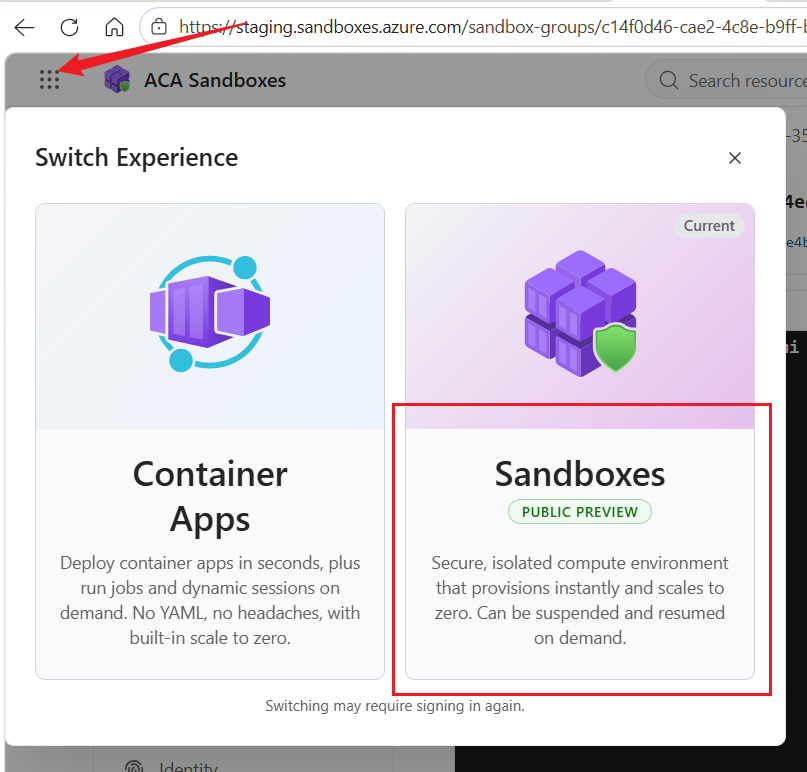

切换到你的 sandbox group：

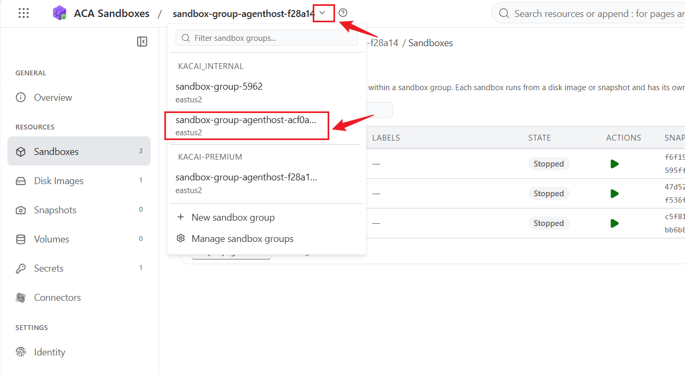

在 **Networking** 选项卡中，为 ACA SandboxGroup 添加到 `aca-subnet` 的 VNET 连接：

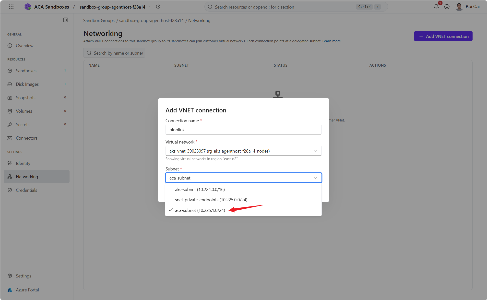

4. 在创建或重启 sandbox 实例之前，确认 SandboxGroup 将 VNet 连接报告为就绪。

创建连接后，应看到：

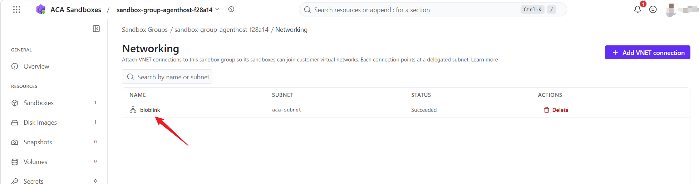

> [!note]
> - Private Endpoint 仍位于 `snet-private-endpoints` 中；ACA Sandboxes 在 `aca-subnet` 中运行，并通过共享 VNet 访问该 Private Endpoint。现有的 `privatelink.blob.core.windows.net` Private DNS zone link 会使标准 Blob 主机名解析为专用 IP。
> - Module-01 UAMI 仍需要 `Storage Blob Data Contributor`，以获得 Blob 数据平面授权。

## 为 sandbox 配置 Blob 卷

在 `https://sandboxes.azure.com/` 的 ACA Sandbox 门户中，转到你的 Sandbox Group。在左侧面板中选择 **Volumes** 选项卡，然后使用 **Create** 按钮将 Blob 容器添加为 sandbox 卷：
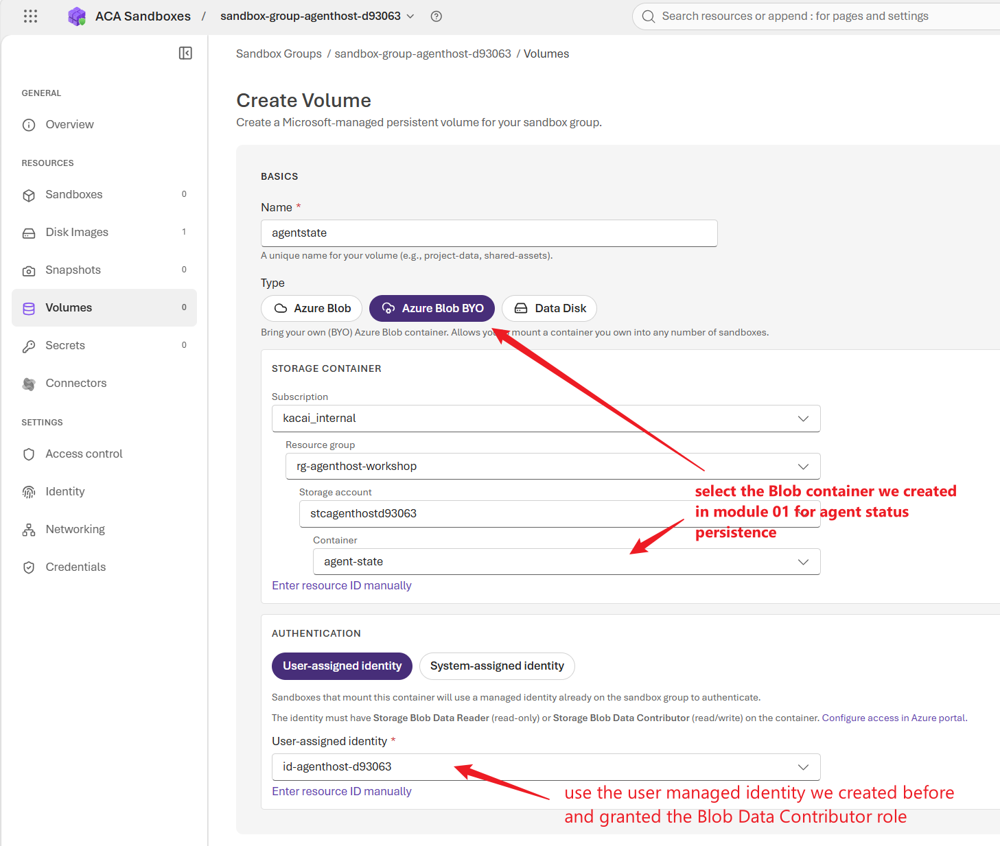

创建 Blob 卷后，应在可用卷列表中看到它：
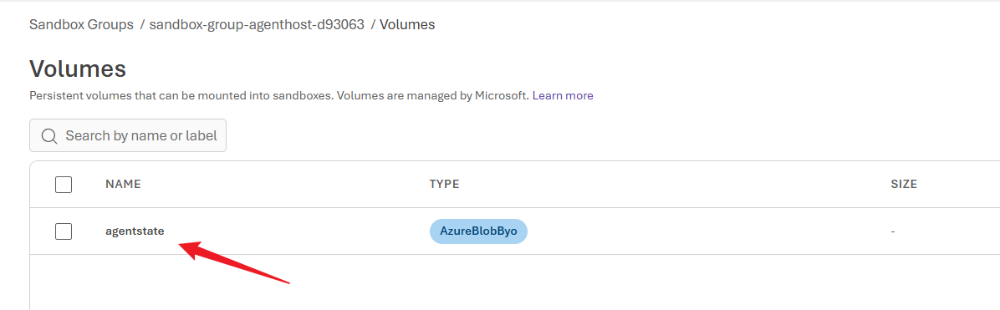

## 部署智能体

你需要从 Module-03 生成的容器映像构建磁盘映像。可以在 Azure Container Registry 门户中找到你的容器映像：
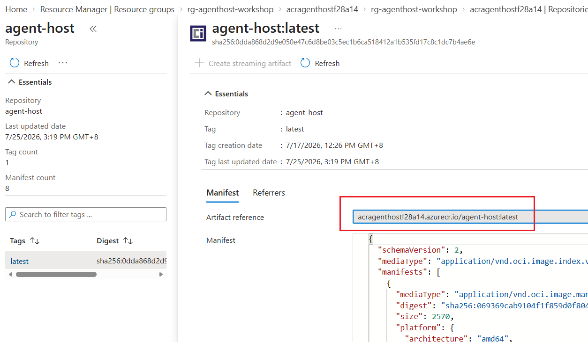

在 `https://sandboxes.azure.com/` 的 ACA Sandbox 门户中，转到 **Disk Images** 选项卡。

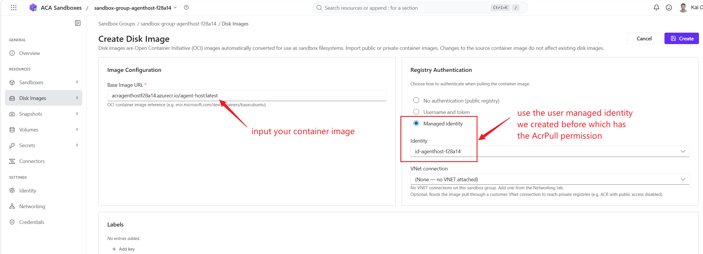

构建完成后，磁盘映像会显示在列表中：

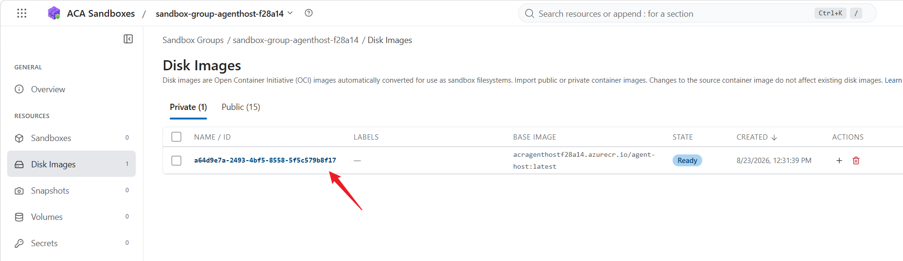

在 **Sandbox** 选项卡中，使用刚构建的磁盘映像创建新的 **Standard Sandbox**。切换到 **Advanced** 选项卡进行配置：

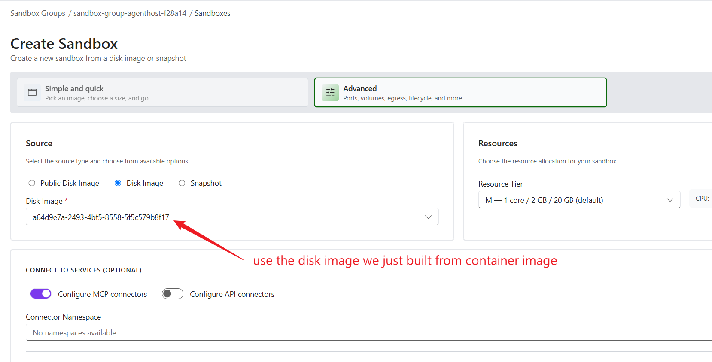

向下滚动并确认 Sandbox 使用 Module-01 中创建的标识。这个用户分配的托管标识已获得研讨会所需的角色，并由 Bicep 模板分配给 SandboxGroup。在大多数情况下，SandboxGroup 中的新 Sandbox 会自动继承此标识：

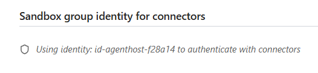

向下滚动到“Additional Details”以配置环境变量。配置以下值：

| 键 | 示例值 | 说明 |
|---|---|---|
| AGENT_ID | agent-host-on-aca | 逻辑智能体标识符。它还决定 Blob 状态文件名，即 `<AGENT_ID>.json`。 |
<!-- | AGENT_STORAGE_ACCOUNT | stcagenthostf28a14 | 智能体用来在 Blob 中持久保存聊天状态的 Module-01 Storage account 名称。 | -->
<!-- | FOUNDRY_PROJECT_ENDPOINT | `https://foundry-agenthost-f28a14.services.ai.azure.com/api/projects/maf-agent-prj` | 用于目录注册和项目范围智能体操作的 Foundry project endpoint。请在 Microsoft Foundry project Home page 中查找 project endpoint 值。 |
| FOUNDRY_AGENT_NAME | agenthost-reflection-agent-on-aca | Foundry catalog 中显示的智能体名称。 | -->

例如，如下所示配置 `AGENT_ID` 变量：
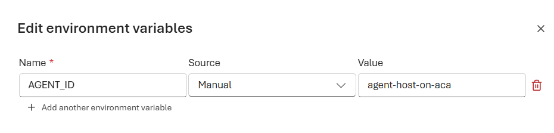

<!-- 配置环境变量后，应看到类似以下内容的列表：
 -->

向下滚动以配置端口：

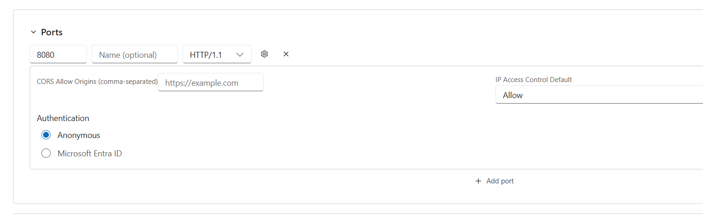

向下滚动到 **Volumes**，配置要装载到智能体 sandbox 中的 Blob 卷，以便持久保存状态：
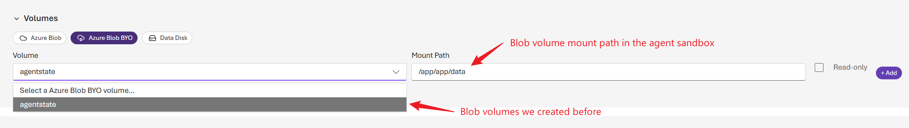
填写卷和装载路径后，单击右侧的 **+Add** 按钮。确保该卷出现在卷列表中：
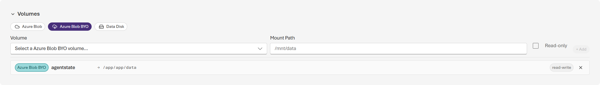

向下滚动以配置生命周期策略：

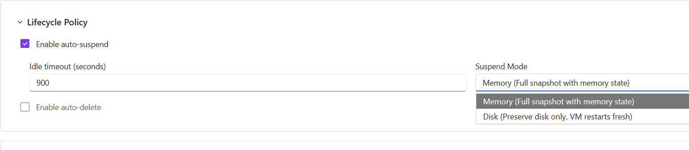

> [!tip]
> - 选择 **Memory** 作为挂起模式，以保留内存和磁盘中的所有内容，并从内存快速恢复运行时状态。在本次研讨会中，你将用它来验证聊天历史记录持久性以及从内存快速恢复。
> - 将 **Idle timeout** 配置为 900 秒，这与研讨会设计的 15 分钟空闲超时一致。

在本次研讨会中使用 **Memory** 模式演示完整的进程和磁盘连续性。选择 **Disk** 模式则可演示智能体能够在不依赖保留内存的情况下重启，并从 Blob 恢复对话历史记录。无论使用哪种模式，都将自动挂起超时保持为 **15 分钟**。

> [!tip]
> **内存挂起模式与磁盘挂起模式的比较**
>
> 生命周期策略提供两种挂起模式。当 sandbox 停止时，这两种模式都会停止 CPU 和内存计费，但它们保留的运行时状态不同：
>
> | 方面 | Memory 模式 | Disk 模式 |
> |---|---|---|
> | 保留的状态 | Sandbox 内存和磁盘 | 仅 Sandbox 磁盘 |
> | 正在运行的进程 | 连同其内存中上下文一起恢复 | 不恢复；进程和应用程序从磁盘重新启动 |
> | 恢复体验 | 从捕获的运行时状态继续 | 包括应用程序启动和状态重新加载 |
> | 最适用场景 | 短暂中断、交互式会话以及最快的连续性 | 较长的空闲期，或已在外部持久保存状态的工作负载 |
> | 研讨会聊天历史记录 | 随恢复的进程立即可用 | 由重启的智能体从 Blob 中的 `agent-state/agent-host.json` 重新加载 |

> [!note]
> 挂起模式控制 ACA Sandbox 快照。它与智能体的 Blob 持久化无关：应用程序会将每轮完成的聊天写入 Blob。

向下滚动以配置 VNET 连接（**仅当 Storage account 未启用公共网络访问时才需要**）：

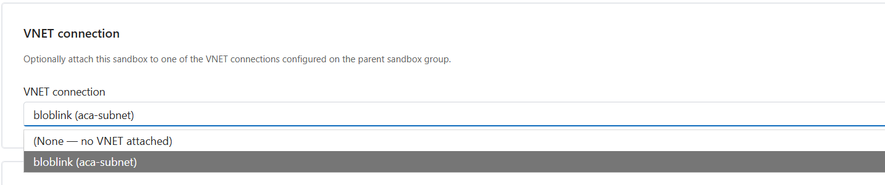

完成上述配置后，按右上角的 **Create**，创建前会进入 **Review** 步骤：

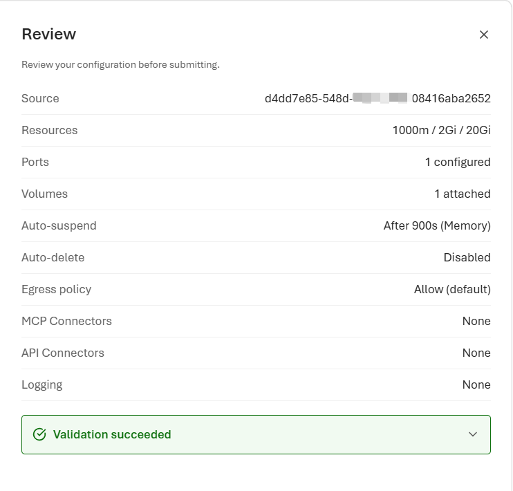

如果所有配置均正确，请单击 **Create** 创建智能体。

Sandbox 会在几秒钟内启动。在控制台中运行几条命令，验证其是否正常工作。下面的示例检查智能体使用的环境变量、文件和文件夹：

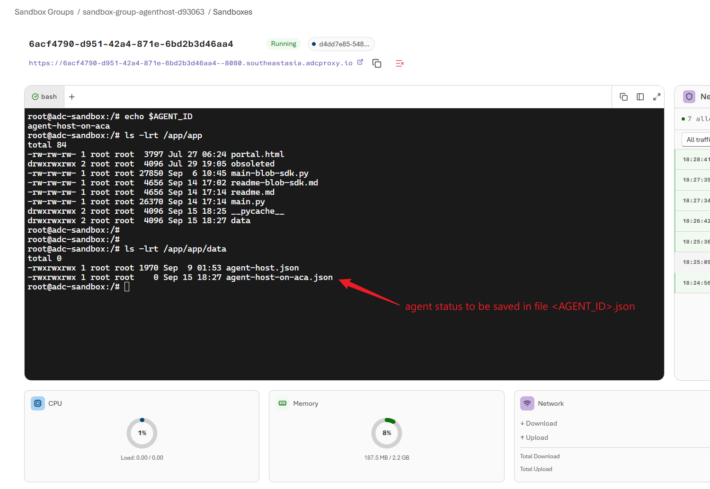

UI 顶部会出现一个超链接。单击该链接，在浏览器中打开智能体聊天界面。发送几条消息，验证智能体是否正常运行。在后端，所有 LLM 调用都通过 APIM AI gateway 路由：

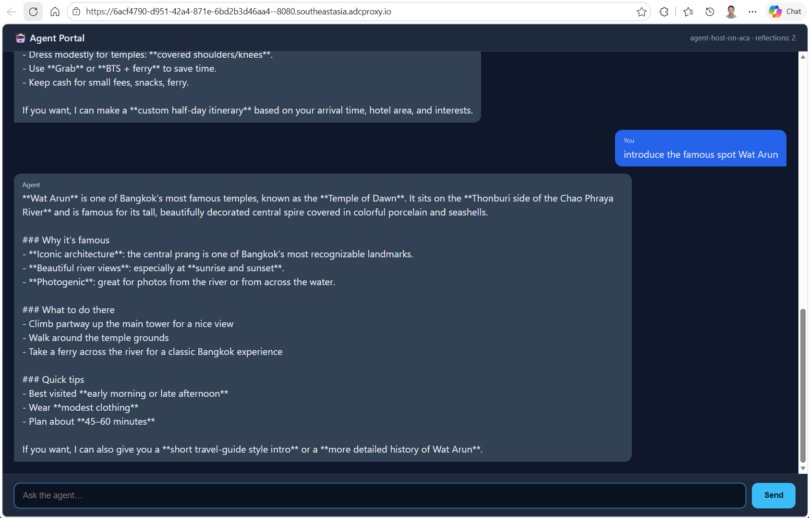

<!-- 在 Microsoft Foundry project 门户中打开 Agent catalog。你应看到，在 ACA Sandbox 上运行的智能体已注册，并以 `Prompt` 类型显示：
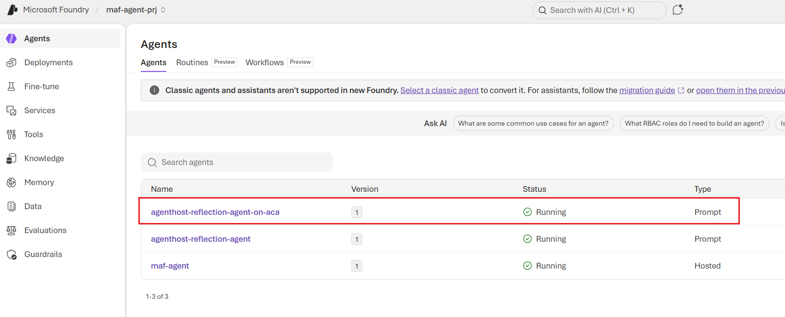 -->

进行几轮对话后，返回智能体 sandbox 控制台，验证聊天历史记录是否已正确保存。
在智能体 Bash 窗口中运行以下命令：
```bash
cat /app/app/data/agent-host-on-aca.json
```
聊天历史记录应如下所示：
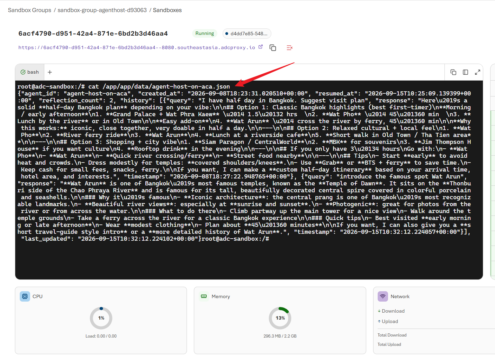

上面的示例表明智能体将其状态存储在 Blob 卷中。Azure Container Apps Sandbox 提供两种便捷的挂起模式来保留智能体状态：Memory 和 Disk。在此配置中，我们选择了 Memory 模式，该模式使用快照同时保留磁盘状态和内存状态。要验证此行为，请等待空闲超时；超时后，智能体会自动进入 `Stopped` 状态：
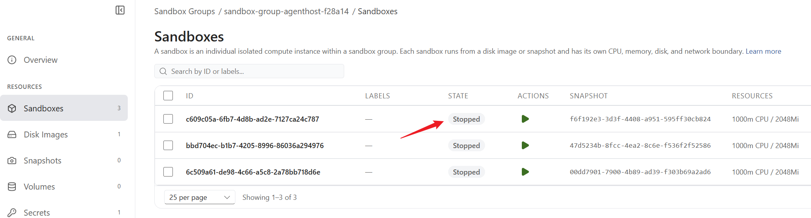

智能体停止后，在浏览器中刷新聊天窗口。应看到：
```json
{"error":"Sandbox is not running"}
```
在 Sandbox 控制台中单击 **Resume**，然后刷新聊天窗口。之前的聊天历史记录应已恢复。这演示了 ACA Sandbox 提供的运行时状态持久性，包括使用 Memory 挂起模式时对内存状态的保留。

> [!tip]
> 如果不想等待空闲超时（本次研讨会设置为 15 分钟），可以手动停止并恢复智能体来模拟该过程。在 Sandbox 控制台中单击右上角的 **Stop**，然后单击 **Resume**。刷新浏览器以检查聊天连接，并验证聊天历史记录是否已恢复。

---

<details>
<summary><strong>可选学习路径 — ACA Dynamic Sessions</strong>（单击展开）</summary>

本节为**可选内容**，面向提前完成 Sandbox 主要路径并希望比较另一种 Azure Container Apps 执行模型的学习者。

> [!IMPORTANT]
> **Dynamic Sessions 并不是运行智能体的理想主机。**
>
> 它专门用于提供**临时、强隔离的执行环境**，例如安全运行 AI 生成的代码或其他不受信任的代码。每个 session 都是**临时的**：按需分配，运行短期任务，并且**使用后即销毁，不保留任何状态**。长时间运行的智能体通常需要稳定、可寻址且有状态的运行时，而这正是 **Sandbox** 研讨会路径提供的能力。应将 Dynamic Sessions 视为智能体调用以安全执行代码的**工具**，而不是智能体本身的运行位置。
>
> 请参阅官方比较：
> [Sandboxes 与 Dynamic Sessions 的比较](https://learn.microsoft.com/en-us/azure/container-apps/sandboxes-overview#sandboxes-vs-dynamic-sessions)。

**此学习路径仍在开发中，将很快更新。**

查看 Dynamic Sessions 内容：
[ACA Dynamic Sessions 学习路径](./dynamic-sessions.md)。

</details>

---

## Sandbox 与 Dynamic Sessions 的比较（参考）

| 方面 | ACA Sandboxes（研讨会路径） | ACA Dynamic Sessions（可选） |
|---|---|---|
| 运行时 | `Microsoft.App/SandboxGroups` | Session Pools |
| 隔离 | 服务管理的 sandbox 隔离（微型 VM 边界） | Hyper-V 隔离 session |
| 状态 | 通过快照保持状态 | 临时 — 使用后销毁，不保留任何状态 |
| 生命周期 | 创建/挂起/恢复/删除 | 池管理、基于冷却时间自动拆除 |
| 主要用途 | 托管隔离且可恢复的智能体运行时 | 临时、安全地执行不受信任或 AI 生成的代码 |
| 是否适合托管智能体？ | 是 | 否 — 应将其用作智能体调用的工具 |
| 最适用于 | 隔离 + 可恢复性 | 快速、临时、可丢弃的代码执行 |

---

## 体系结构

- Azure Container Apps SandboxGroup 在服务管理的微型 VM sandbox 中托管隔离的智能体实例。
- 智能体复用 Module 03 的 ACR 容器映像，以及 Module 01 的托管标识、APIM gateway、Blob Storage 和 Foundry model。
- 装载的 Blob 卷持久保存对话状态，而内存或磁盘挂起模式控制运行时连续性和恢复行为。
- 禁用公共网络访问时，可以使用可选的 VNet 连接对 Blob Storage 进行专用访问。

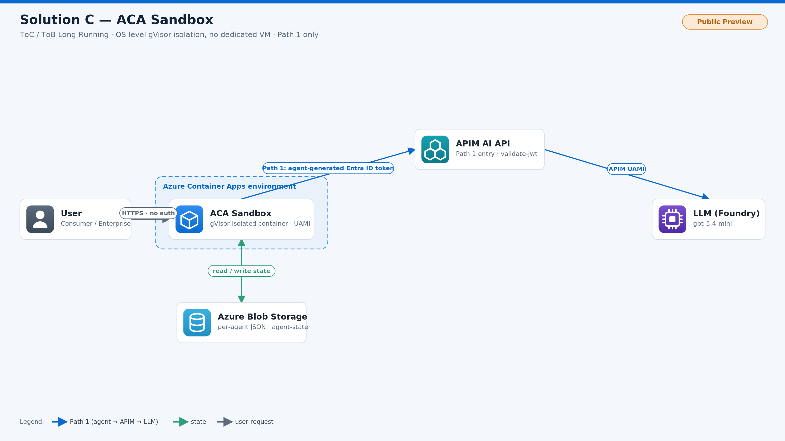

---

## 演示

https://github.com/user-attachments/assets/35d74a64-f960-4e20-93c1-63d318f947fe

---

## 本模块中的文件

| 文件 | 说明 |
|---|---|
| `README.md` | 在 ACA Sandboxes 上部署和运行智能体运行时的说明。 |
| `sandbox-deploy.sh` | 部署 ACA SandboxGroup 和所需角色分配。 |
| `sandbox.bicep` | 定义 ACA SandboxGroup 及其配置的 Bicep 模板。 |
| `dynamic-sessions.md` | ACA Dynamic Sessions 的可选学习路径。 |

---

## 注意事项

- `container-app.yaml` 是旧版标准 ACA 清单，当前脚本不使用它。

---

## 下一步

继续学习[模块 5 — 总结与问答](../module-05/README.md)。

---

[⬆ 返回研讨会主页](../readme.md)
