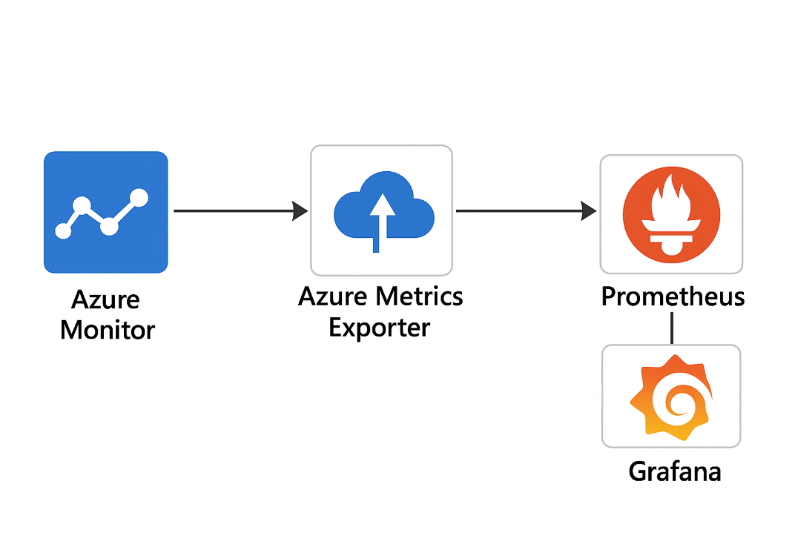
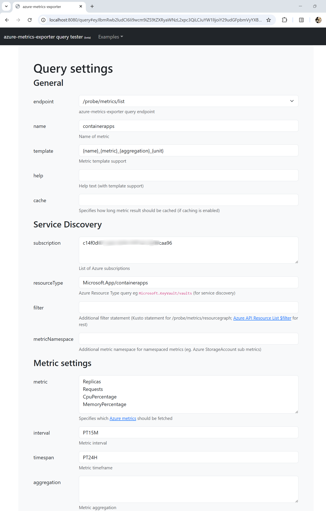
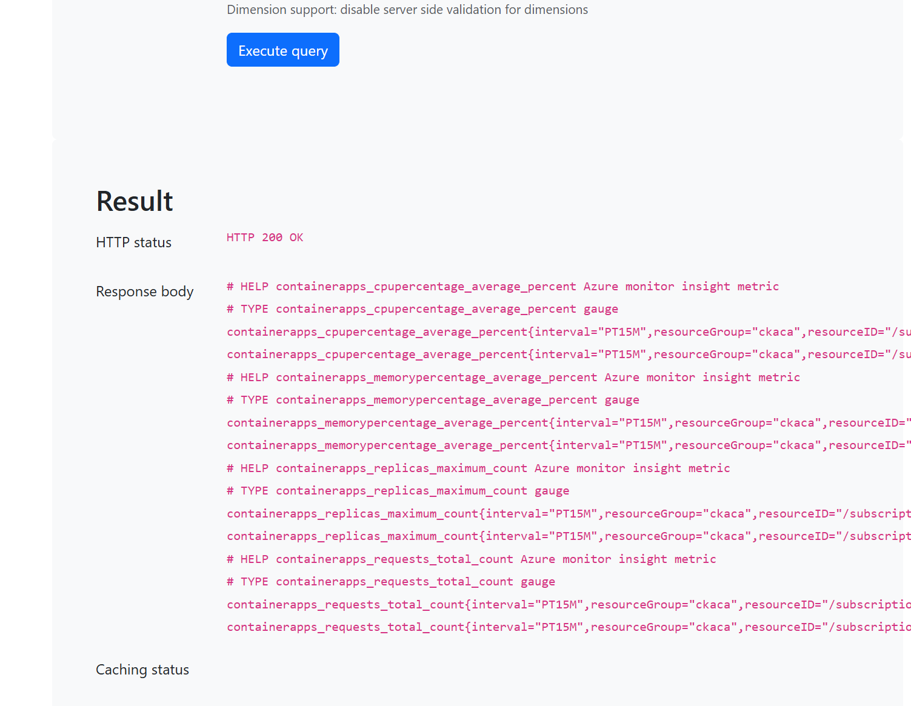
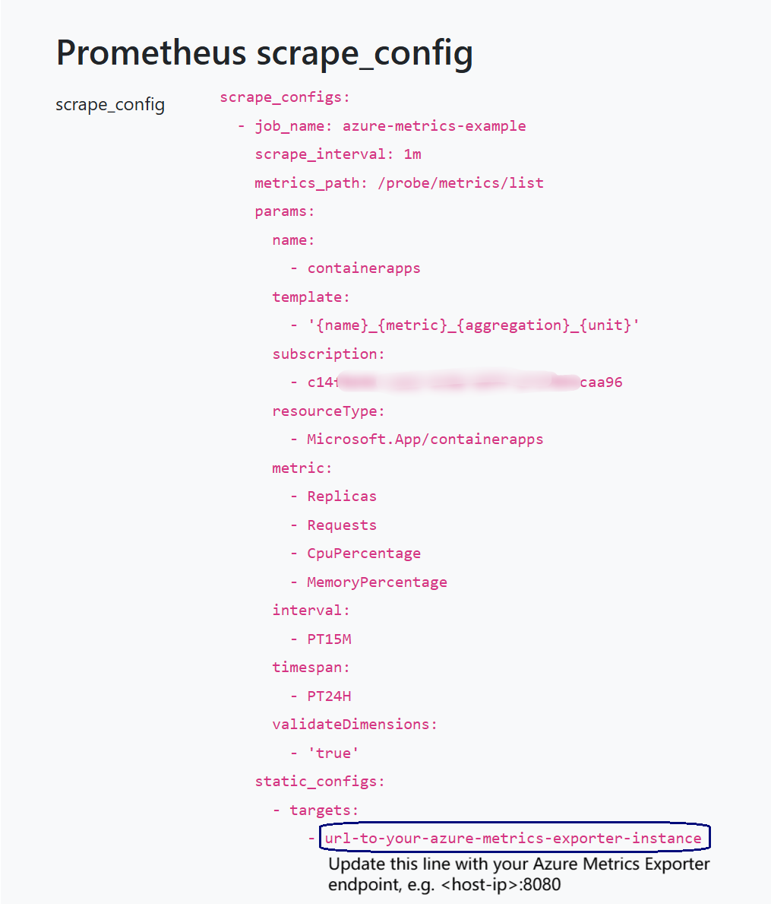
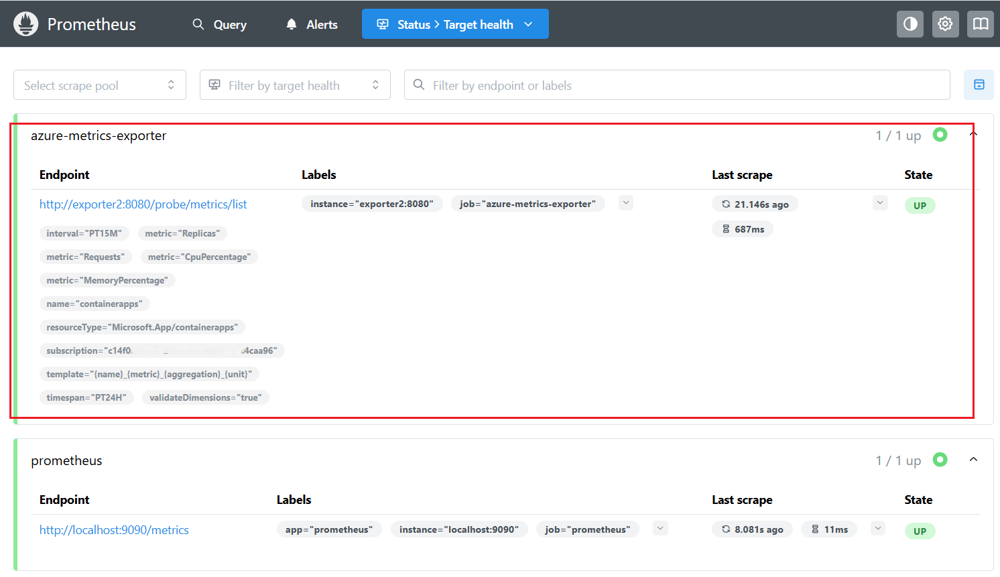
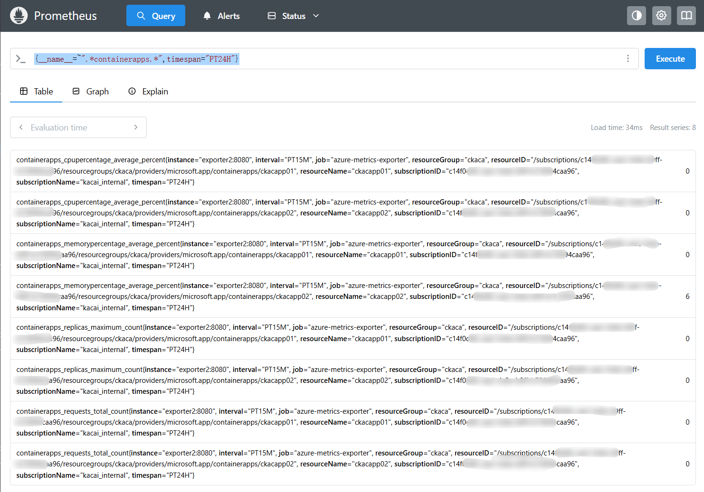
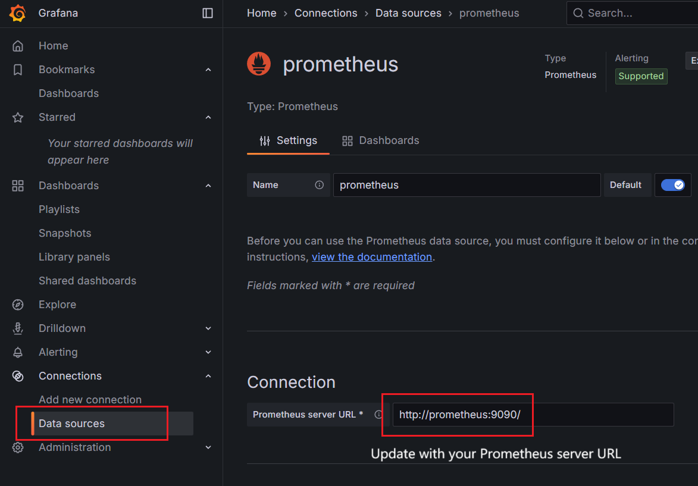
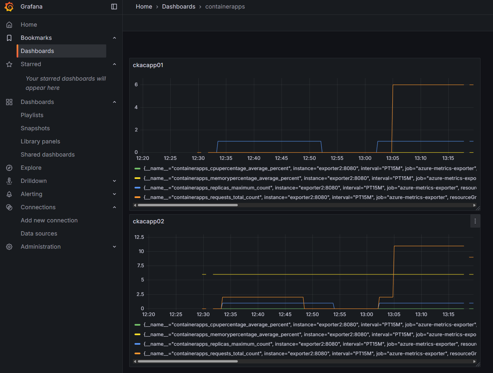

# Exporting Azure Metrics to Prometheus+Grafana

## Purpose

Exports Azure Monitor metrics to Prometheus, and configure the Grafana dashboard for visualization.<br>
In this guide, we take Azure Container Apps (ACA) running metrics as example, exporting them from Azure Monitor to Prometheus, and visualizes them using Grafana.

---

## Architecture


- The "Azure Metrics Exporter" comes from project [webdevops/azure-metrics-exporter](https://github.com/webdevops/azure-metrics-exporter).
- It connects to Azure Monitor using a service principal, retrieves metrics for specified Azure resources, and exposes them in a Prometheus-compatible format. Prometheus then scrapes these metrics at regular intervals, storing them for querying and analysis. Grafana is used to create dashboards and visualize the collected metrics.

---

## Prerequisites

- An Azure service principal with permissions to read metrics from Azure Monitor.
- Clone the [azure-metrics-exporter repository](https://github.com/webdevops/azure-metrics-exporter) and use the provided Dockerfile to create a Docker image. Attention the ```docker buildx``` command is required.

---

## Azure Metrics Exporter Setup
_Tip: For a quick verification, you can simply use the [all-in-one Kubernetes yaml sample](https://github.com/oxcp/ainotes/blob/main/azmetricsexp-k8s.yml.sample), replacing the environment variables with your actual values. This manifest creates the Azure Monitor Exporter, Prometheus, and Grafana services in your Kubernetes cluster with ```kubectl apply``` commands. After the deployment, you can use command ```kubectl get services -n exporter``` to get the **EXTERNAL-IP** and **PORT(S)** to access the services via Internet._

### 1. Configure Azure Service Principal

For your Azure service principal, assign the **Monitoring Reader** role (or higher permissions) on the target subscriptions. Steps for your reference:
1. An application must be registered (e.g., Microsoft Entra ID -> App registrations -> New application registration)
2. The registered application must have reading permission to Azure Monitor (e.g., Subscriptions -> your_subscription -> Access control (IAM) -> Role assignments -> Add -> Add role assignment -> Role : "Monitoring Reader", Select: your_app)

### 2. Start the azure-metrics-exporter container

Replace placeholders with your actual values:

```sh
docker run -d -p 8080:8080 \
   -e AZURE_TENANT_ID="<your-tenant-id>" \
   -e AZURE_CLIENT_ID="<your-client-id>" \
   -e AZURE_CLIENT_SECRET="<your-client-secret>" \
   --restart=always --name azmetricsexporter \
   your-docker-image
```

### 3. Access the azure-metrics-exporter UI

Visit: `http://<host-ip>:8080/query`

### 4. Query ACA Metrics

Fill in the form as shown below:


- **Endpoint:** `/probe/metrics/list`
- **Resource Type:** `Microsoft.App/containerapps`
- **Metric:** `Replicas`, `Requests`, `CpuPercentage`, `MemoryPercentage`  
   _(Above Metrics are for example only. For supported ACA metrics, refer to [Azure Container Apps Metrics](https://learn.microsoft.com/en-us/azure/azure-monitor/reference/supported-metrics/microsoft-app-containerapps-metrics))_
- **Interval:** `PT15M`
- **Timespan:** `PT24H`

### 5. Execute Query

Click **Execute Query**. If successful, you will see a response like below:


---

## Prometheus Integration

### 6. Get Prometheus Scrape Config

Copy the generated Prometheus scrape config for ACA metrics at the bottom of the page. Add it to your `prometheus.yml` file. Replace the `targets` line with your Azure Metrics Exporter endpoint, e.g. `<host-ip>:8080`:



### 7. Restart Prometheus

Restart Prometheus to apply the changes. <br>
In the Prometheus UI, go to **Status → Target health** to verify the ACA metrics endpoint is up:


### 8. Query in Prometheus

Go to the **Query** page in Prometheus UI and run queries like:

```promql
{__name__=~".*containerapps.*",timespan="PT24H"}
```



If you see metrics data, Prometheus is successfully collecting ACA metrics from Azure Metrics Exporter.

---

## Grafana Integration

### 9. Add Prometheus as Data Source

In Grafana, add Prometheus as a data source. Enter the correct Prometheus server URL and configure authentication as needed:



### 10. Create Dashboards

You can now create dashboards to visualize ACA metrics. Create your own or import from Grafana's dashboard repository. See the sample video below for reference:<br>

https://github.com/user-attachments/assets/fa1f0a71-106a-41ac-8039-dc66cc11deca


### 11. View ACA Apps in Grafana

You can now view multiple ACA apps in your Grafana dashboard:

