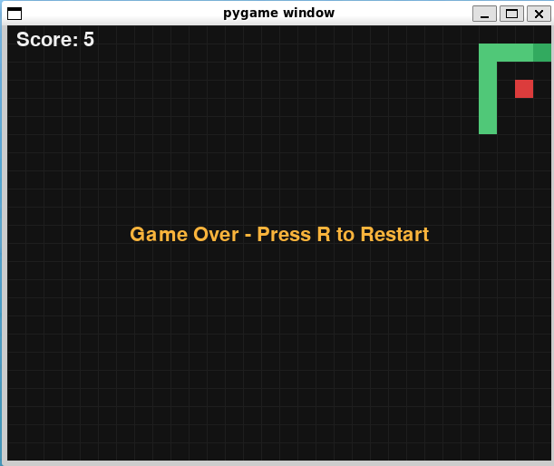
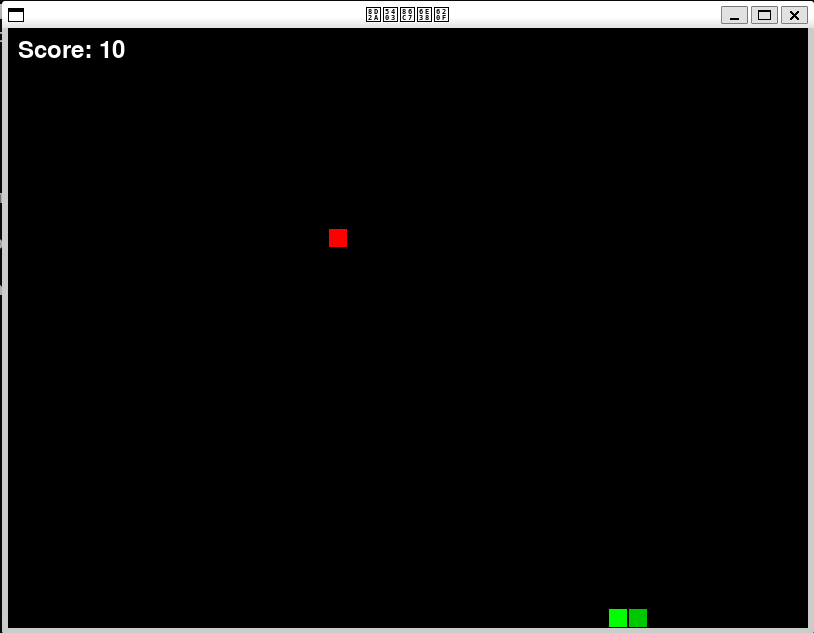
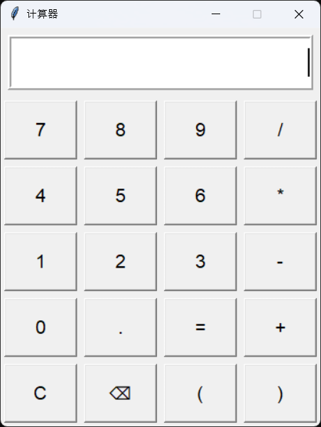
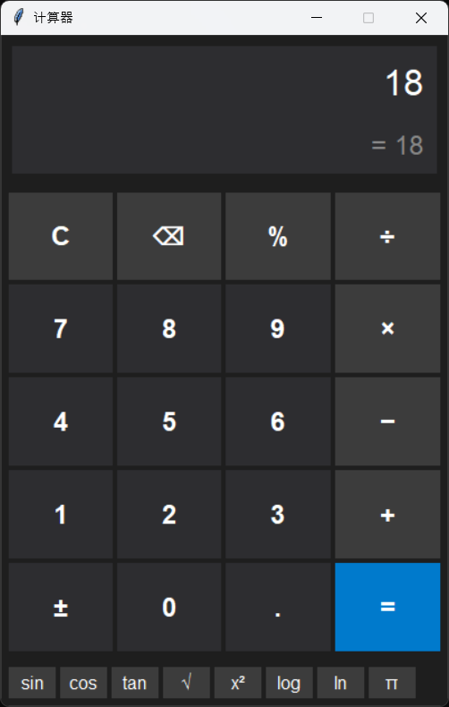
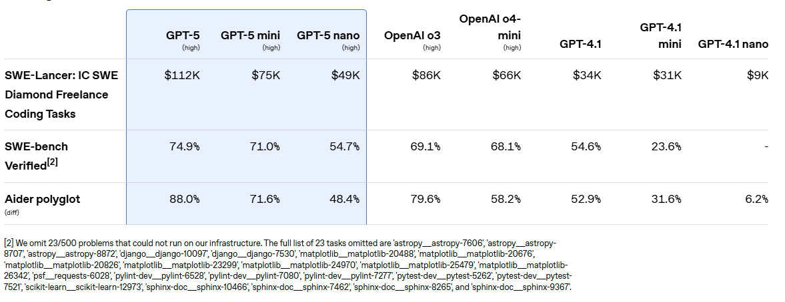
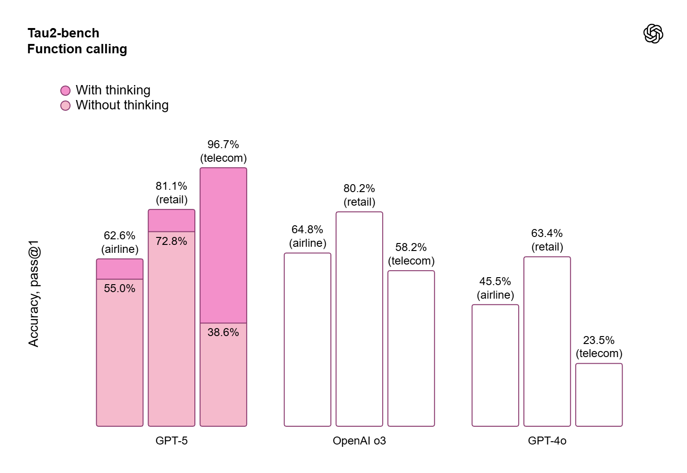
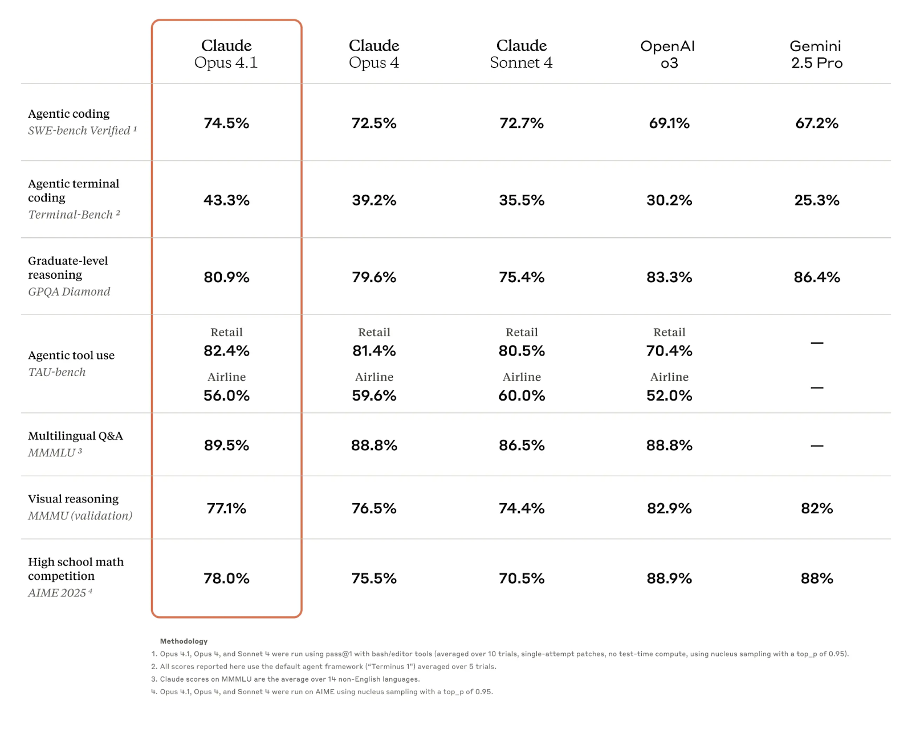

# Code Generation comparison of GPT-5 (Thinking Mode) vs. Claude Opus 4.1/4

## Benchmark result:
| Benchmark | GPT-5 (Thinking Mode) | Claude Opus 4.1 | Claude Opus 4 |
|------------------|----------------------|------------------|---------------|
| [SWE-bench Verified Score](https://github.com/princeton-nlp/SWE-bench) | **74.9%** | 74.5% | 72.5% |

## Code Generation Performance by Task
| Task Type | GPT-5 (Thinking Mode) | Claude Opus 4.1 | Claude Opus 4 |
|-----------|----------------------|------------------|---------------|
| Single-file Edits | **Fast and accurate; excels with structured prompts and minimal reasoning effort.** | Strong performance; slightly more verbose but consistent. | Good, but less precise than 4.1. |
| Multi-file Refactoring | Capable, but slower due to deeper reasoning. | **Best-in-class: Maintains context across modules, ideal for large codebases.** | Strong, but less consistent in long-context edits. |
| Bug Fixing | Excellent at identifying and resolving subtle bugs, especially with reasoning mode. | Very strong: Surgical precision in pinpointing and fixing issues. | Good, but may over-edit or miss edge cases. |
| Test Generation | Generates comprehensive test suites with good coverage. | Slightly better at aligning tests with business logic. | Moderate performance. |
| Frontend UI Code | **High-fidelity HTML/CSS/JS generation; good with design-to-code prompts.** | Competent, but less visually aligned. | Adequate for basic UI tasks. |
| Backend API Development | Strong with REST/GraphQL scaffolding and error handling. | Comparable, with better documentation generation. | Slightly behind in API structure consistency. |
| Tool Use | **Free-form function calling** | Bash + file editing tools | Same as 4.1 |
| Error Recovery | Superior | Strong | Moderate |
| Code Consistency | Good | **Very High** | High |
| Context Window | 128K tokens | 200K tokens | 200K tokens |
| Reasoning Mode | Flexible (minimal to deep) | Hybrid (rapid + extended) | Hybrid (less refined) |
| Latency | Higher (due to thinking mode) | Moderate | Moderate |
| Long-running Agentic Tasks | Handles multi-step workflows well with reasoning mode. | Superior: Can run for hours with minimal intervention (e.g., 7-hour refactors). | Good, but may require more supervision. |

## Summary
**GPT-5 (Thinking Mode)**: 
- Best for single-file edits and bug fixing with minimal reasoning. 
- Excels in frontend UI code generation and has strong tool use capabilities. 
- Its reasoning mode allows for deep context understanding, making it ideal for complex tasks.

**Claude Opus 4.1**: 
- Best-in-class for multi-file refactoring and long-context tasks.
- It maintains high code consistency and excels in backend API development and test generation.
- Its hybrid reasoning mode allows for rapid and extended reasoning, making it versatile across various coding tasks.

---
## Samples on code generation

| Code generation prompt | GPT-5 (Thinking Mode) | Claude 4.1 |
|------------------|----------------------|------------------|
| 用python生成贪吃蛇游戏 |  |  |
| 用python生成计算器和UI |  |  |

### More code generation examples (GPT-5 vs. Claude Opus 4.1)
- https://gpt-5-vs-opus-4-1-coding-examples.vercel.app/

---

## Reference:
**Reference links:**
- https://openai.com/index/introducing-gpt-5-for-developers/  
- https://openai.com/index/introducing-gpt-5/  
- https://blog.getbind.co/2025/08/06/claude-opus-4-1-vs-claude-opus-4-how-good-is-this-upgrade/  
- https://github.com/with-logic/gpt-5-vs-opus-4-1-coding-examples/tree/main 
 

**Benchmarks from OpenAI**
 

 

**Reference: benchmarks from Claude Opus 4.1**

