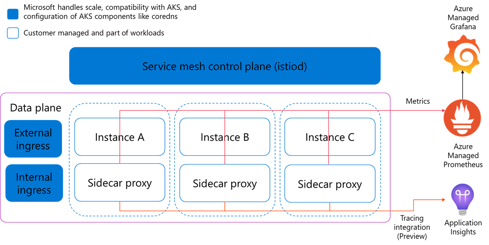
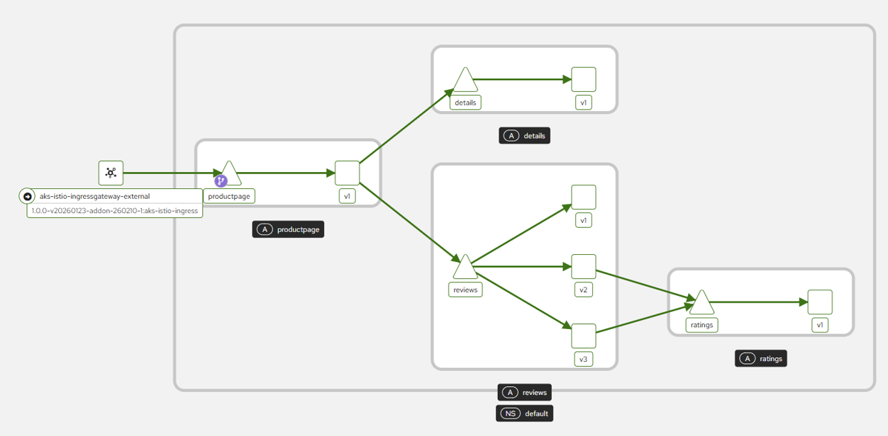
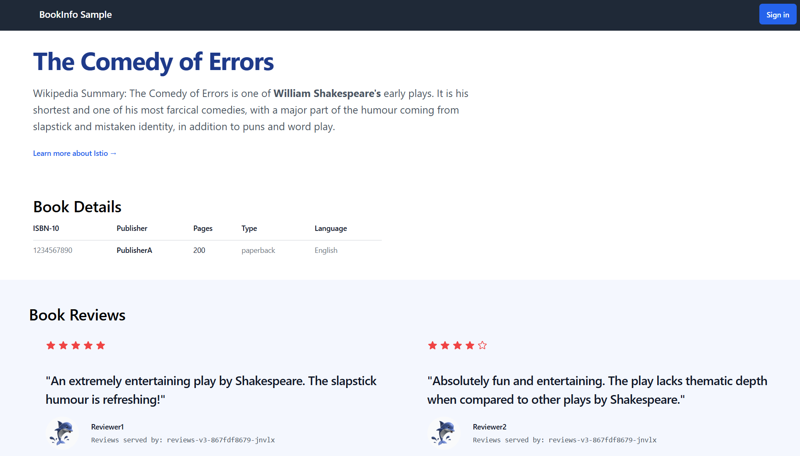
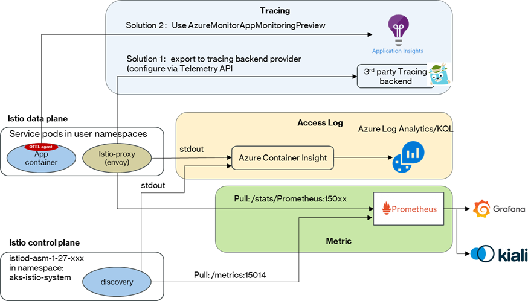
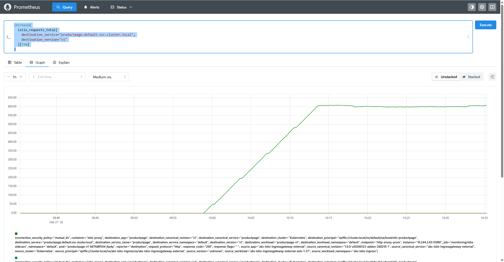
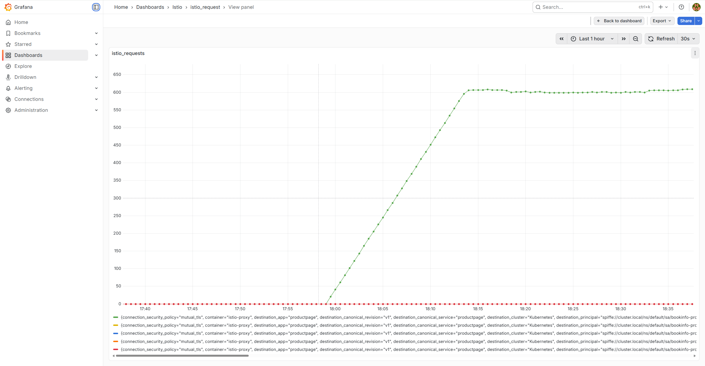
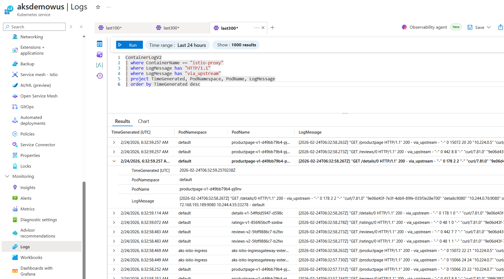
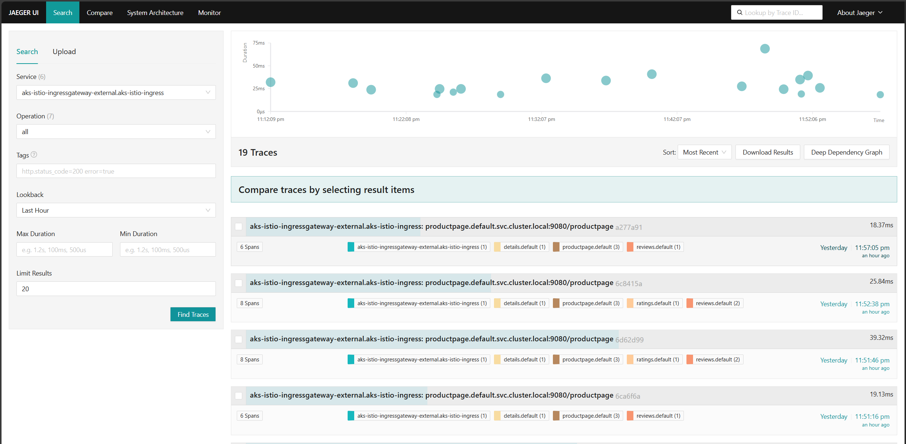
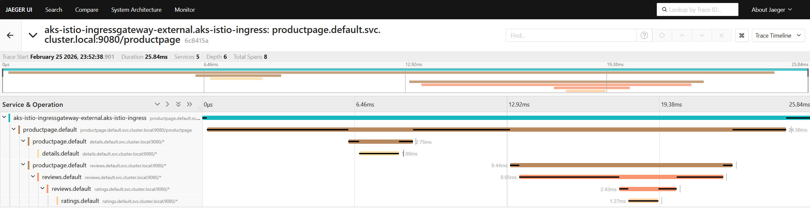
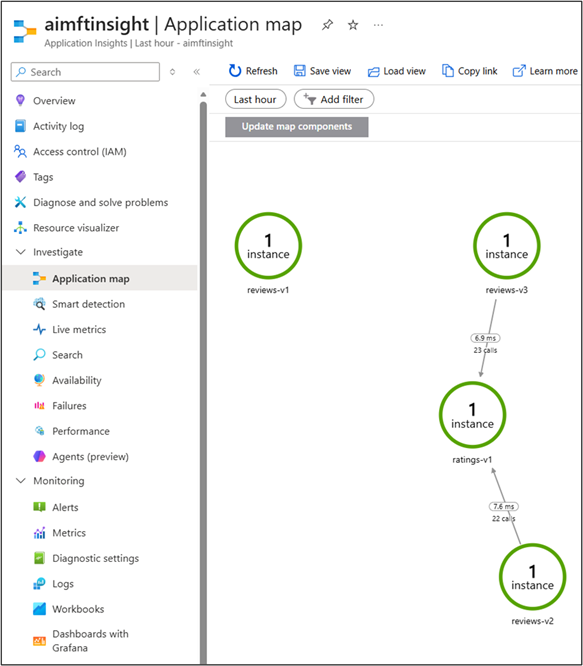

## Setup completed monitoring for AKS Istio based Service Mesh Add-on 

Istio ([official site](https://istio.io/latest/))is an open-source service mesh to manage the network communication across services in distributed, container based applications, and is now the most preferred service mesh solution for the modern microservice architecture workloads. Istio is an important feature offering on Azure Kubernetes Service(AKS) to support Layer 7 container networking demands like ingress controller, microservices discovery, traffic distribution across multiple versions, circuit-breaker, distrubited tracing and more. 

As a key production framework, a completed monitoring for Istio is highly necessary. Although Azure offers bunch of managed offerings to cover most common monitoring requests, it is still expected to be more flexible to integrate with third party powerful tools like Jaeger, Kiali, etc, to further extend the monitoring capabilities for various requests and scenarios.

Istio monitoring covers metrics, access log and tracing, and each has multiple choices on tools for example Azure-managed or Self-managed. Due to the Istio complexity and so many options for choice, it is usually complicated and time consuming. There is no guide to cover all these aspects, and you need to refer to many documents from different sources which cause much confusing.

This repo as a consolidated guide, helping user quickly setup a comprehensive monitoring solution, covering metrics, access log and tracing for using AKS Istio add-on. Within the guide, users can also find the comparison on different tools, and the benefits of each of them. To help users quick start the configuration, this repo contains the code & YAML samples and detail steps.

It includes:
- [Start with AKS Istio addon](#start-with-aks-istio-addon)
  - [Intro to AKS Istio addon](#intro-to-aks-istio-addon)
  - [Enable AKS Istio Add-on](#enable-aks-istio-add-on)
  - [Enable Istio side-car injection](#Enable-sidecar-injection)
  - [Deploy the sample application](#deploy-sample-application)
- [How does the monitoring on AKS Istio add-on work](#how-does-the-monitoring-on-aks-istio-add-on-work)
- Configuration for AKS Istio add-on monitoring
  - [Metrics](#configuration-for-aks-istio-add-on-monitoring---metrics)
    - [Configure Azure Managed Prometheus and Grafana in Azure Monitor](#configure-azure-managed-prometheus)
    - [Install and configure self-managed Prometheus and Grafana](#install-and-configure-self-managed-prometheus)
  - [Access logs](#configuration-for-aks-istio-add-on-monitoring---access-logs)
  - [Tracing](#configuration-for-aks-istio-add-on-monitoring---tracing)
    - [Traccing with Jaeger](#tracing-with-jaeger)
    - [Tracing with Application Insights](#tracing-with-azure-application-insights)
  - [Configure Kiali as the AKS Istio add-on dashboard](#configure-kiali-as-the-aks-istio-add-on-dashboard)

---
> **Note:** <br>
The commands used below are for example assuming the AKS cluster name is `aksdemowus` in the Resource Group `aksdemo`. Make sure to replace the AKS cluster name and resource group to your own specfiic values.

---
---
# Start with AKS Istio addon
## Intro to AKS Istio addon

The AKS Istio-based service mesh add-on provides an officially supported and tested integration for Azure Kubernetes Service. More details for the AKS Istio based service mesh add-on can be found in AKS document [here](https://learn.microsoft.com/en-us/azure/aks/istio-about).

Compared to open-source Istio offering, AKS Istio add-on offers extra benefits:
- Istio versions are tested and verified to be compatible with supported versions of Azure Kubernetes Service.
- Microsoft handles scaling and configuration of Istio control plane
- Microsoft adjusts scaling of AKS components like coredns when Istio is enabled.
- Microsoft provides managed lifecycle (upgrades) for Istio components when triggered by user.
- Verified external and internal ingress set-up.
- Verified to work with Azure Monitor managed service for Prometheus and Azure Managed Grafana.
- Official Azure support provided for the add-on.


---
## Enable AKS Istio Add-on 

```bash
az aks mesh enable -g aksdemo -n aksdemowus
```
Verify successful installation

```bash
az aks show -g aksdemo -n aksdemowus --query 'serviceMeshProfile.mode'
```
You should see `"Istio"` if successful.

Show Istio version

```bash
az aks show -g aksdemo -n aksdemowus --query 'serviceMeshProfile.istio.revisions'
```
You should see something like:
`
[
  "asm-1-xx"
]
`
, for example:
`
[
  "asm-1-27"
]
`

## Enable sidecar injection

```bash
kubectl label namespace default istio.io/rev=asm-1-27
```

---

## Deploy Sample Application

```bash
kubectl apply -f https://raw.githubusercontent.com/istio/istio/release-1.24/samples/bookinfo/platform/kube/bookinfo.yaml
```
The sample application "bookinfo" architecture is:



After the deployment, check your pod in namespace "default" has below annotations:
```yaml
prometheus.io/path: /stats/prometheus
prometheus.io/port: 15020
prometheus.io/scrape: true
```
These annotations mean istio has successfully injected the sidecar to your pod, and the metrics from this pod can be scraped by Prometheus.

---

### Enable External Ingress Gateway

```bash
az aks mesh enable-ingress-gateway -g aksdemo -n aksdemowus --ingress-gateway-type external
kubectl get svc aks-istio-ingressgateway-external -n aks-istio-ingress
```
You should see output like:
```
NAME                                TYPE           CLUSTER-IP        EXTERNAL-IP      PORT(S)                                      AGE
aks-istio-ingressgateway-external   LoadBalancer   172.168.172.xxx   20.237.160.xx    15021:30330/TCP,80:32290/TCP,443:32407/TCP   5d6h
```
---
### Define Istio Gateway and VirtualService for the sample application external accessing

Define `Gateway` and `VirtualService` in the same namespace with bookinfo application.

```yaml
apiVersion: networking.istio.io/v1beta1
kind: Gateway
metadata:
  name: bookinfo-gateway-external
spec:
  selector:
    istio: aks-istio-ingressgateway-external
  servers:
  - port:
      number: 80
      name: http
      protocol: HTTP
    hosts:
    - "*"
---
apiVersion: networking.istio.io/v1beta1
kind: VirtualService
metadata:
  name: bookinfo-vs-external
spec:
  hosts:
  - "*"
  gateways:
  - bookinfo-gateway-external
  http:
  - match:
    - uri:
        exact: /productpage
    - uri:
        prefix: /static
    - uri:
        exact: /login
    - uri:
        exact: /logout
    - uri:
        prefix: /api/v1/products
    route:
    - destination:
        host: productpage
        port:
          number: 9080
```

### Verify Connectivity
```bash
curl -S "http://20.237.160.xx:80/productpage"
```
or in a browser you will see the UI like this:


---
### Enable Internal Ingress Gateway (Optional)

```bash
az aks mesh enable-ingress-gateway -g aksdemo -n aksdemowus --ingress-gateway-type internal
kubectl get svc aks-istio-ingressgateway-internal -n aks-istio-ingress
```
Define the Geteway and VirtualService for the internal ingress gateway. Sample below:
```yaml
apiVersion: networking.istio.io/v1beta1
kind: Gateway
metadata:
  name: bookinfo-internal-gateway
spec:
  selector:
    istio: aks-istio-ingressgateway-internal
  servers:
  - port:
      number: 80
      name: http
      protocol: HTTP
    hosts:
    - "*"
---
apiVersion: networking.istio.io/v1beta1
kind: VirtualService
metadata:
  name: bookinfo-vs-internal
spec:
  hosts:
  - "*"
  gateways:
  - bookinfo-internal-gateway
  http:
  - match:
    - uri:
        exact: /productpage
    - uri:
        prefix: /static
    - uri:
        exact: /login
    - uri:
        exact: /logout
    - uri:
        prefix: /api/v1/products
    route:
    - destination:
        host: productpage
        port:
          number: 9080
```

---
## How does the monitoring on AKS Istio add-on work




---

## Configuration for AKS Istio add-on monitoring - Metrics
You can choose either Azure Managed Prometheus or self-managed Prometheus.

### Configure Azure Managed Prometheus
Prepare the file "prometheus-config" for the Managed Prometheus configuration:

```yaml
global: 
  scrape_interval: 30s
scrape_configs: 
- job_name: workload
  scheme: http
  kubernetes_sd_configs:
    - role: endpoints
  relabel_configs:
    - source_labels: [__meta_kubernetes_pod_annotation_prometheus_io_scrape]
      action: keep
      regex: true
    - source_labels: [__meta_kubernetes_pod_annotation_prometheus_io_path]
      action: replace
      target_label: __metrics_path__
      regex: (.+)
    - source_labels: [__address__, __meta_kubernetes_pod_annotation_prometheus_io_port]
      action: replace
      regex: ([^:]+)(?::\d+)?;(\d+)
      replacement: $1:$2
      target_label: __address__
```
Prepare configmap ama-metrics-settings-configmap in file "ama-metrics-settings-configmap-v1.yaml". <br>
Sample:
```yaml
kind: ConfigMap
apiVersion: v1
data:
  schema-version:
    #string.used by agent to parse config. supported versions are {v1, v2}. Configs with other schema versions will be rejected by the agent.
    v1
  config-version:
    #string.used by customer to keep track of this config file's version in their source control/repository (max allowed 10 chars, other chars will be truncated)
    ver1
  prometheus-collector-settings: |-
    cluster_alias = ""
    https_config = true
  default-scrape-settings-enabled: |-
    kubelet = true
    coredns = false
    cadvisor = true
    kubeproxy = false
    apiserver = false
    kubestate = true
    nodeexporter = true
    windowsexporter = false
    windowskubeproxy = false
    kappiebasic = true
    networkobservabilityRetina = true
    networkobservabilityHubble = true
    networkobservabilityCilium = true
    prometheuscollectorhealth = false
    controlplane-apiserver = true
    controlplane-cluster-autoscaler = false
    controlplane-node-auto-provisioning = false
    controlplane-kube-scheduler = false
    controlplane-kube-controller-manager = false
    controlplane-etcd = true
    acstor-capacity-provisioner = true
    acstor-metrics-exporter = true
    local-csi-driver = true
    ztunnel = false
    istio-cni = false
    waypoint-proxy = false
    dcgmexporter = false
  # Regex for which namespaces to scrape through pod annotation based scraping.
  # This is none by default.
  # Ex: Use 'namespace1|namespace2' to scrape the pods in the namespaces 'namespace1' and 'namespace2'.
  pod-annotation-based-scraping: |-
    podannotationnamespaceregex = "aks-istio-system|default|kube-system"
  default-targets-metrics-keep-list: |-
    kubelet = ""
    coredns = ""
    cadvisor = ""
    kubeproxy = ""
    apiserver = ""
    kubestate = ""
    nodeexporter = ""
    windowsexporter = ""
    windowskubeproxy = ""
    podannotations = ""
    kappiebasic = ""
    networkobservabilityRetina = ""
    networkobservabilityHubble = ""
    networkobservabilityCilium = ""
    controlplane-apiserver = ""
    controlplane-cluster-autoscaler = ""
    controlplane-node-auto-provisioning = ""
    controlplane-kube-scheduler = ""
    controlplane-kube-controller-manager = ""
    controlplane-etcd = ""
    acstor-capacity-provisioner = ""
    acstor-metrics-exporter = ""
    local-csi-driver = ""
    ztunnel = ""
    istio-cni = ""
    waypoint-proxy = ""
    dcgmexporter = ""
    minimalingestionprofile = true
  default-targets-scrape-interval-settings: |-
    kubelet = "30s"
    coredns = "30s"
    cadvisor = "30s"
    kubeproxy = "30s"
    apiserver = "30s"
    kubestate = "30s"
    nodeexporter = "30s"
    windowsexporter = "30s"
    windowskubeproxy = "30s"
    kappiebasic = "30s"
    networkobservabilityRetina = "30s"
    networkobservabilityHubble = "30s"
    networkobservabilityCilium = "30s"
    prometheuscollectorhealth = "30s"
    acstor-capacity-provisioner = "30s"
    acstor-metrics-exporter = "30s"
    local-csi-driver = "30s"
    ztunnel = "30s"
    istio-cni = "30s"
    waypoint-proxy = "30s"
    dcgmexporter = "30s"
    podannotations = "30s"
  debug-mode: |-
    enabled = false
  # Note that below section (ksm-config) is a yaml configuration, the settings override the configuration provided by optional parameters during 
  # onboarding for kube-state-metrics, only uncomment and use them if the collection needs to be customized.
  # Default settings - https://github.com/Azure/prometheus-collector/blob/e40947f3eaee8843021c90bd8645ce7875ad1fcf/otelcollector/deploy/addon-chart/azure-monitor-metrics-addon/values-template.yaml#L2
  # https://learn.microsoft.com/en-us/azure/azure-monitor/containers/kubernetes-monitoring-enable?tabs=cli#optional-parameters
  # OSS documentation for kube-state-metrics resources and the metrics - https://github.com/kubernetes/kube-state-metrics/tree/main/docs#exposed-metrics
  # ksm-config: |-
  #   resources: 
  #     secrets: {}
  #     configmaps: {}
  #   labels_allow_list: # object name and label names
  #     pods: 
  #     - app8
  #   annotations_allow_list: # object name and annotation names
  #     namespaces:
  #     - kube-system
  #     - default
metadata:
  name: ama-metrics-settings-configmap
  namespace: kube-system
```

Then apply with below commands:

```bash
kubectl create configmap ama-metrics-prometheus-config --from-file=monitoring/prometheus-config -n kube-system
kubectl apply -f ama-metrics-settings-configmap-v1.yaml
```
---
### Install and configure self-managed Prometheus

Install via helm:
```bash
helm repo add prometheus-community https://prometheus-community.github.io/helm-charts
helm repo update
helm install kube-prom-stack prometheus-community/kube-prometheus-stack -n monitoring --create-namespace
```
Edit the Prometheus CRD to allow monitoring all namespaces (recommended):

```bash
kubectl edit prometheus -n monitoring kube-prometheus-stack-prometheus
```

Update the spec:

```yaml
spec:
  # Allow ServiceMonitor discovery from all namespaces
  serviceMonitorNamespaceSelector: {}
  serviceMonitorSelector: {}

  # Allow PodMonitor discovery from all namespaces
  podMonitorNamespaceSelector: {}
  podMonitorSelector: {}
```
---

You will also need to define the ServiceMonitor and PodMonitor to instruct self-managed Prometheus how to collect the metrics from service and pods:

**ServiceMonitor sample:**
```yaml
apiVersion: monitoring.coreos.com/v1
kind: ServiceMonitor
metadata:
  name: istiod-monitor
  namespace: monitoring
spec:
  selector:
    matchLabels:
      app: istiod
  namespaceSelector:
    matchNames:
      - aks-istio-system  # AKS Istio add-on default nanespace
  endpoints:
  - port: http-monitoring  # The same port name defined in Services
    path: /metrics
```
**PodMonitor sample:**
```yaml
apiVersion: monitoring.coreos.com/v1
kind: PodMonitor
metadata:
  name: istio-sidecars
  namespace: monitoring
spec:
  selector:
    matchLabels:
      security.istio.io/tlsMode: istio
  podMetricsEndpoints:
  - port: http-envoy-prom
    path: /stats/prometheus
    interval: 15s
  namespaceSelector:
    any: true
```
---

### Query metrics in Prometheus and Grafana

Send multiple requests to generate traffic. Below sample command sends 30 requests for quick traffic:

```bash
for i in $(seq 1 30); do curl -s -o /dev/null "http://20.237.160.xx:80/productpage"; done
```
In the Prometheus UI, go to /query console, try PromQL to query metrics:


PromQL examples as below:

**Count all targets by namespace:**

```promql
count by (namespace) (up)
```

**Istio requests total for productpage v1:**

```promql
istio_requests_total{
  destination_service="productpage.default.svc.cluster.local",
  destination_version="v1"
}
```

**Request increase over 15 minutes:**

```promql
increase(
  istio_requests_total{
    destination_service="productpage.default.svc.cluster.local",
    destination_version="v1"
  }[15m]
)
```

**Request count by response code over 1 hour:**

```promql
sum by (response_code) (
  increase(
    istio_requests_total{
      destination_service="productpage.default.svc.cluster.local",
      destination_version="v1"
    }[1h]
  )
)
```
Go to you Grafana UI, customize your dashboard by exploring the data with the PromQL.
- If you are using Azure Managed Prometheus, just find the Grafana dashboard entry in the Azure Monitor -> Managed Prometheus portal
- If you are using self-managed Prometheus, login to the Grafana UI, and you need to point the Data Source to your Prometheus endpoint before you can see data flows in



**Tip:**
If you cannot find the username/password for your installed Grafana, use below commands to find them out:
```bash
kubectl get secret -n monitoring prometheus-grafana -o jsonpath="{.data.admin-user}" | base64 -d
kubectl get secret -n monitoring prometheus-grafana -o jsonpath="{.data.admin-password}" | base64 -d
```
---
## Configuration for AKS Istio add-on monitoring - Access logs
### Enable the istio access log
Access log in the AKS istio-addon is turned off by default, so you need to enable the access log by Telemetry API.
To do this you need to define the access log Telemetry object using envoy provider. Sample as below:
```yaml
apiVersion: telemetry.istio.io/v1
kind: Telemetry
metadata:
  name: mesh-access-logging
spec:
  accessLogging:
  - providers:
    - name: envoy
```
After turn on the AKS istio-addon access log, the istio-proxy sidecar will write the access log to the stdout.
---
### Query istio-proxy access logs
You need to turn on the Container Insight for your AKS cluster, after that the access log written to the istio-proxy stdout will be collected and sent to Log Analytics Workspace.
<br>
In the AKS portal, go the Log menu entry and the KQL panel. Try KQL to query the access logs:


 Below lists several KQL samples:

**Sample 1: Istio access logs only (via upstream)**

```kql
ContainerLogV2
| where ContainerName == "istio-proxy"
| where LogMessage has "HTTP/1.1"
| where LogMessage has "via_upstream"
| project TimeGenerated, PodNamespace, PodName, LogMessage
| order by TimeGenerated desc
```

**Sample 2: Filter inbound / outbound traffic**

```kql
ContainerLogV2
| where ContainerName == "istio-proxy"
| where LogMessage has "outbound|"
| project TimeGenerated, PodName, LogMessage
| order by TimeGenerated desc
```

**Sample 3: Filter by specific service (e.g., productpage)**

```kql
ContainerLogV2
| where ContainerName == "istio-proxy"
| where LogMessage has "productpage.default.svc.cluster.local"
| project TimeGenerated, PodName, LogMessage
| order by TimeGenerated desc
```

**Sample 4: All-in-one troubleshooting query**

```kql
ContainerLogV2
| where ContainerName in ("istio-proxy", "istio-ingressgateway")
| where LogMessage has "HTTP/1.1"
| project TimeGenerated, PodNamespace, PodName, ContainerName, LogMessage
| order by TimeGenerated desc
```
---

## Configuration for AKS Istio add-on monitoring - Tracing

> Istio can generate metrics, distributed traces, and access logs for all workloads in the mesh.
> The Istio-based service mesh add-on for AKS provides telemetry customization options through the shared MeshConfig and the Istio Telemetry API v1 (for `asm-1-22` and higher).

### Tracing with Jaeger
#### Install Jaeger

```bash
kubectl apply -f https://raw.githubusercontent.com/istio/istio/release-1.27/samples/addons/jaeger.yaml
```
---
#### Enable Jaeger tracing:
You need to configure the istio add-on for tracing backend provider, and enable the tracing. But as an managed service, the AKS Istio add-on does not allow `IstioOperator` CRD customization.<br>
AKS Istio add-on offers the Mesh Config capability to do the work, and you need to apply the shared configmap instead.<br>
You need to define and apply a configmap named like "istio-shared-configmap-asm-1-xx" while "xx" is your istio add-on minor revision.

```bash
kubectl apply -f istio-shared-configmap-asm-1-27.yaml
```
The sample content of the configmap "istio-shared-configmap-asm-1-xx" is as below:
```yaml
apiVersion: v1
kind: ConfigMap
metadata:
  name: istio-shared-configmap-asm-1-27
  namespace: aks-istio-system
data:
  mesh: |-
    accessLogFile: /dev/stdout
    defaultConfig:
      holdApplicationUntilProxyStarts: true
      tracing:
        sampling: 10.0
    enableTracing: true
    extensionProviders:
      - name: jaeger
        zipkin:
          service: jaeger-collector.istio-system.svc.cluster.local
          port: 9411
``` 
This defines the detail of the tracing backend. After this, you will need to use Telemetry API to enable the tracing. The configmap sample is:
```yaml
apiVersion: telemetry.istio.io/v1
kind: Telemetry
metadata:
  name: jaegertracing
  namespace: aks-istio-system
spec:
  tracing:
  - providers:
    - name: jaeger
```
#### Check the trace on Jaeger UI
You can see traces in the UI:

**Tip:**
The concept `span` means the minimum unit be traced that can calculate the time span duration.

Click the trace, and you can see the trace (traffic flows across multiple services, and how much time used in each span):


---

### Tracing with Azure Application Insights
#### Enable Application Insights with AKS

Follow the link: [https://learn.microsoft.com/en-us/azure/azure-monitor/app/kubernetes-codeless?tabs=portal](https://learn.microsoft.com/en-us/azure/azure-monitor/app/kubernetes-codeless?tabs=portal) to enable **AzureMonitorAppMonitoringPreview** feature in your AKS cluster, and configure your namespaces or deployments to be auto instrumented by the Application Insights. <br>

After instrumented, you need to restart your workload to let the Application Insights instrument OpenTelemetry Agent into your application containers.

---
#### View the application tracing
Go to the Azure Monitor -> Insights -> Applications -> Investigate, check the "Application maps", "Performance" etc. to see your application topology and tracing information.



**Tip:**

You may not see the service like "productpage" shown in the application map. The reason is the Application Insights AutoInstrument feature only supports Java and Node.js in current preview stage, while the "productpage" service is not written in Java/Node.js.

---
## Configure Kiali as the AKS Istio add-on dashboard
### Install Kiali

```bash
helm install \
  --namespace istio-system \
  --set auth.strategy="anonymous" \
  --repo https://kiali.org/helm-charts \
  kiali-server \
  kiali-server
```
---
### Configure Kiali to use self-managed Prometheus & Grafana

Update the Kiali ConfigMap in below section to provide the url of Prometheus and Grafana:

```yaml
data:
  config.yaml: |
    external_services:
      prometheus:
        url: "http://prometheus-kube-prometheus-prometheus.monitoring.svc:9090" # Your Prometheus endpoint
        auth:
          type: "none"
      grafana:
        enabled: true
        url: "http://prometheus-grafana.monitoring.svc:80"  # Your Grafana endpoint
        in_cluster_url: "http://prometheus-grafana.monitoring.svc:80"  # Your Grafana in_cluster endpoint
        auth:
          type: "none"
```

Now you have finished the configuration for Metrics/Access log/Tracing for the AKS Istio-addon, and you also setup the Kiali as the consolidated console for Istio management.

Let's generate continues traffic to validate our configuration. Refer to below sample to continuously generate traffic by keeping calling to the productpage service with interval 1 second between calls:
```bash
#!/bin/bash

i=1
while true; do
    printf "%s: %d " "$(date '+%H:%M:%S')" "$i"
    curl -s -o /dev/null -w "%{http_code}\n" "http://20.237.160.xx:80/productpage"
    i=$((i+1))
    sleep 1
done
```
In addtion to use the Promethues/Grafana/Jaeger/Application Insights UIs, now we also have the Kiali UI ready.
We can use all of these UIs now. For Kiali, go to the Traffic Graph on Kiali UI, you will see traffic flows:

https://github.com/user-attachments/assets/4ce086ef-e13d-4d99-b1f0-52c235b36bc5

**Tips:**

In above configuration, you probably only have the AKS cluster internal access for self-managed services including Prometheus, Grafana, Jaeger and Kiali. You may want to expose those services for permenant public access with Ingress, or simply use the port forward for temporary debugging access.